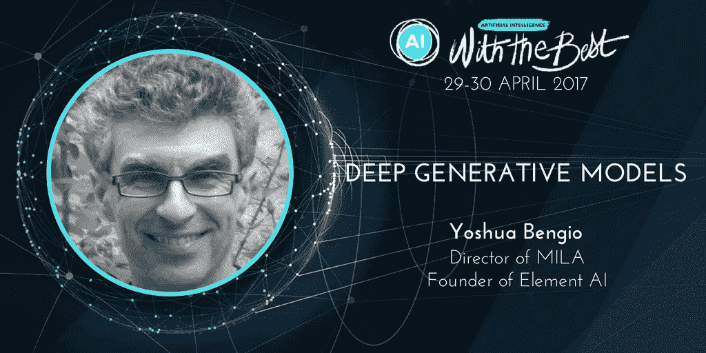

# 从无到有:GANs 的进展如何？

> 原文：<https://towardsdatascience.com/something-from-nothing-where-are-we-at-with-gans-18bdccc3af17?source=collection_archive---------6----------------------->

克洛伊·布莱斯维特

早在 2014 年，Ian Goodfellow 就向我们介绍了生成式对抗网络，简称 GAN，这是一种可以在无人监督的情况下工作的深度机器学习。Yoshua Bengio 与 Goodfellow 一起编写了*深度学习*教材。

“为了让计算机变得智能，它们需要拥有知识。但问题是他们从哪里获得这些知识？”蒙特利尔大学蒙特利尔学习算法研究所(MILA)所长 Yoshua Bengio 教授问道。

“以前，研究人员试图直接传授知识。这是经典的人工智能，我们告诉计算机事实和规则，但不幸的是，我们知道的许多事情是不可传达的，它们是直觉的。”

本质上，有些事情我们知道，但不能，或者就是不解释。

“我们在过去几年取得的进展非常惊人，但这主要是基于监督学习，即人类告诉计算机如何解释图像、声音或文本。我们认为，我们现在所做的这种学习有一些局限性，人类能够应对。”

问题是如何让计算机在无人监督的情况下学习，而不是硬编码事实和数字。

“我们不想告诉计算机解释(某些)数据的基本概念是什么。”

本吉奥强调，他不确定最佳的前进方式是什么，他高兴地承认，开发自主学习人工智能可能有多种方式。这种清晰路径的缺乏导致了许多创新，GANs 在生成性学习领域处于领先地位。

“检验计算机是否理解我们输入的数据的一种方法是，让计算机生成应该来自同一分布的新示例。”

例如，也许一个程序已经看到了成千上万张不同的新面孔的图像。为了查看计算机是否理解了这组训练图像，程序员可以请求计算机根据数据集生成一张全新的、完全新奇的脸。这项任务比看起来更难，因为“自然”图像与计算机生成的图像非常不同。

多年来，机器学习中出现了许多生成模型，但生成对抗网络的成功来自于它们的对抗性。

“GANs 与传统的机器学习非常不同。我们有这两个网络，生成器和鉴别器，它们中的每一个实际上都在优化一个不同的东西，所以使一个表现良好的东西会使另一个变得更差。”

“gan 以及许多具有潜在空间和内部表示的生成网络的一个优点是，我们实际上可以玩表示，并在表示之间进行插值，或从表示中进行加减。

“我们观察到的第一件事是训练 GAN 可能不稳定。有时候，训练进行得很顺利，你可以看到生成的图像越来越好，但突然间，事情变得糟糕起来，训练目标开始以奇怪的方式前进。”

这种不稳定性的主要原因与它作为一种生成模型如此成功的原因是一样的。

研究人员已经开始面临的其他常见障碍包括模式崩溃，即图像重复多次；缺失模式，没有足够的多样性进入生成的数据集；缺乏明确的质量量化措施。

那么，既然要克服这样的挑战，为什么还要继续研究 GANs 呢？

“嗯，它与以前在机器学习方面所做的事情如此不同，你知道，它可能会在未来给我们带来更好的东西！”

注意:这篇文章是基于本吉奥在 4 月 29 日至 30 日的最佳会议上关于人工智能的演讲。他是一个主题演讲人，这是他第一次与最优秀的人交谈。