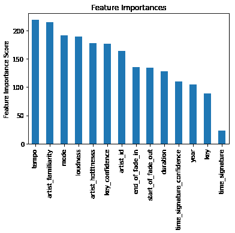
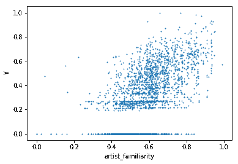
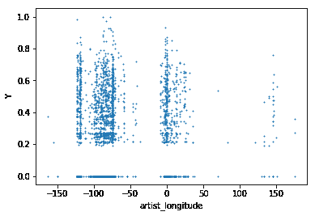
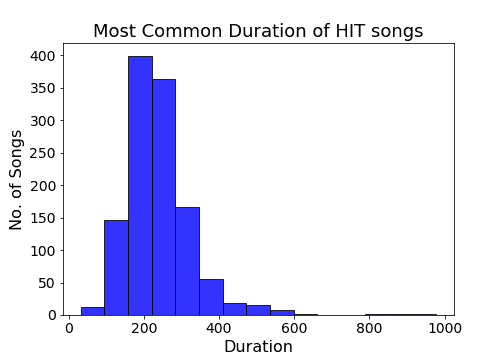
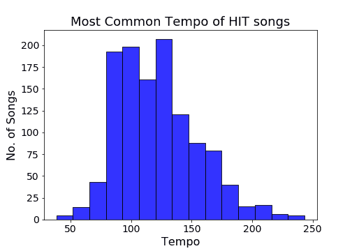
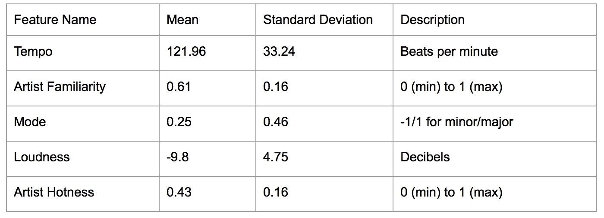
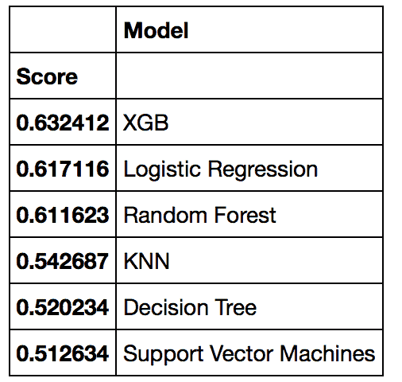
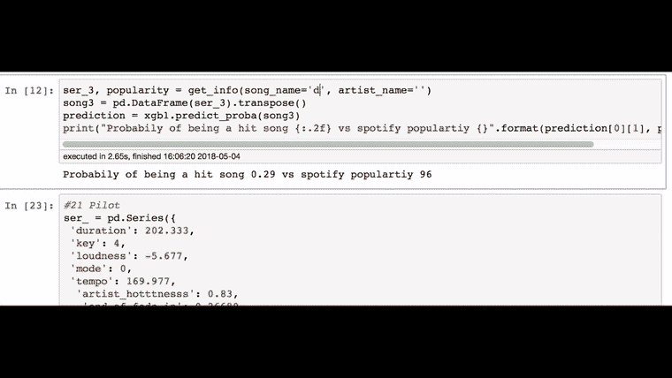
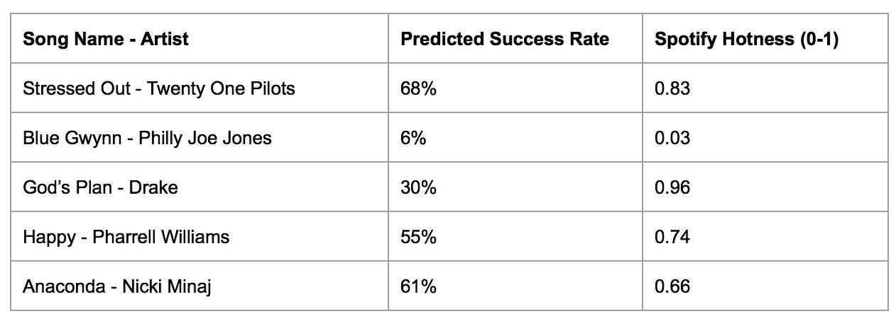

# 歌曲流行度预测器

> 原文：<https://towardsdatascience.com/song-popularity-predictor-1ef69735e380?source=collection_archive---------6----------------------->

Mohamed Nasreldin、Stephen Ma、Eric Dailey、Phuc Dang 的项目

**简介**

[DJ Khaled 大胆宣称总能知道一首歌什么时候会流行。我们决定通过问三个关键问题来进一步调查:热门歌曲是否有某些特征，对一首歌的成功影响最大的因素是什么，以及老歌甚至可以预测新歌的受欢迎程度吗？预测一首歌会有多流行不是一件容易的事。为了回答这些问题，我们利用了哥伦比亚提供的](https://www.youtube.com/watch?v=M0be5674X9Y&feature=youtu.be&t=12m45s)[百万首歌曲数据集](https://labrosa.ee.columbia.edu/millionsong/)，Spotify 的 API，以及机器学习预测模型。我们提出了一个模型，可以预测一首歌有多大可能成为热门歌曲，通过将其列入 Billboard 的前 100 名来定义，准确率超过 68%。

**背景**

[2017 年，仅在美国，音乐产业就创造了 87.2 亿美元的收入。](https://www.billboard.com/articles/business/8257558/us-music-industry-2017-highest-revenue-in-decade-fueled-paid-subscriptions)由于流媒体服务(Spotify、Apple Music 等)的增长，这个行业继续繁荣发展。流行歌曲获得了大部分收入。[2016 年前 10 名艺人总共创造了 3.625 亿美元的收入。关于是什么让一首歌流行的问题在](https://www.forbes.com/sites/zackomalleygreenburg/2017/12/06/the-worlds-highest-paid-musicians-of-2017/#7ea9fe51530e)之前已经被研究过，并取得了不同程度的成功。每首歌曲都有关键特征，包括歌词、时长、艺术家信息、温度、节拍、音量、和弦等。先前的研究认为歌词可以预测一首歌的受欢迎程度，但收效甚微。

**数据采集&预处理**

**获取数据**

选择的数据集是哥伦比亚大学提供的[百万首歌曲数据集](https://labrosa.ee.columbia.edu/millionsong/)，从 Echo Nest 中拉出。我们选择这个数据集是因为它有大量的特征和大小。这个数据集的主要问题是提供的格式。为每首歌曲提供了单独的 h5 文件。提供了一个脚本来将数据集转换为 mat 文件，以便在 matlab 中使用。我们修改了脚本，以便它可以生成一个 csv，我们可以用它来训练我们的模型。数据集也太大了。所有 100 万首歌曲的容量约为 280 GB。谢天谢地，有一个随机选择的子集，只有 10，000 首歌曲。

数据集中的每首歌曲都包含 41 个特征，通过音频分析、艺术家信息和歌曲相关特征进行分类。

音频分析功能:速度，持续时间，模式，响度，关键，拍号，部分开始

艺术家相关特征:艺术家熟悉度、艺术家受欢迎程度、艺术家姓名、艺术家位置

歌曲相关特征:版本，标题，年份，歌曲热度

**刮广告牌歌曲**

百万首歌曲数据集中的原始数据带有歌曲热度特征。然而，大约有 4500 首歌曲没有这个功能，这几乎是我们使用的子集的一半。因此，我们想找到一种新的方法来分类一首歌是否流行。我们决定使用 BillBoard Top 100 来确定受欢迎程度。如果一首歌至少出现在 100 强排行榜上一次，那么它将被列为热门歌曲。

我们使用 BeautifulSoup 编写 python 脚本来抓取 billboard.com，得到 1958 年到 2012 年出现在排行榜上的所有歌曲。我们停在了 2012 年，因为数据集中最近的歌曲都是在 2012 年发布的。在获得 billboard 上的歌曲列表后，我们回到我们的 10，000 首歌曲数据集，并相应地对它们进行分类。在我们的数据集中的 10，000 首歌曲中，有 1192 首被归类为热门歌曲。

**清洗数据集**

由于旧的不推荐使用的数据，数据集中的许多字段不可用。许多数据字段丢失，并且没有 echonest API 来填充数据，因为 API 被 Spotify 修改了。因此，许多领域不得不放弃。有些要素只缺少合理的数量，我们决定用平均值来填充缺少的值。一个例子是艺术家熟悉度字段，它只有 10 个缺失值。

艺术家 ID 和模式这两个要素被修改，以更好地反映它们在数据集中的属性。数据中的每个艺术家都由一个字符串唯一标识，所以我们决定对他们进行标签编码。调式是歌曲在制作过程中使用大调还是小调。虽然这个值很简单，0 表示次要，1 表示主要，但是还有一个名为 mode_confidence 的值，它描述了所选模式准确的概率。有了这两个值，我们组合了从-1(小调)到 1(大调)的特性。值-1 表示 100%确信该键是次要的，1 表示 100%确信该键是主要的。小调的置信度范围在-1 和 0 之间，大调的置信度范围在 0 和 1 之间。这大大增加了这个值的重要性，我们将在下一节看到。

该过程可以总结如下:

1.  从 labrosa Columbia 下载数据子集
2.  将数据格式从 h5 转换为数据帧
3.  刮掉出现在排行榜前 100 名歌曲
4.  数据中的分类歌曲
5.  清理数据集

**数据探索**

在收集数据并对其进行清理以供使用后，我们通过研究特征的重要性、数据集中的趋势以及确定这些特征的最佳值，继续进行数据探索。

**特征重要性**

在这里，我们可以看到最终数据集中每个要素的 f1 值。我们在这里可以看到一个有趣的趋势，即歌曲的实际音乐方面与艺术家信息合理地纠缠在一起。诸如速度、模式和响度之类的技术特征与诸如熟悉度、热度和辨识度之类的艺术家信息一样重要。

**艺人熟悉度**

艺人熟悉度与歌曲热度

正如我们所料，艺术家的熟悉程度与热度值相关。Y 轴是根据歌曲热度 Y，其中 0 是最低分，1 是最高分。熟悉度在 x 轴上，范围也是从 0 到 1，根据 Echo Nest 的算法描述艺术家的“熟悉”程度。当这个值接近 1 时，歌曲的热度也接近 1(谁能想到呢？).

**艺人位置**

艺人经度 vs 歌曲热度

我们也可以在上面的图表中看到一些有趣的趋势。虽然通常在也产生点击的区域中有更多的活动，但是我们可以看到点击集中在这些特定的区域。大多数活动来自世界的西部，在北美，我们也可以看到东海岸和西海岸之间的分界线。因此，我们可以期待模型使用这一点来预测一首歌是否是热门歌曲。

**速度和持续时间**

我们对热门歌曲的分布感兴趣，所以我们隔离了热度值为 1 的所有歌曲，并绘制了这些歌曲的不同特征的分布。我们可以看到，热门歌曲通常使用的节奏有一个范围，在这个范围内有两个峰值，分别为 100 bpm 和 135 bpm。热门歌曲的时长平均在 200 秒左右，一般在 3 到 4 分钟之间。

Optimal values for key selected features

对于登上 Billboard 前 100 名的歌曲，我们研究了之前使用 f1 评分检测到的一些顶级特征的平均值和标准偏差，结果相当合理。节奏约为 122 bpm，标准偏差为 33 bpm，艺术家熟悉度为 61%，标准偏差为 16%，大多数歌曲都是大调，但标准偏差相当大，响度约为-10 dB，艺术家热度约为 0.43。艺术家信息显示，这些艺术家中的大多数都是“昙花一现”，因为他们缺乏热情和熟悉度。

**模式选择&调谐**

我们在不同的模型上训练我们的数据来预测一首歌是否是热门歌曲。在调整之前，Xgboost 在 0.63 曲线下面积(AUC)分数处似乎是具有最高准确度的。下表显示了我们尝试的一些模型的结果。

Models considered and their AUC scores

在 XGBoost 上进行网格搜索以进一步提高 AUC 分数。每个参数都进行了调整，一些值同时被过度调整。例如，n 估计值和学习率被一起调整，因为较高的 n 估计值需要较低的学习率来产生最佳结果。调整后 AUC 值从 0.632 增加到 0.68。随机预测将产生 0.5 的 AUC 分数。

**结果**

这个项目展示了预测音乐热度的可能性，确定了流行音乐的趋势，并使用 Spotify 的 API 开发了特征提取工具。XGBoost 在训练模型上提供了最佳预测，AUC 得分为 0.68。

我们决定用我们的模型预测一些新歌。下面的演示展示了[我们的脚本](https://github.com/manasreldin/Song-Popularity-Predictor/blob/master/Demo101.ipynb)的运行。

自从 Spotify 收购 EchoNest 以来，许多不同的功能都发生了变化，包括通过 ID 查找歌曲信息的简单方法。因此，这个演示使用了一种非常迂回的方式来获取歌曲信息。首先，使用 API 上的搜索端点运行搜索，以获取 Spotify ID。使用 Spotify ID 音频功能和深入的音频分析，可以抓取歌曲。然后进行一些功能工程，以便将 Spotify 数据转换回可用于我们模型的格式。我们开发的用于将 Spotify API 数据映射到我们的训练数据的脚本可以在这里查看。

以下是我们的模型预测的其他一些歌曲的结果，以及与 Spotify hotness 结果进行比较的结果:

**结论**

在这项工作中，我们不确定是否有可能比随机预测更好地预测一首歌是否会流行。在对来自 Spotify 的新歌测试我们的模型后，我们观察到正确预测一首坏歌比预测一首热门歌曲简单得多。预测非热门歌曲可能更容易，因为我们的数据是倾斜的，只有 1200 首热门歌曲。接下来，我们将探讨艺术家所在地或发行日期等其他特征如何影响歌曲的受欢迎程度。此外，我们可以考虑使用完整的数据集，看看是否可以改进我们的模型。另一种选择是使用 Spotify API 来收集我们自己的数据。

虽然 DJ Khaled 没有配备强大的数据科学和机器学习工具，但他是正确的，热门歌曲中确实存在某些趋势。

*完整源代码可以在这里查看*