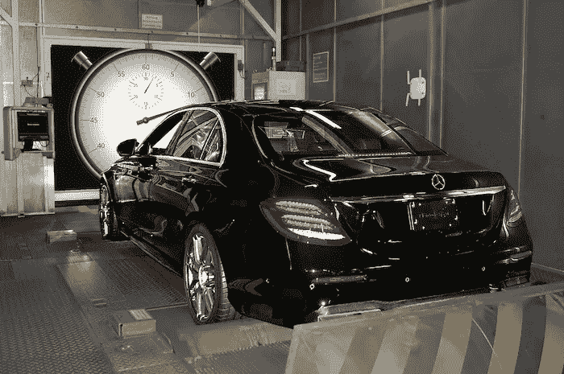
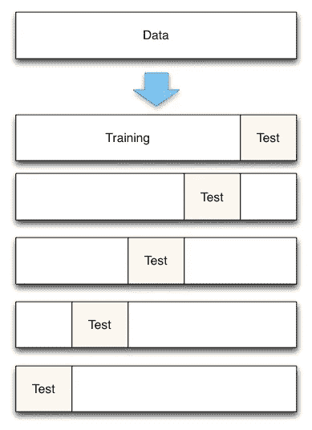
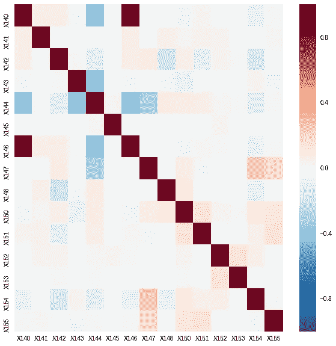
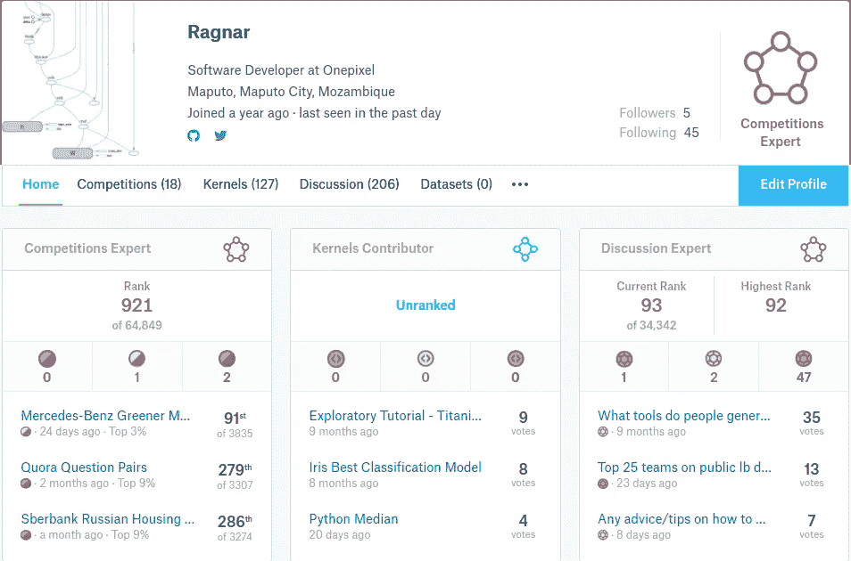
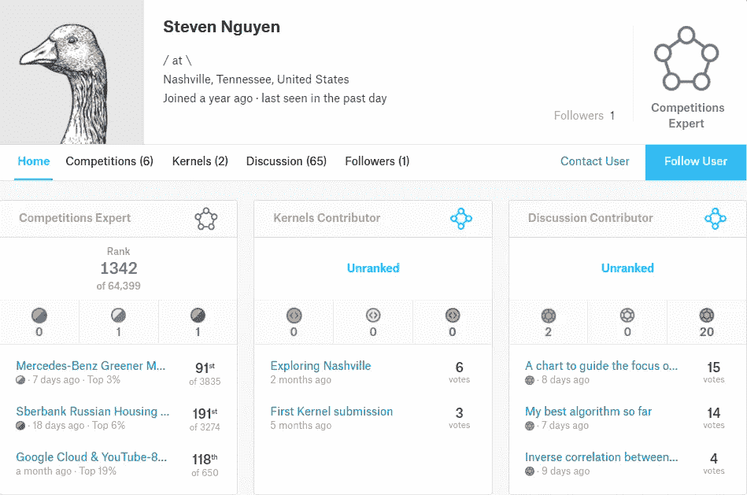

# 你迟早会面临这个问题

> 原文：<https://towardsdatascience.com/soon-or-later-you-will-face-this-problem-c5f204e9f55a?source=collection_archive---------3----------------------->

source: [kaggle](https://www.kaggle.com/c/mercedes-benz-greener-manufacturing)

几天前在 [kaggle](https://www.kaggle.com/) 举办的[梅赛德斯-奔驰比赛](https://www.kaggle.com/c/mercedes-benz-greener-manufacturing)结束了，这场比赛是我经历过的最艰难的比赛之一(我并不孤单)，在这篇文章中我将解释为什么，并分享一些我们可以从中吸取的教训。这篇文章旨在简短，我写这篇文章是为了与你分享我的团队在这场比赛中的经验，解释为什么解决呈现给我们的问题仍然被认为是一个困难的问题，并列出一些你在解决一个兼职项目或在一家公司工作的机器学习问题时可能会遇到的问题。

# 是什么让奔驰竞争如此艰难？

首先让我向你介绍来自[戴姆勒](https://www.kaggle.com/daimler)的任务，当这个比赛开始时，它带来了这个问题:

> 你能减少一辆奔驰花在测试台上的时间吗？

关于这项任务，还有一点更有趣的信息:

> *“在这场比赛中，戴姆勒向卡格勒挑战，以解决维数灾难并减少汽车在测试台上花费的时间。竞争对手将使用代表梅赛德斯-奔驰汽车功能不同排列的数据集来预测通过测试所需的时间。获胜的算法将有助于加快测试速度，从而在不降低戴姆勒标准的情况下降低二氧化碳排放。”*

解决这个问题的方法是把它当作回归问题，给定特征建立模型来预测 y(测试时间)。

在数据科学项目中，有许多事情可能会出错，但以下是许多竞争对手发现的常见问题，在就解决该问题的最佳方法展开公开讨论之前，以下是这场比赛为何具有传奇色彩的原因:

*   小数据集和许多要素
*   极端值
*   敏感指标
*   CV 和 LB 不一致

# (1).小数据集和许多要素

每当你想要解决任何机器学习问题时，大多数时候，最理想的做法是首先寻找将帮助你训练模型的数据(数据收集或收集)。但有时你找不到你想要的具体数据，或者你找不到足够的数据，这是一个行业直到今天仍然面临的问题。在 Mercedes Benz 数据集中，训练数据由 3209 个训练示例和 300 多个特征组成(8 个分类特征，其余为数字特征)，您可能会猜测从如此少的数据中构建强大的机器学习模型具有挑战性。

# 但是如果我们没有足够的数据会怎么样呢？

当我们没有足够的数据时，我们的模型很可能有很高的方差，这意味着过度拟合变得更加难以避免。

# 过度适应的悲伤

你永远也不想吃太多。当我们的模型学习到包括噪声数据点(例如离群值)并且这最终未能概括，另一种认为过度拟合的方式是当模型过于复杂时发生，例如相对于观察值的数量有太多的参数。过度拟合的模型具有较差的预测性能，因为它对训练数据中的微小波动反应过度。提交给 kagglers 的数据集导致许多竞争对手过度适应，这就是为什么公共和私人排行榜之间有很大的变化(我不会详细说明这一点，如果你真的想了解公共和私人排行榜之间的差异，请在评论中问我)。

# (2).极端值

噪声通常会成为一个问题，无论是在你的目标变量上还是在某些特性上。对于小数据集，离群值变得更加危险和难以处理。离群值很有趣。根据具体情况，它们要么值得特别关注，要么应该被完全忽略。如果数据集包含相当数量的异常值，重要的是要么使用对异常值鲁棒的建模算法，要么过滤掉异常值。谈到[梅赛德斯-奔驰绿色制造大赛](https://www.kaggle.com/c/mercedes-benz-greener-manufacturing)的比赛，目标变量(y)中有一些异常值，大多数 y 值在 70 到 120 之间，发现像 237 这样的值对我们来说是一个警告。

# (3).敏感指标

模型评估用于量化预测的质量，无论何时训练机器学习模型，理想情况下，您都希望选择一个评分指标(用于模型评估)，该指标将指导您了解所做的更改是否提高了模型的性能/预测能力。对于分类问题，通常使用准确度、负对数损失和 f1，对于 Kaggle 上的回归问题，通常使用 MSE(均方误差)、MAE(平均绝对误差)或这些指标的一些变体。他们有不同程度的鲁棒性，但在这场比赛中，他们选择了 R，这是一个非常有趣的选择。因为度量太简单了，所以使用传统的 Kaggle 技术，如元集成或深度学习，都是徒劳的。也许我应该写一个关于评估指标和损失函数的帖子？你告诉我。

对于梅赛德斯-奔驰绿色制造竞赛，评分标准与 RMSE 或 MAE 等 Kaggle 竞赛使用的传统标准相反。相比之下，R 是一个非常不稳定的度量，对异常值非常敏感，并且非常容易过度拟合。因为容易过度拟合，所以公排行榜的领袖在私排行榜上摔得那么惨。一个简单的几乎没有特征的模型是概括所选指标的最佳方式，但许多 Kagglers 都很虚荣，宁愿在公共排行榜上看到更高的排名。除了训练数据之外，我们的预测应该基于看不见的数据(测试集)，在梅赛德斯-奔驰中也有一些异常值，所以如果对于给定的看不见的实例，我们的模型预测 y = 133，而真实值是 219，R 对我们的模型不利很多(记住，R 是一个非常敏感的度量)。虽然从训练集中移除离群值降低了公共 LB 上的分数，但这是要采取的适当行动，因为它仍然给出了相对于其他的最佳分数。

# (4).不一致的 CV

CV =交叉验证。

当我们没有成功地建立一个对你的模型进行适当验证的设置时，就会出现 CV 不一致的问题，这可能会导致你认为你做得很好，而实际上并不是。交叉验证是我所知道的评估机器学习模型的最好方法之一(如果不是最好的话)，但是对于小数据集，许多功能和工具甚至交叉验证都可能失败(特别是当使用 R 时)。

如果你不熟悉交叉验证，这份草案可能会帮助你。

## 使用 K 倍交叉验证的评估程序

5-Fold

1.  将数据集分成 K 个**相等的**分区(或“折叠”)。
2.  将褶皱 1 作为**测试集**，将其他褶皱的并集作为**训练集**。
3.  计算**测试精度**。
4.  重复步骤 2 和 3 K 次，每次使用不同的**折叠**作为测试设置。
5.  使用**平均测试精度**作为样本外精度的估计。

# 合理的事情要做

在这里，我将尝试提出一些解决方案，如果你面临上面提到的一些问题，你可以使用。有些我的团队用过，有些我们没有。

*   **坚持使用简单的模型:**在这次竞赛中，首先使用的算法是基于决策树的模型，在与 [Steven](https://medium.com/@steven_26637/) 合作后，他告诉我简单的线性模型得分也很高，有时甚至超过了 Random Forest 和 xgboost 等更复杂的模型，这让我感到惊讶。
*   **执行特征选择:**这可能是本次比赛中最有价值的事情，数据集包含 300 多个特征，从一些特征的相关矩阵图中(因为有许多特征，所以选择了 15 个特征)，相关矩阵帮助我们认识到有许多冗余特征，这是不好的，如果我们将冗余信息添加到我们的模型中，它会一次又一次地学习相同的东西，这没有帮助，只要有可能，我们就想删除冗余特征。

correlation matrix done using seaborn (for plotting) and pandas(for data representation)

*   **使用集成模型:**集成方法使用多种学习算法来获得比单独使用任何组成学习算法更好的预测性能。特别是如果你的模型在不同的事情上做得很好(例如:一个擅长分类反面例子，另一个擅长分类正面例子)，将两者结合起来通常会产生更好的结果。我们最终的模型是我的模型(大部分是 xgboost)和 Steven 的模型(RF、SVR、GBM、ElasticNet、Lasso 等)的组合。无需深入细节，我可以告诉你的是，结合我们的模型，我们得到了改进。

# 最终注释

这篇文章并不是我们为[梅赛德斯-奔驰绿色制造竞赛](https://www.kaggle.com/c/mercedes-benz-greener-manufacturing)准备的解决方案，而是带来一些你在研究新问题或从事数据驱动项目时可能会发现的问题。寻找好的大数据是我们一直想要的，理想情况下，我们希望有至少 50K 训练样本的数据集。这篇文章没有描述完整的解决方案，还有一些细节我省略了。

# 关于我的团队(🏎本茨🏎)

在这次比赛中，我和史蒂文在 3835 支队伍中名列第 91 位。

Kaggle profile: [Steven Nguyen](https://www.kaggle.com/stevenknguyen)

我特别感谢史蒂文·阮在梅赛德斯-奔驰比赛和我写这篇文章时给予的支持。

## 进一步阅读

*   进行机器学习时的 7 个常见错误
*   [第二名解决方案](https://www.kaggle.com/c/mercedes-benz-greener-manufacturing/discussion/36390#latest-204086)
*   讨论:[数据科学刚刚失败了吗？](https://www.kaggle.com/c/mercedes-benz-greener-manufacturing/discussion/36145#latest-202366)

让我知道你对此的想法，如果你有一个主题的建议，你会喜欢看我写的。

和往常一样，如果你喜欢这些作品，请留下你的掌声👏*推荐这篇文章，让别人也能看到。*