# 用 ARIMA 预测西班牙主要经济总量

> 原文：<https://towardsdatascience.com/spains-main-economic-aggregates-forecasted-using-arima-b00e285514d5?source=collection_archive---------12----------------------->

首先，我想对马诺斯·安托尼乌在[的这篇文章](/forecasting-gdp-in-the-eurozone-54778f79912e)中分享他对欧元区 GDP 的分析表示由衷的感谢。我受到了它的启发，它促使我复制并扩展他的分析，特别是针对我目前居住的国家，也就是西班牙。如果你没有读过他的文章，我鼓励你去读！

按照他的蓝图，我将利用[欧盟统计局](https://ec.europa.eu/eurostat/web/main/home)数据库中的可用信息做一些时间序列建模和预测。

欧盟统计局[数据库](https://ec.europa.eu/eurostat/data/database)是一个神奇的经济统计资料库，可以在线查阅，幸运的是我们也可以直接从 R！

下面是欧盟统计局如何描述他们的方法:

> *“欧统局的主要作用是处理和发布欧洲层面的可比统计信息。我们试图达成一种包含概念、方法、结构和技术标准的共同统计“语言”。*
> 
> *欧统局不收集数据。在成员国，这是由统计当局完成的。他们核实和分析国家数据，并将其发送给欧盟统计局。欧统局的作用是使用统一的方法整合数据，并确保它们具有可比性。欧统局实际上是欧洲一级唯一的统计数据提供者，我们发布的数据尽可能统一。”*

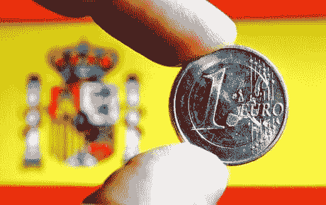

我要做的是使用 R 中的 [*eurostat 包*](https://cran.r-project.org/web/packages/eurostat/eurostat.pdf) 从 Eurostat 下载一些数据，分析时间序列，为以下 6 个总量中的每一个建立模型并预测未来 8 个季度:

1.  [GDP](https://en.wikipedia.org/wiki/Gross_domestic_product) ( *按市场价格计算的国内生产总值*)
2.  消费(*最终消费支出*)
3.  总资本(*总资本形成*)
4.  货物和服务的出口(*)*
5.  (货物和服务的)进口
6.  薪金(*工资和薪金*)

我们将有 6 个时间序列，从 1995 年开始，到 2018 年 Q2 奥运会结束。

我们将做 [ARIMA](https://en.wikipedia.org/wiki/Autoregressive_integrated_moving_average) 造型。

## ARIMA 模型(自回归综合移动平均)

*   在*自回归*模型(AR)中，我们使用变量过去值的线性组合来预测感兴趣的变量
*   在*移动平均*模型(MA)中，我们不使用预测变量的过去值，而是使用过去的预测误差
*   *ARIMA* 结合了自回归模型和移动平均模型，同时还对序列进行差分(*积分*在此上下文中的意思是*差分*的逆运算)来处理非平稳性。
*   与基于数据趋势和季节性描述的*指数平滑*模型相比， *ARIMA 模型*旨在描述数据的自相关性。

季节性的 ARIMA 模型包括季节性的条款。我们将讨论一个`ARIMA(p,d,q)(P,D,Q)m`模型，其中:

*   p = *自回归的顺序* ***非季节性*** *部分*
*   d = *一阶差分参与度为* ***非季节性*** *部分*
*   q = *顺序移动平均* ***非季节性*** *部分*
*   P = *自回归的顺序* ***季节性*** *部分*
*   D = *一阶差分所涉及的度为* ***季节性*** *部分*
*   Q = *顺序移动平均* ***季节性*** *部分*
*   m = *每年的观察次数*

# **数据采集&探索性分析**

在使用 eurostat API、下载并导入数据之后([查看完整的 R 代码](https://github.com/gabrielpierobon/spain-forecast)以了解详细信息)，我们来看看第一行和最后一行:

```
head(data, 20)
```

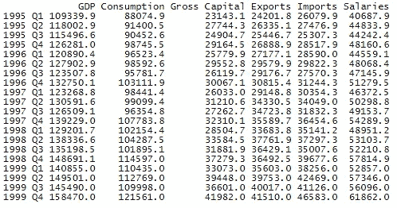

in millions of Euros at current prices

```
tail(data, 20)
```

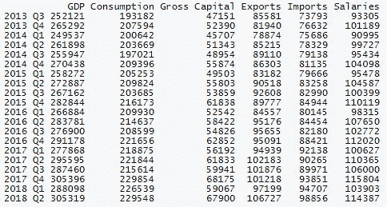

in millions of Euros at current prices

这是 6 个时间序列的图:

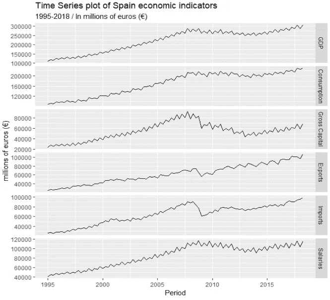

in millions of Euros at current prices

我们将逐一研究这个时间序列。

让我们首先关注 GDP 时间序列。


in millions of Euros at current prices

本地生产总值数列显示上升趋势及明显的季节性。

我们可以用两个图来检验季节性:

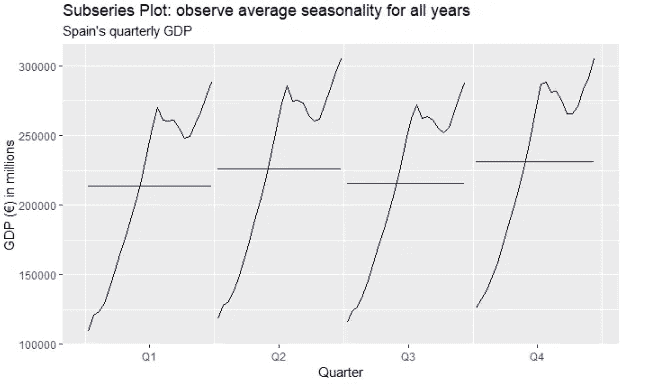

in millions of Euros at current prices

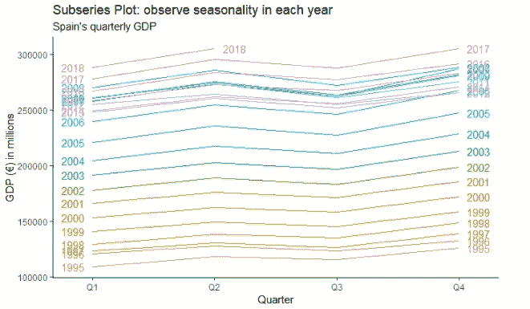

in millions of Euros at current prices

这两个图让我们理解 GDP 行为是季节性的，在 Q2 和第四季度表现较高，在 Q1 和第三季度表现较低。

# 和 ARIMA 一起做模特

为了开始我们的建模，我们将首先创建一个数据子集来训练模型，然后能够在看不见的数据(我们将有目的地展示的数据)上测试其性能:

```
train_set <- window(data, end = c(2016, 4))
```

然后我们使用`forecast`包中的`auto.arima()`函数来拟合一个自动 ARIMA 模型:

```
arima_train <- auto.arima(**train_set**[, "GDP"], 
                          ic = "aicc", 
                          approximation = FALSE,
                          stepwise = FALSE,
                          lambda = "auto")
```

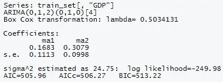

`auto.arima()`适合不同的模型，选择 ARIMA(0，1，2)(0，1，0)[4]作为最佳模型。

> 注:ARIMA 使用最大似然估计。这意味着它找到了最大可能获得数据的参数值。

为了让这个模型被接受，我们应该在正态分布的残差及其包含在 ACF 边界内的滞后中看不到任何模式。让我们在我们的模型对象上使用`checkresiduals()`来检查它:

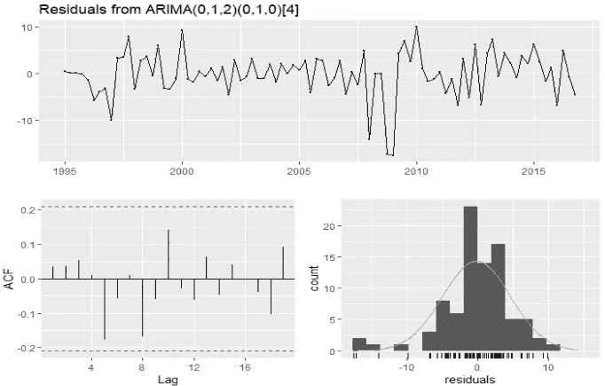

残差看起来确实像白噪声。我们准备好了。

现在让我们在完整的数据集上检查这个模型的性能，包括我们给出的季度。我们可以一次计算几个准确度分数:

```
round(accuracy(forecast(arima_train, h = 5), data[, "GDP"]), 3)
```

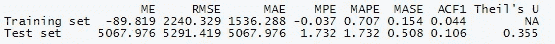

在这些准确性指标中，我们可以看看 MAPE(平均绝对百分比误差)。在这种情况下，对于测试集，我们得到 1.7%的 MAPE。这本身并不是非常有用，但如果我们有几个想要比较的模型，它会有所帮助。除此之外，1.7%似乎是一个相当低的误差百分比，我们将使用该模型进行预测。

我们现在继续扩展模型，以使用所有可用的信息(以便考虑我们之前发布的最新季度):

```
arima_full <- auto.arima(**data**[, "GDP"],
                         ic = "aicc", 
                         approximation = FALSE,
                         stepwise = FALSE,
                         lambda = "auto")
```

这又导致了我们的 **ARIMA(0，1，2)(0，1，0)[4]** 模型。

然后，我们用它来预测未来 8 个季度，并绘制:

```
**arima_full** %>% 
 **forecast**(h = 8) %>% 
  **autoplot**() +
   labs(title = "Spain's quarterly GDP forecast: ARIMA modelling",
        subtitle = "In millions of euros (€), 2018-19",
        y = "GDP (€)")+
   scale_x_continuous(breaks = seq(1995, 2020, 1)) +
   theme(axis.text.x = element_text(angle = 45, hjust = 1))
```

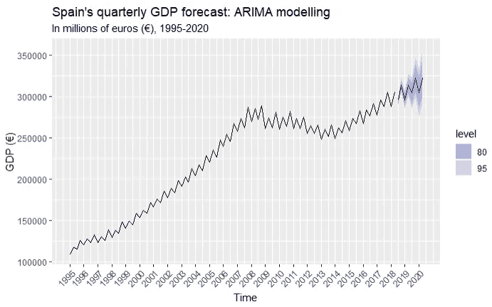

Modeled with ARIMA(0,1,2)(0,1,0)[4]

> 根据我们的预测，西班牙未来 8 个季度的国内生产总值显示出持续的上升趋势，同时也正确地捕捉到了季节性。根据这一预测，2020 年第二季度国内生产总值按现价计算将增至 3262.93 亿€，较 2018 年同期增长 6.87%，平均每季度增长 0.86%。

这是完整的预测，包括置信区间:

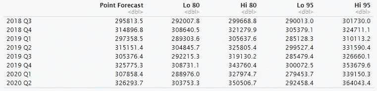

现在，我们将继续为其他指标重复同样的过程。我将避免技术细节，只绘制预测图，并在最后将数字表合并成一个表。

# 消费

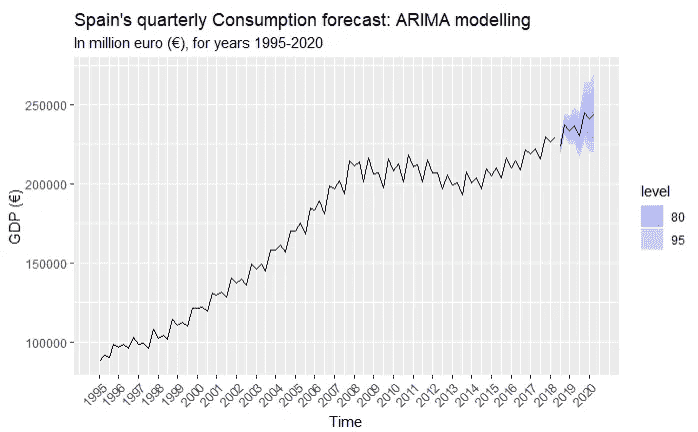

Modeled with ARIMA(2,1,0)(0,1,1)[4]

# 总资本

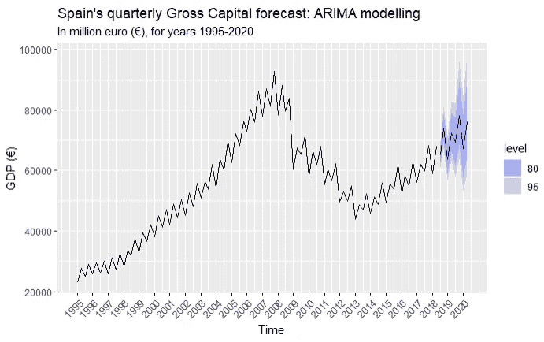

Modeled with ARIMA(0,1,0)(1,1,1)[4]

# 出口

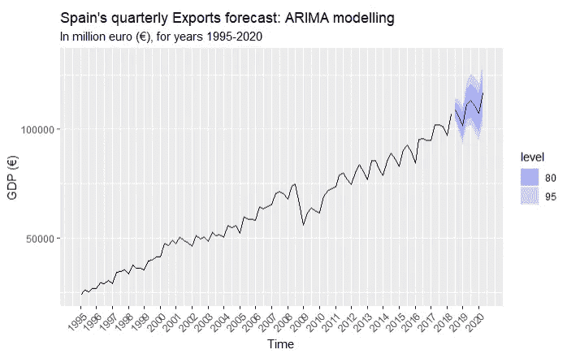

Modeled with ARIMA(2,0,0)(2,1,1)[4] with drift

# 进口

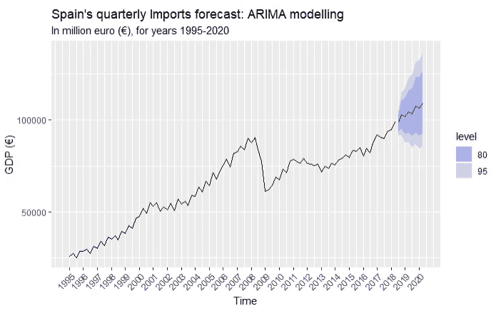

Modeled with ARIMA(2,0,0)(0,1,1)[4] with drift

# 薪水

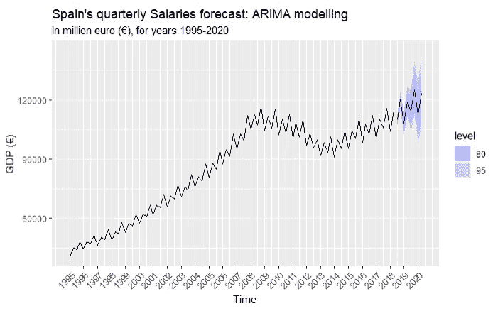

Modeled with ARIMA(2,1,3)(0,1,0)[4]

# 预测摘要

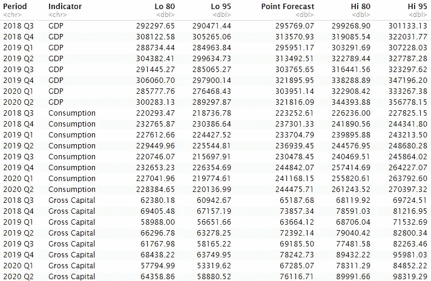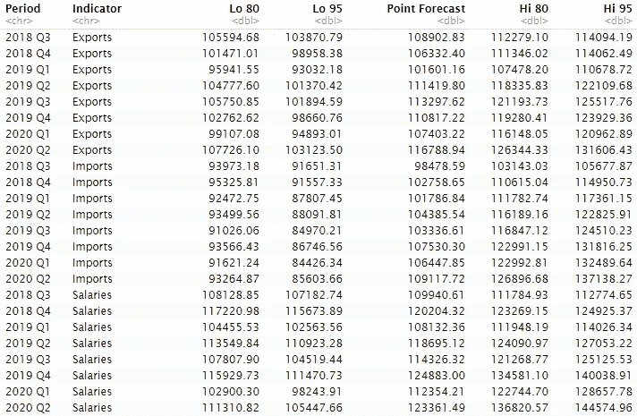

> [在这里查看完整的 R 代码](https://github.com/gabrielpierobon/spain-forecast)