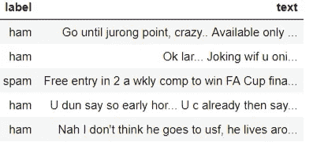
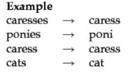
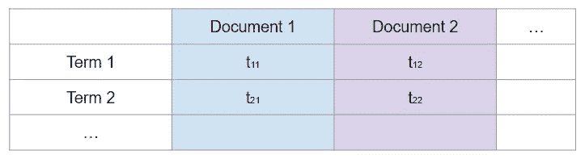
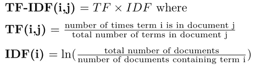
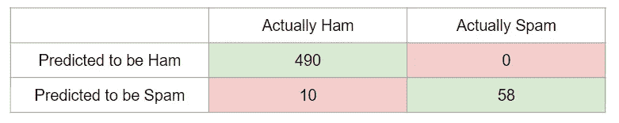
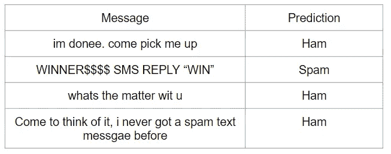

# 垃圾邮件还是火腿:自然语言处理介绍第 2 部分

> 原文：<https://towardsdatascience.com/spam-or-ham-introduction-to-natural-language-processing-part-2-a0093185aebd?source=collection_archive---------2----------------------->


Spam … or ham?

这是我的自然语言处理基础系列的第二部分。如果你还没看第一部分，可以在这里找到[。](https://medium.com/analytics-vidhya/introduction-to-natural-language-processing-part-1-777f972cc7b3)

在这一部分中，我们将从头到尾地介绍如何用 Python 3 构建一个非常简单的文本分类器。我们将使用[垃圾短信收集数据集](https://www.kaggle.com/uciml/sms-spam-collection-dataset/home)，该数据集根据短信是“垃圾短信”还是“垃圾短信”(非垃圾短信)来标记 5574 条短信。

我们的目标是建立一个预测模型，它将确定一个文本消息是垃圾邮件还是火腿。代码见[这里](https://github.com/happilyeverafter95/Medium/blob/master/spam_or_ham.py)。

# 我们开始吧！

导入数据后，我更改了列名，使其更具描述性。

```
import pandas as pddata = pd.read_csv("spam.csv", encoding = "latin-1")
data = data[['v1', 'v2']]
data = data.rename(columns = {'v1': 'label', 'v2': 'text'})
```

我们数据集的前几个条目如下所示:



通过简单地浏览我们的数据，我们对我们正在处理的文本有了一些了解:口语。这个特定的数据集也有 87%的邮件被标记为“垃圾邮件”，13%的邮件被标记为“垃圾邮件”。当稍后评估我们的分类器的强度时，类别不平衡将变得重要。

# 数据清理

清理文本数据与常规数据清理略有不同。文本规范化比去除离群值或杠杆点更受重视。

根据维基百科:

> 文本规范化是将文本转换成以前可能没有的单一规范形式的过程。

正确使用时，它可以减少噪音，将具有相似语义的术语分组，并通过给我们一个更小的矩阵来降低计算成本。

我将介绍几种常见的标准化方法，但是请记住，使用它们并不总是好主意。保留判断何时使用数据科学中人的因素的权利。

[**没有免费的午餐定理:**](https://en.wikipedia.org/wiki/No_free_lunch_theorem) 从来没有一个解决方案对所有的事情都有效。用您的数据集尝试它，以确定它是否适合您的特殊用例。

**案例规范化**

大小写是否提供了关于文本消息是垃圾邮件还是垃圾邮件的任何相关信息？ *HELLO* 和 *hello* 或者 *Hello* 语义相同吗？你可以根据以前的知识认为垃圾邮件倾向于使用更多的大写字母来吸引读者的注意力。或者，你可以争辩说这没有什么区别，所有的单词都应该简化为相同的大小写。

**删除停止字**

停用词是没有增加预测价值的常用词，因为它们随处可见。它们类似于电影《T2:超人总动员》中的反派评论:

> *当每个人都是超级的时候，没有人会是【超级】*。


英语中一些常见的停用词:

*   我
*   a
*   因为
*   到

关于什么时候删除停用词是个好主意，有很多争论。这种做法在许多信息检索任务(如搜索引擎查询)中使用，但在需要对语言进行语法理解时可能是有害的。

**删除标点符号、特殊符号**

我们必须再次考虑标点符号和特殊符号对分类器预测能力的重要性。我们还必须考虑每个符号功能的重要性。例如，撇号允许我们定义缩写，并区分像 *it's* 和 *its 这样的单词。*

**词干匹配/词干匹配**

这两种技术都减少了变形形式，使具有相同词条的单词规范化。词汇匹配和词干匹配的区别在于，词汇匹配通过考虑单词的上下文来进行这种归约，而词干匹配则不会。缺点是目前没有准确率非常高的 lemmatiser 或 stemmer。



Examples of stemming from Stanford NLP

不太常见的规范化技术包括纠错、将单词转换为其词性或使用同义词词典映射同义词。除了错误纠正和同义词映射之外，还有许多用于其他规范化技术的预建工具，所有这些工具都可以在 [*nltk* 库](https://www.nltk.org/)中找到。

对于这个特殊的分类问题，我们将只使用案例规范化。基本原理是很难将词干分析器或词尾分析器应用到口语中，而且由于文本消息非常短，删除停用词可能不会给我们留下太多工作。

```
def review_messages(msg): # converting messages to lowercase msg = msg.lower() return msg
```

作为参考，这个函数进行了大小写规范化，删除了停用词和词干。

```
from nltk import stemfrom nltk.corpus import stopwordsstemmer = stem.SnowballStemmer('english')stopwords = set(stopwords.words('english')) def alternative_review_messages(msg): # converting messages to lowercase msg = msg.lower() # removing stopwords msg = [word for word in msg.split() if word not in stopwords] # using a stemmer msg = " ".join([stemmer.stem(word) for word in msg]) return msg
```

我们应用第一个函数来归一化文本消息。

```
data['text'] = data['text'].apply(review_messages)
```

# 向量化文本

在本系列的第一部分中，我们探索了最基本类型的单词矢量器，单词袋模型，由于其简单性，它对于我们的垃圾邮件或业余爱好者分类器来说不是很好。

相反，我们将使用 TF-IDF 矢量器(术语频率—逆文档频率)，这是一种类似的嵌入技术，它考虑了每个术语对文档的重要性。

虽然大多数矢量器都有其独特的优势，但使用哪一种并不总是很清楚。在我们的例子中，选择 TF-IDF 矢量器是因为它在对文本消息等文档进行矢量处理时简单而高效。

TF-IDF 通过计算文档和词汇表中每个术语之间的 TF-IDF 统计量来对文档进行矢量化。文档向量是通过使用每个统计信息作为向量中的一个元素来构建的。



文件 *j* 中术语 *i* 的 TF-IDF 统计量计算如下:



在解决了 TF-IDF 之后，我们必须决定矢量器的粒度。将每个单词指定为自己的术语的一种流行的替代方法是使用分词器。记号赋予器根据空白和特殊字符将文档分割成*记号*(从而将每个记号分配给它自己的术语)。

**例如，短语*what ' s how on*可能被拆分为 *what，s，going，on* 。**

标记器能够提取比单词级分析器更多的信息。然而，分词器不能很好地处理口语，可能会遇到拆分 URL 或电子邮件的问题。因此，我们将使用单词级分析器，它将每个单词分配给它自己的术语。

在训练矢量器之前，我们将数据分为训练集和测试集。我们 10%的数据用于测试。

```
from sklearn.model_selection import train_test_splitX_train, X_test, y_train, y_test = train_test_split(data['text'], data['label'], test_size = 0.1, random_state = 1)# training the vectorizer from sklearn.feature_extraction.text import TfidfVectorizervectorizer = TfidfVectorizer()X_train = vectorizer.fit_transform(X_train)
```

# 构建和测试分类器

下一步是选择要使用的分类器类型。通常在这一步中，我们会选择几个候选分类器，并根据测试集对它们进行评估，看看哪一个效果最好。为了保持事物，我们可以假设支持向量机足够好地工作。

SVM 的目标是找到

*C* 项用作影响目标函数的正则化。

较大的 C 值通常会导致超平面具有较小的裕度，因为它更强调精度而不是裕度宽度。诸如此类的参数可以通过网格搜索精确调整。

```
from sklearn import svmsvm = svm.SVC(C=1000)svm.fit(X_train, y_train)
```

现在，让我们来测试一下。

```
from sklearn.metrics import confusion_matrixX_test = vectorizer.transform(X_test)y_pred = svm.predict(X_test)print(confusion_matrix(y_test, y_pred))
```



成绩一点都不差！我们没有假阳性，大约 15%的假阴性。

让我们用几个新例子来测试一下。

```
def pred(msg): msg = vectorizer.transform([msg]) prediction = svm.predict(msg) return prediction[0]
```



在我看来是对的:)

我希望你喜欢本教程的第 2 部分。同样，完整的代码可以在这里找到[。](https://github.com/happilyeverafter95/Medium/blob/master/spam_or_ham.py)

检查第三部分！

# 感谢您的阅读！

如果你喜欢这篇文章，可以看看我关于数据科学、数学和编程的其他文章。[通过 Medium](https://medium.com/@mandygu) 关注我的最新动态。😃

作为一个业余爱好项目，我还在[www.dscrashcourse.com](http://www.dscrashcourse.com/)建立了一套全面的**免费**数据科学课程和练习题。

如果你想支持我的写作，下次你报名参加 Coursera 课程时，可以考虑使用我的会员链接。完全公开—我从每一次注册中获得佣金，但不会对您产生额外费用。

再次感谢您的阅读！📕