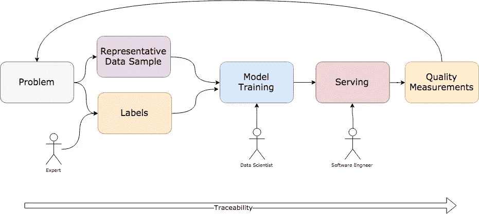
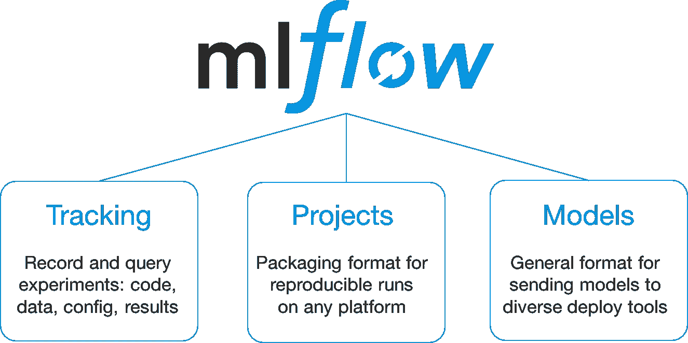
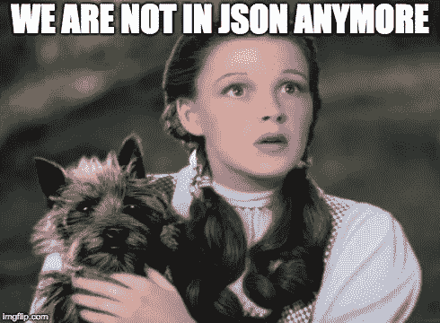

# 2018 年火花+人工智能峰会-概述

> 原文：<https://towardsdatascience.com/spark-ai-summit-2018-overview-7c5a8d7be296?source=collection_archive---------6----------------------->

上周参加了 Spark+AI 峰会，想分享一下学到的东西。

# 特种宽银幕电影

Spark +AI 峰会的大局观来自于大局观大师——[马克·安德森](https://medium.com/u/fa65e64cf273?source=post_page-----7c5a8d7be296--------------------------------)。他的公司[安德森·霍洛维茨](https://a16z.com/)是 [databricks](http://databricks.com/) 的早期投资者，该公司由[阿帕奇火花](https://spark.apache.org/)的创造者运营。

[https://data bricks . com/session/fireside-chat-with-Marc-Andre essen-and-Ali-gho DSI](https://databricks.com/session/fireside-chat-with-marc-andreessen-and-ali-ghodsi)

根据 Marc 的说法，AI 可能是添加到现有产品中的一个功能，也可能是一个完整的“*架构变化*”。现有产品的一个特征可以是 DSLR 相机的自动对焦。一个架构的改变是一个拍照无人机，它可以自动飞行，检测正确的场景，拍摄正确的照片。
A16Z 团队在人工智能将带来*架构变革而不仅仅是一个附加功能*的想法上下了大赌注。

如同任何新的架构一样，它需要新的软件范例。安德烈·卡帕西在介绍 [**软件 2.0**](https://databricks.com/session/keynote-from-tesla) 时，他的主旨在这一点上是正确的。

在经典的软件开发 1.0 中，开发人员以代码的形式描述预期的行为。

## 使用软件 2.0，行为不是被编程的，而是从精心准备的数据和标签中学习的。

像神经网络这样的机器学习模型可以从数据和标签中学习行为。学习到的行为甚至可以比根据规则编程的东西表现得更好。然而，这并不意味着不再需要编程。而是改变编程过程。软件开发人员 2.0 通过进行正确的数据采样、标记、模型选择和调整进行编程。

# 一般景观-两种类型的问题。

每个公司都有自己的故事，与迈向新架构的人工智能相关，但总的主题是清楚的。要解决的问题可以分为两大类:“新工具”和“大规模性能”。

## 新工具

新软件开发过程需要新的工具。这花了几十年的时间，但现在我们有了一套令人惊叹的专用于软件 1.0 的工具。我们有现代化的 ide、复杂的自动化测试框架、构建工具、docker、CI/CD 工具、github 等等。即使是半途而废的软件开发车间现在也可以建立一个自动化的过程，在这个过程中，很容易将生产中执行的代码与软件库中的代码联系起来。

不幸的是，对于人工智能驱动软件的工具却不能这么说。共同的主题是，科学家正在做的数据可能是使用各种软件组件进行的数百次离线实验。将这些模型投入生产并非易事。很多时候，并不清楚。生产中运行的确切模型是什么？它是根据什么数据训练的？训练数据是如何收集的？将新算法引入生产流水线需要什么？

从获得正确的训练数据到标记，再到管理训练，再到服务于能够调试现有模型缺点的模型，开发端到端的管道是未来十年左右的挑战。

We can only dream it’s that easy….

这就是为什么 Spark AI 峰会的最大亮点之一是 databricks 宣布了名为 [mlflow](https://databricks.com/blog/2018/06/05/introducing-mlflow-an-open-source-machine-learning-platform.html) 的新产品。

mlflow image from databricks announcement.

mlflow 似乎处于早期阶段，但它看起来非常有前途。

然而，mlflow 只是拼图的一小部分。这个高层图上的每个小方框都需要一套工具。每个公司都有自己的一套工具来解决他们的具体问题。特斯拉拥有复杂的图像标签集成开发环境。Netfix 引入了他们的 Scala DLS，用于被称为玻色子的分层数据采样。加州大学洛杉矶分校的团队推出了基于 Spark 的大调试，它可以快速找到错误，扭曲聚合。

很明显，软件 2.0 工具集还处于起步阶段，但发展非常迅速。

## 规模化性能

Spark AI Summit 表明，大数据真正变大的时候终于到了。当您的到达率达到每天 100 TB 时，以旧的可靠的 json 格式存储数据不再是一种选择。很明显，在数据处理方面，这些公司正在回归基础。

Pinterest 团队做了一个惊人的[演示](https://databricks.com/session/image-similarity-detection-at-scale-using-lsh-and-tensorflow)，使用 VGG 和位置敏感的哈丁删除了几乎重复的图片。他们每天会收到 2000 亿张图片。随着这种流入，每一点都很重要。他们使用可变字节编码和高度优化的原始集合等技术来处理如此大量的数据。

LinkedIn 推出了[大象博士](https://github.com/linkedin/dr-elephant)，它会自动调整 Spark 作业，然后让这些作业进入跨越 100 Pb 数据的 Spark 集群。

StichFix 找到了将 mix 效果分层模型的训练并行化的方法——[https://databricks . com/session/moment-based-estimation-for-hierarchical-models-in-Apache-spark](https://databricks.com/session/moment-based-estimation-for-hierarchical-models-in-apache-spark)。他们能够在 40 分钟内对 1.2 亿行数据集进行训练。

脸书为 Spark Shuffle 引入了新的优化，这应该会出现在 Spark 的下一个版本中。

Spark 流越来越强大，有状态流处理支持基于事件时间的窗口和流连接。

# 结论

很明显，人工智能将推动新产品架构，这将推动向模型驱动行为的移动。支持软件开发 2.0 的新工具的开发与老式的性能优化相结合，将是未来十年软件开发创新的主要驱动力。我们才刚刚开始。

我鼓励你在这里了解更多并获得录制的视频:【https://databricks.com/sparkaisummit/sessions 