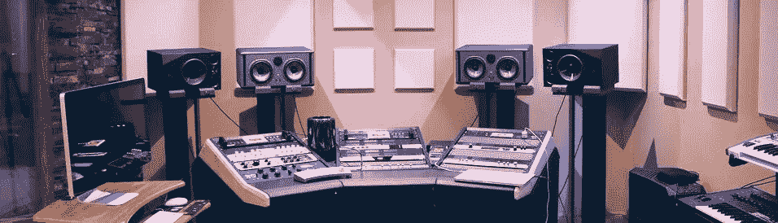
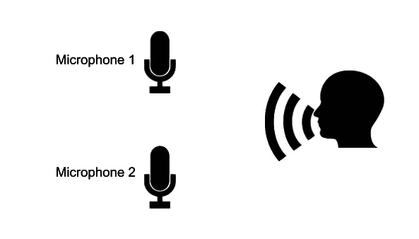
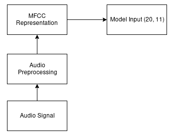
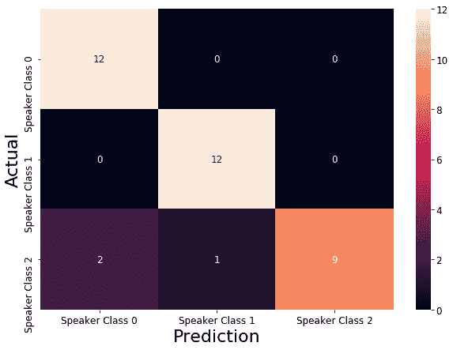
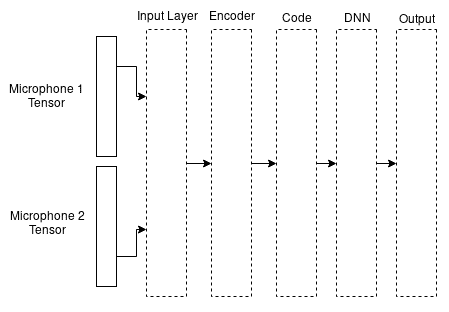
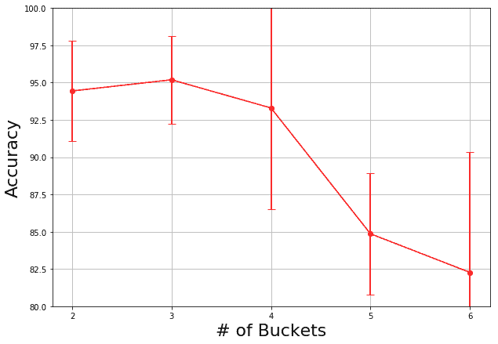
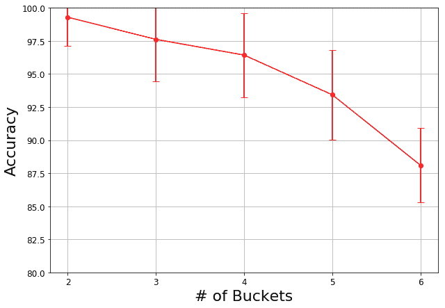

# 使用深度学习的说话人区分

> 原文：<https://towardsdatascience.com/speaker-differentiation-using-deep-learning-68b2dede498f?source=collection_archive---------10----------------------->

上周，我在 ICSEE2018 上发表了一篇关于神经网络系统的[会议论文，该系统能够快速区分双麦克风音频中的扬声器。这与](https://www.ieee.org.il/icsee-2018/)[酒会问题](https://www.youtube.com/watch?v=Qj5ltrAFric)有关。在我的工作中，这个想法是一个神经网络学习如何使用每个说话者的少量干净的训练数据来将语音分成多个箱(一个非常乐观的假设)。一个进一步简化的假设是，有正常的背景噪音，但没有困难的东西，如背景音乐或噪音。这里最难的部分，或者取决于你的观点，最容易的部分，是应该有最少的预处理。神经网络对音频的每个片段进行预测，当在给定的对话中检测到每个语音签名时，说话者就被识别出来。

在更一般的有多个说话者的鸡尾酒会问题中，这要困难得多，这个想法是这些说话者可以被识别，因为我们知道谁在说话，他们在哪里，他们说话有多大声。在这种情况下，扬声器的位置是相关的，而在我们的工作中，人们对麦克风说话的相对位置是相似的，因此我们专注于扬声器的声音，而不是声音的力量或相对位置。

We used 2 microphones to record human voices.

该领域还有其他关于从单麦克风和双麦克风信号中提取特征的工作，让我们跳过所有这些。我们的目标是看看某一种神经网络是否只需要基本的预处理就能完成这项工作。

我的合著者[默罕默德·阿斯尼](https://ca.linkedin.com/in/mohamed-asni)、托尼·马修[、米奥德拉·博利奇](http://www.site.uottawa.ca/~mbolic/)和[莱奥·格雷布勒](https://medium.com/u/136fa39ffeba?source=post_page-----68b2dede498f--------------------------------)在这篇论文上与我一起工作了很长时间。我觉得我们花了大约一年的时间。回溯到拨款和创意阶段，超过一年。该项目从需求收集延伸到解决方案架构，然后是数据收集，最后是开发、分析、起草、提交论文，并在会议上进行演示。这些事情发生得很慢。在你知道之前，这篇论文应该会出现在 IEEE Xplore 和谷歌学术网站上。

最终，我们开发了一种深度学习解决方案，用于区分同时来自两个麦克风源的音频中的人声。为了更好地理解这个解决方案，让我们简单地讨论一下自动编码器、卷积、MFCC 等等。我不会在本文中涵盖我们所做的一切，也不会介绍现有技术。相反，我想从解决方案架构的角度向您介绍我们所做的事情。

[自动编码器](https://en.wikipedia.org/wiki/Autoencoder) (AE)将输入的维度缩小到潜在空间表示(AE 的编码器部分)，然后尝试重建压缩数据(解码器)。这种编码器-解码器系统旨在将输入压缩到某个较低维度的潜在空间中，以保存输入的基本信息。换句话说，它可以被看作是一个自动化的特征提取器。[卷积 AEs，(CAEs)](https://link.springer.com/chapter/10.1007%2F978-3-642-21735-7_7) 基于 AEs，其中[卷积层](https://en.wikipedia.org/wiki/Convolutional_neural_network)用于编码/解码，而不是 MLP 中的[层。](https://en.wikipedia.org/wiki/Multilayer_perceptron)

因此，我们使用 CAE 进行自动特征提取并生成精确的潜在空间表示，但我们没有在原始音频上这样做。[梅尔频率倒谱](https://en.wikipedia.org/wiki/Mel-frequency_cepstrum) (MFCC)提供了音频特征的短期频谱表示。MFCC 是音频振幅频谱表示的一种紧凑形式。当用作特征提取的预处理步骤时，它降低了计算成本，并且它被广泛地知晓并用于人类语音材料。因此，如下图所示，在使用 CAE 对原始音频进行分类之前，我们对其进行了 MFCC 预处理。

Single microphone audio preprocessing leading to the AI model’s input

这项工作的基本目的是评估 CAE 的准确性，因为网络输出的叶片数量增加了。我们希望在不进行大量预处理的情况下，同时使用来自两个麦克风源的输入。我们对这个项目的预期是，无论数据集的大小和质量如何，随着扬声器(桶)数量的增加，模型的准确性最终会降低。我们预料到了这一点，因为随着输出标签的可能性越来越多，问题变得越来越难。直觉告诉我们，有两个人说话，你有 50%的几率猜对，但是有 10 个人说话，你只有 10%的几率猜对。因此，当说话的人可能是许多人中的一个时，就很难区分出是谁在说话。

下面的[混淆矩阵](https://scikit-learn.org/stable/auto_examples/model_selection/plot_confusion_matrix.html#sphx-glr-auto-examples-model-selection-plot-confusion-matrix-py)显示了区分 3 个扬声器的双麦克风结果。系统在 12 次尝试中识别了 3 个扬声器中的 2 个，但是第三个扬声器被第一个扬声器混淆了两次，被第二个扬声器混淆了一次。

Confusion matrix for 3 speakers in a dual microphone setup

让我们更详细地讨论一下上述实验是如何进行的，以及 CAE 是如何设计的。使用两个麦克风同时收集数据，并保存到单独的 WAV 文件中。我们必须收集自己的数据，因为双麦克风数据集很难找到。我们复制了一个公共语音数据集的短语，有效地将其扩展到双麦克风领域，用于我们的窄应用和小数据集。我们以 44100 Hz 的采样率进行记录，每个音频片段由 10 秒的持续时间组成。录音中的平均房间噪音水平为 47 分贝。在我们的新录音中，我们有 6 名 30 岁以下的发言者，其中 3 名是男性，3 名是女性。收集的样本被转换为每个麦克风信号的 MFCC 表示，以便我们可以比较单麦克风和双麦克风的性能。

在我们的系统中，解码器(DNN)使用编码数据(由编码器(CNN)生成的数据)的相关特征，通过将扬声器放入桶中来区分原始音频中的扬声器

Block diagram showing the MFCC input for 2 audio snippets concatenated before entering an encoder, followed by a decoder and a softmax at the output. The width of the output was the same as then number of possible individuals (speakers) in each experiment.

对于每个实验，我们使用 [K 倍交叉验证](https://scikit-learn.org/stable/auto_examples/model_selection/plot_cv_indices.html#sphx-glr-auto-examples-model-selection-plot-cv-indices-py)来确保结果有效。1 个麦克风的结果如下所示。

Test results for a single microphone (one MFCC input).

现在我们来看看两个麦克风的结果:

Test results for a dual microphone (two MFCC inputs).

在比较单麦克风和双麦克风的结果时，我们注意到的第一件事是，与单麦克风源相比，当给定来自 2 个麦克风源的音频时，模型表现更好。这是好消息。这意味着我们使用两个麦克风的想法并不愚蠢。我们还在两个结果中看到，随着可能的扬声器(桶)数量的增加，性能会下降。随着说话者类别数量的增加，模型的准确性降低。为了得到更一般的结论，我们发现，给定从两个麦克风同时收集的小样本音频，CAE 可以区分音频中的扬声器。

希望这篇文章能让你更好地理解这篇论文的内容，我们发现了什么，以及我们是如何做到的。这项工作得到了加拿大自然科学和工程研究委员会(NSERC)和统一计算机智能公司( [UCIC.io](http://www.ucic.io/) )的慷慨资助。自从这个项目开始以来，Mohamed 已经在 [lemay.ai](http://lemay.ai) 和 [stallion.ai](https://stallion.ai/en/team) 工作。

参加这个两年一度的 IEEE 会议真的很有用。它比我去的上一次会议更具技术性([tmls 2018](https://torontomachinelearning.com/)——更多关于那次旅行[这里](/pitching-artificial-intelligence-to-business-people-f8ddd8fb2da2))，面积略大于 TMLS 的三分之一。但我确实很喜欢这两场会议。我遇到了一些非常有趣的人，看到了一些精彩的演讲，从这次经历中我可以告诉你，信号处理领域正在发生很多变化。仍然有优秀的特征工程工作在进行，也有大量关于 ML/AI 方法处理语音和信号的新论文。深度学习专场也有一些精彩的讲座。我在中途认出了一些演讲者，他们是我在 youtube 视频上看到的演讲人。就像书呆子看名人一样。非常激动人心的时刻。

如果你喜欢我最近论文中的这篇文章，那么看看我过去最常阅读的一些文章，比如“[如何为人工智能项目定价](https://medium.com/towards-data-science/how-to-price-an-ai-project-f7270cb630a4)”和“[如何聘请人工智能顾问](https://medium.com/towards-data-science/why-hire-an-ai-consultant-50e155e17b39)”

下次见！

丹尼尔

您可能喜欢的其他文章:

*   [人工智能和不良数据](/artificial-intelligence-and-bad-data-fbf2564c541a)
*   [人工智能的图像数据集](/image-datasets-for-artificial-intelligence-bbb12615edd7)
*   人工智能:让你的用户给你的数据贴上标签