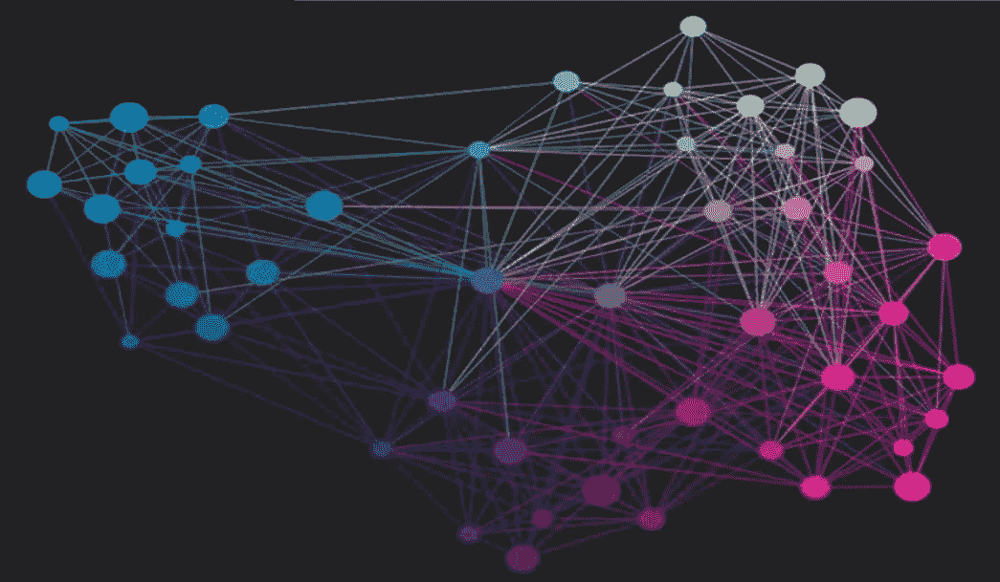
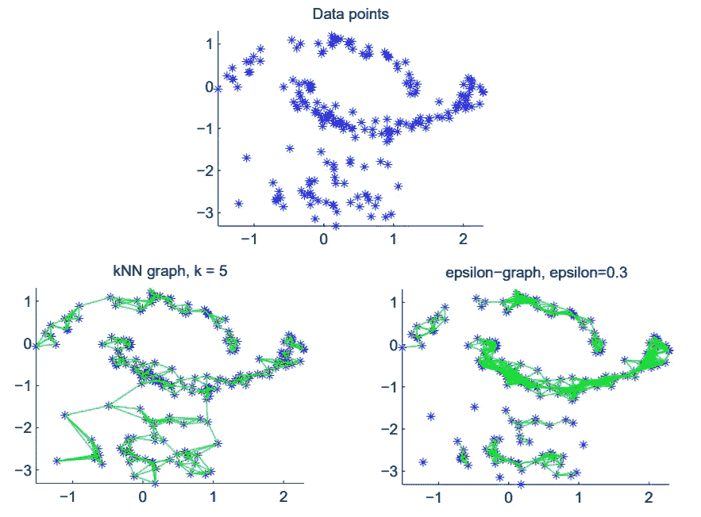
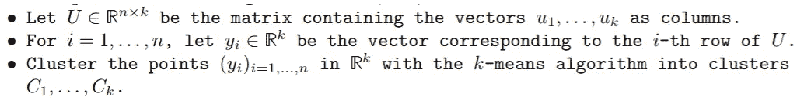
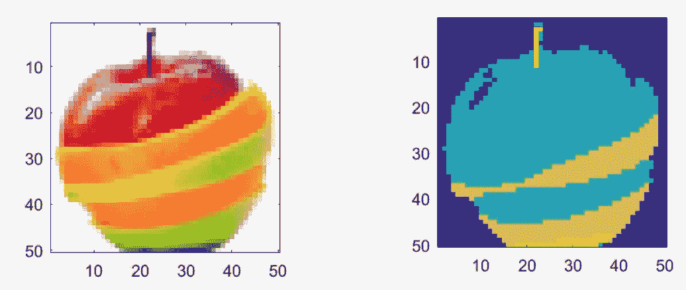

# 面向初学者的谱聚类

> 原文：<https://towardsdatascience.com/spectral-clustering-for-beginners-d08b7d25b4d8?source=collection_archive---------3----------------------->

聚类是探索性数据分析中使用最广泛的技术之一。其目标是将数据点分成若干组，使得同一组中的点相似，而不同组中的点彼此不相似。

谱聚类由于其简单的实现和在许多基于图的聚类中有前途的性能而变得越来越流行。它可以通过标准的线性代数软件有效地解决，并且通常优于传统的算法，例如 k-means 算法。

在这里，我们将尝试非常简要地解释它是如何工作的！

要执行谱聚类，我们需要 3 个主要步骤:

1.  创建我们要聚类的 *N* 个对象之间的相似度图。
2.  计算其拉普拉斯矩阵的前 k 个特征向量，以定义每个对象的特征向量。
3.  对这些特征运行 k-means 将对象分成 k 个类。

## 第一步:

表示一组数据点 *x* 1，.。。 *x* *N* 的形式为相似图 *G* =( *V* ， *E* )。

Similarity Graph

有不同的方法来构建表示数据点之间关系的图形:

1.  ε-邻域图:每个顶点都连接到半径为ε的球内的顶点，其中ε是一个实值，为了捕捉数据的局部结构，必须对其进行调整。
2.  k-最近邻图:每个顶点连接到它的 k-最近邻，其中 k 是控制数据的局部关系的整数。

Different similarity graphs

在上面的例子中，我们画了 3 个集群:两个“月亮”和一个高斯。

在ε-邻域图中，我们可以看到很难选择一个有用的参数ε。如图中ε = 0.3，中月上的点已经连接的非常紧密，而高斯中的点几乎没有连接。如果我们有“不同尺度”的数据，即在空间的不同区域，数据点之间的距离不同，这个问题总是会发生。然而，k-最近邻图可以连接“不同尺度”上的点。我们可以看到低密度高斯中的点与高密度月球中的点相连。

## 第二步:

现在我们有了我们的图，我们需要形成它相关的拉普拉斯矩阵。

**注意:谱聚类的主要工具是图拉普拉斯矩阵。**

我们现在要做的就是计算 **L** 的特征向量 *u* _ *j* 。

## 第三步:

运行 k 均值:

**应用**:图像处理中的光谱聚类

Original image (left) and segmented image using spectral clustering (right)

## **加成**:k 怎么选？

通过将点投影到非线性嵌入中并分析拉普拉斯矩阵的特征值，可以推断出数据中存在的聚类的数量。当相似图不完全连通时，特征值λ = 0 的重数给我们一个 k 的估计。

# 结论

在处理经验数据的每个科学领域中，人们试图通过识别数据中相似行为的组来获得对数据的第一印象。在本文中，我们介绍了谱聚类算法如何通过使用拉普拉斯矩阵的底部特征向量将图的顶点嵌入到低维空间中来工作。

请继续关注，如果你喜欢这篇文章，请留下👏！

# 参考

[1] [利用线性谱聚类进行图像分割，Sandeep Reddy](https://www.omicsonline.org/open-access/image-segmentation-by-using-linear-spectral-clustering-2167-0919-1000143.php?aid=81482)【2】[机器学习中的图形，Michal Valko](http://citeseerx.ist.psu.edu/viewdoc/download?doi=10.1.1.708.6592&rep=rep1&type=pdf)