# 使用神经网络的语音分类:基础

> 原文：<https://towardsdatascience.com/speech-classification-using-neural-networks-the-basics-e5b08d6928b7?source=collection_archive---------7----------------------->

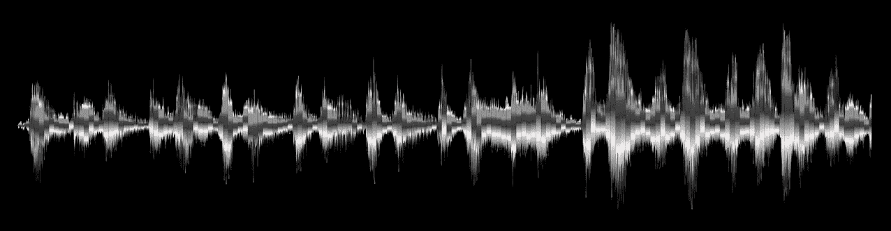

最近，我开始研究一个语音分类问题，因为我对语音/音频处理知之甚少，所以我不得不回顾一下最基本的内容。在这篇文章中，我想回顾一下我学到的一些东西。为此，我想研究“语音 MNIST”数据集，即一组记录的口语数字。

你可以在这里找到数据集[。](https://github.com/Jakobovski/free-spoken-digit-dataset)

数据集包含以下内容:

*   3 个扬声器
*   1，500 个录音(每个扬声器每个数字 50 个)

如题所述，这是一个分类问题，我们得到一段录音，需要预测其中所说的数字。

我想尝试不同的方法来解决这个问题，并逐步了解什么更好，为什么。

首先，我们来了解一下录音到底是什么。我将使用优秀的`librosa`库:

```
wav, sr = librosa.load(DATA_DIR + random_file)
print 'sr:', sr
print 'wav shape:', wav.shape# OUTPUT
sr: 22050
wav shape: (9609,)
```

`load`方法返回 2 个值，第一个是实际声波，第二个是‘采样率’。如你所知，“声音”是一种模拟信号，为了使其数字化，并能够用类似于`numpy`阵列的东西来表示，我们必须对原始信号进行[采样](https://en.wikipedia.org/wiki/Sampling_(signal_processing))。简而言之，采样只是从原始信号中“选择”有限数量的点，并丢弃其余的点。我们可以将这些选定的点存储在一个数组中，并对其执行不同的离散操作。[奈奎斯特-香农采样定理](https://en.wikipedia.org/wiki/Nyquist%E2%80%93Shannon_sampling_theorem)表明，如果我们的采样速率足够高，我们就能够捕获信号中的所有信息，甚至完全恢复它。

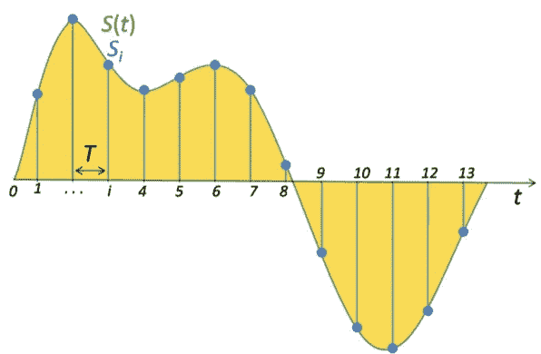

Signal sampling representation. The continuous (analog) signal is represented with a green colored line while the discrete samples are indicated by the blue vertical lines.

采样率非常重要，我们稍后会在不同的算法中用到它。它的标度是赫兹，即每秒的点数(样本数)。在我们的示例中，`sr=22050` 我们每秒有 22050 个样本，我们的波形大小为 9609，我们可以使用以下公式计算音频长度:

`length = wav.shape[0]/float(sr) = 0.435 secs`

实际上，我们的实际采样率不是 22050，`librosa`隐式地对我们的文件进行重新采样，以获得更标准的 22050 SR。要获得原始采样率，我们可以使用`sr=False`的`load`方法:

```
wav, sr = librosa.load(DATA_DIR + random_file, sr=None)
print 'sr:', sr
print 'wav shape:', wav.shape
print 'length:', sr/wav.shape[0], 'secs'# OUTPUT
sr: 8000
wav shape: (3486,)
length: 0.43575 secs
```

音频长度与预期保持一致。

当我们处理具有不同采样率的文件时，重采样非常有用。我们暂时坚持这一点。

实际声音是这样的:

```
plt.plot(wav)
```

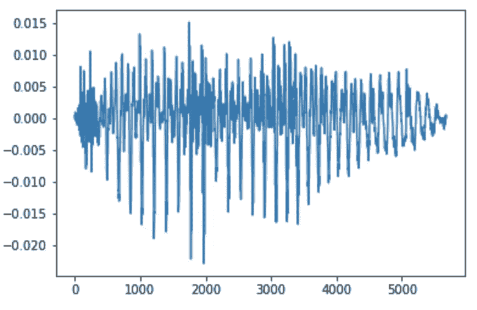

如你所见，这是一个非常复杂的信号，很难从中找出规律。就算放大看，还是挺复杂的。

```
plt.plot(wav[4000:4200])
```

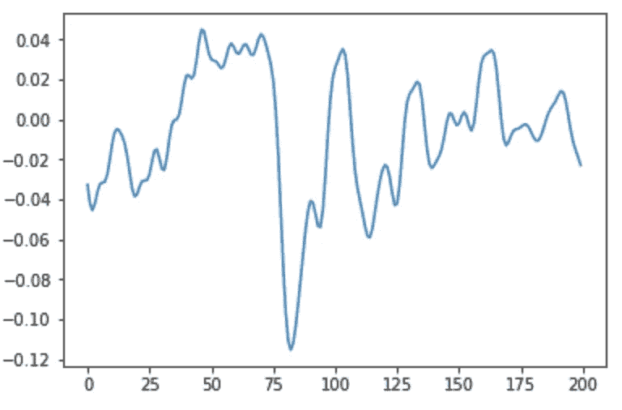

200 samples out of 9000 of the original file

首先，我们将尝试“原样”使用这些波形，并尝试建立一个神经网络来为我们预测口语数字。实际上，几乎从来没有这样做过。我这样做只是为了理解从原始文件到完整解决方案的不同步骤。

但首先，我们需要准备数据集。正如我们前面看到的，我们有 1500 个由 3 个说话者说出的数字的录音。将数据分割成经典的 80-20 训练测试分割可能不是一个好主意，因为我们的训练数据将包含与测试数据中相同的扬声器，并且可能会提供非常好的结果，而对其他扬声器提供非常差的结果。测试我们算法的正确方法是在两个扬声器上训练它，在第三个扬声器上测试它。这样，我们将有一个非常小的训练和测试集，但对于本文的目的来说，这已经足够了。在现实生活中，我们必须在许多不同性别、种族、口音等的人身上测试我们的算法，以便真正了解我们的算法有多好。

我们的数据看起来像这样:

```
X = []
y = []
pad = lambda a, i: a[0: i] if a.shape[0] > i else np.hstack((a, np.zeros(i - a.shape[0])))
for fname in os.listdir(DATA_DIR):
    struct = fname.split('_')
    digit = struct[0]
    wav, sr = librosa.load(DATA_DIR + fname)
    padded = pad(wav, 30000)
    X.append(padded)
    y.append(digit)X = np.vstack(X)
y = np.array(y)print 'X:', X.shape
print 'y:', y.shape# OUTPUT
X: (1500, 30000)
y: (1500,)
```

我们将使用一个简单的 MLP 网络与一个单一的隐藏层开始:

```
ip = Input(shape=(X[0].shape))
hidden = Dense(128, activation='relu')(ip)
op = Dense(10, activation='softmax')(hidden)
model = Model(input=ip, output=op)model.summary()# OUTPUT
Layer (type)                 Output Shape              Param #   
=================================================================
input_1 (InputLayer)         (None, 30000)             0         
_________________________________________________________________
dense_1 (Dense)              (None, 128)               3840128   
_________________________________________________________________
dense_2 (Dense)              (None, 10)                1290      
=================================================================
Total params: 3,841,418
Trainable params: 3,841,418
Non-trainable params: 0
_________________________________________________________________
```

让我们来训练它:

```
model.compile(loss='categorical_crossentropy',
              optimizer='adam',
              metrics=['accuracy'])history = model.fit(train_X,
          train_y,
          epochs=10,
          batch_size=32,
          validation_data=(test_X, test_y))plt.plot(history.history['acc'], label='Train Accuracy')
plt.plot(history.history['val_acc'], label='Validation Accuracy')
plt.xlabel('Epochs')
plt.ylabel('Accuracy')
plt.legend()
```

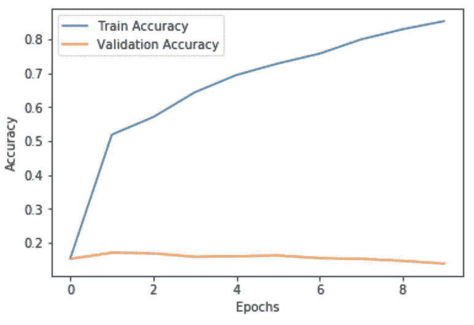

您可以看到，我们在训练数据上的准确性还可以，但在测试数据上却很糟糕。

我们可以尝试不同的网络架构来解决这个问题，但正如我前面所说，在实践中，raw waves 几乎从未使用过。所以我们将转向更标准的方式来表示声音文件:声谱图！

在讲光谱图之前，我们先来讲讲余弦波。

余弦波看起来像这样:

```
signal = np.cos(np.arange(0, 20, 0.2))
plt.plot(signal)
```

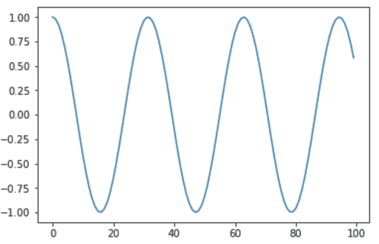

你可以看到这是一个非常简单的信号，其中有一个清晰的模式。我们可以通过改变余弦波的振幅和频率来控制余弦波。

```
signal = 2*np.cos(np.arange(0, 20, 0.2)*2)
plt.plot(signal)
```

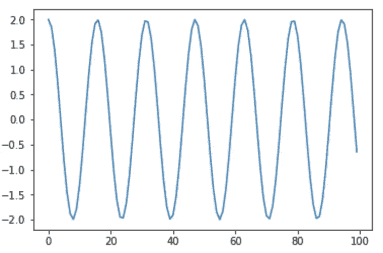

通过将不同频率的不同余弦波叠加在一起，我们可以实现非常复杂的波。

```
cos1 = np.cos(np.arange(0, 20, 0.2))
cos2 = 2*np.cos(np.arange(0, 20, 0.2)*2)
cos3 = 8*np.cos(np.arange(0, 20, 0.2)*4)
signal = cos1 + cos2 + cos3
plt.plot(signal)
```

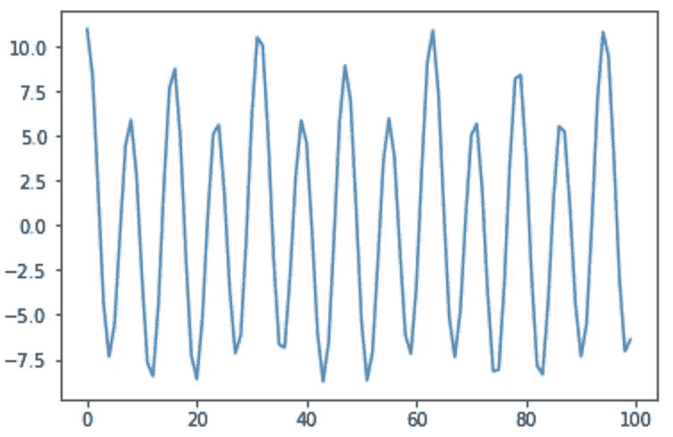

我们可以(至少)用两种方式来表示上面的波。我们可以使用非常复杂的整个 100 大小的信号，或者，我们可以只存储该信号中使用的频率。这是一种更简单的数据表示方式，占用的空间也少得多。这里我们有 3 个不同振幅的不同频率。那三个频率到底是什么？这是一个很好的问题，答案是:这取决于采样率(我稍后将展示如何)。

我们需要一种方法，给定一个原始波(时间的函数)，将返回给我们其中的频率。这就是傅立叶变换的作用！我不会深究傅立叶变换是如何工作的，所以让我们把它当作一个黑匣子，给我们一个声波的频率。如果你想更好的理解，我推荐[这个](https://www.youtube.com/watch?v=spUNpyF58BY&t=3s)视频。

我们需要确定我们的波的采样率是多少，或者类似地，我们的信号的长度是多少。为了方便起见，我们用一秒钟。我们有 100 品脱，所以我们的采样率是 100 赫兹。

现在我们可以对信号进行傅立叶变换。我们将使用“快速傅立叶变换”算法来计算 O(nlogn)中的离散傅立叶变换。为此我们将使用`numpy`

```
fft = np.fft.fft(signal)[:50]
fft = np.abs(fft)
plt.plot(fft)
```

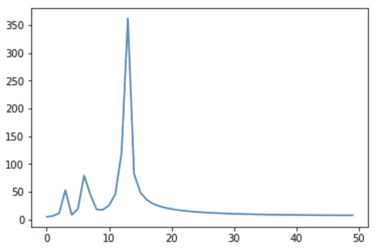

我们在这里看到 3 种频率:4、7 和 14 位每秒，正如我们建立我们的信号(欢迎您检查)。

这里我们只使用返回值的前半部分，因为 FFT 的结果是对称的。

原来每一个声音(甚至是人的语音)都是由很多这样的不同频率的基本余弦波组成的。

我们有办法从任何声音信号中获取频率，但人类语音不是静态噪声，它会随着时间的推移而变化，因此为了正确地表示人类语音，我们将把我们的记录分成小窗口，并计算每个窗口中使用的频率。为此，我们可以使用[短时傅立叶变换](https://en.wikipedia.org/wiki/Short-time_Fourier_transform)。

```
D = librosa.amplitude_to_db(np.abs(librosa.stft(wav)), ref=np.max)
librosa.display.specshow(D, y_axis='linear')
```

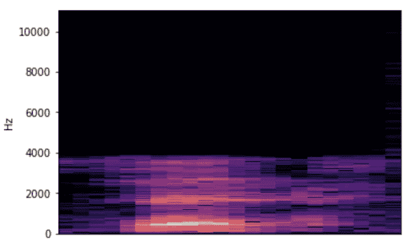

我们可以在录音中间看到一些低频声音。这是典型的男性声音。这就是光谱图！它向我们展示了录音不同部分的不同频率。

让我们看一下代码:

`librosa.stft`为我们计算短时傅立叶变换。返回值是一个矩阵，其中 X 是窗口号，Y 是频率。STFT 值是复数。我们只需要使用它的实部来找到频率系数。

`np.abs`取`stft`的绝对值，如果是复数，则返回实部的绝对值。

`librosa.amplitude_to_db`将数值转换为分贝。

概括一下:

[傅立叶变换](https://en.wikipedia.org/wiki/Fourier_transform) —将时间幅度信号转换为频率幅度函数的过程

[离散傅里叶变换](https://en.wikipedia.org/wiki/Discrete_Fourier_transform) (DST) —傅里叶变换**离散**信号

[快速傅立叶变换](https://en.wikipedia.org/wiki/Fast_Fourier_transform)(FFT)——一种能够以 O(nlogn)而不是 O(n)计算傅立叶变换的算法

[短时傅立叶变换](https://en.wikipedia.org/wiki/Short-time_Fourier_transform)(STFT)——将记录分成小窗口并计算每个窗口 DST 的算法

很好，现在我们能够计算数据集中每个文件的光谱图，然后用它们来分类数字。光谱图的真正好处是它们像 2D 图像，所以我们可以对它们使用图像分类技术，特别是卷积神经网络！

```
ip = Input(shape=train_X_ex[0].shape)
m = Conv2D(32, kernel_size=(4, 4), activation='relu', padding='same')(ip)
m = MaxPooling2D(pool_size=(4, 4))(m)
m = Dropout(0.2)(m)
m = Conv2D(64, kernel_size=(4, 4), activation='relu')(ip)
m = MaxPooling2D(pool_size=(4, 4))(m)
m = Dropout(0.2)(m)
m = Flatten()(m)
m = Dense(32, activation='relu')(m)
op = Dense(10, activation='softmax')(m)model = Model(input=ip, output=op)model.summary()# OUTPUT
Layer (type)                 Output Shape              Param #   
=================================================================
input_2 (InputLayer)         (None, 1025, 40, 1)       0         
_________________________________________________________________
conv2d_4 (Conv2D)            (None, 1022, 37, 64)      1088      
_________________________________________________________________
max_pooling2d_4 (MaxPooling2 (None, 255, 9, 64)        0         
_________________________________________________________________
dropout_3 (Dropout)          (None, 255, 9, 64)        0         
_________________________________________________________________
flatten_2 (Flatten)          (None, 146880)            0         
_________________________________________________________________
dense_3 (Dense)              (None, 32)                4700192   
_________________________________________________________________
dense_4 (Dense)              (None, 10)                330       
=================================================================
Total params: 4,701,610
Trainable params: 4,701,610
Non-trainable params: 0
____________________________
```

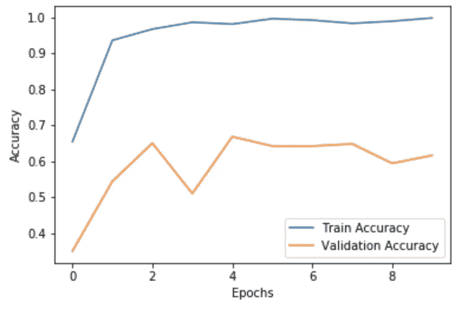

好多了！在我们的测试集上，我们得到了大约 65%的准确率，这离完美还差得很远，但这比使用原始波形要好得多。借助更多的数据和对我们网络的更多微调，我们可能会得到更好的结果。

**结论**

我们看到了一个非常基本的语音分类实现。为机器学习表示声音一点也不简单，有很多方法，也做了很多研究。傅立叶变换是信号处理的基础，几乎无处不在，是处理声音的基础。

你可以在这里找到我的实验代码。

**下一个要探索的话题:**

*   梅尔标度光谱图
*   梅尔频率倒谱系数