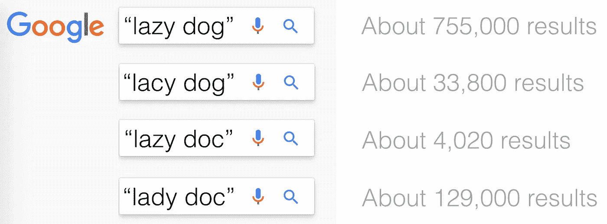

# 语音识别:懒狗初级读本

> 原文：<https://towardsdatascience.com/speech-recognition-a-lazy-dog-primer-6504ab4dccaf?source=collection_archive---------3----------------------->

我和一个好朋友最近在吃饭时聊起了语音识别应用。没错，我们就是*那些*人。隔着一张桌子，刻板的极客们对技术、创业和变革变得兴致勃勃。你可以走进几乎任何一家硅谷咖啡店，买一杯超定制的拿铁咖啡，仅仅五分钟后，你就可以成为风险投资或移动开发领域的迷你专家——或者至少感觉自己是专家。

回到我们的故事。我们正在进行有趣的讨论，在讨论过程中，我的朋友让我解释自动语音识别(ASR)实际上是如何工作的。我有点困惑，被迫检查我的假设，但意识到你不需要成为底层技术的专家，就能判断语音到文本的质量或对产品适合度和用户体验进行推理。那天晚上剩下的时间里，我们投入到了语音识别的深度探索中，揭开神秘的面纱，鼓励这个领域的奇妙创造力涌现出来。我们有时也会触及我知识的极限，促使我回头去追赶。

这是我关于语音识别的愚蠢的“懒狗入门”——只是为了吊你的胃口。如果你真的想了解 ASR，我鼓励你参加课程，阅读同行评审的论文(从深度学习方法到旧的 hmm、DTW、模型)，亲自动手，了解声学模型、频谱图和解码器。你会喜欢的。

与此同时，带走这些信息中的一些。你永远不知道什么时候你会在排队买咖啡的时候被迫跳进一场语音识别辩论。

# 人类最清楚。暂时如此。

尽管有这些缺陷、盲点和特性，以自动语音识别为特色的应用程序正开始为广大用户提供真正的价值。语音到文本有许多风格和体现:手机伴侣应用程序，笨重的客户服务导航系统，自称的智能扬声器，过度宣传的智能助手，以及我最喜欢的——[智能电梯](https://www.youtube.com/watch?v=JofRc_qQCAs)。

直观地说，基于机器的语音识别模仿了人们理解语音的过程。人类已经进化了他们的身体器官，能够产生可辨别的声音(通过声带、共振和发音)，甚至在嘈杂的环境中接收和辨别这些声音(外-中-内耳管道)，并应用他们过去的经验推理和解码不清楚的话语成为连贯、有意义的信息(通过计算和编码的经验)。

机器遵循相似的路径。为了便于解释，我们将在这本初级读本中使用一个更传统的语音识别模型。就拿[名句](https://en.wikipedia.org/wiki/The_quick_brown_fox_jumps_over_the_lazy_dog)*敏捷的棕狐狸跳过懒狗*来说吧，从语音生成，一直到语音识别。

## 1.制作:只要说一句话

当说出这句话时，*敏捷的棕色狐狸跳过懒惰的狗，*“你产生了在你周围传播的声音。你可以把声音的原始结构想象成一个波形。

组成单词的基本声音单位被称为*音素*，你可以把它们想象成上面波形中的小段。它们是元音如/e/、/a/、/o/和辅音如/p/、/b/、/k/，通常用斜线表示。其中一些音素非常接近，很容易混淆，尤其是在嘈杂的信道中，例如在打电话时。例如:/p/和/b/在“ ***P*** *aul* ”和“***b****all*”中相似；/g/和/k/在“***g****oal*”和“***c****oal*”中类似。

如果我们仅仅改变句子中的几个音素，波形看起来是相似的，但是意思完全偏离了:

音素混淆在嘈杂的情况下会加剧——这是我们句子的模糊版本。听到声音，解释它，并把它拼凑成有意义的东西不是一件容易的事情。

## 2.有人听到了吗？

这就是机器开始工作的地方。它需要倾听、捕捉声音，并将其转换成我们可以使用的标准格式。幸运的是，很长时间以来，麦克风一直是一种商品(例如，在移动设备、笔记本电脑、扬声器等中)。)而且捕捉到的声音质量也尽善尽美。机器使用廉价、无处不在的音频电路记录声音，并将其存储为相应的波形——然后开始工作。

出于所有实际目的，我们不会担心用于清理传入声音的硬件和软件过滤器的魔力，而只是假设质量足够高。

## 3.音素:解析那个声音！

还记得音素吗？在这个阶段，我们的算法将波形分割成它的组成声音单元:音素。在理想情况下，我们的波形将被转换成以下音素序列:

*/ðəkwɪk braʊn·福克斯·ʤʌmps ˈoʊvərðəˈleɪzi dɔg/*

然而，由于噪音、口音、犹豫、言语障碍和特殊习惯，会有一定程度的不确定性。在这些情况下，算法(称为解码器)会分支(思考:对冲他们的赌注)并考虑相同声音的替代音素序列:

*   你可能会说/ *dɔg/，但是/达克/和/dʌk* /也是可行的猜测。
*   在嘈杂的环境中，你可能会说出 */ˈleɪzi* /或/ *ˈleɪsi* /。

在这个阶段，我们可能会做出艰难的选择，选择一个音素序列。然而，聪明的算法很可能会将多个候选者带到语音识别过程的后续阶段。通过这种方式，他们将不同类型的信号(从声音到意义)结合起来，并推迟做出决定，直到所有的证据都汇总起来。在上面的例子中，假设算法评估了备选方案，并携带得分为 0.7 的序列/ *dɔg/* 和得分为 0.2 的序列/ dʌk */* 。

## 4.话:蕾丝还是懒？

好的，这不是一个单独的阶段，但为了清楚起见，我们将假装它是。实际上，解码器在更长的序列上进行优化，并基于概率矩阵生成可能的句子。

之前，我们已经确定了一组*候选音素序列*——基于原始波形的合理序列。在这个阶段，我们把这些序列解码成可能的单词。例如，我们会解码/ *dɔg/ →“狗”、/dak/ →“医生”、/* dʌk/ →“鸭子”。这不是一个直接的、确定的映射，因为人类产生的语音受到许多因素的影响:地理、年龄和语音模式、发音能力、教育等。

例如，假设单词“dog”的发音带有美国南方口音、苏格兰口音、波士顿口音、澳大利亚口音和东欧口音。这些重音会导致不同的音素序列，但最终需要映射到单词“dog”中。

就像以前一样，该算法评估许多备选方案/候选单词，对它们进行评分，并沿着管道进一步传播，而不是进行单一的最佳猜测。在我们的例子中，基于语音(和历史)证据，单词在这个阶段被分配概率分数:例如，“*狗*”的分数为 0.73，“*文档*”的分数为 0.55，以及“*鸭子*”的分数为 0.18。

请记住，像“ *doc* 这样的单词的*证据*可以从几个可能的音素序列中获得——例如，从美国口音下的 */dak/* 或东欧口音下的/ *dɔk* /中获得。语音识别需要适用于所有人，而不仅仅是电视节目主持人发音和标准口音的母语人士。

“The quick brown fox jumps over the lazy dog” OR “The quick brown fax bumps over the lady doc”? Credit: [Roy Jones](https://medium.com/u/43d50b537969?source=post_page-----6504ab4dccaf--------------------------------).

## 5.句子:人类会怎么做？

在这个最后阶段(出于解释目的，此处人为分离)，该算法评估候选词的所有组合——它在前面阶段已经识别的*好猜测*。它查找这些单词的组合(例如，“*懒 doc* ”、“*懒狗*”、“*莱西 doc* ”等)。)在其知识库中，被称为*语言模型*。语言模型是使用大量人类生成的文本构建的，从口语转录的语音到新闻故事。它们对共现统计进行编码，例如单词“ *dog* ”跟在单词“lazy”后面的频率与其他单词的频率。使用这些语言模型统计数据，算法可以推断一个人说出特定短语和句子的可能性有多大。

例如，“*跳过*”比“*颠簸提供*”更可能是一个人说出的短语。短语“*懒狗*”比“*莱西多克*”更有可能，但是“*多克女士*”也有合理的分量。

如果你想玩准语言模型，你可以使用谷歌的搜索引擎作为代理。试一试:

在我们的例子中，当面对“*ðəkwɪk braʊn·福克斯·ʤʌmps ˈoʊvərðəˈleɪzi dɔg*”时，该算法从音素、单词、短语，最后评估候选句子的总体概率，例如:

*   "快速的棕色人种跳过了懒惰的医生"
*   "敏捷的布朗克斯撞倒了一只带花边的狗"
*   "敏捷的棕色狐狸跳过懒惰的狗"
*   "T30 快速棕色传真取消了对多克女士的报价"
*   …

有了分段(音素/单词/短语)概率分数，该算法识别出最佳句子，即给定原始信号时具有最高总体概率的句子。在我们的例子中，最佳句子可能是“ ***”这只敏捷的棕色狐狸跳过了那只懒惰的狗*** ”，因此算法会产生它作为输出。

在这一点上，根据语音识别系统的工作表现，你会 a)高兴地跳过或者 b)痛苦和沮丧地咆哮。

# 限制与进步

在移动设备上，计算是有限的，时间是至关重要的——你不想在看到转录之前等待一两分钟。网络经常是不稳定的，这使得*总是*在云中执行语音识别，然后将结果发送回你的手机是不切实际的。由于这些限制，有限的语音识别模型通常部署在移动设备上。这意味着探索的替代语句更少，优化的范围更窄，语言模型等资源的覆盖范围更有限。

然而，当网络延迟允许时，语音到文本引擎的移动部署由强大的云部署支持，以提高准确性。

深度学习的最新进展对自动语音识别领域产生了重大影响。例如，最近的模型正在寻求同时学习 ASR 系统的所有元素:发音、声学和语言模型。目标是构建高精度系统，减少人工参与(即特征工程)，并减少内存占用，非常适合部署在移动设备上。

作为一个语音到文本的超级用户，我真的很期待得到我的手(voice on？)拥有多种语言的可靠而准确的模型的智能助手。我们绝不是在那里，但我们肯定已经跨过了价值超越挫折的门槛。

_____

*如果你喜欢这个帖子，请鼓掌*👏*让我知道:)*

[***Lucian Lita***](https://www.linkedin.com/in/lucianlita)*是*[*Yoyo Labs*](https://www.yoyolabs.io)*的创始人，之前是 BlueKai、Intuit 和 Siemens Healthcare 的 Level Up 分析和数据领导者。*