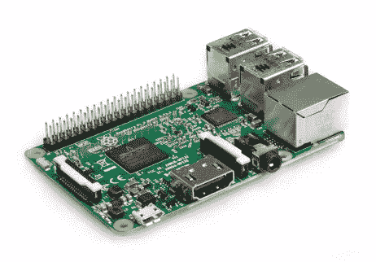

# 树莓 Pi 3 B 上的语音识别

> 原文：<https://towardsdatascience.com/speech-recognition-on-raspberry-pi-3-b-8351c418dc25?source=collection_archive---------11----------------------->



网上分享的大多数 Raspberry Pi 语音转文本示例似乎依赖于各种云解决方案(例如[谷歌云语音转文本](https://cloud.google.com/speech-to-text/))进行实际的音频处理。本文将向您展示如何在您的 Raspberry Pi 上配置一个不需要第三方云服务的“离线”语音处理解决方案。

我们将使用 [CMUSphinx](https://cmusphinx.github.io/) ，一组由[卡耐基梅隆大学](https://www.cmu.edu/)开发的连续语音、非特定人语音识别系统。

**第一步**。打开您的虚拟环境(除非您想要全局安装)。使用 *virtualenv* 的好处在我之前关于 OpenCV 的[文章](https://www.alatortsev.com/2018/04/27/installing-opencv-on-raspberry-pi-3-b/)中有解释。我的名为“cv ”,我通过发出以下命令启动它:

```
workon cv
```

我的 shell 提示符会相应地改变:


**第二步**。更新包列表并获取包的新版本(可能需要几分钟):

```
sudo apt-get update 
sudo apt-get upgrade
```

**第三步**。如果您要使用麦克风(相对于处理音频文件或从其他设备接收音频流)，请验证您的声卡配置:

```
cat /proc/asound/cards
```

我的树莓派 3B 显示如下:

```
(cv) pi@raspberrypi:~ $ cat /proc/asound/cards
 0 [ALSA ]: bcm2835_alsa - bcm2835 ALSA 
            bcm2835 ALSA 
(cv) pi@raspberrypi:~ $
```

**第四步**。安装 Bison (GNU 解析器生成器):

```
sudo apt-get install bison
```

**第五步**。安装 ALSA(高级 Linux 声音架构)库:

```
sudo apt-get install libasound2-dev
```

**第六步**。下载并解压 *sphinxbase* (最新版本为 5 个真实版本，此处显示):

```
wget [https://sourceforge.net/projects/cmusphinx/files/sphinxbase/5prealpha/sphinxbase-5prealpha.tar.gz](https://sourceforge.net/projects/cmusphinx/files/sphinxbase/5prealpha/sphinxbase-5prealpha.tar.gz)tar -xzvf sphinxbase-5prealpha.tar.gz
```

**第七步**。安装 SWIG。SWIG 是一个接口编译器，它将用 C 和 C++编写的程序与 Python 等脚本语言连接起来:

```
sudo apt-get install swig
```

**第八步**。进入刚刚提取的 sphinxbase 目录并编译 sphinx base——确保没有错误:

```
cd sphinxbase-5prealpha 
./configure --enable-fixed 
make clean all 
sudo make install
```

**第九步**。下载并解压 *pocketsphinx* (同样，最新版本是 5prealpha，此处显示为)，但首先向上一个目录:

```
cd .. wget [https://sourceforge.net/projects/cmusphinx/files/pocketsphinx/5prealpha/pocketsphinx-5prealpha.tar.gz](https://sourceforge.net/projects/cmusphinx/files/pocketsphinx/5prealpha/pocketsphinx-5prealpha.tar.gz)tar -xzvf pocketsphinx-5prealpha.tar.gz
```

**第十步**。进入刚刚提取的 pocketsphinx 目录并编译 pocket sphinx——确保没有错误:

```
cd pocketsphinx-5prealpha 
./configure 
make 
sudo make install 
export LD_LIBRARY_PATH=/usr/local/lib 
export PKG_CONFIG_PATH=/usr/local/lib/pkgconfig
```

**第十一步**。获取一些音频文件进行测试。我们将使用来自[开放语音库](http://www.voiptroubleshooter.com/open_speech/american.html)的几个美国英语样本:

```
wget [http://www.voiptroubleshooter.com/open_speech/american/OSR_us_000_0019_8k.wav](http://www.voiptroubleshooter.com/open_speech/american/OSR_us_000_0019_8k.wav) wget [http://www.voiptroubleshooter.com/open_speech/american/OSR_us_000_0030_8k.wav](http://www.voiptroubleshooter.com/open_speech/american/OSR_us_000_0030_8k.wav)
```

**第十二步**。这是我在一个样本上运行斯芬克斯。我下载的 wav 文件:

```
pocketsphinx_continuous -samprate 8000 -hmm en-us-8khz -infile OSR_us_000_0030_8k.wav
```

正如你从我下面的屏幕记录中看到的，这个过程不是很快，所以我需要优化:

[](https://asciinema.org/a/3UNRmoCxmNOj5KfkKpR810ZUB) [## 使用 Sphinx 解析一个小的。wav 文件

### 迈克尔·阿拉托尔采夫录制

asciinema.org](https://asciinema.org/a/3UNRmoCxmNOj5KfkKpR810ZUB) 

**出了问题怎么办？**
如果你第一次编译或运行 *pocketsphinxcontinuous* 时遇到错误，请在下面的评论中分享你的错误信息，我会添加一些故障排除步骤。在我的例子中，我必须帮助编译器找到一些库。我还不得不[下载](https://sourceforge.net/projects/cmusphinx/files/Acoustic%20and%20Language%20Models/US%20English/)一个 8kHz 的 Sphinx 声学模型，以便处理我的。wav 样本。

祝你好运！

*原载于 2018 年 6 月 28 日*[*www.alatortsev.com*](https://www.alatortsev.com/2018/06/28/speech-processing-on-raspberry-pi-3-b/)*。*