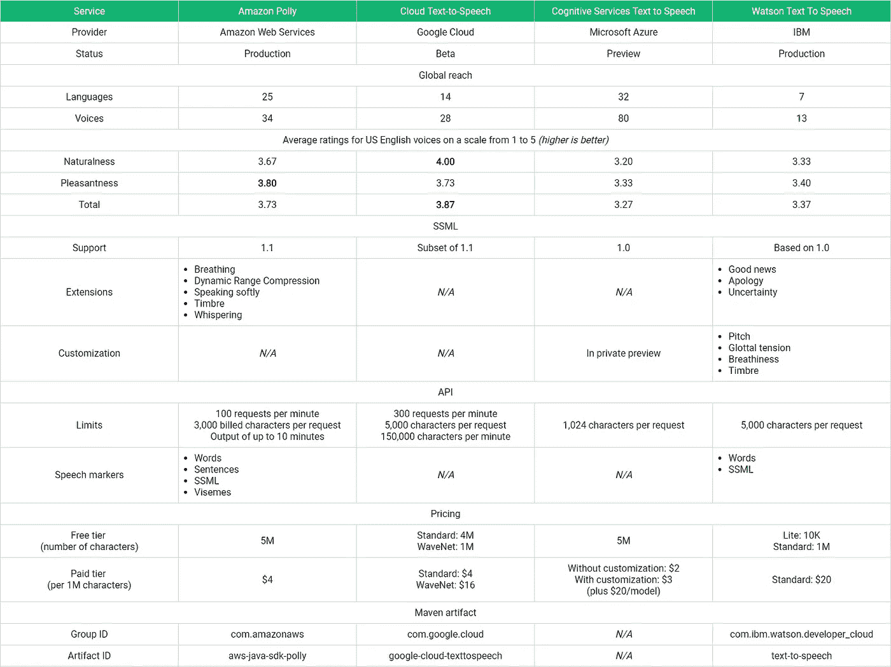

# 语音合成即服务

> 原文：<https://towardsdatascience.com/speech-synthesis-as-a-service-5c65d17e62f4?source=collection_archive---------4----------------------->

## MLaaS 第 2 部分:墙上的扬声器，谁的声音最好听？

# 目录

*   [第一部分:情感分析](/machine-learning-as-a-service-487e930265b2)
*   第二部分:语音合成

# 听起来很自然的机器人声音

随着文本到语音系统性能的不断提高，术语“机器人声音”可能很快会被重新定义。

一次一个改进，我们将会把语音合成看作是一种补充，有时是人类配音天才和播音员的竞争对手。

描述 WaveNet[1]、Tacotron[2]、DeepVoice[3]和其他系统的出版物是通过声学形式的图灵测试的重要里程碑。

然而，训练语音合成器仍然是一项耗时、耗费资源，有时甚至令人沮丧的任务。Github 知识库上发布的关于复制研究成果的问题和演示就是这一事实的证明。

相比之下，本系列涵盖的所有云计算平台——Amazon Web Services、Google Cloud、Microsoft Azure 和 IBM Watson——都可以在服务调用时实现文本到语音的转换。

这为快速开发具有越来越灵活、听起来越来越自然的语音的引人入胜的对话应用程序提供了令人兴奋的机会。

本文提供了一个用例列表、语音合成标记语言(SSML)的介绍以及四种服务的比较，包括示例输出、示例代码和一个小型研究的结果。

# 语音合成可以做什么？

如果您的目标是一次性地将一小段或中等长度的文本转换成语音，目前还没有任何技术可以与录音棚中配音人员的工作相媲美。

另一方面，如果你想反复制作大量个性化文本的录音，语音合成几乎肯定是正确的选择。

以下是文本到语音转换服务特别适合的十种应用:

*   联络中心:除非您的客户有真正独特和非常具体的查询，否则提供自动化支持可能是一个可行的选择。即时回复，加上一定程度的灵活性(从客户姓名的正确发音开始)，有助于获得和保留客户。
*   创造语言学习材料:一个以人类为母语的人并不总是能够展示正确的发音。语音合成可以与跟踪语言学习者的兴趣和他所取得的进步的方法相结合，以生成个性化的音频内容。
*   多语言内容:一些组织使用语音合成为其全球员工创建并定期更新多种语言的培训材料。
*   内容再利用:文本到语音转换扩大了内容创作者的机会范围。通过更自然的语音，文章可以到达那些喜欢在通勤上班或在健身房锻炼时听有声书和播客的人。结合视觉内容，它还可能打开更具成本效益的视频营销的大门。
*   敏捷视频(再)制作:动画内容的脚本，比如 explainer 视频，随着项目成员提出新的想法和客户要求最后的修改而不断发展。文本到语音服务可以生成始终符合最新版本脚本的语音。在项目结束时，最终的脚本可以被专业的人造录音所取代。
*   提醒:虚拟助理产品的一个受欢迎的特性是能够设置提醒。计算机生成的语音可以让你清醒，有助于习惯的形成，并保留那些有可能从最前面溜走的待办事项的记忆。这里有很大的个性化空间。你更喜欢被轻柔平静的声音叫醒吗？或者你想用一句激励人心的名言开始你的一天吗？
*   人工播音员:FM Wakayama 是一家私人资助的非营利组织，制作社区广播，它开发了一种人工播音员，用于天气预报、一般新闻和紧急信息。当 2017 年 9 月台风袭击和歌山市时，这种基于云的系统继续全天可靠且经济高效地提供灾害信息。
*   智能家居设备:无论是机器人吸尘器让你知道它卡在哪里，冰箱让你确认自动生成的购物清单，还是安全系统通知你有人入侵:语音合成让智能家居设备有了声音。
*   同步:定时信息是语音合成过程的副产品。语音标记描述了在给定的音频流中单词的发音或相关动作的开始和结束位置。在游戏中，这些信息通过使角色的面部表情与他们的讲话内容同步来帮助他们活灵活现。
*   测试:语音合成即服务为基于语音的应用领域带来了高效的分割测试。可能的实验范围远远超出了口语内容。使用 SSML，实验者可以尝试不同的声音，表情和韵律设置。

# SSML

语音合成服务的输入或者作为原始文本提供，或者以[语音合成标记语言(SSML)](https://www.w3.org/TR/speech-synthesis11/) 文档的形式提供。

SSML 文件定义了说什么和怎么说。

因为我们将要讨论的所有四个服务都使用这种标记语言，所以我认为提供一个关于大多数常用元素和属性的介绍会很有帮助。

## 根元素

SSML 文档中根元素的名称是`speak`。

一句最简单的“你好，世界！”-style 示例如下所示:

“Hello, world!” in SSML

请注意，`version`和`xml:lang`有时会被遗漏，尽管规范声明它们是必需的属性。

## 解释

`say-as`元素定义了如何解释包含的文本。支持 SSML 标准的语音合成器为此元素的`interpret-as` 属性提供了不同的设置。

例如，为了拼出原本会被当作单词来读的字符串，服务可以支持*拼出*解释。

Instructing the speech synthesizer to spell out Google’s ticker symbol

## 文本结构

可选元素`p` *、* `s`和`w`分别用于定义段落、句子和单词。

语言属性由子元素继承。例如，假设您想为说美国英语的人学习德语创建一个资源。在这种情况下， *en-US* 被应用于根元素，而 *de-DE* 被设置用于文档中的单个元素。

Text structuring and the use of multiple languages in SSML

## 破裂

有时候，沉默可能是最吸引人的内容。

在 SSML，讲话是用`break`元素停顿的。暂停的长度由`time`属性决定。

Creating a moderately dramatic pause in SSML

请注意，合成器可能会自动在句子或段落后添加停顿。

## 强调

`emphasis`实现了名字的承诺。可选的`level`属性可以设置为三个可能值之一:*减少*、*中度*或*强烈*。

Emphasizing words in SSML

## 代替

在语音输出中，`sub`元素中包含的单词被替换为不同的单词。

常见的用例包括缩写和符号。

The chemical symbol Fr is substituted with the name “Francium”.

## 韵律学

`prosody`元件控制合成语音的音高、语速和音量。

`volume`可根据预定义水平或相对于当前音量的变化进行设置:

It’s getting loud in here.

语音`rate`可以通过预定义的级别或默认速率的百分比来指定。

Setting the speech rate with pre-defined values and relative to the default rate.

类似地，`pitch`也有预设和百分比设置:

Still waiting for the neural singing feature …

## 标记

`mark`标签是一个自结束标签，需要一个`name`属性。

它的唯一目的是在 SSML 文档中放置一个标记。它不影响语音合成过程的输出。

标记可用于检索文档中特定位置的计时信息。

The self-closing mark tag does not affect the output.

# 谁的声音最好听？

在这一部分，我们来看看四种语音合成服务:亚马逊 Polly、谷歌云文本到语音、微软的认知服务文本到语音和 IBM Watson 文本到语音。

为了获得这些服务生成的语音的主观评级，进行了一项小型研究。三名参与者(两名女性，一名男性)听了转换成 MP3 文件的维基新闻文章摘录。

这五篇文章涵盖了一辆汽车撞进牙科诊所[4]，2026 年 FIFA 世界杯的比赛场地[5]，微软收购 Github 的计划[6]，韩国领导人的一次会晤[7]以及 Netta 在欧洲电视网歌曲大赛上的胜利[8]。

在不知道服务和声音名称的情况下，参与者被随机地一次呈现一个语音输出。他们被要求按照从 1(最差)到 5(最好)的等级来评价他们所听的演讲的自然程度和愉快程度。

对于四种服务中的每一种，使用一种男性和一种女性声音。这总共产生了 120 个评级(三个主题，五篇文章，四个服务，每个服务两个声音)。文本作为原始文本发送给 API，没有经过任何 SSML 优化。

研究完成后，生成的语音样本的播放列表被上传到 SoundCloud。

下表概述了调查结果:

## 亚马逊波利

亚马逊的文本到语音转换服务 [Polly](https://aws.amazon.com/polly/) 于 2016 年底宣布。

在撰写本文时，它支持 [25 种语言](https://docs.aws.amazon.com/polly/latest/dg/voicelist.html)，从丹麦语和澳大利亚英语到葡萄牙语、巴西语和土耳其语。

更多的声音有几个好处。生成的语音可以用于对话，代表不同的人物角色，实现更高程度的本地化。

波利为美国英语提供了八种不同的声音。研究中使用的声音名字分别是*乔安娜*和*马修*。

应该注意的是，亚马逊已经承诺不会取消任何通过 Polly 提供的当前或未来的声音。

在我进行的实验中，Polly 获得了第二高的综合评分。就演讲的愉快程度而言，亚马逊的服务击败了谷歌的云转文本 API。

以下是呈现给参与者的演讲输出:

Samples generated with the Amazon Polly voices Joanna and Matthew

可以为用`mark`元素指定的位置以及单词和句子的级别获得语音标记。此外，Polly 还允许您检索代表说话者说一个单词时面部和嘴部位置的[视位](https://en.wikipedia.org/wiki/Viseme)。

[控制台](https://console.aws.amazon.com/polly/home/SynthesizeSpeech)是试验 SSML 并获得可用功能集的第一印象的好方法。

每秒允许 100 个请求。输入最多可包含 3，000 个计费字符。SSML 标签不算计费字符。每个请求的输出限于 10 分钟的合成语音。

[定价](https://aws.amazon.com/polly/pricing/)模型很简单。在最初的 12 个月里，第一批 500 万个字符出现在亚马逊上。在这一层之上，请求按现收现付的方式计费，每 100 万个字符 4 美元。

Speech synthesis with Amazon Polly

Polly 支持我们提到的所有 SSML 标签以及两个扩展:*呼吸*和*声音效果*。

自闭`[amazon:breath](https://docs.aws.amazon.com/polly/latest/dg/supported-ssml.html#breath-tag)`标签指示人工扬声器进行指定*长度*和*音量*的(相当逼真的)呼吸。

声音效果包括耳语、轻声说话和改变声道长度以使扬声器听起来更大或更小。

Deep voice and heavy breathing Amazon’s SSML extensions

## 谷歌云文本到语音

谷歌 DeepMind 的研究人员发表的 WaveNet 论文[1]被引用了 250 多次，是语音合成近代史上的一个重要里程碑。

为复制 DeepMind 研究人员取得的成果而兴起的 Github 知识库已经被标上星号和分叉数千次。[9, 10, 11]

在那篇论文描述的一项研究中，受试者被要求对 WaveNet 生成的语音、实际人类语音和两个竞争模型的输出的自然度进行评级。在本文报告的研究中使用的从 1 到 5 的相同尺度上，WaveNet 样本的平均意见得分为 4.2，人类语音为 4.5，竞争模型小于 4。

去年 11 月，谷歌终于发布了期待已久的云文本到语音转换服务的 alpha 版本。在撰写本文时，该服务正处于[测试阶段](https://cloud.google.com/text-to-speech/docs/release-notes)，并且“不打算在关键应用中实时使用”。

这项服务提供基于 WaveNet 的语音合成，以及谷歌所说的标准语音(T5)和非 WaveNet 语音(T7)。

六种可用的 WaveNet 语音[是美式英语。根据](https://cloud.google.com/text-to-speech/docs/voices)[文档](https://cloud.google.com/text-to-speech/docs/wavenet)，这些声音与谷歌助手、谷歌搜索和谷歌翻译中使用的声音相同。

这 28 种标准声音涵盖了几种欧洲语言，还包括一些针对亚洲市场的女声。

与其他服务不同的是，这些声音有技术标识符，而不是容易记忆的名字。例如，我使用的两种声音分别被称为 *en-US-Wavenet-A* 和 *en-US-Wavenet-C.*

这是实验中使用的输出播放列表:

Samples generated with the Google Cloud Text-to-Speech voices *en-US-Wavenet-A* and *en-US-Wavenet-C*

我自己的结果与 WaveNet 论文中报道的结果相当。在四个竞争对手中，谷歌的服务取得了最高的自然度得分和最好的综合评分。

如果自然的声音是首要考虑，那么这很可能是你的正确选择。

然而，应该指出的是，Amazon Web Services 和 IBM Watson 都提供了更多的功能。谷歌云文本到语音既不支持定时信息，也不支持 SSML 扩展。

WaveNet 功能的[额外价格](https://cloud.google.com/text-to-speech/pricing)为超过免费层覆盖的前 100 万个字符的请求的每 100 万个字符 16 美元。

每月有 400 万个字符可以用标准语音免费合成。随后的请求会让您为每一百万个字符支付 4 美元。

除了[限制](https://cloud.google.com/text-to-speech/quotas)每分钟 300 个请求和每个请求 5000 个字符之外，还有每分钟 150000 个字符的配额。

如果你决定使用 Java SDK，确保从名称空间*com . Google . cloud . texttospeech*中的包 *v1beta1* 导入(而不是从 *v1* 包)。

Speech synthesis with Google Cloud Text to Speech

## 微软认知服务文本到语音

微软的认知服务文本到语音转换(Text To Speech)目前提供预览版。这项服务的最大优势是它提供的本地化程度。

跨越 32 种语言的 [80 种声音](https://docs.microsoft.com/en-us/azure/cognitive-services/speech-service/supported-languages#text-to-speech)覆盖了无与伦比的欧洲和亚洲地区。

然而，在这一点上，数量和质量之间存在明显的权衡。两个声音 *ZiraRUS* 和 *BenjaminRUS* 产生的输出在实验中得到最差的评分:自然度 3.2，愉悦度 3.33。

可以通过以下播放列表访问为实验生成的样本:

Samples generated with the Microsoft Cognitive Text To Speech voices ZiraRUS and BenjaminRUS

微软的[定制功能](https://docs.microsoft.com/en-us/azure/cognitive-services/speech-service/how-to-customize-voice-font)使用录音室录音和相关脚本作为训练数据，创建了一个独特的声音模型。这项功能目前在私人预览，并仅限于美国英语和中国大陆。

免费层每月覆盖五百万个字符。在 S1 层，用默认声音合成的每一百万个字符的价格是 2 美元。定制模式的语音转文本服务的价格是每 100 万个字符 3 美元，外加每个模式每月 20 美元的费用。

控制台似乎只对其前身 [Bing 文本到语音转换 API](https://azure.microsoft.com/en-us/services/cognitive-services/speech/) 可用。

该服务支持没有扩展的 1.0 版本，并限制每个请求的输入为 1024 个字符，这只是一篇新闻文章长度的一小部分。

现存的唯一一个官方 Java 库用于 Android 的开发。然而，与 REST API 的交互是一个简单的两步过程。客户端首先通过提供订阅密钥来获得令牌。这个令牌——有效期为 10 分钟——然后用于从 API 获取合成语音。注意，声音是在 SSML 文档中使用`[voice](https://docs.microsoft.com/en-us/azure/cognitive-services/speech-service/how-to-text-to-speech#specify-a-voice)`标签指定的。

Speech synthesis with Microsoft Cognitive Services Speech to Text

## 沃森文本到语音

IBM 为其[沃森文本到语音](https://text-to-speech-demo.ng.bluemix.net/)服务引入了两个有趣的 SSML 扩展:*富有表现力的 SSML* 和*语音转换 SSML。*

第一个扩展可用于美国英语语音 *Allison* 并通过 *express-as* 元素*实现。*标签有一个`type`属性，有三种可能的自描述设置:*好消息*、*道歉*和*不确定性*。

Expressive SSML in Watson Text To Speech

人们可以很容易地看到[富有表现力的 SSML](https://console.bluemix.net/docs/services/text-to-speech/SSML-expressive.html#expressive) 如何增强客户支持解决方案和其他旨在实现逼真对话的应用程序。

虽然 Watson 文本到语音仅支持 7 种语言的 13 种声音，但第二个 SSML 扩展可以创建新的声音。

除了普遍使用的各种默认声音的好处之外，独特的声音可以通过令人难忘的差异化用户体验来增强品牌推广工作。

使用`[voice transformation](https://console.bluemix.net/docs/services/text-to-speech/SSML-transformation.html#transformation)`元素，客户可以应用内置的转换或定义他们自己的变化，根据三种现有的美国英语替代方案创建新的声音。

使用类型属性的值*年轻*和*柔和*，可以使三个现有声部的声音[更加年轻和柔和](https://console.bluemix.net/docs/services/text-to-speech/SSML-transformation.html#transformation)。

要应用自定义转换，必须将`type`属性设置为*自定义*。这通过可选属性提供了对语音不同方面的细粒度控制。可调节的声音特征包括音调、速率、音色、呼吸和声门张力。

在我进行的实验中，Watson 文本到语音的表现略好于微软的服务，但没有达到亚马逊和谷歌提供的自然和愉悦的水平。

实验中用过的声音的名字是*艾利森*和*迈克尔*。参与者评定的生成样本可通过以下播放列表获得:

Samples with the IBM Watson voices Allison and Michael

除了`w`标签，我们提到的所有 SSML 元素都被支持。然而，对于美国英语以外的语言，`[say-as](https://console.bluemix.net/docs/services/text-to-speech/SSML-elements.html#say-as_element)`指令仅限于两种解释:*数字*和*字母*。

[可以获得单词和标记的定时信息](https://console.bluemix.net/docs/services/text-to-speech/word-timing.html#timing)。

[精简版计划](https://www.ibm.com/cloud/watson-text-to-speech/pricing)限制在 10，000 个字符以内。在标准层下，前一百万个字符的合成对消费者是免费的。随后的请求按每 1000 个字符 0.02 美元的费率收费，这使得沃森文本到语音转换成为四种服务中最贵的。

一个网络演示展示了基本功能和 SSML 扩展。

虽然单个请求的正文最多可以有 [5，000 个字符](https://www.ibm.com/watson/developercloud/text-to-speech/api/v1/curl.html?curl#websocket_methods)，但是每分钟发送的请求数量没有限制。

Java SDK 无缝且直观地工作:

Speech synthesis with IBM Watson

# 结论

*   一系列论文描述了新的机器学习方法，这些方法大大缩小了机器生成的语音和人类语音之间的差距。
*   语音合成服务利用了这些方法，并为训练定制模型的资源密集型过程提供了替代方案。
*   语音合成即服务加快了灵活的基于语音的应用程序的开发，并使多语言内容的创建、测试和重新利用变得更加简单和经济高效。
*   语音合成服务的输入作为原始文本或以语音合成标记语言(SSML)格式提供。SSML 文件定义了说什么和怎么说。
*   谷歌云文本到语音转换功能有限，但获得了最高的自然度评级和最佳的总体主观评级。
*   亚马逊 Polly 在演讲的愉悦性方面胜过了竞争对手，获得了第二好的总体评分。
*   Watson 文本到语音和 Amazon Polly 提供了丰富的功能集，包括有用的 SSML 扩展和定时信息。
*   微软认知服务“文本到语音”提供了最广泛的声音，但是得到了最差的主观评价。

# 感谢您的阅读！如果你喜欢这篇文章，请点击“鼓掌”按钮，跟随我了解更多关于云中机器学习服务的信息。

# 此外，让我知道如果你有一个项目在这个空间，你想讨论。

# 参考

[1]范·登·奥尔德，a .，迪耶曼，s .，曾，h .，西蒙扬，k .，维尼亚尔斯，o .，格雷夫斯，a .，卡尔奇布伦纳，n .，老 a .，卡武克库奥卢，k .，2016。Wavenet:原始音频的生成模型。 *arXiv 预印本 arXiv:1609.03499* 。

[2]王，y .，斯凯里-瑞安，R.J .，斯坦顿，d .，吴，y .，韦斯，R.J .，贾伊特利，n .，杨，z .，肖，y .，陈，z .，本吉奥，s .和勒，q .，2017 年。Tacotron:走向端到端语音合成。 *arXiv 预印本 arXiv:1703.10135* 。

[3]平，w .，彭，k .，吉比安斯基，a .，阿里克，s .，坎南，a .，纳朗，s .，赖曼，j .和米勒，j .，2018。深度语音 3:使用卷积序列学习缩放文本到语音。在*徐健。第六届国际学习代表会议*。

[4]维基新闻撰稿人。一辆空中轿车冲进加州圣安娜的牙科诊所。在 *Wikinews，你可以写的免费新闻来源。*

[5]维基新闻撰稿人。足球:加拿大、墨西哥和美国联合申办 2026 年世界杯。在 *Wikinews，你可以写的免费新闻来源。*

[6]维基新闻撰稿人。微软宣布计划以 75 亿美元收购 GitHub。在 *Wikinews，你可以写的免费新闻来源。*

[7]维基新闻撰稿人。韩美峰会取消几天后，韩国领导人文在寅和金正日会晤。在 *Wikinews，你可以写的免费新闻来源。*

[8]维基新闻撰稿人。Netta 为以色列赢得欧洲歌唱大赛。在 *Wikinews，你可以写的免费新闻来源。*

[9][https://github.com/ibab/tensorflow-wavenet](https://github.com/ibab/tensorflow-wavenet)

[https://github.com/tomlepaine/fast-wavenet](https://github.com/tomlepaine/fast-wavenet)

[https://github.com/basveeling/wavenet](https://github.com/basveeling/wavenet)