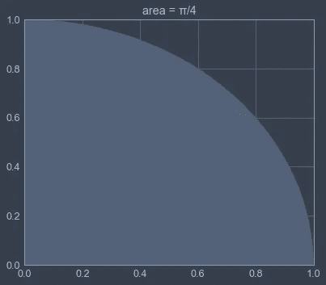
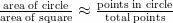
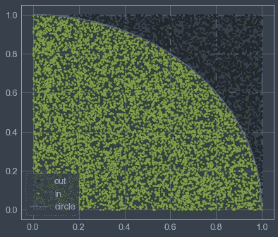
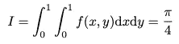
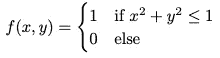
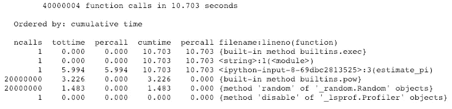
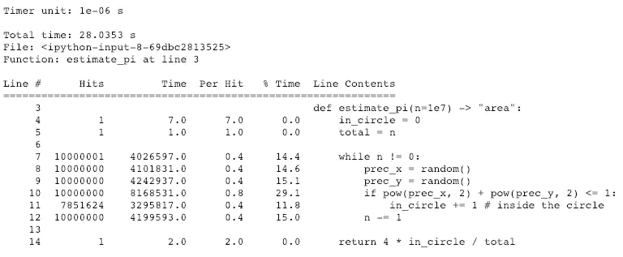
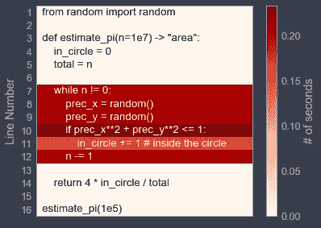
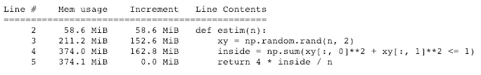
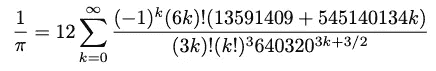

# 在科学环境中剖析和优化 Python 算法。

> 原文：<https://towardsdatascience.com/speed-up-jupyter-notebooks-20716cbe2025?source=collection_archive---------3----------------------->

## 根据我在过去一年中获得的一些技巧，找到瓶颈并大幅提高运行时性能。


虽然我们都知道过早的微优化是万恶之源，主要是因为 Donald Knuth 的论文“*使用 Go To 语句的结构化编程*”[1]，但最终在数据探索过程中的某个时刻，您掌握的不仅仅是当前的“工作”解决方案。

我们通常遵循的启发式方法考虑:

1.  让它工作。
2.  使**正确**。
3.  使它**快速**。

在直接跳到第三点并开始重构我们的代码之前，重要的是确定性能瓶颈在哪里，以便对我们想要遵循的操作过程做出明智的决定。

如果我们需要用最少的工作获得最大的收益，这是一个基本的步骤。说实话，在这种情况下，最大的错误之一是做出无知的猜测，并微调我们认为是这个问题的主要驱动因素。通过剖析我们的代码，我们消除了这个漏洞，因为我们将准确地知道问题在哪里。

既然我们在这里使用 Jupyter 笔记本，我们也可以利用它带来的便利，比如魔法命令。**魔法命令**毫无疑问是扩展笔记本电脑功能的绝佳增强功能之一。详细来说，我们将看看:

*   `%time`和`%timeit`
*   `%prun`和`%lprun`
*   `%mprun`和`%memit`
*   `%%heat`
*   用`snakeviz`可视化分析会话的输出

并研究以下内容:

*   pythonic 式编码方法
*   使用**矢量化**的循环优化方法
*   不同算法的优化

我们的第一个目标是找出让我们头疼的原因。一般来说，性能分析包括测量您想要优化的资源，无论是内存使用还是 CPU 时间。

在接下来的例子中，我们将考虑如果我们的任务是**“CPU 受限”**(因此花费在 CPU 上的时间)，如何努力优化，以及与之相反，如何以及为什么要特别关注**内存密集型**任务。

> **注意**:在本文中，我不是**投入并行或高性能计算来解决性能瓶颈问题。这超出了这篇文章的范围，可能是一个在将来写的想法。**

# 用蒙特卡罗积分逼近π

蒙特卡罗模拟是一种通过随机生成样本来估计问题答案的方法。它们主要适用于计算对可能是高维的系统的解的“强力”近似，例如使用了[蒙特卡罗树搜索](https://deepmind.com/research/publications/learning-search-mctsnets/)的 [DeepMind 的 AlphaGo Zero](https://deepmind.com/blog/alphago-zero-learning-scratch/) 。

我们将定义一个使用随机生成的数据点评估 pi 的慢速方法，然后寻找优化的方法。请记住，半径为 1 的圆所覆盖的面积正好等于圆周率的四分之一。

我们通过取圆的**面积与正方形**的**面积之比得到圆周率的值，**



unit quarter-circle

我们用生成的随机点来近似这个区域。



π ≈ 3.1417

考虑下面的代码，其中我们近似积分:

在 while 循环中，我们生成一个随机点，并检查它是否落在圆内。如果是的话，我们将`in_circle`加 1。我们这样做`n`次，并返回**比率**乘以 4，以便估计 pi(第 19 行)。

或者用更数学的术语来说:



在哪里



> **注意**:更糟糕的是，迭代代码可以用递归解决方案来实现。递归版本可以在这里找到[。](https://gist.github.com/Murgio/ce972c49688041ca840015ea86eef67e)

在开始犹豫不决的优化迭代之前，在没有任何分析器开销的情况下，测量我们想要优化的函数的总执行时间并将其保存在某个地方供以后参考是很重要的。

神奇的命令`%time`可以为比较不同函数的运行时间提供一个有用的工具(即**基准测试**)。

在[1]中:`**%time** estimate_pi()`

```
CPU times: user 6.2 s, sys: 11.8 ms, total: 6.21 s
Wall time: 6.25 s
```

如果我们对标准化`%time`感兴趣，使用:

在[2]中:`**%timeit** -r 2 -n 5 estimate_pi()`

其中`-r`表示运行次数，而`-n` 表示循环次数。我们得到的是:

```
6.29 s ± 73.7 ms per loop (mean ± std. dev. of 2 runs, 5 loops each)
```

我们的第一种方法用了 **6.29 秒**来估算圆周率，我们会记住它，稍后再来讨论。

## cProfile

为了真正了解什么占用了大部分执行时间，python 附带了一个很棒的分析器，它可以逐个函数地分解执行功能。它通过给出性能的高级视图，使我们的注意力缩小到关键功能。

在[3]中:`**%prun** estimate_pi()`


> **注意**:您应该记住，剖析通常会增加代码的开销。

对于每个功能，报告显示:

*   呼叫次数
*   花费在其上的总时间(总时间),不包括调用子功能的时间
*   每个呼叫花费的时间(按百分比计算，不包括和包括)
*   包括所有子功能调用的总时间(累计时间)

输出将被写入标准输出。如果我们希望保存输出供以后检查，例如用 [**pstats**](https://docs.python.org/2/library/profile.html#the-stats-class) ，使用 **-D** 选项保存到磁盘上。

在[4]中:`**%prun** -D pi.prof estimate_pi()`

```
*** Profile stats marshalled to file 'pi.prof'.
```

另一个有用的选项是 **-s** ，它支持对特定列进行排序。例如，按降序对累积时间进行排序:

[5]: `**%prun** -s cumulative estimate_pi()`



有趣的似乎是调用内置函数`pow()`和`random()`的次数。在我们处理如此大量的调用之前，让我们先来看看一个更方便的库，它可以提供更具体的报告。

## 线条轮廓仪

`%lprun`命令产生每行代码花费的时间，给我们一个逐行报告。因为默认情况下没有提供，所以用 pip 安装库

`!pip install line_profiler`

并在笔记本中手动加载扩展。

`%load_ext line_profiler`

使用与`%prun`相似的语法，可以像 pi(e)一样容易地定位代码中的热点，唯一的区别是需要显式定义函数。

在[6]中:`**%lprun** -f estimate_pi estimate_pi()`



注意第 10 行的 *if* 语句花费了大量时间(29.1%)。请记住，我们甚至可以将上面的报告着色，给我们一个更直观的方式来查看热点。



我们所要做的就是在单元的顶部插入`%%heat`命令(使用`!pip install py-heat-magic`安装后加载扩展`%load_ext heat`，它允许我们看到完全红色的*，而*循环倾斜高成本的 CPU 时间，清楚地显示优化的空间。

我只想简单地提一下，有一个很好的库叫做`snakeviz`，它将概要文件显示为旭日，其中函数表示为弧线。


更多信息可在[这里](https://jiffyclub.github.io/snakeviz/)找到。

## 使最优化

在深入研究涉及外部库依赖的方法之前，让我们提出一个想法，让事情变得更加 pythonic 化！

> *Python 意味着代码不仅要有正确的语法，还要遵循 Python 社区的惯例，并按照预期的方式使用语言。*

请记住，对函数的每个调用都与开销时间相关，因此循环中的绝大多数调用都会让我们陷入困境。如果满足某个条件， *while* 循环只是将计数器加 1。为了简化代码，我们引入了`**sum()**` **方法，一个生成器表达式**和 pow()的移除。

通过做这三个改变，我们已经将函数调用减少了 30.37% ，速度提高了 41.5 %。

在[7]中:`**%prun** estimate_pi()`


在[8]中:`%timeit -r 2 -n 5 estimate_pi()`

```
3.68 s ± 2.39 ms per loop (mean ± std. dev. of 2 runs, 5 loops each)
```

## 通过矢量化进行优化

假设我们事先确切地知道应该生成多少个随机数，我们可以简单地尝试将所有的**放在循环的前面或外面。**

还记得第 10 行的 *if* 语句吗，它占用了将近 30%的计算时间。这个 *if* 语句需要的唯一信息是两个坐标，因此也可以放在循环之外。

如果选项可用，我们应该避免循环代码。特别是在数据科学中，我们熟悉 NumPy 和 pandas，它们是针对数值计算的高度优化的库。NumPy 的一大优势是内部基于 C 数组的数组，这些数组存储在一个连续的内存块中**(基于数据缓冲区的数组)**。

在这里，我们将所有随机点创建为一个形状为`(n, 2)`的数组(第 9 行)，并计算该点落入圆中的次数(第 10 行)。

如果我们现在测试 numpy 版本，

在[9]: `**%timeit** estimate_pi()`

```
388 ms ± 9.24 ms per loop (mean ± std. dev. of 7 runs, 1 loop each)
```

结果为 388 毫秒，因此**比 *while* 循环快 16 倍。Numpy 的语法类似于标准的 python 方法，我们写的是`np.sum()`而不是`sum()`，本质上我们不再遍历列表，而是使用 numpy 的矢量化例程。**

## 内存分析

处理大型数据集需要清楚地了解后台的内存消耗和分配过程。如前所述，有一些工具可以监控笔记本电脑的内存使用情况。

以熟悉的方式使用`%memit`到`%timeit`

【10】中:`**%memit** estimate_pi()`

```
peak memory: 623.36 MiB, increment: 152.59 MiB
```

我们看到该函数为 1e7 模拟使用了大约 600 兆字节。我的假设是分配大数组贡献了大部分。用`%mprun`来证明这个假设，它检查每一行的内存使用情况。

在[11]中:`**%mprun** -f estimate_pi estimate_pi()`



非常有趣的似乎是**行 4** ，其中增量是 162.8 MiB，然而在下一行，整体内存使用只增加了 0.1。这里发生的是，我们在赋值的右边分配，然后再次丢弃内存，因为`inside`不再是一个 numpy 数组。

下面是一个和上面一样的 liner，除了不是分配一个 shape `(n, 2)`的大数组，而是按需分配 x 和 y 点。尽管我们牺牲了可读性，重写表达式减少了赋值操作的数量，从而产生了更快的解决方案，280 ms(快 22 倍)。

在[9]中:`**%timeit** estimate_pi()`

```
280 ms ± 3.06 ms per loop (mean ± std. dev. of 7 runs, 1 loop each)
```

# 被遗忘

创建阵列会对可用的系统内存产生限制。分配过程与输入参数`n`成线性比例。例如，如果我们试图将模拟的数量设置为`1e10`，我们的内核将在创建数组时崩溃。幸运的是，这种方法不需要一个大的阵列，相反，我们将它分成更小的块，这使我们能够独立于系统内存扩展模拟的数量。

这里我们预定义了数组的大小(第 9 行),等于 80 MB。我们将模拟的数量拆分为处理 80 MB numpy 数组，每次增加`inside`。

如果我们预先模拟将`n`设置为`1e10`，我们将尝试分配一个 80 GB 的数组(！)的尺寸，在标准机器上根本不可行。使用更新的方法，计算时间与`n`的计算时间相等。

# 用不同的算法优化

如果我们测试后一种 numpy 解决方案，我们估计 pi 为 3.1426944，相对**误差为 0.035%**280 毫秒。蒙特卡洛方法是一个很好的概念，可以得出一个答案，这个答案并不立即具有通过随机程序可以推导出来的所有特征。

可能会有不同的计算方法，以更有效的方式解决这个问题。对任何编程执行来说，最大的提升就是改变解决问题的一般方式。不出所料，这是最难实现的改变，因为需要对编码进行升级和改造。

## Chudnovsky 算法

虽然有许多方法可以计算具有高位数精度的圆周率[3]，但一种非常快速的方法是 Chudnovsky 算法，该算法由 Chudnovsky 兄弟于 1989 年发表，其形式如下:



尼克·克雷格·伍德的网站上有一篇很棒的文章。该算法的实现是一项重要的任务，留给读者作为练习。

剖析这种方法导致，

在【12】:`%timeit -r 1 -n 1000 pi_chudnovsky(10**100)`

```
13.6 µs ± 72 ns per loop (mean ± std. dev. of 7 runs, 10 loops each)
```

13.6 微秒，这不仅比我们的 numpy 蒙特卡罗版本快了 20，000 倍，而且它还成功地计算了圆周率的前 100 位。

# 结论

在进行优化之前，我们应该对可能的瓶颈进行剖析并避免不成熟的假设(而剖析器从不说谎)。为了监控 CPU 时间消耗和内存占用，Jupyter 提供了方便的魔术命令，可直接在笔记本电脑上执行。优化的基本方法包括在显式循环中使用生成器表达式和列表理解。纯粹的 python 编码在极少数情况下是一个有指导意义的建议，因此应该被科学库中的优化的 equal 方法所取代，从而带来巨大的速度提升。

> **注意:**考虑对 Jupyter Notebook 中的优化持保留态度，因为它有一些方面，如执行单元时的非线性工作流，乍一看似乎很方便，但由于它上面还有另一个抽象层，我们无法控制如何读取状态并将其保存在内存中。抽象发生得越多，就越难揭示潜在的问题。(如果我说错了，请指正。)

第二部分计划探索 Cython 和 python 中并行计算的可能性。

我欢迎反馈和建设性的批评。

干杯！🙇

# 参考

[1]唐纳德·e·克努特，*结构化程序设计与 Go To 语句，1974 年，*https://pic.plover.com/knuth-GOTO.pdf

[2] Eric C. Anderson，*蒙特卡罗方法与重要性抽样，1999，*[http://IB . Berkeley . edu/labs/slat kin/eriq/classes/guest _ lect/MC _ lech _ notes . pdf](http://ib.berkeley.edu/labs/slatkin/eriq/classes/guest_lect/mc_lecture_notes.pdf)

[3]沃尔夫拉姆研究，[http://functions.wolfram.com/PDF/Pi.pdf](http://functions.wolfram.com/PDF/Pi.pdf)

杰克·范德普拉斯。(2016)， *Python 数据科学手册*

西里尔·罗森。(2014 年)， *IPython 交互式计算和可视化食谱*

加布里埃尔·拉纳罗。(2013)， *Python 高性能编程*