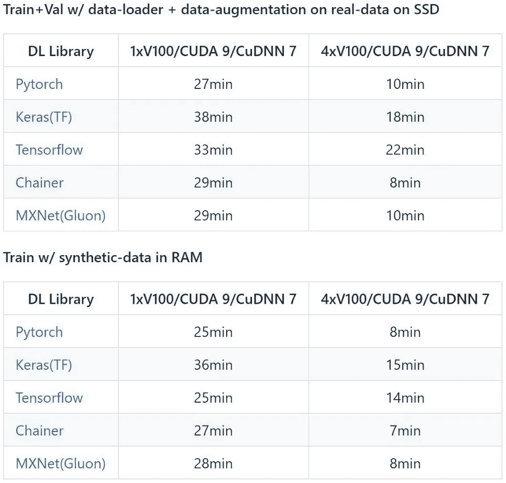

# 加速您的算法第 1 部分— PyTorch

> 原文：<https://towardsdatascience.com/speed-up-your-algorithms-part-1-pytorch-56d8a4ae7051?source=collection_archive---------1----------------------->


“low angle photography of yellow hot air balloon” by [sutirta budiman](https://unsplash.com/@sutirtab?utm_source=medium&utm_medium=referral) on [Unsplash](https://unsplash.com?utm_source=medium&utm_medium=referral)

## 加速你的 PyTorch 模型

这是我写的系列文章中的第一篇。所有帖子都在这里:

1.  [加速您的算法第 1 部分— PyTorch](/speed-up-your-algorithms-part-1-pytorch-56d8a4ae7051)
2.  [加速您的算法第 2 部分— Numba](/speed-up-your-algorithms-part-2-numba-293e554c5cc1)
3.  [加速您的算法第 3 部分—并行化](/speed-up-your-algorithms-part-3-parallelization-4d95c0888748)
4.  [加速您的算法第 4 部分— Dask](/speeding-up-your-algorithms-part-4-dask-7c6ed79994ef)

这些与 ***Jupyter 笔记本*** 搭配在这里可以得到:

[[Github-speedupyourlightms](https://github.com/PuneetGrov3r/MediumPosts/tree/master/SpeedUpYourAlgorithms)和**[**[**ka ggle**](https://www.kaggle.com/puneetgrover/kernels)**]**

**(编辑-28/11/18)** —增加了 torch.multiprocessing 部分。

# 索引:

1.  介绍
2.  如何检查 cuda 的可用性？
3.  如何获得更多关于 cuda 设备的信息？
4.  如何在 GPU 上存储张量和运行模型？
5.  如果您有多个 GPU，如何选择和使用它们？
6.  数据并行性
7.  数据并行性的比较
8.  torch .多重处理
9.  参考

```
***NOTE:*** This post goes with ***Jupyter Notebook*** available in my Repo on Github:[[SpeedUpYourAlgorithms-Pytorch](https://nbviewer.jupyter.org/github/PuneetGrov3r/MediumPosts/blob/master/SpeedUpYourAlgorithms/1%29%20PyTorch.ipynb)]
```

# 1.简介:

在这篇文章中，我将展示如何使用`torch`和`pycuda`来检查和初始化 GPU 设备，以及如何让你的算法更快。

**PyTorch** 是建立在 [torch](https://en.wikipedia.org/wiki/Torch_(machine_learning)) 之上的机器学习库。它得到了脸书人工智能研究小组的支持。经过最近的发展，它已经获得了很大的普及，因为它的简单性，动态图形，因为它是本质上的 pythonic。它在速度上仍然不落后，在很多情况下甚至可以超越。

pycuda 让你从 python 访问 Nvidia 的 cuda 并行计算 API。

# 2.如何检查 cuda 的可用性？


“brown dried leaves on sand” by [sydney Rae](https://unsplash.com/@srz?utm_source=medium&utm_medium=referral) on [Unsplash](https://unsplash.com?utm_source=medium&utm_medium=referral)

要使用`Torch`检查您是否有可用的`cuda`设备，您只需运行:

```
import torchtorch.cuda.is_available()
# True
```

# 3.如何获得更多关于 cuda 设备的信息？


“black smartphone” by [rawpixel](https://unsplash.com/@rawpixel?utm_source=medium&utm_medium=referral) on [Unsplash](https://unsplash.com?utm_source=medium&utm_medium=referral)

要获取设备的基本信息，您可以使用`torch.cuda`。但是要在你的设备上获得更多信息，你可以使用`pycuda`，一个围绕`CUDA`库的 python 包装器。您可以使用类似以下的内容:

```
import torch
import pycuda.driver as cuda
cuda.init()## Get Id of default device
torch.cuda.current_device()
# 0cuda.Device(0).name() # '0' is the id of your GPU
# Tesla K80
```

或者，

```
torch.cuda.get_device_name(0) # Get name device with ID '0'
# 'Tesla K80'
```

我编写了一个简单的类来获取关于兼容 GPU 的信息:

要获取当前的内存使用情况，您可以使用`pyTorch`的功能，例如:

```
import torch# Returns the current GPU memory usage by 
# tensors in bytes for a given device
torch.cuda.memory_allocated()# Returns the current GPU memory managed by the
# caching allocator in bytes for a given device
torch.cuda.memory_cached()
```

运行应用程序后，您可以使用一个简单的命令来清除缓存:

```
# Releases all unoccupied cached memory currently held by
# the caching allocator so that those can be used in other
# GPU application and visible in nvidia-smi
torch.cuda.empty_cache()
```

但是，使用该命令不会释放张量所占用的 GPU 内存，因此它不能增加 PyTorch 可用的 GPU 内存量。

这些内存方法只适用于 GPU。这才是真正需要它们的地方。

# 4.如何在 GPU 上存储张量和运行模型？

> `.cuda`魔法。


“five pigeons perching on railing and one pigeon in flight” by [Nathan Dumlao](https://unsplash.com/@nate_dumlao?utm_source=medium&utm_medium=referral) on [Unsplash](https://unsplash.com?utm_source=medium&utm_medium=referral)

如果你想在 cpu 上存储一些东西，你可以简单地写:

```
a = torch.DoubleTensor([1., 2.])
```

这个向量存储在 cpu 上，你对它的任何操作都将在 cpu 上完成。要将其传输到 gpu，您只需做`.cuda`:

```
a = torch.FloatTensor([1., 2.]).cuda()
```

或者，

```
a = torch.cuda.FloatTensor([1., 2.])
```

这将为它选择默认设备，可以通过以下命令看到:

```
torch.cuda.current_device()
# 0
```

或者，你也可以这样做:

```
a.get_device()
# 0
```

你也可以发送一个模型到 GPU 设备。例如，考虑一个由`nn.Sequential`制成的简单模块:

```
sq = nn.Sequential(
         nn.Linear(20, 20),
         nn.ReLU(),
         nn.Linear(20, 4),
         nn.Softmax()
)
```

要将此发送到 GPU 设备，只需:

```
model = sq.cuda()
```

你可以检查它是否在 GPU 设备上，因为你必须检查它的参数是否在 GPU 上，比如:

```
# From the discussions here: [discuss.pytorch.org/t/how-to-check-if-model-is-on-cuda](https://discuss.pytorch.org/t/how-to-check-if-model-is-on-cuda/180)next(model.parameters()).is_cuda
# True
```

# 5.如果您有多个 GPU，如何选择和使用它们？


“selective focus photography of mechanics tool lot” by [NeONBRAND](https://unsplash.com/@neonbrand?utm_source=medium&utm_medium=referral) on [Unsplash](https://unsplash.com?utm_source=medium&utm_medium=referral)

您可以为当前应用程序/存储选择一个 GPU，该 GPU 可以不同于您为上一个应用程序/存储选择的 GPU。

正如在第(2)部分已经看到的，我们可以使用`pycuda`来获得所有的`cuda`兼容设备和它们的`Id`,我们在这里不讨论。

考虑到您有 3 个`cuda`兼容设备，您可以像这样初始化并分配`tensors`给一个特定的设备:

```
cuda0 = torch.device('cuda:0')
cuda1 = torch.device('cuda:1')
cuda2 = torch.device('cuda:2')
# If you use 'cuda' only, Tensors/models will be sent to 
# the default(current) device. (default= 0)x = torch.Tensor([1., 2.], device=cuda1)
# Or
x = torch.Tensor([1., 2.]).to(cuda1)
# Or
x = torch.Tensor([1., 2.]).cuda(cuda1)**# NOTE:**
**#** If you want to change the default device, use:
torch.cuda.set_device(2) # where '2' is Id of device**#** And if you want to use only 2 of the 3 GPU's, you
**#** will have to set the environment variable 
**#** *CUDA_VISIBLE_DEVICES* equal to say, "0,2" if you 
**#** only want to use first and third GPUs. Now if you 
**#** check how many GPUs you have, it will show two*(0, 1)*.
import os
os.environ["CUDA_VISIBLE_DEVICES"] = "0,2"
```

当您在这些`Tensor`上进行任何操作时，您可以不考虑所选的设备，结果将保存在与`Tensor`相同的设备上。

```
x = torch.Tensor([1., 2.]).to(cuda2)
y = torch.Tensor([3., 4.]).to(cuda2)# This Tensor will be saved on 'cuda2' only
z = x + y
```

如果你有多个 GPU，你可以在它们之间分配应用程序的工作，但是这会带来它们之间的通信开销。但是如果你不需要太多的信息，你可以试一试。

实际上还有一个问题。在`PyTorch`中，默认情况下所有的 GPU 操作都是异步的。虽然它在 CPU 和 GPU 之间或两个 GPU 之间复制数据时进行必要的同步，但如果你在命令`torch.cuda.Stream()`的帮助下创建自己的流，那么你将不得不自己负责指令的同步。

从`PyTorch`的文档中举一个例子，这是**不正确的:**

```
cuda = torch.device('cuda')
s = torch.cuda.Stream()  ***#*** *Create a new stream.*
A = torch.empty((100, 100), device=cuda).normal_(0.0, 1.0)
with torch.cuda.stream(s):
    ***#*** *because sum() may start execution before normal_() finishes!*
    B = torch.sum(A)
```

如果您想要充分发挥多个 GPU 的潜力，您可以:

1.  将所有 GPU 用于不同的任务/应用，
2.  将每个 GPU 用于集合或堆栈中的一个模型，每个 GPU 具有数据的副本(如果可能)，因为大多数处理是在拟合模型期间完成的，
3.  在每个 GPU 中使用带有切片输入和模型副本的每个 GPU。每个 GPU 将分别计算结果，并将它们结果发送到目标 GPU，在那里将进行进一步的计算，等等。

# 6.数据并行？


“photography of tree in forest” by [Abigail Keenan](https://unsplash.com/@akeenster?utm_source=medium&utm_medium=referral) on [Unsplash](https://unsplash.com?utm_source=medium&utm_medium=referral)

在数据并行中，我们将从数据生成器获得的一批数据分割成更小的小批，然后发送到多个 GPU 进行并行计算。

在`PyTorch`中，使用`torch.nn.DataParallel`实现数据并行。

但是我们将看到一个简单的例子，看看到底发生了什么。为此我们将不得不使用`nn.parallel`的一些功能，即:

1.  复制:在多个设备上复制`Module`。
2.  分散:将第一维度的`input`分布在这些设备中。
3.  收集:从这些设备中收集并连接第一维度的`input`。
4.  parallel_apply:将我们从 Scatter 获得的一组分布式的`input`应用到我们从 Replicate 获得的相应的一组分布式的`Module`。

```
# Replicate module to devices in device_ids
replicas **=** nn**.**parallel**.**replicate(module, device_ids)# Distribute input to devices in device_ids
inputs **=** nn**.**parallel**.**scatter(input, device_ids)# Apply the models to corresponding inputs
outputs **=** nn**.**parallel**.**parallel_apply(replicas, inputs)# Gather result from all devices to output_device
result = nn**.**parallel**.**gather(outputs, output_device)
```

或者，简单地说:

```
model = nn.DataParallel(model, device_ids=device_ids)
result = model(input)
```

# 7.数据并行比较


“silver bell alarm clock” by [Icons8 team](https://unsplash.com/@icons8?utm_source=medium&utm_medium=referral) on [Unsplash](https://unsplash.com?utm_source=medium&utm_medium=referral)

我没有多个 GPU，但我能够找到一个由 [Ilia Karmanov](https://medium.com/u/7dd01b9c5ed1?source=post_page-----56d8a4ae7051--------------------------------) [在这里](https://medium.com/@iliakarmanov/multi-gpu-rosetta-stone-d4fa96162986)和他的 github repo 比较大多数使用多个 GPU 的框架[在这里](https://github.com/ilkarman/DeepLearningFrameworks)的伟大帖子。

他的结果是:



> 【最后更新:(2018 年 6 月 19 日)】即他的 github 回购。PyTorch 1.0、Tensorflow 2.0 以及新 GPU 的推出可能会改变这一点…

因此，如您所见，即使必须在开始和结束时与主设备通信，并行处理也绝对有帮助。而且`PyTorch`给出结果的速度比所有的都快，仅在多 GPU 的情况下比`Chainer`快。`Pytorch`也很简单，只需调用一次`DataParallel`。

# 8.torch .多重处理


Photo by [Matthew Hicks](https://unsplash.com/@mjhphotography?utm_source=medium&utm_medium=referral) on [Unsplash](https://unsplash.com?utm_source=medium&utm_medium=referral)

`torch.multiprocessing`是 Python `multiprocessing`模块的包装器，其 API 与原始模块 100%兼容。所以可以用`Queue`的、`Pipe`的、`Array`的等等。这些都在 Python 的多重处理模块中。除此之外，为了使它更快，他们增加了一个方法`share_memory_()`，它允许数据进入任何进程都可以直接使用它的状态，因此将该数据作为参数传递给不同的进程不会复制该数据。

你可以分享`Tensors`，model 的`parameters`，你可以随心所欲的在 CPU 或者 GPU 上分享。

```
**Warning from Pytorch: (Regarding sharing on GPU)
**  CUDA API requires that the allocation exported to other processes remains valid as long as it’s used by them. You should be careful and ensure that CUDA tensors you shared don’t go out of scope as long as it’s necessary. This shouldn’t be a problem for sharing model parameters, but passing other kinds of data should be done with care. Note that this restriction doesn’t apply to shared CPU memory.
```

你可以在这里的“池和进程”部分使用上面的方法，为了获得更快的速度，你可以使用`share_memory_()`方法在所有进程之间共享一个`Tensor`(比方说)而不被复制。

```
**# Training a model using multiple processes:**import torch.multiprocessing as mp
def train(model):
    for data, labels in data_loader:
        optimizer.zero_grad()
        loss_fn(model(data), labels).backward()
        optimizer.step()  ***#*** *This will update the shared parameters*model = nn.Sequential(nn.Linear(n_in, n_h1),
                      nn.ReLU(),
                      nn.Linear(n_h1, n_out))model.share_memory() **#** Required for 'fork' method to workprocesses = []
for i in range(4): # No. of processes
    p = mp.Process(target=train, args=(model,))
    p.start()
    processes.append(p)for p in processes: p.join()
```

您也可以使用一组机器。更多信息请参见[此处](https://pytorch.org/docs/stable/distributed.html)。

# 9.参考资料:

1.  [https://documen.tician.de/pycuda/](https://documen.tician.de/pycuda/)
2.  [https://pytorch.org/docs/stable/notes/cuda.html](https://pytorch.org/docs/stable/notes/cuda.html)
3.  [https://discuse . py torch . org/t/how-to-check-if-model-is-on-cuda](https://discuss.pytorch.org/t/how-to-check-if-model-is-on-cuda)
4.  [https://py torch . org/tutorials/初学者/blitz/data _ parallel _ tutorial . html](https://pytorch.org/tutorials/beginner/blitz/data_parallel_tutorial.html#sphx-glr-beginner-blitz-data-parallel-tutorial-py)
5.  [https://medium . com/@ iliakarmanov/multi-GPU-Rosetta-stone-d4fa 96162986](https://medium.com/@iliakarmanov/multi-gpu-rosetta-stone-d4fa96162986)

```
Suggestions and reviews are welcome.
Thank you for reading!
```

签名:

