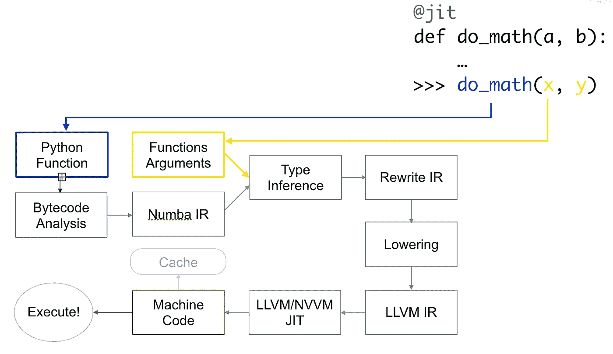
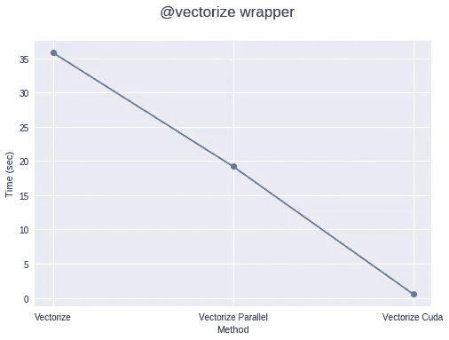

# 加速您的算法第 2 部分— Numba

> 原文：<https://towardsdatascience.com/speed-up-your-algorithms-part-2-numba-293e554c5cc1?source=collection_archive---------4----------------------->

## 使用 Numba 获得 C++/Fortran 般的速度


“brown snake” by [Duncan Sanchez](https://unsplash.com/@joseph3088?utm_source=medium&utm_medium=referral) on [Unsplash](https://unsplash.com?utm_source=medium&utm_medium=referral)

这是我写的系列文章中的第三篇。所有帖子都在这里:

1.  [加速您的算法第 1 部分— PyTorch](/speed-up-your-algorithms-part-1-pytorch-56d8a4ae7051)
2.  [加速你的算法第二部分——Numba](/speed-up-your-algorithms-part-2-numba-293e554c5cc1)
3.  [加速您的算法第三部分——并行化](/speed-up-your-algorithms-part-3-parallelization-4d95c0888748)
4.  加速你的算法第 4 部分— Dask

而这些与 ***相配套的 Jupyter 笔记本*** 可在此处获得:

[[Github-speedupyourlightms](https://github.com/PuneetGrov3r/MediumPosts/tree/master/SpeedUpYourAlgorithms)和**[**[**ka ggle**](https://www.kaggle.com/puneetgrover/kernels)**]**

# 索引

1.  介绍
2.  为什么是 Numba？
3.  Numba 是如何工作的？
4.  使用基本的 numba 功能(就@jit 吧！)
5.  @矢量化包装器
6.  在 GPU 上运行您的函数
7.  进一步阅读
8.  参考

```
***NOTE:*** This post goes with ***Jupyter Notebook*** available in my Repo on Github:[[SpeedUpYourAlgorithms-Numba](https://nbviewer.jupyter.org/github/PuneetGrov3r/MediumPosts/blob/master/SpeedUpYourAlgorithms/2%29%20Numba.ipynb)]
```

# 1.介绍

N umba 是一个*即时*的 python 编译器，也就是说，每当你调用一个 python 函数时，你的全部或部分代码都会被转换成机器码“*即时*”执行，然后它就会以你的本机机器码速度运行！它由 Anaconda 公司赞助，并得到了许多其他组织的支持。

有了 Numba，你可以加速所有计算密集型的 python 函数(比如循环)。它还支持 [numpy 库](https://numba.pydata.org/numba-doc/dev/reference/numpysupported.html)！因此，您也可以在计算中使用 numpy，并加快整体计算速度，因为 python 中的循环非常慢。你也可以使用 python 标准库的数学库的许多功能，比如 sqrt 等。有关所有兼容功能的完整列表，请查看此处的。

# 2.为什么是 Numba？


[ [来源](http://rebloggy.com/post/snake-crown-zeus-ball-python-python-i-cant-believe-he-let-me-do-this-snakes-in-h/30972529459) ]

S o，为什么 numba？当有很多其他的编译器像 [cython](http://cython.org/) ，或者任何其他类似的编译器或者类似 [pypy](http://doc.pypy.org/en/latest/faq.html#what-is-pypy) 的时候。

原因很简单，在这里你不必离开用 python 写代码的舒适区。是的，你没看错，你根本不需要为基本的加速而改变你的代码，这可以和你从类似的带有类型定义的 cython 代码中得到的加速相媲美。这不是很好吗？

你只需要添加一个熟悉的 python 功能，一个围绕你的函数的装饰器(包装器)。一个用于类的[包装器也正在开发中。](https://numba.pydata.org/numba-doc/dev/user/jitclass.html)

所以，你只需要添加一个装饰就可以了。例如:

```
from numba import jit@jit
def function(x):
    # your loop or numerically intensive computations
    return x
```

它看起来仍然像一个纯 python 代码，不是吗？

# 3.numba 是如何工作的？


“question mark neon signage” by [Emily Morter](https://unsplash.com/@emilymorter?utm_source=medium&utm_medium=referral) on [Unsplash](https://unsplash.com?utm_source=medium&utm_medium=referral)

N umba 使用 [LLVM 编译器基础设施](http://llvm.org/)从纯 Python 代码生成优化的机器码。使用 numba 运行代码的速度与 C、C++或 Fortran 中的类似代码相当。

下面是代码的编译方式:



[ [来源](https://github.com/ContinuumIO/gtc2017-numba/blob/master/1%20-%20Numba%20Basics.ipynb)

首先，Python 函数被获取、优化并转换成 Numba 的中间表示，然后在类似 Numpy 的类型推理(因此 python float 是 float64)的类型推理之后，它被转换成 LLVM 可解释代码。然后，这些代码被送入 LLVM 的实时编译器，以给出机器码。

您可以根据自己的喜好，在 CPU(默认)或 [GPU](http://numba.pydata.org/numba-doc/latest/cuda/index.html) 上运行时或导入时[生成](http://numba.pydata.org/numba-doc/latest/user/jit.html#jit)代码。

# 4.使用基本的 numba 功能(就@jit 吧！)


Photo by [Charles Etoroma](https://unsplash.com/@charlesetoroma?utm_source=medium&utm_medium=referral) on [Unsplash](https://unsplash.com?utm_source=medium&utm_medium=referral)

> *小菜一碟！*

或者最佳性能 numba 建议在你的 jit 包装器中使用`nopython = True`参数，这样它就不会用到 Python 解释器。或者你也可以使用`@njit`。如果你的`nopython = True`包装器因错误而失败，你可以使用简单的`@jit`包装器，它将编译你的部分代码，循环它可以编译，并把它们变成函数，编译成机器码，把剩下的交给 python 解释器。
所以，你只需要做:

```
from numba import njit, jit@njit      # or @jit(nopython=True)
def function(a, b):
    # your loop or numerically intensive computations
    return result
```

当使用`@jit`时，确保你的代码有 numba 可以编译的东西，比如一个计算密集型的循环，可能有它支持的库(numpy)和函数。否则，它将无法编译任何内容。

最重要的是，numba 还会在函数首次作为机器码使用后对其进行缓存。所以在第一次之后，它会更快，因为它不需要再次编译代码，因为你使用的参数类型与你之前使用的相同。

如果您的代码是[可并行化的](http://numba.pydata.org/numba-doc/latest/user/parallel.html#numba-parallel)，您也可以将`parallel = True`作为参数传递，但是它必须与`nopython = True`一起使用。目前，它只在 CPU 上工作。

你也可以指定你希望你的函数拥有的函数签名，但是它不会为你给它的任何其他类型的参数进行编译。例如:

```
from numba import jit, int32@jit(int32(int32, int32))
def function(a, b):
    # your loop or numerically intensive computations
    return result**#** or if you haven't imported type names
**#** you can pass them as string@jit('int32(int32, int32)')
def function(a, b):
    # your loop or numerically intensive computations
    return result
```

现在你的函数将只接受两个 int32 并返回一个 int32。这样，你可以更好地控制你的功能。如果你愿意，你甚至可以传递多个功能签名。


您也可以使用 numba 提供的其他包装器:

1.  [@矢量化](http://numba.pydata.org/numba-doc/latest/user/vectorize.html):允许标量参数用作 numpy `ufunc` s，
2.  [@ gu 矢量化](http://numba.pydata.org/numba-doc/latest/user/vectorize.html#guvectorize):产生 NumPy 个广义`ufunc` s，
3.  [@stencil](http://numba.pydata.org/numba-doc/latest/user/stencil.html#numba-stencil) :声明一个函数作为类模板操作的内核，
4.  [@jitclass](http://numba.pydata.org/numba-doc/latest/user/jitclass.html#jitclass) :对于 jit 感知类，
5.  [@cfunc](http://numba.pydata.org/numba-doc/latest/user/cfunc.html#cfunc) :声明一个函数作为本机回调使用(从 C/C++等调用)，
6.  [@overload](http://numba.pydata.org/numba-doc/latest/extending/high-level.html#high-level-extending) :注册自己的函数实现，用于 nopython 模式，例如`@overload(scipy.special.j0)`。

Numba 还有提前**([AOT](https://numba.pydata.org/numba-doc/dev/user/pycc.html))编译，产生一个不依赖 Numba 的编译后的扩展模块。但是:**

1.  **它只允许常规函数(非 ufuncs)，**
2.  **您必须指定一个函数签名。您只能指定一个，因为许多指定在不同的名称下。**

**它还为您的 CPU 架构家族生成通用代码。**

# **5.@矢量化包装器**

****

**“gray solar panel lot” by [American Public Power Association](https://unsplash.com/@publicpowerorg?utm_source=medium&utm_medium=referral) on [Unsplash](https://unsplash.com?utm_source=medium&utm_medium=referral)**

**通过使用@vectorize wrapper，你可以将只在标量上操作的函数转换为数组，例如，如果你正在使用只在标量上工作的 python 的`math`库。这提供了类似于 numpy 数组操作(ufuncs)的速度。例如:**

```
@vectorize
def func(a, b):
    # Some operation on scalars
    return result
```

**您还可以将`target`参数传递给这个包装器，对于并行化代码，它的值可以等于`parallel`，对于在 cuda/GPU 上运行代码，它的值可以等于`cuda`。**

```
@vectorize(target="parallel")
def func(a, b):
    # Some operation on scalars
    return result
```

**如果您的代码计算量足够大或者数组足够大，使用`target = “parallel”`或`“cuda”`进行矢量化通常会比 numpy 实现运行得更快。如果不是这样，那么它会带来创建线程和为不同线程拆分元素的时间开销，这可能比整个进程的实际计算时间要长。因此，工作应该足够繁重以获得加速。**

****

**这个伟大的视频有一个例子，加速纳维尔斯托克斯方程计算流体力学与 Numba:**

# **6.在 GPU 上运行您的函数**

****

**“time-lapsed of street lights” by [Marc Sendra martorell](https://unsplash.com/@marcsm?utm_source=medium&utm_medium=referral) on [Unsplash](https://unsplash.com?utm_source=medium&utm_medium=referral)**

**你也可以通过@jit 这样的包装器在 cuda/GPU 上运行函数。为此，您必须从`numba`库中导入`cuda`。但是在 GPU 上运行你的代码不会像以前那么容易了。在 GPU 上数百甚至数千个线程上运行函数需要进行一些初始计算。您必须声明和管理网格、块和线程的层次结构。也没那么难。**

**要在 GPU 上执行一个函数，你必须定义一个叫做`**kernel function**`或`**device function**`的东西。首先让我们看一个`**kernel function**`。**

**关于内核函数，需要记住以下几点:**

**a)内核在被调用时显式声明它们的线程层次，即块数和每个块的线程数。您可以编译一次内核，然后使用不同的块和网格大小多次调用它。**

**b)内核不能返回值。所以，要么你必须对原始数组进行修改，要么传递另一个数组来存储结果。为了计算标量，您必须传递一个 1 元素数组。**

```
# Defining a kernel function
from numba import cuda@cuda.jit
def func(a, result):
    # Some cuda related computation, then
    # your computationally intensive code.
    # (Your answer is stored in 'result')
```

**所以为了启动一个内核，你必须传递两个东西:**

1.  **每个块的线程数，**
2.  **块数。**

**例如:**

```
threadsperblock = 32
blockspergrid = (array.size + (threadsperblock - 1)) // threadsperblock
func[blockspergrid, threadsperblock](array)
```

**每个线程中的内核函数必须知道它在哪个线程中，知道它负责数组的哪些元素。Numba 使获取这些元素的位置变得很容易，只需一次调用。**

```
@cuda.jit
def func(a, result):
    pos = cuda.grid(1)  # For 1D array
    # x, y = cuda.grid(2) # For 2D array
    if pos < a.shape[0]:
        result[pos] = a[pos] * (some computation)
```

**为了节省将 numpy 数组复制到特定设备，然后再将结果存储到 numpy 数组中所浪费的时间，Numba 提供了一些[函数](https://numba.pydata.org/numba-doc/dev/cuda/memory.html)来声明和发送数组到特定设备，如:`numba.cuda.device_array`、`numba.cuda.device_array_like`、`numba.cuda.to_device`等。为了节省不必要的拷贝到 cpu 的时间(除非必要)。**

**另一方面，`**device function**`只能从设备内部调用(通过内核或另一个设备函数)。有利的一点是，你可以从一个`**device function**`返回值。因此，您可以使用函数的返回值来计算`kernel function`或`device function`中的内容。**

```
from numba import cuda@cuda.jit(device=True)
def device_function(a, b):
    return a + b
```

**你也应该看看 Numba 的 cuda 库支持的功能。**

**Numba 在其 cuda 库中还实现了[原子操作](https://numba.pydata.org/numba-doc/dev/cuda/intrinsics.html)、[随机数生成器](https://numba.pydata.org/numba-doc/dev/cuda/random.html)、[共享内存实现](https://numba.pydata.org/numba-doc/dev/cuda/memory.html#cuda-shared-memory)(以加速数据访问)等。**

**ctypes/cffi/cython 互操作性:**

*   **cffi—nopython 模式支持调用 [CFFI](http://numba.pydata.org/numba-doc/latest/reference/pysupported.html#cffi-support) 函数。**
*   **ctypes——在 nopython 模式下支持调用 [ctypes](http://numba.pydata.org/numba-doc/latest/reference/pysupported.html#ctypes-support) 包装函数…**
*   **Cython 导出函数[可调用](http://numba.pydata.org/numba-doc/latest/extending/high-level.html#cython-support)。**

# **7.进一步阅读**

1.  **[https://nb viewer . jupyter . org/github/continuum io/GTC 2017-numba/tree/master/](https://nbviewer.jupyter.org/github/ContinuumIO/gtc2017-numba/tree/master/)**
2.  **[https://devblogs.nvidia.com/seven-things-numba/](https://devblogs.nvidia.com/seven-things-numba/)**
3.  **[https://devblogs.nvidia.com/numba-python-cuda-acceleration/](https://devblogs.nvidia.com/numba-python-cuda-acceleration/)**
4.  **[https://jakevdp . github . io/blog/2015/02/24/optimizing-python-with-numpy-and-numba/](https://jakevdp.github.io/blog/2015/02/24/optimizing-python-with-numpy-and-numba/)**
5.  **[https://www.youtube.com/watch?v=1AwG0T4gaO0](https://www.youtube.com/watch?v=1AwG0T4gaO0)**

# **8.参考**

1.  **[http://numba.pydata.org/numba-doc/latest/user/index.html](http://numba.pydata.org/numba-doc/latest/user/index.html)**
2.  **[https://github.com/ContinuumIO/gtc2018-numba](https://github.com/ContinuumIO/gtc2018-numba)**
3.  **[http://Stephan hoyer . com/2015/04/09/numba-vs-cy thon-how-to-choose/](http://stephanhoyer.com/2015/04/09/numba-vs-cython-how-to-choose/)**

```
Suggestions and reviews are welcome.
Thank you for reading!
```

**签名:**

****