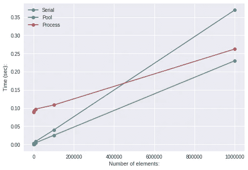

# 加速您的算法第 3 部分—并行化

> 原文：<https://towardsdatascience.com/speed-up-your-algorithms-part-3-parallelization-4d95c0888748?source=collection_archive---------5----------------------->

## Python 并行编程简介


Photo by [drmakete lab](https://unsplash.com/@drmakete?utm_source=medium&utm_medium=referral) on [Unsplash](https://unsplash.com?utm_source=medium&utm_medium=referral)

这是我写的系列文章中的第三篇。所有帖子都在这里:

1.  [加速您的算法第 1 部分— PyTorch](/speed-up-your-algorithms-part-1-pytorch-56d8a4ae7051)
2.  [加速你的算法第二部分——Numba](/speed-up-your-algorithms-part-2-numba-293e554c5cc1)
3.  [加速您的算法第三部分——并行化](/speed-up-your-algorithms-part-3-parallelization-4d95c0888748)
4.  加速你的算法第 4 部分— Dask

而这些与 ***相配套的 Jupyter 笔记本*** 可在此处获得:

[[Github-speedupyourlightms](https://github.com/PuneetGrov3r/MediumPosts/tree/master/SpeedUpYourAlgorithms)和**[**[**ka ggle**](https://www.kaggle.com/puneetgrover/kernels)**]**

# 索引

1.  [简介](#9ad0)
2.  [池和过程](#7e6e)
3.  [穿线](#43ca)
4.  [达斯克](#be41)
5.  [torch.multiprocessing](#aec3)
6.  [延伸阅读](#fea9)
7.  [参考文献](#0b7f)

```
***NOTE:*** This post goes with ***Jupyter Notebook*** available in my Repo on **Github**:[[SpeedUpYourAlgorithms-Parallelization](https://nbviewer.jupyter.org/github/PuneetGrov3r/MediumPosts/blob/master/SpeedUpYourAlgorithms/3%29%20Prallelization.ipynb)]
and on **Kaggle**:
[[SpeedUpYourAlgorithms-Parallelization](https://www.kaggle.com/puneetgrover/speed-up-your-algorithms-prallelization)]
```

# 1.简介 [^](#5133)

随着时间的推移，数据呈指数级增长，而处理器计算能力的增长却停滞不前，我们需要找到高效处理数据的方法。我们做什么呢

GPU 是一种解决方案，而且非常有效。但是，GPU 不是为了机器学习的目的而制造的，它们是专门为复杂的图像处理和游戏而制造的。我们让我们的算法在现有的 GPU 上工作，它实际上得到了回报。现在，谷歌推出了一款名为 TPU(张量处理单元)的新设备，它是为 TensorFlow 上的机器学习工作负载量身定制的，结果看起来很有希望。英伟达也没有退缩。[](#f403)

但是我们会在未来的某个时候碰到天花板。即使我们采用当今可用的任何巨大数据集，单个机器或计算单元也不足以处理这样的负载。我们将不得不使用多台机器来完成任务。我们将不得不**并行化**我们的任务。

在本帖中，我们将探讨一些你在 Python 中大部分时间会用到的方法。然后稍微介绍一下 **Dask** 和 **torch.multiprocessing** 。

# 2.池和进程 [^](#5133)


Photo by [Alexander Popov](https://unsplash.com/@5tep5?utm_source=medium&utm_medium=referral) on [Unsplash](https://unsplash.com?utm_source=medium&utm_medium=referral)

Python 的`multiprocessing`库的`Pool`和`Process`方法都为我们的任务启动了一个新的进程，但是方式不同。`Process`每次呼叫只进行一个过程:

```
import multiprocessing as mp
p = mp.Process(target= ##target-function,
               args=   ##args-to-func)
# This call will make only one process, which will process
# target-function with given arguments in background.
```

但是这个过程还没有开始。要启动它，您必须:

```
p.start()
```

现在，您可以将它留在这里，或者通过以下方式检查流程是否完成:

```
p.join()
# Now it will wait for process to complete.
```

不检查进程是否已经完成有许多用途。例如，在客户端-服务器应用程序中，数据包丢失或无响应进程的概率非常低，我们可以忽略它，这可以为我们带来可观的加速。[取决于应用程序的流程]

对于多个进程，你将不得不制作多个`Process`。你可以随意制作多个。当您调用它们上的`.start()`时，它们都将启动。

```
processes =[mp.Process(target=func, args=(a, b)) for (a, b) in list]for p in processes: p.start()
for p in processes: p.join()
```

另一方面,`Pool`启动固定数量的进程，然后我们可以给这些进程分配一些任务。因此，在特定的时刻，只有固定数量的进程在运行，其余的都在等待。进程的数量通常被选择为设备的内核数量，如果将该参数留空，这也是默认行为。

```
pool = mp.Pool(processes=2)
```

现在有很多方法可以让你使用这个`Pool`。在数据科学中，我们可以不用担心的是`Pool.apply`和`Pool.map`，因为它们在任务完成后立即返回结果。`Pool.apply`只接受一个参数，只使用一个进程，而`Pool.map`接受许多参数，并将它们放到我们的`Pool`进程中。

```
results = [pool.apply(func, (x)) for x in X]
# Or 
results = pool.map(func, (arg)) **#** Takes only one argument
```

但是`Pool.map`只接受一个参数(iterable ),它将这个参数分成若干块。要发送许多参数，你可以像 [this](https://stackoverflow.com/questions/5442910/python-multiprocessing-pool-map-for-multiple-arguments) 这样做。

考虑我们前面的客户机-服务器应用程序的例子，这里要运行的最大进程数是预定义的，所以如果我们有很多请求/包，一次只有其中的`n`(池中的最大进程数)会运行，而其他的会在队列中的进程槽中等待轮到它。



Squaring of all elements of a vector

```
**# How can we use it with Data Frame?
# A:** You can use some parallelizable functiondf.shape
# (100, 100)
dfs = [df.iloc[i*25:i*25+25, 0] for i in range(4)]with Pool(4) as p:
    res = p.map(np.exp, dfs)
for i in range(4): df.iloc[i*25:i*25+25, 0] = res[i]**#** It can come in handy for preprocessing of data.
```

**用什么，什么时候用？**[](#d923)

如果你有很多任务，但其中没有多少是计算密集型的，你应该使用`Process`。因为如果它们是计算密集型的，它们可能会阻塞您的 CPU，您的系统可能会崩溃。如果您的系统可以一次性处理它们，它们就不必排队等待机会。

当你有固定数量的任务并且它们是计算密集型的，你应该使用一个`Pool`。因为如果你一下子放开它们，你的系统可能会崩溃。

# 3.穿线 [^](#5133)


Photo by [Hello I'm Nik](https://unsplash.com/@helloimnik?utm_source=medium&utm_medium=referral) on [Unsplash](https://unsplash.com?utm_source=medium&utm_medium=referral)

**穿线！用 python？**

python 中的线程名声不好。人们是正确的。实际上，线程在大多数情况下并没有正常工作。那么问题是什么呢？

问题是 **GIL(全局解释器锁)**。GIL 是在 Python 开发的早期引入的，当时操作系统中甚至没有线程的概念。选择它是因为它简单。

GIL 一次只允许一个 CPU 绑定的进程。也就是说，它一次只允许一个线程访问 python 解释器。因此，线程`Lock`是整个解释器，直到它完成。[](#76b1)

对于单线程程序来说，它很快，因为只有一个`Lock`需要维护。随着 python 的流行，很难有效地消除 GIL 而不损害所有相关的应用程序。这就是它还在的原因。

**但是**，如果你的任务不受 CPU 限制，你仍然可以使用多线程并行(y)。也就是说，如果你的任务是 I/O 受限的，你可以使用多线程并获得加速。因为大部分时间这些任务都在等待其他代理(如磁盘等)的响应。)在此期间，他们可以释放锁，让其他任务同时获取它。 [⁴](#5984)

```
**NOTE: (From official page** [**here**](https://wiki.python.org/moin/GlobalInterpreterLock)**)** The GIL is controversial because it prevents multithreaded CPython programs from taking full advantage of multiprocessor systems in certain situations. Note that potentially blocking or long-running operations, such as **I/O**, **image processing**, and [**NumPy**](https://wiki.python.org/moin/NumPy) **number crunching**, happen ***outside*** the GIL. Therefore it is only in multithreaded programs that spend a lot of time inside the GIL, interpreting CPython bytecode, that the GIL becomes a bottleneck.
```

所以，如果你的任务是 IO 绑定的，比如从服务器下载一些数据，读/写磁盘等等。，您可以使用多线程并获得加速。

```
from threading import Thread as t
import queue
q = queue.Queue()  # For putting and getting results of threadfunc_ = lambda q, args: q.put(func(args))threads = [t(target=func_, args=(q, args)) for args in args_array]
for t in threads: t.start()
for t in threads: t.join()
res = []
for t in threads: res.append(q.get()) 
**#** These results won't necessarily be in order
```

为了保存线程的结果，你可以使用类似`Queue`的东西。为此，你必须像上面那样定义你的函数，或者你可以在你的函数中使用`Queue.put()`，但是你必须改变你的函数定义，以包含`Queue`作为参数。 [⁶](#fc5f)

现在，你在队列中的结果不一定是有序的。如果你希望你的结果是有序的，你可以传入一些计数器作为参数，作为 id，然后使用这些 id 来识别结果来自哪里。

```
threads = [t(func_, args = (i, q, args)) for i, args in 
                                         enumerate(args_array)]
# And update function accordingly***NOTE:*** Multiprocessing with Pandas 'read.csv' method doesn't give much speedup for some reason. As an alternative you can use [**Dask**](/speeding-up-your-algorithms-part-4-dask-7c6ed79994ef).
```

**线程 vs 进程？** [**⁷**](#9540)

一个进程是重量级的，因为它可能包含许多自己的线程(至少包含一个)，并且它有自己分配的内存空间，而线程是重量级的，因为它在父进程的内存区域工作，因此执行速度更快。

进程内线程之间的通信更容易，因为它们共享相同的内存空间。，而进程间的通信(**IPC**-进程间通信)较慢。不过话说回来，共享相同数据的线程可能会进入[竞争状态](https://en.wikipedia.org/wiki/Race_condition#Software)，应该使用`Locks`或类似的解决方案来处理。

# 4.达斯克 [^](#5133)


Photo by [Trevor Cole](https://unsplash.com/@trevcole?utm_source=medium&utm_medium=referral) on [Unsplash](https://unsplash.com?utm_source=medium&utm_medium=referral)

`Dask`是一个并行计算库，它不仅帮助并行化现有的机器学习工具(`Pandas`和`Numpy` )[ **，即使用高级集合** ]，还帮助并行化低级任务/功能，并可以通过制作任务图来处理这些功能之间的复杂交互。[ **即使用低级调度程序** ]这类似于 Python 的线程或多处理模块。

他们还有一个独立的机器学习库`dask-ml`，它与现有的库如`sklearn`、`xgboost`和`tensorflow`集成在一起。

```
from dask import delayed as delay@delay
def add(x, y):
    return x+y
@delay
def sq(x):
    return x**2# Now you can use these functions any way you want, Dask will 
# parallelize your execution. And as the name suggest Dask 
# will not execute your function callings right away, rather
# it will make a computational graph depending on the way you are
# calling functions on inputs and intermediate results. To compute
# final result:
result.compute()
```

Dask 做任何事情都有一种天生的并行性。对于它如何处理数据帧，您可以将它看作是一种分而治之的方法，它将您的数据帧分成块，然后并行应用您给定的函数。

```
df = dask.DataFrame.read_csv("BigFile.csv", chunks=50000)
# Your DataFrame has been divided into chunks and every function
# you apply will be applied to all chunks separately and in 
# parallel.# It has most of Pandas functions which you can use:
agg = df.groupby(["column"]).aggregate(["sum", "mean"])
agg.columns = new_column_namesdf_new = df.merge(agg.reset_index(), on="column", how="left")
# It have not compute result up until now,# but with .compute() it will compute now in parallel.
df_new.compute().head()
```

它们也有在机器集群上运行它们接口。

关于`Dask`的完整介绍，请看我的帖子[这里](/speeding-up-your-algorithms-part-4-dask-7c6ed79994ef)。

# 5.火炬.多重处理 [^](#5133)


Photo by [Matthew Hicks](https://unsplash.com/@mjhphotography?utm_source=medium&utm_medium=referral) on [Unsplash](https://unsplash.com?utm_source=medium&utm_medium=referral)

`torch.multiprocessing`是 Python `multiprocessing`模块的包装器，其 API 与原始模块 100%兼容。所以可以用`Queue`的、`Pipe`的、`Array`的等等。这些都在 Python 的多重处理模块中。除此之外，为了使它更快，他们增加了一个方法`share_memory_()`，它允许数据进入任何进程都可以直接使用它的状态，因此将该数据作为参数传递给不同的进程不会复制该数据。

你可以分享`Tensors`，model 的`parameters`，你可以随心所欲的在 CPU 或者 GPU 上分享。

```
**Warning from Pytorch: (Regarding sharing on GPU)
**  CUDA API requires that the allocation exported to other processes remains valid as long as it’s used by them. You should be careful and ensure that CUDA tensors you shared don’t go out of scope as long as it’s necessary. This shouldn’t be a problem for sharing model parameters, but passing other kinds of data should be done with care. Note that this restriction doesn’t apply to shared CPU memory.
```

你可以在这里的“池和进程”部分使用上面的方法，为了获得更快的速度，你可以使用`share_memory_()`方法在所有进程之间共享一个`Tensor`(比方说)而不被复制。

```
**# Training a model using multiple processes:**import torch.multiprocessing as mp
def train(model):
    for data, labels in data_loader:
        optimizer.zero_grad()
        loss_fn(model(data), labels).backward()
        optimizer.step()  ***#*** *This will update the shared parameters*model = nn.Sequential(nn.Linear(n_in, n_h1),
                      nn.ReLU(),
                      nn.Linear(n_h1, n_out))model.share_memory() **#** Required for 'fork' method to workprocesses = []
for i in range(4): # No. of processes
    p = mp.Process(target=train, args=(model,))
    p.start()
    processes.append(p)for p in processes: p.join()
```

您也可以使用一组机器。更多信息请参见[此处](https://pytorch.org/docs/stable/distributed.html)。

```
**NOTE:** For little introduction (kind of) on usage of **Pycuda**, see Jupyter Notebook's PyCuda section [here](https://nbviewer.jupyter.org/github/PuneetGrov3r/MediumPosts/blob/master/SpeedUpYourAlgorithms/3%29%20Prallelization.ipynb#5.-Pycuda-(Optional)).
```

# 6.延伸阅读 [^](#5133)

1.  [https://blog . rise ml . com/comparising-Google-TPU v2-对抗-NVIDIA-v100-on-resnet-50-C2 BBB 6 a 51 e 5 e](https://blog.riseml.com/comparing-google-tpuv2-against-nvidia-v100-on-resnet-50-c2bbb6a51e5e)
2.  [https://medium . com/synced review/Google s-TPU-chip-goes-public-in-challenge-to-NVIDIA-s-GPU-78 ced 56776 b5](https://medium.com/syncedreview/googles-tpu-chip-goes-public-in-challenge-to-nvidia-s-gpu-78ced56776b5)
3.  [https://sebastianraschka . com/Articles/2014 _ multi processing . html](https://sebastianraschka.com/Articles/2014_multiprocessing.html)
4.  [https://towards data science . com/how-I-learn-to-love-parallelised-apply-with-python-pandas k-and-numba-f 06 b0b 367138](/how-i-learned-to-love-parallelized-applies-with-python-pandas-dask-and-numba-f06b0b367138)
5.  [https://www.geeksforgeeks.org/multiprocessing-python-set-2/](https://www.geeksforgeeks.org/multiprocessing-python-set-2/)
6.  [https://www . geeksforgeeks . org/multi threading-in-python-set-2-synchron ization/](https://www.geeksforgeeks.org/multithreading-in-python-set-2-synchronization/)
7.  [https://medium . com/idealo-tech-blog/parallelisation-in-python-an-alternative-approach-b 2749 b 49 a 1 e](https://medium.com/idealo-tech-blog/parallelisation-in-python-an-alternative-approach-b2749b49a1e)
8.  [https://stack overflow . com/questions/990102/python-global-interpreter-lock-Gil-workrance-on-multi-core-systems-using-task](https://stackoverflow.com/questions/990102/python-global-interpreter-lock-gil-workaround-on-multi-core-systems-using-task)
9.  [https://stack overflow . com/questions/38666078/fast-queue-of-read-only-numpy-arrays](https://stackoverflow.com/questions/38666078/fast-queue-of-read-only-numpy-arrays)
10.  [https://medium . com/@ rvprasad/data-and-chunk-size-matter-when-using-multi processing-pool-map-in-python-5023 c 96875 ef](https://medium.com/@rvprasad/data-and-chunk-sizes-matter-when-using-multiprocessing-pool-map-in-python-5023c96875ef)
11.  [https://stackabuse.com/parallel-processing-in-python/](https://stackabuse.com/parallel-processing-in-python/)

# 7.参考文献 [^](#5133)

**a)池和过程:**

1.  [https://docs.python.org/3/library/multiprocessing.html](https://docs.python.org/3/library/multiprocessing.html)
2.  [https://www . elli cium . com/python-multi processing-pool-process/](https://www.ellicium.com/python-multiprocessing-pool-process/)

**b)穿线:**

3.[https://realpython.com/python-gil/](https://realpython.com/python-gil/)

4.[https://stack overflow . com/questions/29270818/why-a-python-I-o-bound-task-not-blocked-by-the-Gil](https://stackoverflow.com/questions/29270818/why-is-a-python-i-o-bound-task-not-blocked-by-the-gil)

5.[https://stack overflow . com/questions/27455155/python-multi processing-combined-with-threading](https://stackoverflow.com/questions/27455155/python-multiprocessing-combined-with-multithreading)

6.[https://stack overflow . com/questions/6893968/how-to-get-the-return-value-from-a-thread-in-python](https://stackoverflow.com/questions/6893968/how-to-get-the-return-value-from-a-thread-in-python)

7.[https://stack overflow . com/questions/200469/a-process-and-a-thread 的区别是什么](https://stackoverflow.com/questions/200469/what-is-the-difference-between-a-process-and-a-thread)

**c)达斯克**

8.【https://ml.dask.org 

9.[https://docs.dask.org/en/latest/](https://docs.dask.org/en/latest/)

**d)火炬.多重处理:**

9.[https://pytorch.org/docs/stable/multiprocessing.html](https://pytorch.org/docs/stable/multiprocessing.html)

10.[https://pytorch.org/docs/stable/notes/multiprocessing.html](https://pytorch.org/docs/stable/notes/multiprocessing.html)

**d) Pycuda:**

11.[https://documen.tician.de/pycuda/tutorial.html](https://documen.tician.de/pycuda/tutorial.html)

12.[https://github.com/inducer/pycuda/tree/master/examples](https://github.com/inducer/pycuda/tree/master/examples)

13.[https://www3.nd.edu/~zxu2/acms60212-40212-S12/Lec-12-02.pdf](https://www3.nd.edu/~zxu2/acms60212-40212-S12/Lec-12-02.pdf)

```
Suggestions and reviews are welcome.
Thank you for reading!
```

签名:

