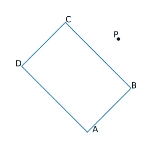

# 用广播和 PyTorch 加速你的 Python 代码

> 原文：<https://towardsdatascience.com/speed-up-your-python-code-with-broadcasting-and-pytorch-64fbd31b359?source=collection_archive---------6----------------------->


Image credit: Saffu at [https://unsplash.com/photos/E4kKGI4oGaU](https://unsplash.com/photos/E4kKGI4oGaU)

## 广播使得向量化您的代码成为可能，在 Numpy 的底层 C 实现中执行数组运算，而不必制作不必要的数据副本。根据不同的情况，这可以给你的代码带来显著的加速。此外，事实证明，如果您在 Numpy 中使用广播，您可以轻松地将代码移植到 PyTorch，然后在您的 GPU 上运行相同的代码，从而获得更高的速度！

当我做硕士论文的时候，我花了很多时间处理大量的激光雷达数据。其中一个步骤是移除属于场景中静态对象(建筑物、栅栏等)的所有点测量。场景中的每个静态对象都被建模为一个矩形对象，这实质上意味着我必须检查每个激光雷达测量值是否落在任何矩形内。我论文中使用的激光雷达工作在 10Hz，每次扫描包含大约 100，000 到 150，000 次测量，这意味着一秒钟的激光雷达数据对应于需要处理的 1-150 万个激光雷达点。那时我不了解 Python 或广播，所以我的这个处理步骤的实现不是那么快或有效。现在，我将以这个问题为例，展示如何使用 broadcasting 和 PyTorch 编写一个非常快速的算法实现。

## 如何确定一个点是否在矩形中



有一个简单的公式可以用来确定一个点是否在矩形内。如果我们假设矩形的每个角(x，y)被表示为 A，B，C，D，并且我们所讨论的点位于(x，y)点 P，那么公式可以被表示为


AP denotes the vector from point A to point P. The · sign denotes dot multiplication between the vectors.

如果这两个条件都满足，则该点位于矩形内，否则不满足。

## 没有广播的实现

如果我们以“标准”的方式实现算法，我们会得到这样的结果:

```
def in_boxes(boxes, points):
  # (N, 4, 2) = boxes.shape
  # (M, 2) = points.shape w = np.zeros(points.shape[0])
  for (i, point) in enumerate(points):
   in_box = False
   for box in boxes:
     (A, B, C, D) = box
     AP = (point — A)
     AB = (B — A)
     AD = (D — A)
     cond0 = 0 < np.dot(AP, AB) < np.dot(AB, AB)
     cond1 = 0 < np.dot(AP, AD) < np.dot(AD, AD)
     in_box = in_box or (cond0 and cond1)
   if in_box:
     w[i] = 1
   else:
     w[i] = 0
  return w
```

输入参数对应于出现的框和我们想要检查的点。盒子由形状为`(N,4,2)`的数组表示，其中`N` 对应于盒子的数量，`4`反映了我们有角(A，B，C，D)，而`2`反映了每个角的 xy 位置。我们想要研究的点由形状为`(M, 2)`的数组表示，其中`M`对应于点的数量，`2`反映每个点的 xy 位置。

在我的 MBP 2014 上用 3 个盒子和 1，000，000 个积分运行这个功能大约需要 **21.47 秒。**让我们看看使用 Numpy 广播重写函数时会发生什么。

## 广播，我怎么用？

在我们继续实现之前，让我们快速讨论一下如何使用广播。判断一个点是否在矩形中的算法的核心部分是计算向量`AP`，即每个点和每个坐标的`P-A`。所有的 A 坐标可以存储在一个形状为`(N, 2)`的数组`A`中。类似地，我们有`M`点，这些点存储在形状为`(M, 2)`的数组`P`中。现在，如果我们以下面的方式给数组增加一个额外的维度，我们将增加秩(维度的数量),数组将有新的形状

```
>>> A.shape
(M, 2)
>>> P.shape
(N, 2)
>>> A = A[:, None, :]
>>> P = P[None, ...]
>>> A.shape
(M, 1, 2)
>>> P.shape
(1, N, 2)
```

正是在这个阶段，广播开始发挥作用。如果我们现在选择计算两个数组之间的差，我们将得到一个形状为`(M, N, 2)`的数组

```
>>> (P - A).shape
(M, N, 2)
```

因此，Numpy 正在*广播*大小为 1 的每个维度中的数据，以便匹配两个数组的大小。这意味着 Numpy 本质上在第一维度上重复了 N 次`A`数组，在第 0 维度上重复了 M 次`P`数组。这种数据重复是在底层 C 实现中执行的，并且利用了指针，这意味着不会为了执行重复而复制数据(也就是说，我们不会因为必须复制数据而耗尽空间)。

这基本上展示了如何使用广播。通过向我们的数组添加额外的 1 维，并确保它们以相同的秩结束，我们可以执行任何类型的算术运算，并以我们想要的方式结束结果排序，而不必使用 for 循环。至此，让我们看看如何使用广播实现`in_boxes`算法

## 广播的实现

使用广播实现算法非常简单。为了更容易理解发生了什么，我在每一行都添加了注释，描述每个操作的结果形状。由于 Numpy 的`np.dot()`方法不支持广播，我将数组逐元素相乘(因为它支持广播)，然后在最后一个维度上求和，因为这个操作对应于点积。

```
def in_boxes_bc(boxes, points):
  # (N, 4, 2) = boxes.shape
  # (M, 2) = points.shape (A, B, C, D) = np.split(boxes, 4, axis=1)  # (N, 1, 2)
  AM = (points[None, ...] - A)  # (N, M, 2)
  AB = (B - A)  # (N, 1, 2)
  AD = (D - A)  # (N, 1, 2) 

  AM_AB = np.sum(AM * AB, axis=-1)  # (N, M)
  AB_AB = np.sum(AB * AB, axis=-1)  # (N, 1)
  AM_AD = np.sum(AM * AD, axis=-1)  # (N, M)
  AD_AD = np.sum(AD * AD, axis=-1)  # (N, 1)

  cond0 = (0 < AM_AB) & (AM_AB < AB_AB)  # (N, M)
  cond1 = (0 < AM_AD) & (AM_AD < AD_AD)  # (N, M)

  in_box = cond0 & cond1  # (N, M) = in_box.shape
  w = np.any(in_box, axis=0)
  return w
```

在我的 MBP 2014 上用 3 个盒子和 1，000，000 个点运行这个版本的算法大约需要 **0.36 秒。**与之前花费的时间 21.47 秒相比，这意味着我们实现了**到 60 倍**的速度提升！

## 使用 PyTorch 在 GPU 上运行

该算法的广播变体的真正巧妙之处在于，它非常容易移植到 PyTorch，这允许我们在 GPU 上运行相同的算法，从而可以进一步加快算法的速度！Numpy 和 PyTorch 都以相同的方式实现广播，唯一的警告是 PyTorch 对一些数学函数及其参数有稍微不同的命名方案。(`cuda()`函数用于将数据移动到 GPU，而`cpu()`用于将数据从 GPU 移回)。

```
def in_boxes_torch(boxes, points):
  boxes = torch.DoubleTensor(boxes).cuda()
  points = torch.DoubleTensor(points).cuda()

  dd = torch.chunk(boxes, 4, dim=1)
  (A, B, C, D) = dd AM = (points[None, ...] - A)
  AB = (B - A)
  AD = (D - A) AM_AB = torch.sum(AM * AB, dim=-1)
  AB_AB = torch.sum(AB * AB, dim=-1)
  AM_AD = torch.sum(AM * AD, dim=-1)
  AD_AD = torch.sum(AD * AD, dim=-1) cond0 = (0 < AM_AB) & (AM_AB < AB_AB)
  cond1 = (0 < AM_AD) & (AM_AD < AD_AD)

  in_box = cond0 & cond1
  # PyTorch does not have anything corresponding to np.any()
  w = (torch.sum(in_box, dim=0) > 0)
  return w.cpu()
```

使用与之前相同的场景(3 个盒子和 1，000，000 个点)，但这次在 GTX 980 Ti 上运行大约需要 **0.026 秒*** ，与使用广播的版本相比速度增加了 **~14x** ，与算法的第一个版本相比速度增加了 **~826x** ！

广播可以用来使某些类型的算法运行得更快，这很酷(尽管应该注意到[情况并不总是这样](http://scipy.github.io/old-wiki/pages/EricsBroadcastingDoc)，所以在开始使用广播进行任何类型的计算之前要小心)。能够快速移植代码在 GPU 上运行的额外好处是非常惊人的，特别是因为 ML/DL 领域的大多数人通常都可以使用非常强大的 GPU。速度上的差异很重要，因为这可能是等待几分钟算法完成与等待几小时(甚至几天)算法完成之间的差异！).

非常感谢 [Adam Fjeldsted](https://www.linkedin.com/in/adam-fjeldsted-84779a86/) 校对这篇文章！

*关于在 GPU 上运行代码，有两点值得注意:*

1.  *功能* `*in_boxes_torch*` *包括将数据移动到 GPU*
2.  *第一次使用 PyTorch 将数据移动到 GPU 比后续的移动花费更多的时间，因为建立到 GPU 的连接会有一些开销(这种开销与您试图移动到 GPU 的数据大小无关，在我的机器上大约是 2 秒)。因此，在运行和计时* `*in_boxes_torch*` *函数之前，我先将一些虚拟数据移入和移出 GPU。*