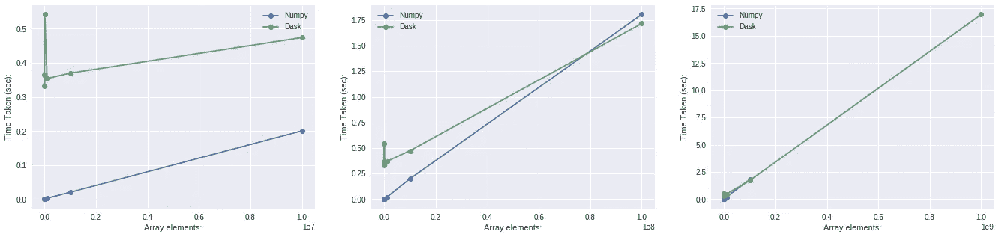
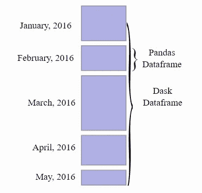

# 加速您的算法第 4 部分— Dask

> 原文：<https://towardsdatascience.com/speeding-up-your-algorithms-part-4-dask-7c6ed79994ef?source=collection_archive---------4----------------------->

## 与 Dask 并行运行您的 Pandas/Numpy/Sklearn/Python 代码


Photo by [Raul Cacho Oses](https://unsplash.com/@rcoses?utm_source=medium&utm_medium=referral) on [Unsplash](https://unsplash.com?utm_source=medium&utm_medium=referral)

这是我写的系列文章中的第四篇。所有帖子都在这里:

1.  [加速你的算法第一部分— PyTorch](/speed-up-your-algorithms-part-1-pytorch-56d8a4ae7051)
2.  加速你的算法第二部分—数字
3.  [加速您的算法第 3 部分—并行化](/speed-up-your-algorithms-part-3-parallelization-4d95c0888748)
4.  [加速您的算法第 4 部分— Dask](/speeding-up-your-algorithms-part-4-dask-7c6ed79994ef)

而这些与 ***Jupyter 笔记本*** 搭配在这里可以得到:

[[**Github**-speedupyourlightms](https://github.com/PuneetGrov3r/MediumPosts/tree/master/SpeedUpYourAlgorithms)和**[**[**ka ggle**](https://www.kaggle.com/puneetgrover/kernels)**】**

**(Edit-1/2/2019)** — [添加了 dask . distributed . local cluste](#c217)r 的更多信息/可能用法

# 索引

1.  [简介](#16a7)
2.  [数据类型](#7b8c)
3.  [延迟](#c7cd)
4.  [分发](#59f3)
5.  [机器学习](#9f6a)
6.  [延伸阅读](#7154)
7.  [参考文献](#df2c)

```
***NOTE:*** This post goes with ***Jupyter Notebook*** available in my Repo on **Github**:[[SpeedUpYourAlgorithms-Dask](https://nbviewer.jupyter.org/github/PuneetGrov3r/MediumPosts/blob/master/SpeedUpYourAlgorithms/4%29%20Dask.ipynb)]
and on **Kaggle:** [[SpeedUpYourAlgorithms-Dask](https://www.kaggle.com/puneetgrover/speed-up-your-algorithms-dask)]
```

# 1.简介 [^](#5133)

随着对机器学习算法并行化需求的增加，由于数据大小甚至模型大小的指数增长，如果我们有一个工具可以帮助我们并行处理`Pandas`的数据帧，可以并行处理`Numpy`的计算，甚至可以并行处理我们的机器学习算法(可能是来自`sklearn`和`tensorflow`的算法)，而没有太多麻烦，这将是非常有用的。

但这样的库确实存在，它的名字叫`Dask`。`Dask`是一个并行计算库，它不仅帮助并行化现有的机器学习工具(`Pandas`和`Numpy` )[ **，即使用高级集合** ]，还帮助并行化低级任务/功能，并可以通过制作任务图来处理这些功能之间的复杂交互。[ **即使用低级调度程序** ]这类似于 Python 的线程或多处理模块。

他们还有一个独立的机器学习库`dask-ml`，它与现有的库如`sklearn`、`xgboost`和`tensorflow`集成在一起。

`Dask` 通过绘制任务之间的交互图，将分配给它的任务并行化。通过使用`Dask`的`.visualize()`方法来可视化您正在做的事情将会非常有帮助，该方法可用于它的所有数据类型和您计算的复杂任务链。该方法将输出您的任务的图表，如果您的任务在每一层都有许多节点(即您的任务链结构在许多层都有许多独立的任务，例如数据块上的可并行化任务)，那么`Dask`将能够并行化它们。


```
**Note:**
Dask is still a relatively new project. It has a long way to go. Still if you don't want to go through learning a completely new API (like in case of PySpark) Dask is your best option, which surely will get better and better in future. 
Still Spark/PySpark is ways ahead and will still keep on improving. It is a well established Apache project. I will publish a post on PySpark in coming months.(Today: April'19)
If you want to start with PySpark, read this comment [here](https://medium.com/@grover.puneet1995/i-have-stated-in-third-section-4f8206c4f081).
```

# 2.数据类型 [^](#5133)


Photo by [Kai Oberhäuser](https://unsplash.com/@memoryonsounds?utm_source=medium&utm_medium=referral) on [Unsplash](https://unsplash.com?utm_source=medium&utm_medium=referral)

`Dask`中的每种数据类型都提供了现有数据类型的分布式版本，如`Pandas`中的`DataFrame`、`numpy`中的`ndarray`和`Python`中的`list`。这些数据类型可能比你的内存大，`Dask`将以`Blocked`的方式对你的数据并行(y)运行计算。`Blocked`通过执行许多小计算来执行大计算，即以块为单位，块的数量是`chunks`的总数。

**a)数组:**


Many Numpy arrays in a grid as Dask Array

Dask Array 通过将非常大的数组分成块并并行执行这些块来对它们进行操作。它有许多可用的 numpy 方法，你可以用它们来加速。但是其中的[部分](http://docs.dask.org/en/latest/array.html#scope)没有实现。

Dask 数组可以从任何类似数组的结构中读取，只要它支持类似 numpy 的切片，并且通过使用`dask.array.from_array`方法具有`.shape`属性。也可以从`.npy`和`.zarr`文件中读取。

```
import dask.array as da
import numpy as nparr = numpy.random.randint(1, 1000, (10000, 10000))darr = da.from_array(arr, chunks=(1000, 1000))
# It will make chunks, each of size (1000, 1000)
darr.npartitioins
# 100
```

当你的数组非常大的时候(也就是说，它们放不进内存)可以使用它，而`numpy`对此无能为力。所以，`Dask`把它们分成数组块，给你并行操作。

现在，`Dask`对每一个方法进行懒惰的评估。所以，要真正计算一个函数的值，你必须使用`.compute()`方法。它将在块中并行计算结果，同时并行处理每个独立的任务。

```
result = darr.compute()
```



1) Numpy faster than Dask for smaller number of elements; 2) Dask taking over Numpy for around 1e7 elements; 3) Numpy not able to produce results for higher number of elements as it is not able to put them on memory.

**b)数据帧:**



5 Pandas’ DataFrames each providing monthly data (can be from diff files) in one Dask DataFrame

与`Dask Arrays`类似，`Dask DataFrame`通过将文件划分为块，并对这些块并行地执行计算功能，来对无法容纳在内存中的非常大的数据文件进行并行计算。

```
import dask.dataframe as dd
df = dd.read_csv("BigFile(s).csv", blocksize=50e6)
```

现在，您可以应用/使用`pandas`库中的大多数功能，并在此处应用。

```
agg = df.groupby(["column"]).aggregate(["sum", "mean", "max", "min"])
agg.columns = new_column_names # see in notebook
df_new = df.merge(agg.reset_index(), on="column", how="left")
df_new.compute().head()
```

**c)袋子:**

`Dask` `Bag` s 对包含多种数据类型元素的`Python``list`like 对象进行并行化计算。当您试图处理 JSON blobs 或日志文件之类的半结构化数据时，这很有用。

```
import dask.bag as db
b = db.from_txt("BigSemiStructuredData.txt")
b.take(1)
```

`Dask` bags 逐行读取，`.take`方法输出指定行数的元组。

`Dask` `Bag`对这类 Python 对象集合执行`map`、`filter`、`fold`、`groupby`等操作。它使用 Python 迭代器以较小的内存占用并行完成这一任务。它类似于 PyToolz T21 的平行版本或者 PySpark RDD 的 Pythonic 版本。

```
filtered = b.filter(lambda x: x["Name"]=="James")\
                     .map(lambda x: x["Address"] = "New_Address")
filtered.compute()
```

# 3.延期 [^](#5133)


Photo by [Andrea Cau](https://unsplash.com/@andreacau?utm_source=medium&utm_medium=referral) on [Unsplash](https://unsplash.com?utm_source=medium&utm_medium=referral)

如果您的任务有点简单，并且您不能或不想使用这些高级集合来完成，那么您可以使用低级调度程序来帮助您使用`dask.delayed`接口并行化您的代码/算法。`dask.delayed`也做懒计算。

```
import dask.delayed as delay@delay
def sq(x):
    return x**2
@delay 
def add(x, y):
    return x+y
@delay 
def sum(arr):
    sum=0
    for i in range(len(arr)): sum+=arr[i]
    return sum
```

您可以根据需要在这些函数之间添加复杂的交互，使用前一个任务的结果作为下一个任务的参数。`Dask`不会立即计算这些函数，而是会为您的任务制作一个图表，有效地整合您使用的函数之间的交互。

```
inputs = list(np.arange(1, 11))#Will be addin' dask.delayed to list
temp = []
for i in range(len(inputs)):
    temp.append(sq(inputs[i]))  # Compute sq of inputs and save 
                                # delayed in list
inputs=temp; temp = []
for i in range(0, len(inputs)-1, 2):
    temp.append(add(inputs[i]+inputs[i+1])) # Add two consecutive
                                            # results from prev step
inputs = temp
result = sum(inputs) # Sum all results from prev step
results.compute()
```

您可以用许多可能的小块为任何可并行化的代码增加延迟，并获得加速。它可以是你想要计算的许多函数，比如上面的例子，或者使用`pandas.read_csv`并行读取许多文件。

# 4.分发 [^](#5133)


Photo by [Chinh Le Duc](https://unsplash.com/@mero_dnt?utm_source=medium&utm_medium=referral) on [Unsplash](https://unsplash.com?utm_source=medium&utm_medium=referral)

首先，到目前为止，我们一直使用`Dask`的默认调度程序来计算任务的结果。但是您可以根据自己的需要从`Dask`的可用选项中进行更改。

`Dask`附带四个可用的调度程序:

*   "`threaded`":由线程池支持的调度程序
*   "`processes`":由进程池支持的调度程序
*   "`single-threaded`"(又名"`sync`"):一个同步调度器，适合调试
*   `distributed`:用于在多台机器上执行图形的分布式调度程序

```
result.compute(scheduler="single-threaded") # for debugging
# Or
dask.config.set(scheduler="single-threaded")
result.compute()**NOTE: (from official page** [**here**](https://render.githubusercontent.com/view/ipynb?commit=33efceb9ba76b16ce3bf51d6210546e257f0874b&enc_url=68747470733a2f2f7261772e67697468756275736572636f6e74656e742e636f6d2f6461736b2f6461736b2d7475746f7269616c2f333365666365623962613736623136636533626635316436323130353436653235376630383734622f30355f64697374726962757465642e6970796e62&nwo=dask%2Fdask-tutorial&path=05_distributed.ipynb&repository_id=39199909&repository_type=Repository#Some-Questions-to-Consider:)**)**
Threaded tasks will work well when the functions called release the [GIL](https://wiki.python.org/moin/GlobalInterpreterLock), whereas multiprocessing will always have a slower start-up time and suffer where a lot of communication is required between tasks.# And you can get the scheduler by the one of these commands:
dask.threaded.get, dask.multiprocessing.get, dask.local.get_sync
# last one for "single-threaded"
```

但是，`Dask`多了一个调度器，`dask.distributed`，出于以下原因，可以优先选择它:

1.  它提供对异步 API 的访问，特别是 [Futures](http://docs.dask.org/en/latest/futures.html) ，
2.  它提供了一个诊断控制面板，可以提供关于性能和进度的宝贵见解
3.  它处理数据局部性更加复杂，因此在需要多个进程的工作负载上比多处理调度程序更有效。

您可以通过导入和创建一个`Client`来创建`Dask`的`dask.distributed`调度程序。

```
from dask.distributed import Client
client = Client() # Set up a local cluster# You can navigate to [http://localhost:8787/status](http://localhost:8787/status) to see the 
# diagnostic dashboard if you have Bokeh installed.
```

现在，您可以通过使用`client.submit`方法将您的任务提交给这个集群，将函数和参数作为它的参数。然后我们可以通过使用`client.gather`或`.result`方法来收集我们的结果。

```
sent = client.submit(sq, 4) # sq: square function
result = client.gather(sent) # Or sent.result()
```

您还可以通过使用`dask.distributed.progress`来查看当前单元格中的任务进度。您还可以通过使用`dask.distributed.wait`明确选择等待任务完成。

更多信息请看[这里](http://docs.dask.org/en/latest/futures.html)。

```
**Note: (Local Cluster)** At times you will notice that **Dask** is exceeding memory use, even though it is dividing tasks. It could be happening to you because of the function you are trying to use on your **dataset** wants most of your data for processing, and multiprocessing can make things worse as all workers might try to copy **dataset** to memory. This can happen in aggregating cases.
Or maybe you want to restrict Dask to use only specific amount of memory. In these cases you can use **Dask.distributed.LocalCluster** parameters and pass them to **Client**() to make a **LocalCluster** using cores of your Local machines.**from** dask.distributed **import** Client, LocalCluster
client = **Client**(n_workers=1, threads_per_worker=1, processes=False,
                memory_limit='25GB', scheduler_port=0, 
                silence_logs=True, diagnostics_port=0)
client 'scheduler_port=0' and 'diagnostics_port=0' will choose random port number for this particular client. With 'processes=False' **dask**'s client won't copy dataset, which would have happened for every process you might have made.
You can tune your client as per your needs or limitations, and for more info you can look into parameters of **LocalCluster.** You can also use multiple clients on same machine at different ports.
```

# 5.机器学习 [^](#5133)


Photo by [James Pond](https://unsplash.com/@lamppidotco?utm_source=medium&utm_medium=referral) on [Unsplash](https://unsplash.com?utm_source=medium&utm_medium=referral)

`Dask`也有帮助并行运行最流行的机器学习库的库，比如`sklearn`、`tensorflow`和`xgboost`。

在机器学习中，你可能会面临几个不同的缩放问题。扩展策略取决于您面临的问题:

1.  大型模型:数据适合 RAM，但训练时间太长。许多超参数组合、许多模型的大型集合等。
2.  大型数据集:数据比 RAM 大，采样是不可行的。

因此，您应该:

*   对于内存适配问题，只需使用 scikit-learn(或者你最喜欢的 ML 库)；
*   对于大型模型，使用`dask_ml.joblib`和您最喜欢的 scikit-learn 估算器；和
*   对于大型数据集，使用`dask_ml`估算器。

**a)预处理:**

`dask_ml.preprocessing`包含`sklearn`中的一些功能，如`RobustScalar`、`StandardScalar`、`LabelEncoder`、`OneHotEncoder`、`PolynomialFeatures`等。，还有一些自己的如`Categorizer`、`DummyEncoder`、`OrdinalEncoder`等。

您可以像使用`Pandas`数据框一样使用它们。

```
from dask_ml.preprocessing import RobustScalardf = da.read_csv("BigFile.csv", chunks=50000)rsc = RobustScalar()
df["column"] = rsc.fit_transform(df["column"])
```

您可以使用`Dask`的`DataFrame`上的`Dask`的预处理方法，从`sklearn`的`make_pipeline`方法制作一个管道。

**b)超参数搜索:**

`Dask`有来自`sklearn`的用于超参数搜索的方法，如`GridSearchCV`、`RandomizedSearchCV`等。

```
from dask_ml.datasets import make_regression
from dask_ml.model_selection import train_test_split, GridSearchCV
X, y = make_regression(chunks=50000)
xtr, ytr, xval, yval = test_train_split(X, y)gsearch = GridSearchCV(estimator, param_grid, cv=10)
gsearch.fit(xtr, ytr)
```

如果你使用`partial_fit`和你的估算器，你可以使用`dask-ml`的`IncrementalSearchCV`。

```
**NOTE: (from Dask)**
If you want to use post-fit tasks like scoring and prediction, then underlying estimators scoring method is used. If your estimator, possibly from sklearn is not able to handle large dataset, then wrap your estimator around "dask_ml.wrappers.ParallelPostFit". It can parallelize methods like "predict", "predict_proba", "transform" etc.
```

**c)模型/估计器:**

`Dask`有一些线性模型(`LinearRegression`，`LogisticRegression`等)。)、一些聚类模型(`Kmeans`和`SpectralClustering`)、一个用`Tensorflow` [聚类](https://ml.dask.org/tensorflow.html)操作的方法、使用`Dask`训练`XGBoost` [模型](https://ml.dask.org/xgboost.html)的方法。

如果你的训练数据很少，你可以使用`sklearn`的模型和`Dask`，或者使用`ParallelPostFit`的包装器(如果你的测试数据很多)。

```
from sklearn.linear_model import ElasticNet
from dask_ml.wrappers import ParallelPostFitel = ParallelPostFit(estimator=ElasticNet())el.fit(Xtrain, ytrain)
preds = el.predict(Xtest)
```

如果你的数据集不大但是你的模型很大，那么你可以使用`joblib`。许多`sklearns`算法是为并行执行而编写的(您可能已经使用了`n_jobs=-1`参数)，使用`joblib`来利用线程和进程来并行化工作负载。要使用`Dask`进行并行化，您可以创建一个`Client`(您必须这样做)，然后将您的代码包装在`with joblib.parallel_backend('dask'):`周围。

```
import dask_ml.joblib
from sklearn.externals import joblibclient = Client()with joblib.parallel_backend('dask'):
    # your scikit-learn code**NOTE:** Note that the Dask joblib backend is useful for scaling out CPU-bound workloads; workloads with datasets that fit in RAM, but have many individual operations that can be done in parallel. To scale out to RAM-bound workloads (larger-than-memory datasets) you should use Dask's inbuilt models and methods.
```

如果你的训练数据太大，无法放入内存，那么你应该使用`Dask`的内置估算器来加速。您也可以使用`Dask`的`wrapper.Incremental`，它使用底层估计器的`partial_fit`方法对整个数据集进行训练，但它本质上是顺序的。

`Dask`的内置估算器通过各种优化算法(如`admm`、`lbfgs`、`gradient_descent`等)很好地扩展了大型数据集。以及`L1`、`L2`、`ElasticNet`等正则化子。

```
from dask_ml.linear_model import LogisticRegressionlr = LogisticRegression()
lr.fit(X, y, solver="lbfgs")
```

再举一个使用`Dask`的例子，你可以在这里阅读我的帖子[中的`Dask`部分。这是一个从探索到训练模型的完整过程。](/how-to-learn-from-bigdata-files-on-low-memory-incremental-learning-d377282d38ff)

# 6.延伸阅读 [^](#5133)

1.  [https://mybinder.org/v2/gh/dask/dask-examples/master?urlpath=lab](https://mybinder.org/v2/gh/dask/dask-examples/master?urlpath=lab)
2.  [https://towards data science . com/how-I-learn-to-love-parallelised-apply-with-python-pandas-dask-and-numba-f 06 b0b 367138](/how-i-learned-to-love-parallelized-applies-with-python-pandas-dask-and-numba-f06b0b367138)
3.  [https://docs.dask.org/en/latest/](https://docs.dask.org/en/latest/)
4.  [https://ml.dask.org](https://ml.dask.org)

# 7.参考文献 [^](#5133)

1.  [https://ml.dask.org](https://ml.dask.org)
2.  [https://docs.dask.org/en/latest/](https://docs.dask.org/en/latest/)

```
Suggestions and reviews are welcome.
Thank you for reading!
```

签名:

