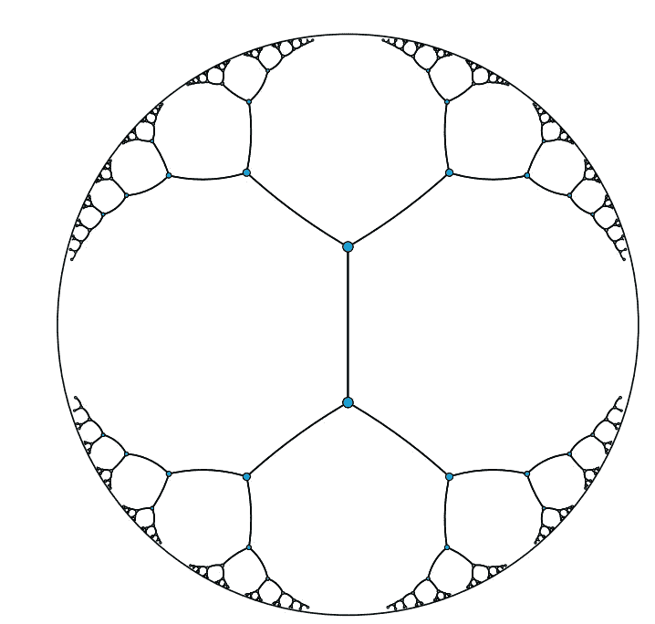
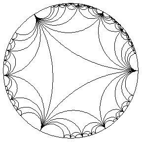
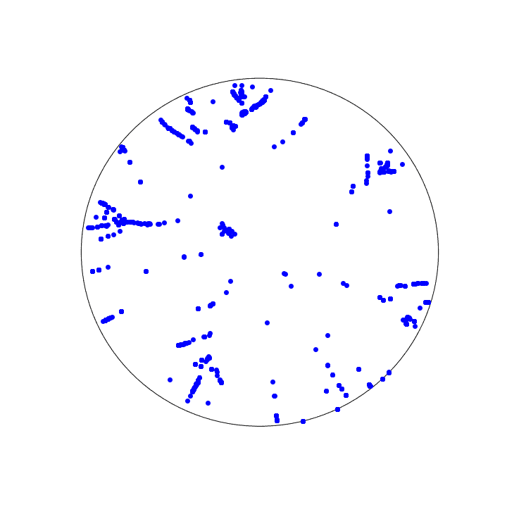
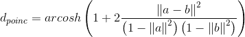
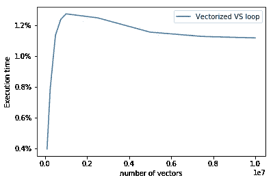

# 加速你的代码(1):庞加莱球空间中均值漂移聚类的例子

> 原文：<https://towardsdatascience.com/speeding-up-your-code-1-the-example-of-the-mean-shift-clustering-in-poincar%C3%A9-ball-space-d46169bfdfc8?source=collection_archive---------7----------------------->

来自本系列:

1.  庞加莱球空间中均值漂移聚类的例子(本帖)
2.  [用 Numpy 对循环进行矢量化](https://medium.com/@vincenzo.lavorini/speeding-up-your-code-2-vectorizing-the-loops-with-numpy-e380e939bed3)
3.  [批处理和多线程](https://medium.com/@vincenzo.lavorini/speeding-up-your-code-3-batches-and-multiprocess-52d2d34a4091)
4.  [用 Numba 实时编译](https://medium.com/@vincenzo.lavorini/speeding-up-your-code-4-in-time-compilation-with-numba-177d6849820e)

你好社区！

这是一系列文章中的第一篇，我将描述使用 Python 和 Numpy 构建快速聚类算法的步骤，该算法将在特定的“双曲线”空间中使用。

因为我想展示一个真实的开发案例，所以在第一篇文章中，我将描述我必须达到的目标，详细描述我必须实现目标的环境以及我在那里的原因，然后是代码的第一个原始版本。

所以让我们开始吧！

## 为什么会这样？

2017 年 5 月，在《人工智能世界》杂志上，来自脸书人工智能研究所的 Maximilian Nickel 和 Douwe Kiela 发表了一篇[论文](https://arxiv.org/abs/1705.08039)。这篇论文的内容有望对代表学习领域产生巨大的影响。

严格来说，表示学习技术的目标是翻译属于一个集合(例如，一本书)的对象(例如，单词)的“含义”，考虑到它们之间存在的属性(例如，语义)，目标是具有一个随后可以被 AI 算法使用的基础。对象表现得越好，后续的算法就越有效。

这些技术的尖端使用“嵌入”:每个对象由多维空间中的一个点来表示，并且该点将理想地“嵌入”该对象相对于集合所具有的所有属性。因此，具有相似含义的对象将发现它们的嵌入在几何上彼此接近。这就是为什么我必须建立一个聚类算法。

这种多维空间通常是“平面”型的，也就是说，具有我们在现实空间中看到的几何性质，也就是我们在学校里学过的那些。相反，在提到的论文中，他们使用了一个特殊的“弯曲”空间:庞加莱球模型。这是因为这种空间非常适合表示层次结构，因此集合中的潜在层次结构很容易表示。事实上，它们使用低得多的维度在许多领域显示了最先进的结果。

这个庞加莱球是什么样子的？作为例子，下面有两个二维球(即一个圆)表示。你看到的弧线就是所谓的“[测地线](https://en.wikipedia.org/wiki/Geodesic)，也就是两点之间最短的步行距离。这是相对于“平坦的”欧几里得空间的最明显的区别之一，在欧几里得空间中，点之间的最短穿行是一条直线。另一个很大的不同是，在圆之外没有任何东西可以存在:实际上，离中心很远的点(“在无穷远处”)位于圆盘圆周上。因此，连接你在左图中看到的点的弧线都有相同的长度。令人兴奋，不是吗？

Left: the lines connecting the points have all the same distance. Right: the animation of a rotation within the Poincaré disk. Credits: [Wolfram.com](http://mathworld.wolfram.com/PoincareHyperbolicDisk.html)

## 目标

我必须建立一个算法，将空间中彼此靠近的点组合在一起。我需要这个算法在没有预先指定聚类数的情况下工作。然后我选择[均值漂移](https://en.wikipedia.org/wiki/Mean_shift)程序。

该过程将每个点向其最近的点群移动，并且单个参数定义了最近的点群有多远。如果最近的大块太远，该点将自己形成一个孤立的簇。

这是二维庞加莱盘中结果的动画，其中算法将以 13 个聚类结束:

Mean shift clustering in Poicaré disk.

您可以注意到，圆边界附近的点(相对距离似乎很小)不会聚集。相反，靠近圆心的点，其相对距离似乎比圆周上的点要大，实际上会聚集在一起。

这是我们所在的弯曲空间的影响，庞加莱球:正如我已经提到的，你离中心越远，距离实际上就越大，比你在照片上看到的要大。

可以说很多细节，但那超出了本帖的范围。但是，如果你想了解更多关于均值漂移过程和花哨的庞加莱球空间模型，只需搜索网络，有大量的资源。

## 履行

描述性地，为了实现均值漂移过程，我们必须用所有其他点的加权和来代替每个点 *P* 。应用于每个点的权重取决于它与所考虑的点的距离( *P* )。并且必须重复这个过程，直到所有的点都聚集在一起。

您可以在网上找到该算法的几种实现，基本上适用于每种编程语言。但是没有人会在这个空间工作！

原因是我们计算点与点之间距离的方式。所有这些算法都是为在“平坦的”欧几里得空间中工作而设计的，因此它们以欧几里得方式计算点之间的距离。相反，在这个特定的空间中，距离是更复杂的。

这是用 Python 和 Numpy 写的基本代码。我从杰瑞米·霍华德[的精彩](https://medium.com/u/34ab754f8c5e?source=post_page-----d46169bfdfc8--------------------------------)[课程](http://course.fast.ai/lessons/lesson11.html)中得到这个版本:

The basic code

这是一个通用的 meanshift 实现。对于我们的例子，区别在于我们定义点之间的区别的方式:

如您所见，Numpy 的[广播](https://docs.scipy.org/doc/numpy/user/basics.broadcasting.html)功能在编写简单代码方面帮助很大。为了理解广播，请看高斯函数:它接受两个元素作为输入( *d* 作为距离， *bw* 作为带宽)。它们都可以是数字，或者任何 n 维数组(向量、矩阵、张量)，如果它们的形状兼容，Numpy 会知道如何以适当的方式处理它们。在我们的例子中，我们为函数提供一个向量( *dists* )和一个数字(sigma)。

为了完整起见，庞加莱球模型中两点之间的距离定义为:

Definition of distance in the Poincaré Ball space

那么，搞定了？是也不是。它是有效的，你之前看到的动画就是用这种算法制作的。但是很慢:在我的笔记本电脑(i7–4750 HQ CPU @ 2.00 GHz，8GB RAM)上，对于集群 1200 点，每步需要 14 秒，算法收敛需要 10 步。

所以我需要改进代码。

## 加快代码速度

可以做很多很好的尝试来改进它:使用近似技术、随机矩阵、多线程、GPU 等等。

但我们是程序员，有义务多动脑，少蛮力。所以我想尝试的第一个尝试是[向量化](https://en.wikipedia.org/wiki/Array_programming)两个循环:一个在 *dist_poinc* 函数中，另一个在 mean 算法中。

在下一篇文章中，我会展示原因和结果。但是作为开胃菜，看看这个情节:

Percentage of execution time of a vectorized product with respect to a looped one.

是的，你读得不错:一个简单操作的矢量化版本的执行时间不到完成循环所需时间的 1.3%。

难道不值得一试吗？