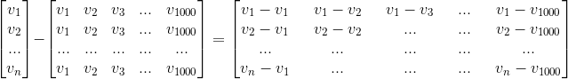
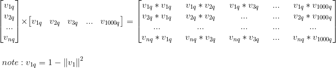
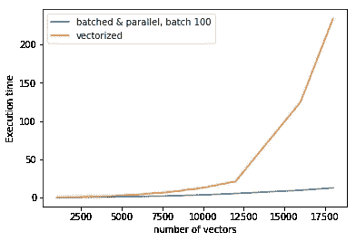
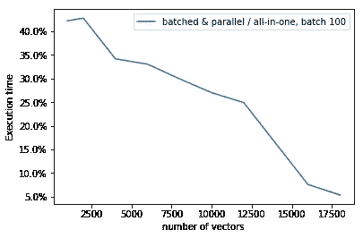
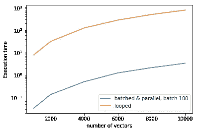
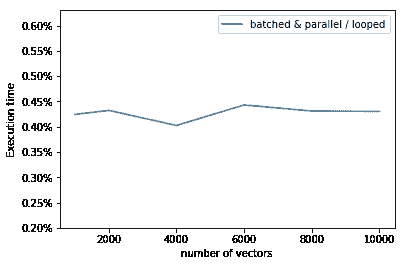

# 加速您的代码(3):批处理和多线程

> 原文：<https://towardsdatascience.com/speeding-up-your-code-3-batches-and-multiprocess-52d2d34a4091?source=collection_archive---------3----------------------->

来自本系列:

1.  [庞加莱球空间中均值漂移聚类的例子](https://medium.com/@vincenzo.lavorini/speeding-up-your-code-1-the-example-of-the-mean-shift-clustering-in-poincar%C3%A9-ball-space-d46169bfdfc8)
2.  [用 Numpy 对循环进行矢量化](https://hackernoon.com/speeding-up-your-code-2-vectorizing-the-loops-with-numpy-e380e939bed3)
3.  批处理和多线程(这篇文章)
4.  [用 Numba 实时编译](https://medium.com/@vincenzo.lavorini/speeding-up-your-code-4-in-time-compilation-with-numba-177d6849820e)

在上一篇文章中，我们展示了我们算法的矢量化版本会随着向量数量的增加而变慢，我们将这一特性与以下事实相关联:对于 *N* 个向量，我们处理的是 *N* 个矩阵。

现在，我们将实现一种算法，每次处理一批向量，即批处理版本。利用这个技巧，我们将对顺序为 *n x N* 的矩阵进行计算，其中小的 *n* 是一批中要考虑的向量的数量。这个技巧的一个很好的副作用是，我们还可以并行计算。

# 更新代码

均值漂移过程中的第一个操作是计算每个向量到所有其他向量的距离，在庞加莱球空间中，距离为:

Distance in Poincaré ball

按照我们的 1000 个二维向量的例子，为了计算距离公式的分子，我们需要第一个 *n* 元素的这个 *n x 1000* 矩阵:

Batched version of the vectorized numerator of the distance formula.

然后像以前一样，得到的矩阵中每个元素的分量(都是向量，还记得隐藏维吗？)都得平方总结。

在分母上，我们必须对这个结构进行编码:

Batched version of the vectorized denominator of the distance formula.

距离函数的其余部分很容易。使用 Numpy 语言，下面是计算数据集子样本(批处理)和整个数据集之间的距离所需的代码。只有修改过的行被注释:

Batched version of the code for the Poincaré ball distance.

整个 meanshift 算法几乎保持不变:

Code for one iteration of the meanshift algorithm, batched version

最大的不同是，这里我们动态地更新矢量，也就是说，我们根据已经移动的矢量计算出的距离来移动矢量。实际上:在第一批中，距离是以传统方式计算的，产生的移位向量被放置在原始数据集中。因此，我们将有一个数据集，其中第一个 *n 个*向量被移位，而其他向量没有被移位。当我们考虑第二批时，将针对该混合数据集计算距离，对于其他批也是如此。

虽然这个版本的算法的稳定性需要更好的研究，但我们可以相当肯定的是，使用小高斯宽度(*∑*)我们不会遇到问题。

最后，在我们在[前一篇文章](https://hackernoon.com/speeding-up-your-code-2-vectorizing-the-loops-with-numpy-e380e939bed3)中介绍的位置循环=bad 之后，我们回到另一个循环，因为为了移动所有的向量，我们必须为每一个可能的批次运行这个过程。但是好消息是每个批处理都是相互独立的，所以我们可以并行化这个循环！

为了利用我们的多核处理器，我们将使用 Python 的[*ThreadPoolExecutor*](https://docs.python.org/3.4/library/concurrent.futures.html)*函数:*

*关于 ThreadPoolExecutor 的细节超出了本系列文章的范围，但简而言之:*

1.  *修改 *__shift* 函数，以恢复该函数已移动的向量的位置；这是追踪移动的向量并将其放入数据集中正确位置所必需的。*
2.  *定义了一个字典(*future _ shift*)，它包含所有要并行执行的函数，每个批处理一个；函数的数量将取决于所选择的批量大小，例如，如果数据集包含 1000 个向量，并且选择的批量大小为 200，则字典将包含 5 个函数。*
3.  *一旦执行了每个函数，数据集中由跟踪号指定的位置(此列表中的点 1)处的相对位移矢量就会更新。*

*仅此而已！现在，我们在速度执行方面获得了多少？让我们用通常的二维向量集合来检查一下:*

***

Comparison of the execution time for the mean shift algorithm, absolute on the left, relative on the right.* 

*不出所料，水货版更快。数据集越大，它的性能就越好:对于移动一个由 18k 个向量组成的数据集，并行版本只需要一次移动所有向量所需时间的 5%。这是因为旧版本在[多项式时间](https://en.wikipedia.org/wiki/Time_complexity#Polynomial_time) O(N)中执行，而并行版本在[线性时间](https://en.wikipedia.org/wiki/Time_complexity#Linear_time)中执行:不管数据集大小如何，我们总是使用固定大小的矩阵执行操作( *n_batches x N* ，在前面的示例中 *n_batches* =100)。*

# *结论*

*所有的数值算法都有一个要达到的目标:在合理的时间内获得合理精确的结果。所以，一般来说，在保持精度不变的情况下，加快算法的执行速度就像金子一样。如果考虑生产环境，更快的执行意味着更早地释放硬件资源；在相同的单位时间内可以执行更多的线程，这意味着省钱。更多:在实时应用中，执行速度可以区分可能和不可能。*

*对于“我如何才能提高速度？”这个问题，第一个天真的答案是通常是“购买更快的硬件！”，但看看接下来的图，我们比较了算法的原始版本(在第一篇文章的[中描述)和这里解释的版本:](https://medium.com/@vincenzo.lavorini/speeding-up-your-code-1-the-example-of-the-mean-shift-clustering-in-poincar%C3%A9-ball-space-d46169bfdfc8)*

***

Comparison between the algorithm in the first post (‘looped’) and the one in the present post (‘batched & parallel’).* 

*我们需要 0.4%多一点的时间来执行一次迭代，这意味着并行矢量化算法比循环算法快 250 倍。或者，如果你喜欢，快 25000%。*

*你能想到购买硬件的速度快 250 倍吗？这就像从 2009 年构建的英特尔赛扬处理器(~4 GFLOPS)过渡到 2017 年构建的英特尔 I9(~ 1000 GFLOPS)。是的，你需要一个时间机器。*

*更好的优化代码，不是吗？*

*如果你想自己试试，可以在这里找到代码[。](https://github.com/vlavorini/meanshift_blog)*