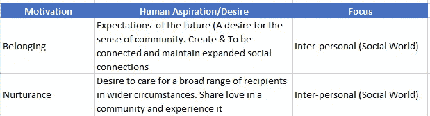

# 特朗普总统每周讲话中的人际动机！

> 原文：<https://towardsdatascience.com/spiking-interpersonal-motives-in-this-weekly-address-by-president-trump-d9acb03f0ba1?source=collection_archive---------3----------------------->

## 发现总统的思想和内心

我分析了唐纳德·j·特朗普总统(dt。2017 年 4 月 14 日)，你可以在[访问这个白宫网站](https://www.whitehouse.gov/the-press-office/2017/04/14/president-donald-j-trumps-weekly-address)链接。在我的观察中，我发现，除了更高水平的安全和社会福祉相关的价值观飙升之外，这个每周讲话还有一个重要的人际/社会动机。

你可以通过人类动机、价值和人格特质的镜头，在下面找到我分析的细节。该分析是基于对每周讲话的语音记录的认知计算和分析。

> **首先，这是每周电视讲话的要点**(摘要)
> 几个世纪以来，犹太人经历了一次又一次的迫害——然而，他们坚持下来，繁荣起来，提升了这个世界。这是一个神圣的崇敬和崇拜的日子；这是一个神圣的时刻，用我们人民的信念来充实我们国家的精神。我们祈求力量和智慧来实现一个更美好的明天——一个所有信仰的善良的人们，基督教徒、穆斯林、犹太教徒和印度教徒，都能随心所欲，凭良心礼拜的明天。我还想给那些挣扎中的美国人一个特别的信息，他们长期以来一直感受到艰难困苦的滋味。我们为所有公民享有安全与和平的权利而战，为所有上帝的孩子有权知道的有尊严地工作和生活而战。

## 认知分析

## 1.预测的动机

> 人类的动机就是渴望或寻求改变。激励情绪是从一个人的内心和思想中唤起的情感力量。

我发现养成(7.5)和归属(8.4/10)的动机很重要(在上周的演讲中并不重要)。).这些动机**与众不同，表明在游戏中有更高的人际/社会动机**,而不是只有工具性动机。(物质世界方面)

这意味着什么？

*   养育动机表明了美国公民的关怀态度，这种态度更多的是在当前的背景下体验(相对于过去或未来的焦点)
*   归属动机是面向未来的(期待..).这在心理上意味着总统渴望成为社区的一员。(即成为人民主席)

## 2.预测的价值取向(信念和目标)

> 价值观传达了对一个人来说什么是最重要的。它们是“合意的、跨情境的目标，其重要性各不相同，是人们生活中的指导原则”——它们与具体的行为状态密切相关——沙洛姆·施瓦茨博士。

**被发现在安全、刺激和普遍主义维度上占主导地位的预测价值取向**(沙洛姆·施瓦茨博士模型)**表示以下方面。，**

> *社会秩序、家庭安全、归属感、健康/幸福
> 
> *尊重传统、国家安全
> 
> *社会公正、世界和平、诚实、宽容

## 3.预测的人格倾向

基于海洋模型的人格相关性表明了以下几个关键方面

*   更高的平等主义取向
*   不那么占优势，也不那么保守的防御姿态
*   适度的合作&友好的态度(Vs)与对立的态度*(例如，采取不太严厉措施的国家)*
*   更高水平的保守(计划可预测结果的能力)以及承担风险和/或运用创造力的意愿。
*   对负面情绪(风险/损失)更敏感。

## 4.发现语境主题:独特而重要的方面**(词云)**

## 5.总结——将动机、价值观和个性倾向联系起来

1.  特朗普总统正在通过加强与美国人民的联系和关心美国人民来强调公民福利。这将如何显化和进化将会很有意思。
2.  似乎强调国家安全、秩序和人民福祉，我认为这与保卫国家/公民免受外来威胁有关。
3.  鉴于美国复杂和不祥的外交形势，我预计至少会有一些认知信号，可能表明某种专制和防御/战争姿态。例如，上一次每周讲话传达了更高层次的自信和意志坚定。本周更多的是温柔！特别是关于朝鲜局势，这可能意味着他可能会采取与美国盟友和其他国家建立和平的方式，而不是继续咄咄逼人或好战的姿态。

随着未来几周事件的展开，看看我们是否能找到任何基于上述推测的预测将会很有趣。

## **限制**

这种分析可能有如下所述的局限性，因此我的发现和推测可能不正确。

1.  以人民为中心的演讲恰逢犹太人的逾越节和复活节。由于这一点，认知取向可能不会为总统深入参与的其他政治和国家方面提供线索。
2.  每周讲话(文本数据)内容的大小可能较小，可能无法进行统计意义上的预测。

声明:
此处提及的观点均为本人观点。
本文使用的信息/数据来自公共领域的可用信息。但对其准确性、完整性、及时性或正确性不做任何明示或暗示的陈述或保证。我不对任何错误或不准确负责，不管是什么原因造成的。(读者)