# Garoppolo 效应:使用 Python 探索 NFL 数据教程

> 原文：<https://towardsdatascience.com/sports-analytics-exploring-nfl-data-using-python-3f70721a9c60?source=collection_archive---------10----------------------->


Photo by [Ashton Clark](https://unsplash.com/@official_jeww?utm_source=medium&utm_medium=referral) on [Unsplash](https://unsplash.com?utm_source=medium&utm_medium=referral)

吉米·加罗波洛刚刚与旧金山 49 人队签署了 NFL 历史上最大的合同。在赛季中期被交易后，他为他们首发了 5 场比赛，并带领 49 人队赢得了所有这些比赛。

我想探究加罗波洛被交易后 49 人队发生了什么变化，并更多地了解他是如何帮助球队的。为了进行这一分析，我使用了一个关于 2017 年 NFL 比赛的数据集。你可以使用 NFL scrapeR 获取数据。我用这个工具下载了 NFL 2017 年的比赛数据，并包含了一个直接的[链接](https://raw.githubusercontent.com/ryurko/nflscrapR-data/master/data/season_play_by_play/pbp_2017.csv)，可以在那里下载 2017 年的 NFL 数据。

出于我们的目的，我们将专注于分析 2017 赛季的 49 人队数据，这是一个关于如何使用 Python 2.7 完成这项工作的演练。我在代码中加入了一些注释来帮助您理解。由于吉米·加罗波洛只为 49 人队首发了 5 场比赛，这些情节不会都有类似的观察次数，但让我们看看我们可以学到什么有趣的东西。

```
**import** **pandas** **as** **pd # data manipulation library**
**import** **numpy** **as** **np # numerical computation library**
**import** **datetime** **as** **dt** 

**import** **matplotlib.pyplot** **as** **plt # plotting library**
**from** **matplotlib** **import** cm # color maps for plotting
plt.style.use('ggplot') # use the ggplot plotting style

%matplotlib inline # show plots in line in a jupyter notebook

**from** **__future__** **import** division # division without truncating decimals 
```

现在，让我们将数据读入一个名为 nfl 的变量。

```
nfl = pd.read_csv('https://raw.githubusercontent.com/ryurko/nflscrapR-data/master/data/season_play_by_play/pbp_2017.csv', low_memory=False)
```

因为我们想比较球队在交易前后的表现，所以我们可以添加一个额外的列，表明某个日期是在 Jimmy Garoppolo 为 49 人队开始比赛的日期之前或之后。这样做将允许我们比较 Jimmy 开始工作之前和之后的数据，因为我们可以基于该列的值聚集数据。

首先，我们将 date 列转换为 datetime 格式，这样我们就可以将它们与我们想要检查的日期进行比较。

```
nfl['Date'] = pd.to_datetime(nfl['Date'])
```

然后我们可以创建一个名为 Jimmy 的列，如果比赛日期在 2017 年 12 月 3 日或之后，则为 yes，否则为 no。

```
nfl['Jimmy'] = np.where( nfl['Date']>=pd.datetime(2017,12,3), 'yes', 'no')
```

现在，如果我们检查我们的 nfl 数据框架，我们会看到最后一列现在是吉米。

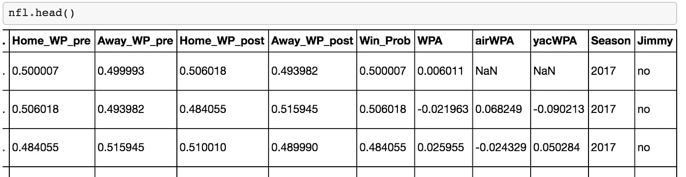

我们可以从 2017 年的 NFL 数据中获得 49 人的特定数据，方法是对 NFL 数据进行子集化，使主队或客场队为 SF 49 人。

```
niners = nfl[ (nfl["HomeTeam"] == 'SF') | (nfl["AwayTeam"] == 'SF') ]
```

接下来，我们可以看看达阵得分。为了检查触地得分信息，我们可以检查主队或客队是 SF，发生了得分比赛，发生了触地得分，进攻的球队是 SF，并且没有拦截者，拦截者是拦截球的球员。

```
niners_td = nfl[((nfl["HomeTeam"] == 'SF') | (nfl["AwayTeam"] == 'SF')) & (nfl["sp"] == 1) & (nfl["Touchdown"] == 1) & (nfl["DefensiveTeam"] != 'SF') & pd.isnull(nfl["Interceptor"]) ]
```

本赛季我们有 31 次触地得分。

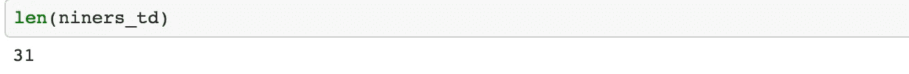

现在，我们可以通过对数据帧进行分组来检查在没有吉米和有他的情况下有多少次触地得分。

```
niners_td.groupby('Jimmy').Touchdown.sum()
```

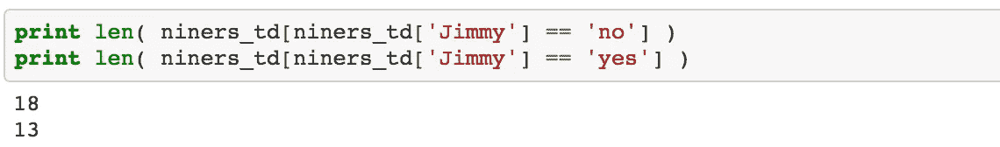

# 吉米·加洛波洛出场和不出场都是达阵

现在让我们来绘制吉米开始和没有开始比赛时的达阵次数。

```
tds = niners_td.groupby('Jimmy').Touchdown.sum() *# score the touchdown information in tds*

fig, ax = plt.subplots(figsize=(8, 6), dpi = 72) *# Get access to the figure and axes to modify their attributes later*

ax.set_title("Total Number of Touchdowns", fontsize = 18) *# Chart title*
ax.set_xlabel('Jimmy', fontsize = 15) *# X-axis label*
ax.set_ylabel('Number of Touchdowns', fontsize = 15) *# Y-axis label*
plt.xticks(fontsize = 13)
plt.yticks(fontsize = 13)

mycolors = ['#A6192E', '#85714D'] *# Using scarlet and gold colors*

tds.plot(kind='bar', alpha = 0.9, rot=0, color = mycolors) *# Plot a Bar chart*
plt.show()
```

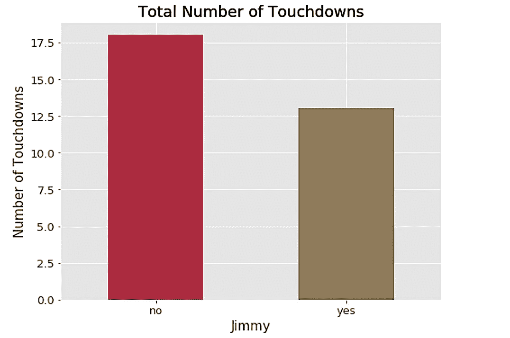

虽然这个图很好，但我们也应该检查一下每场比赛的达阵次数，因为吉米只打了 5 场比赛。

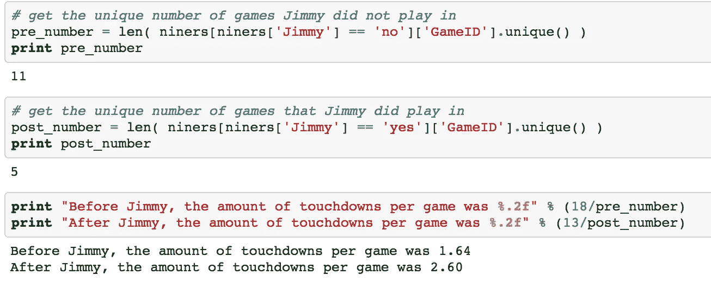

我们可以看到，当吉米·加罗波洛开始时，49 人队每场比赛大约多得分 1 次。这并不意味着他要对他打球时的每一次触地得分负责，但这只是显示了他打球时触地得分的次数。

# 随着时间的推移，触地得分和拦截

为了从不同的角度来看触地得分的情况，我们可以采用时间序列的方法来观察一段时间内触地得分和拦截的次数。我们可以标记出 Garoppolo 开始游戏的时间点，看看我们可以观察到什么变化。

```
*# get sum of touchdowns by game day*
td_by_date = niners.groupby('Date')['Touchdown'].sum()
td_by_date;*# get sum of interceptions by game day*
inter_by_date = niners.groupby('Date')['InterceptionThrown'].sum()
inter_by_date;
```

现在让我们把它画出来。

```
fig, ax = plt.subplots(figsize=(8, 6), dpi = 80) *# set plot size* 

mycolors = ['#A6192E', '#85714D'] *# Using scarlet and gold colors*

f1 = td_by_date.plot(color = mycolors[0]) *# plot the touchdowns*
f2 = inter_by_date.plot(color = mycolors[1]) *# plot the interceptions*

ax.set_title("Touchdowns and Interceptions over Time", fontsize = 18) *# Chart title*
ax.set_xlabel('Game Date', fontsize = 15) *# X-axis label*
ax.set_ylabel('Count', fontsize = 15) *# Y-axis label*
plt.xticks(fontsize = 12)
plt.yticks(fontsize = 12)

plt.axvline(dt.datetime(2017, 12, 3), color = 'black') *# add a vertical line*
plt.legend(loc='upper center', frameon=True, facecolor="white") *# add a legend with a white background*

plt.show()
```

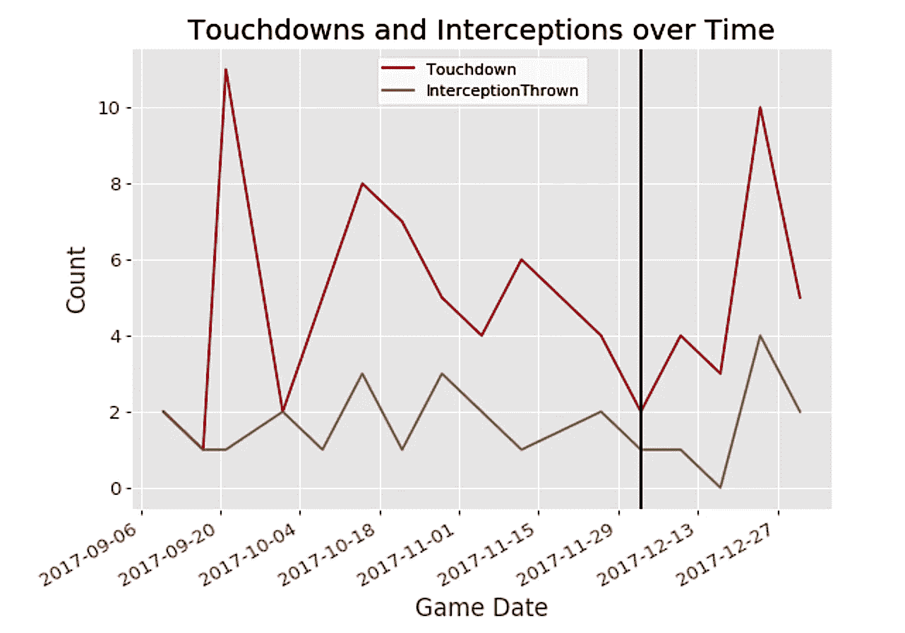

黑色竖线右边的线是吉米开始的游戏。我们注意到，在他开始为 49 人队比赛之前，他们在触地得分方面处于下降趋势，在他开始后，他们的进攻开始再次起飞。

# 不同游戏类型的比较

我们还可以比较加罗波洛没有首发和首发时不同类型的打法。这可以给我们一个总体的感觉，当他开始比赛时，某些比赛的流行程度如何改变，而当他没有开始比赛时，因为比赛的类型可以随着不同的四分卫而改变。为了比较不同的打法类型，我们使用 niners 数据框架，而不是上面定义的 niners_td 数据框架，因为我们关心的是比赛中的整体打法，而不仅仅是 49 人队进攻时的打法。

```
fig, ax = plt.subplots(2, 1, figsize=(10, 8), dpi = 85) *# specify a plot with 2 rows and 1 column*

*# get plays where Jimmy did not start and did start*
f1 = niners[niners['Jimmy']=='no']['PlayType'].value_counts().plot(kind='barh', ax=ax[0]) 
f2 = niners[niners['Jimmy']=='yes']['PlayType'].value_counts().plot(kind='barh', ax=ax[1])

f1.set(title = "Before Jimmy's Starts", xlabel='Count', ylabel='Play Type')
f2.set(title = "After Jimmy's Starts", xlabel='Count', ylabel='Play Type')f1.set_xlim(0,805) # use the same scale for both plots
f2.set_xlim(0,805)fig.tight_layout() *# prevent overlapping axis labels*

plt.show()
```

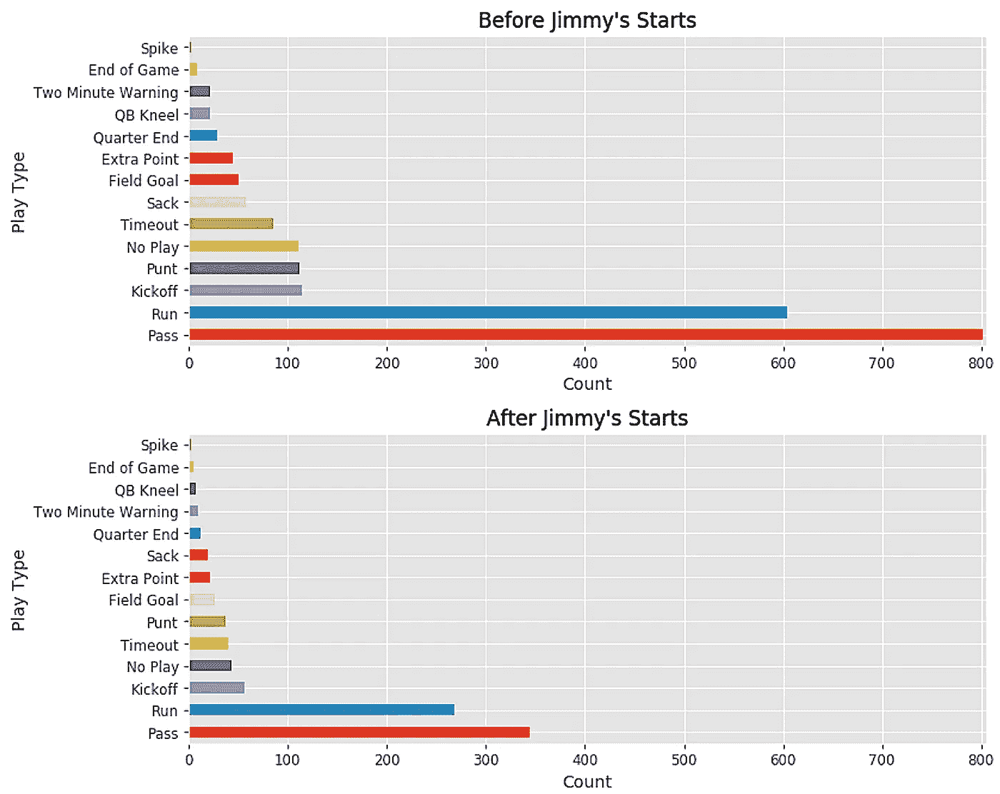

当然，比赛的数量不同，因此比赛的次数也不同，但是如果我们使用两个图中的颜色来匹配哪种比赛最频繁，我们会看到在两个图中，最常见的比赛是传球、跑动和开球，但是我们注意到，在吉米开始之前，打门更常见，而在吉米开始之后，射门更常见。这可能表明，吉米的发挥可以帮助 49 人队更接近得分位置，并有机会获得更多的投篮机会。

# 最后，让我们更深入地研究一下 49 人队的进攻数据。

让我们来看看 49 人队进攻时获得的码数排名靠前的比赛。像以前一样，我们将子集化我们的数据，以获得 49 人队进攻时的数据。

```
niners_offense = nfl[((nfl["HomeTeam"] == 'SF') | (nfl["AwayTeam"] == 'SF')) & (nfl["DefensiveTeam"] != 'SF') ]
```

我们可以创建一个名为 most_yards 的新数据框架，它采用了 49 人队进攻获得最多码数的 50 次观察。

```
most_yards = niners_offense.sort_values(by='Yards.Gained', ascending=False)[:50]
```

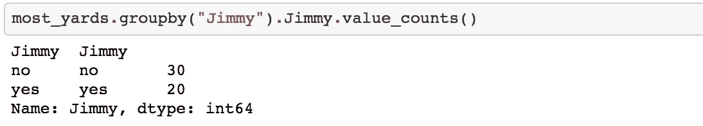

我们可以看到，这 50 个按码数计算的顶级游戏中有 20 个发生在 Jimmy 开始时，但是由于出现的次数不同，我们将查看整体值，而不是像以前一样将图分开，因为这些不同的观察结果会导致条形图中条形数的变化。

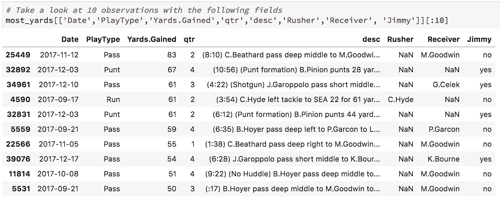

我们注意到马奎斯·古德温是上个赛季获得最多码数的接球手。

```
passes = most_yards[most_yards["PlayType"] == 'Pass']fig, ax = plt.subplots(figsize=(8, 6), dpi = 75)

f1 = passes['Receiver'].value_counts().plot(kind='barh')
f1.set(title = "Players with the most Yards after receiving Passes", xlabel='Count', ylabel='Player Name')

plt.show()
```

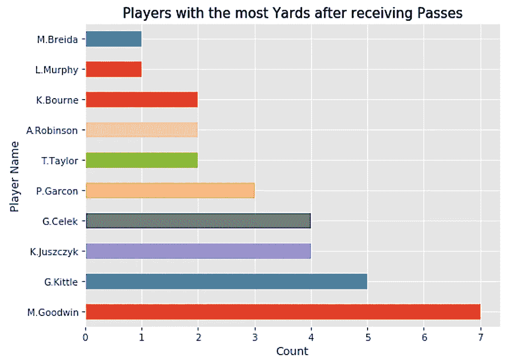

我们可以看到马特·布雷达和卡洛斯·海德是上赛季最成功的跑垒者之一。

```
runs = most_yards[most_yards['PlayType'] == 'Run']fig, ax = plt.subplots(figsize=(6, 5), dpi = 75)

f1 = runs['Rusher'].value_counts().plot(kind='barh')
f1.set(title = "Players with the most Yards from Rushing", xlabel='Count', ylabel='Player Name')

plt.show()
```

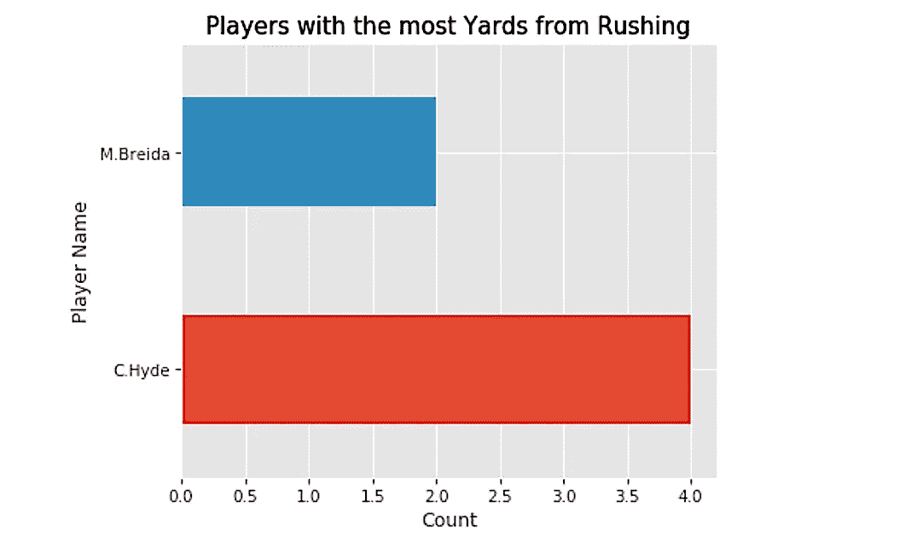

## 结论

我希望您喜欢这篇使用 NFL 数据的 Python 数据分析指南。现在你可以去下载 NFL 的数据，用不同的信息进行试验，看看你会发现什么有趣的东西！

感谢您花时间阅读这篇文章，并随时在 LinkedIn 上发表评论或联系。

参考资料:

1.  [熊猫数据框文档](https://pandas.pydata.org/pandas-docs/stable/generated/pandas.DataFrame.html)
2.  [熊猫剧情文档](https://pandas.pydata.org/pandas-docs/stable/generated/pandas.DataFrame.plot.html)
3.  [Matplotlib 文档](https://matplotlib.org/tutorials/introductory/sample_plots.html#sphx-glr-tutorials-introductory-sample-plots-py)
4.  [NFL 刮刀](https://github.com/maksimhorowitz/nflscrapR)
5.  [个人 Github 知识库与本代码笔记本](https://github.com/k7p/nfl_analysis/blob/master/NFL%20Analysis.ipynb)