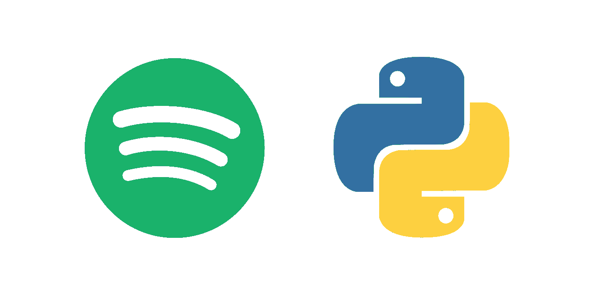
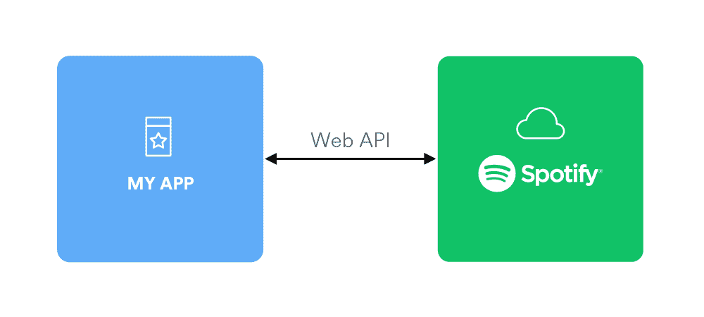
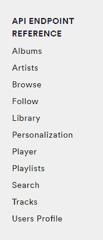
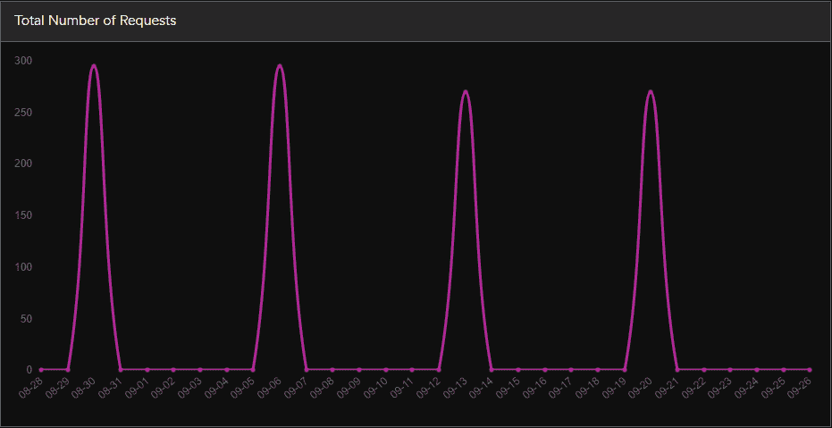
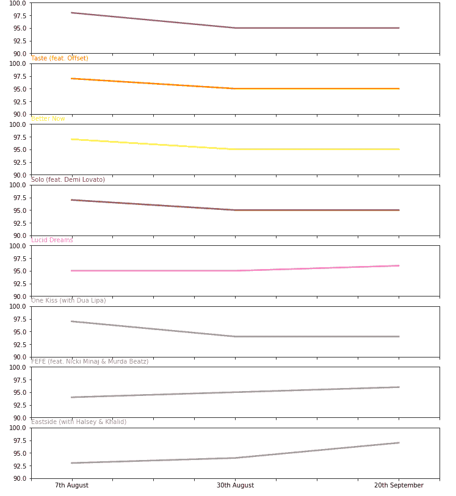

# Spotify 数据项目第 1 部分——从数据检索到第一视角

> 原文：<https://towardsdatascience.com/spotify-data-project-part-1-from-data-retrieval-to-first-insights-f5f819f8e1c3?source=collection_archive---------13----------------------->



到目前为止，2018 年对我们这些数据书呆子来说是很棒的一年。有很多很好的选择来获得有趣的数据，例如最大的数据科学社区 Kaggle，拥有超过 10，000 个来自各种行业的已发布数据集。或者，谷歌(碰巧也拥有 Kaggle)新推出的[数据集搜索工具](https://toolbox.google.com/datasetsearch)，让寻找数据集来练习数据肌肉变得像安装 Pandas(或任何其他数据科学库)一样简单。

如果你愿意尝试一些好的数据，你可以选择 API。Twitter、Slack 和谷歌等科技公司(又来了！)提供 API，以便其他人可以在这些 API 的基础上构建应用程序。没有什么可以阻止你使用它们来提取数据和进行数据分析。

在这一系列文章中，我将描述我如何利用 [Spotify Web API](https://developer.spotify.com/documentation/web-api/) 自动检索数据(主要是本文的主题)，以及如何使用 Python、SQL 和 Bash 等数据科学工具从数据中获得洞察力(将在后续文章中讨论)。

**注意:**如果你只对编码感兴趣，请随意跳到本文末尾，在那里你会找到所有用于这个项目的笔记本、工具和参考资料。

# 资料检索

为了访问 Spotify 的平台，你需要在 developer.spotify.com[创建一个账户。之后，您可以直接进入](https://developer.spotify.com/) [Spotify Web API 控制台](https://developer.spotify.com/console/)，通过一个易于使用的界面开始探索不同的 API 端点，而完全不需要任何 Jupyter 笔记本！

本质上，API 基于请求/响应工作。你问 API 关于 2010 年至 2012 年黄金岁月的歌曲，API 的回答是我们这一代的一些最佳歌曲，如 [this gem](https://www.youtube.com/watch?v=APUxJ8f7PXY) 。然而，由于与 API 的通信是以机器可读的格式(如 JSON)完成的，所以您将希望使用编程语言来完成这一任务。也就是说，如果你想利用 Spotify 目录中的数百万行音乐数据。



因为我使用的是 Python，所以有一个非常好的库叫做 [Spotipy](https://spotipy.readthedocs.io/) ，这使得访问 Spotify API 的过程变得更加容易。

一旦你安装了 Spotipy，下面的代码足以让它启动并运行(使用你自己的 cid 和来自你的 Spotify 开发者帐户的密码):

```
import spotipy from spotipy.oauth2 import SpotifyClientCredentials cid ="xx" secret = "xx" 
client_credentials_manager = SpotifyClientCredentials(client_id=cid, client_secret=secret) 
sp = spotipy.Spotify(client_credentials_manager=client_credentials_manager)
```

现在您可以开始实际的数据检索了。通过观察 Spotify API 的不同端点，你可能会问自己:我应该获取什么数据？



这是你需要开始挖掘并找出你感兴趣的东西的地方。在这个例子中，我只使用了 50 多个可用端点中的 2 个。您可能会发现其他一些端点对您的分析也很有用。

我知道我想处理跟踪数据。这就是为什么我使用了[搜索端点](https://developer.spotify.com/documentation/web-api/reference/search/search/)(而不是[获得几个轨道端点](https://developer.spotify.com/documentation/web-api/reference/tracks/get-several-tracks/)，因为它需要提供轨道 id，而我没有)。

搜索端点很容易使用，因为只需要两个参数:q 和 type。第一个可以是任何关键词，如“roadhouse blues”或“2018”。类型可以是专辑、艺术家、播放列表或曲目。

这个端点也有一些限制:

*   限制:每个查询最多可以返回 50 个结果
*   offset:这是要返回的第一个结果的索引，所以如果您想获得索引为 50–100 的结果，您需要将 offset 设置为 50 等。

此外，最大偏移量被限制为 10.000，这意味着您无法获得比单次搜索更多的结果。**趣闻:**我第一次做数据检索的时候(2018 年 4 月底)最大偏移量是 100.000。希望我不是他们决定砍掉它的原因:)

为了解决这些限制，我使用了一个嵌套的 for 循环，在这个循环中，我在外部循环中将偏移量增加了 50，直到达到最大偏移量。在将返回的结果追加到列表中时，内部 for 循环执行实际的查询。

```
for i in range(0,10000,50): 
  track_results = sp.search(q='year:2018', type='track',       limit=50,offset=i) 
    for i, t in enumerate(track_results['tracks']['items']):   artist_name.append(t['artists'][0]['name']) track_name.append(t['name']) track_id.append(t['id']) popularity.append(t['popularity'])
```

在我将数据加载到 pandas 数据框架中之后，我得到了以下结果:

```
artist_name	popularity	track_id	track_name 0	Drake 100	2G7V7zsVDxg1yRsu7Ew9RJ	In My Feelings 1	XXXTENTACION	97	3ee8Jmje8o58CHK66QrVC2	SAD! 2	
Tyga 96	5IaHrVsrferBYDm0bDyABy	Taste (feat. Offset) 3	
Cardi B 97	58q2HKrzhC3ozto2nDdN4z	I Like It 4	
XXXTENTACION	95	0JP9xo3adEtGSdUEISiszL	Moonlight
```

这已经足够了，正如我将在本文的第二部分展示的那样，届时我将更深入地挖掘 Spotify 提供的“流行”功能。由于我也想做一些更高级的分析(提示:机器学习)，我还包括了由 [get 几个音频特征端点](https://developer.spotify.com/documentation/web-api/reference/tracks/get-several-audio-features/)提供的数据。

此端点仅要求提供轨道 id。这不成问题，因为我在之前的查询中有 10.000 个音轨 id。

这里的限制是每个查询最多可以提交 100 个曲目 id。

同样，我使用了嵌套的 for 循环。这一次，外部循环以 100 为一批提取跟踪 id，内部 for 循环执行查询并将结果追加到 rows 列表中。

此外，当音轨 ID 没有返回任何音频特征(即没有返回任何音频特征)时，我必须执行检查，因为这会导致问题:

```
for i in range(0,len(df_tracks['track_id']),batchsize): 
 batch = df_tracks['track_id'][i:i+batchsize] 
 feature_results = sp.audio_features(batch) 
  for i, t in enumerate(feature_results): 
   if t == None: 
    None_counter = None_counter + 1 
   else: rows.append(t)
```

作为回报，我为我的歌曲获得了一系列的音频特征，比如舞蹈性、音量、声音等等。然而，这些特性将是本系列的下一篇文章的一部分。

在使用流行特性进行数据分析之前，我想向您展示我如何在 Linux 终端(命令行/ Bash)上设置 cron 作业，以便在我睡觉时自动进行数据检索！

这非常简单:您只需要您的 Python 文件(如果您使用的是 Jupyter 笔记本，您可以将其下载为. py 文件),然后创建一个 Bash 脚本(。sh 文件)，它将在 Python 中运行该文件:

```
#!/usr/bin/env bash python3 /home/user/SpotifyDataScript.py
```

最后，您打开 crontab 编辑器，在所需的时间和日期设置 cron 作业，如下所示:

```
30 00 * * 4 /home/user/Spotify.sh
```

瞧！你不用再担心了，数据现在会被自动检索。正如您从 Spotify 开发者仪表盘上截取的截图中所看到的，现在每周都会从 API 中自动提取数据。



如果你想了解更多关于 Bash 脚本和 cron 作业的信息，我推荐 data36 的这个系列文章以及[这个快速参考指南](http://www.adminschoice.com/crontab-quick-reference)。

**注意:**尽管这对我来说已经很好了，我还是建议在设置 API 调用的自动化时要小心。通过使用更长的时间间隔来触发数据，例如每周一次甚至每月一次，尽量减少对提供方的影响。

# 数据探索:流行特征

正如所承诺的，我现在将使用检索到的数据从中获得一些见解。在本文中，我将重点介绍流行功能，根据 Spotify 官方文档[的说法](https://developer.spotify.com/documentation/web-api/reference/search/search/)它的意思是:

> *“流行曲目。该值介于 0(最不受欢迎)和 100(最受欢迎)之间。曲目的受欢迎程度是一个介于 0 和 100 之间的值，100 是最受欢迎的。受欢迎程度主要基于播放的总次数。诸如单曲和专辑中的重复曲目的流行度评级是不同的。注意:该值不会实时更新，因此可能会落后于实际受欢迎程度。”*

尽管 Spotify 对这一功能并不太精确，但这对于数据分析来说应该足够了。理想情况下，应该有另一个功能，如每个轨道的流数量，然而，Spotify 目前没有通过他们的 API 分享这些信息。

关于人气特性，需要了解的一件重要事情也在 2013 年一位名叫 Sascha 的用户发布的[SO 帖子中进行了解释:](https://stackoverflow.com/a/19849105/8848786)

> *“Spotify 的受欢迎程度的确是基于流媒体的数量，但它不是基于总播放量，而是基于一个很短的时间段。这就是为什么你会经常在艺人简介上看到一个更受欢迎的数字排在第一位，而播放次数却比第二位少。*
> 
> *我们已经使用 API 数作为我们流流行度的百分比，让人们了解他们的曲目当前的流行度。所以请记住，这个数字可以增加，但也很容易减少。”*

所以基本上，它代表了某首歌在某个时刻的受欢迎程度。这也解释了为什么它会随着时间的推移而变化，我可以从我每周的数据检索中注意到这一点。

由于我在 2018 年 8 月开始定期收集数据，我决定将以下 3 个数据检索纳入我的分析:

*   2018 年 8 月 7 日
*   2018 年 8 月 30 日
*   2018 年 9 月 20 日

由于 Spotify 提到的流行度计算的所谓延迟，这应该很好地涵盖了 7 月、8 月和 9 月，这样我就可以将我的分析作为“2018 年**夏季最受欢迎的歌曲”**。

为此，我将 3 个 CSV 文件加载到 Pandas 数据帧中，并将它们合并成一个数据帧。通过使用外部连接作为合并方法，保留了各自的流行性:

```
# loop over dataframes and merge into one dataframe 
# outer join in order to keep the popularity column from each file
for df_, files in zip(df_from_each_file, all_files): 
# all_files are here to provide the column suffix (0920,0830 etc) 
df = df.merge(df_, how='outer', on=merge_columns, suffixes=('',str(files)[-8:-4])
```

这已经是该分析的整个数据准备阶段中最棘手的部分。在那之后，我计算了一个总体受欢迎分数以及一个平均受欢迎分数。

按总体受欢迎程度分数排序的新数据框架如下所示:

```
artist_name	track_name	popularity	popularity_mean 3	Drake In My Feelings	300.0 100.000000 4	
XXXTENTACION	SAD! 288.0 96.000000 12	
Cardi B I Like It	288.0 96.000000 6	
Tyga Taste (feat. Offset)	287.0	95.666667 10	
Post Malone	Better Now	287.0 95.666667
```

当谈到 2018 年夏季热播时，似乎没有什么能比得上德雷克的《在我的感觉中》。

按艺术家对数据帧进行分组揭示了一些更有趣的见解，例如前 100 名中每个艺术家的曲目数量:

```
track_name artist_name 
Drake 5 
XXXTENTACION	5 
Travis Scott	5 
Post Malone	5 
Juice WRLD	3
```

每一个好的数据分析也应该有一些可视化。在这个例子中，我可视化了前 10 首歌曲在测量期间的个人受欢迎程度得分。这是可视化的一部分(查看文章末尾的笔记本文件以获得完整视图):



今天就到这里吧！检索并分析了大量数据，以了解 2018 年夏天最受欢迎的歌曲和艺术家。

在下一篇文章中，我将深入挖掘音频特征数据，并尝试不同的聚类算法。如果你对此感兴趣，请务必在 Twitter ( [@tgel0](https://twitter.com/tgel0) )上关注我，因为我会首先在那里发布新闻。如果你想和我打招呼或什么的，这也是联系我的最好方式(我很乐意)。

正如承诺的那样，以下是链接:

*   数据检索笔记本放在 [github](https://github.com/tgel0/spotify-data/blob/master/notebooks/SpotifyDataRetrieval.ipynb) 上或者作为 [nbviewer 渲染](http://nbviewer.jupyter.org/github/tgel0/spotify-data/blob/master/notebooks/SpotifyDataRetrieval.ipynb)
*   在 [github](https://github.com/tgel0/spotify-data/blob/master/notebooks/SpotifyDataExploPopularity.ipynb) 上的数据探索笔记本或作为 [nbviewer 渲染](http://nbviewer.jupyter.org/github/tgel0/spotify-data/blob/master/notebooks/SpotifyDataExploPopularity.ipynb)
*   非常感谢 Spotify 的 Web API，也感谢 Spotify 的创造者让我的生活变得更简单
*   最后但同样重要的是，如果没有 Python 库 [Pandas](http://pandas.pydata.org/) 、 [Numpy](http://www.numpy.org/) 、 [Matplotlib](https://matplotlib.org/) 以及构建和维护它们的出色人员，这是不可能的
*   如果你喜欢听音乐，而不仅仅是阅读，我已经根据这一分析创建了一个 [Spotify 播放列表](https://open.spotify.com/user/gelotomi/playlist/2bhPeVZnd8llTJt24LjMnE?si=D5oQX3BORIGgB-VsBdcZyg)

*原载于 2018 年 9 月 27 日*[*tgel 0 . github . io*](https://tgel0.github.io/blog/spotify-data-project-part-1-from-data-retrieval-to-first-insights/)*。*