# Spotify 重新包装

> 原文：<https://towardsdatascience.com/spotify-rewrapped-e2a7cc94fb4e?source=collection_archive---------6----------------------->

## Spotify 每年 12 月都会以酷炫的年终特价带给我们惊喜。然而，今年的一些报道让人感到可疑。这个不起眼的中等账户决定进行调查。


Photoshop skills: level 9000

每年我都期待 Spotify 的总结。2016 年是歌曲、艺术家和流派的前五名。花在听音乐上的时间，不同歌曲的数量，以及关于一周中你最喜欢哪一天听音乐的非常酷的见解。此外，你的热门歌曲播放列表。2017 年还带来了分钟数、热门歌曲播放列表和一个很酷的另一个播放列表，名为“The ones that away ”,可能是过去一年很酷的推荐。
今年带来了 [Spotify Wrapped](https://spotifywrapped.com/) ，它告诉你许多统计数据(我们将分析)和两个播放列表:Top 100 和 Tastebreakers。我需要承认，我爱上了前卫的❤.它们应该让你在新的一年里听到 Spotify 惊人的推荐算法为你量身定制的新内容。

尽管这一次并不是一切都那么美好。 [Spotify Wrapped 在 12 月](https://www.reddit.com/r/spotify/comments/a37thx/spotify_2018_wrapped/)和[前几天被泄露，并不是每个用户都对提供的见解感到高兴](https://www.reddit.com/r/spotify/comments/a37thx/spotify_2018_wrapped/eb4m5j5/)。只要在 Reddit 的 r/spotify 中快速浏览一下，就足以意识到前 5 名艺术家或前 5 名歌曲中的大多数都很奇怪。尤其是我的，看起来很奇怪；就好像我最后的几个月根本不算在内。


Charly and his famous bi-color moustache

像每一个音乐和数据极客一样，我用 [Last.fm](https://www.last.fm/user/alexing10) 记录(并不断咨询和控制)我的听力故事。所以，我知道我的数据不准确。**10 月份和 11 月份的大部分时间，我都在不停地听 Charly García 的音乐，尤其是他的一个乐队项目:Serú Girán**

**有点跑题**:这两个名字都是阿根廷摇滚的精华部分，是阿根廷摇滚的精华。自 1967 年以来，Charly 一直在从事不同的优秀项目，他仍然非常活跃。在 1978 年至 1982 年期间，以及在 1992 年持续一年的短暂复出期间，Serú Girán 是他的主要乐队。信不信由你，他们被认为是“阿根廷披头士”。

Judge by yourself 💥💥💥💥

我也一直想用 Python 的熊猫库研究一点**时间序列操作和可视化，所以这看起来是一个很好的借口。**

# 技术

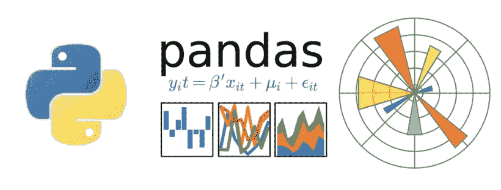

和我的大多数数据项目一样，我的主要盟友是[**Python 3**](https://www.python.org/download/releases/3.0/)**[**熊猫**](https://pandas.pydata.org/) **和**[**matplotlib**](https://matplotlib.org/)**。**我还与 [Seaborn](https://seaborn.pydata.org/) 、 [Spotipy](https://github.com/plamere/spotipy) 合作，为 [Spotify Web API](https://developer.spotify.com/documentation/web-api/) 做 Python 包装，并与 [Pylast](https://github.com/pylast/pylast) 合作，为 [Last.fm API](https://www.last.fm/api) 做 Python 包装。就环境而言，我只使用了 Jupyter 笔记本电脑和版本化我的作品。可以在[我的公众 Github 账号](https://github.com/alexing/spotify_rewrapped)查看数据库创建、数据分析、数据可视化的完整代码。**

**[](https://github.com/alexing/spotify_rewrapped) [## alexing/spotify_rewrapped

### Spotify 重新包装。通过在 GitHub 上创建一个帐户，为 alexing/spotify_rewrapped 开发做出贡献。

github.com](https://github.com/alexing/spotify_rewrapped) 

这些数据是从 Last.fm 的 API 中删除的，还用 Spotify 的 API 丰富了一点。此外，根据 [GDPR 法律](https://ec.europa.eu/commission/priorities/justice-and-fundamental-rights/data-protection/2018-reform-eu-data-protection-rules_en)，我联系了 Spotify 客户支持，试图访问我的全部收听历史数据并获得更多见解。到写这篇文章的时候，我还没有收到回信。

# 数据分析

数据集由我从 1 月 1 日到 12 月中旬的收听历史组成。Spotify Wrapped 于 12 月 1 日发布，所以这一年还没有结束并不重要。

```
df.head()
```

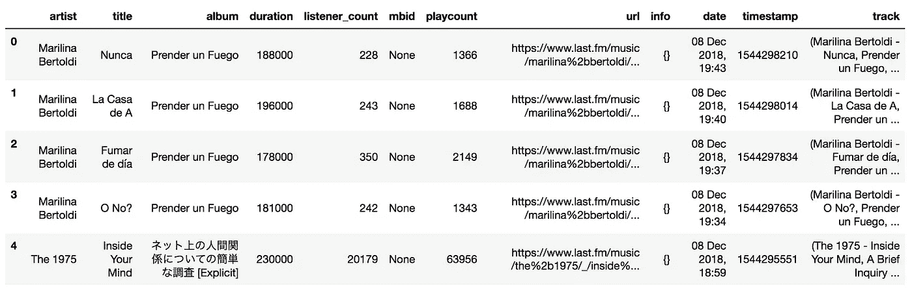

Most of this features I won’t be using, like the listener_count, mbid, playcount and url.

让我们通过逐一浏览 Spotify 的见解([至少是有趣的……](https://community.spotify.com/t5/Social-Off-Topic/Can-t-see-my-artists-zodiac-wrapped-2018/td-p/4626230))来开始分析，并决定它们是真是假。

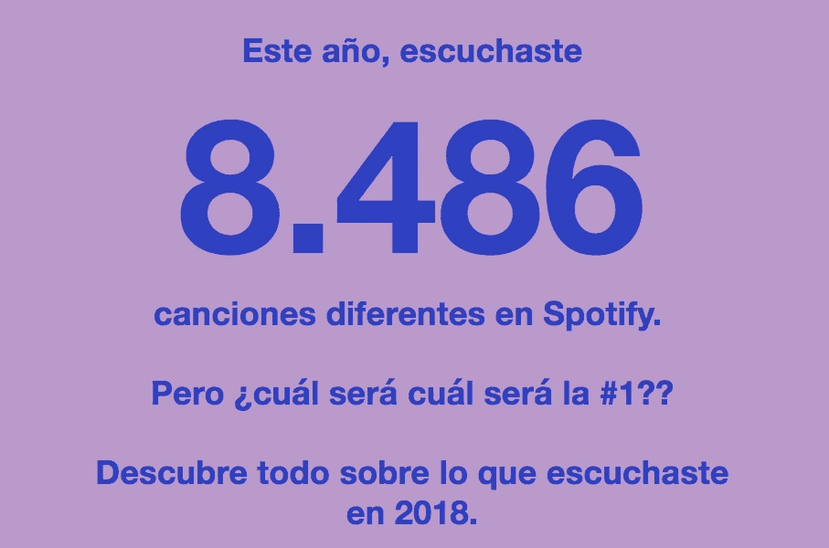

I got the email in Spanish, sorry. You probably get the main idea, though.

# 1.今年你在 Spotify 上听了 8486 首不同的歌曲。

.

嗯，这个很容易检查。只需要询问数据帧中的唯一值。

.

```
unique_songs = df[df.date < '2018-12-01'].drop_duplicates(subset=['artist', 'title', 'album']).shape[0]
unique_songs
```

**6538**

这意味着 Spotify 的数字和我的数字之间有 1948 首歌曲的差异。

## 假的！

考虑到 Wrapped 发行日期之后的歌曲没有计算在内，所以在数量上有相当大的差异。

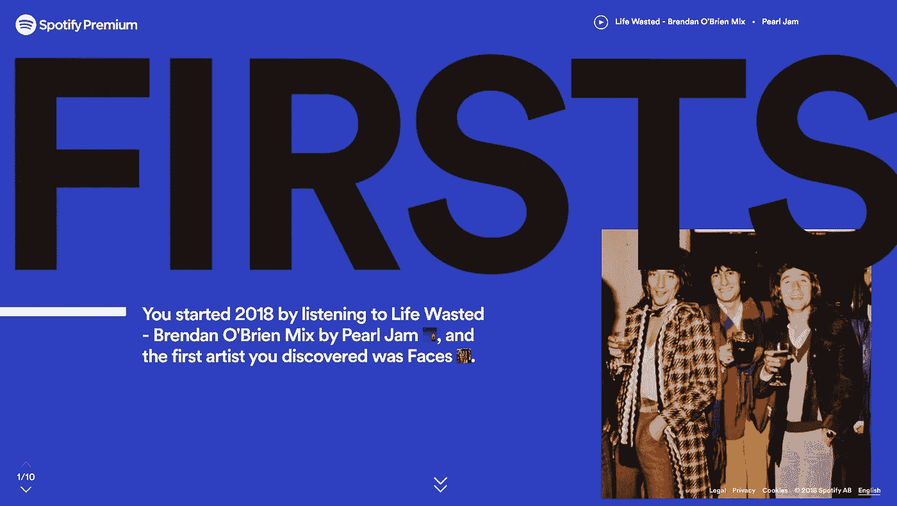

# 2.你开始了 2018 年，听了《浪费的生命》Pearl Jam 的 Brendan O' Brien Mix，你发现的第一个艺术家是 Faces。

哦，这原来是辣的，而且超级容易检查。让我们开始吃吧。

```
df.loc[df['timestamp'].idxmin()]
```

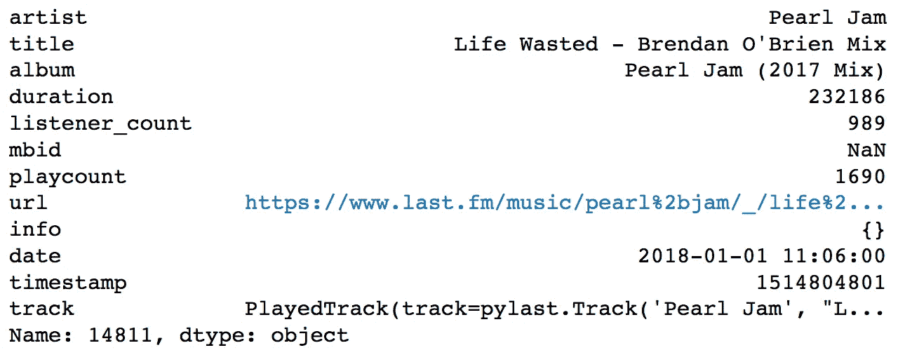

事实上，我听的第一首歌是浪费的生命(**开始 2019 年的精彩歌曲，对吗？！**)。Spotify 的第一个目标。1–1 是这场比赛的部分比分。

现在，这是灰色部分，它开始变得不那么科学严谨。我们如何衡量被发现的艺术家？我用了手头的东西，决定用[Spotify API 的功能来获取用户的顶级艺术家](https://developer.spotify.com/documentation/web-api/reference/personalization/get-users-top-artists-and-tracks/)。这可以让你每次请求获得多达 50 位艺术家，其中一个有趣的参数让你在`long_term`(根据几年的数据计算，包括所有可用的新数据)`medium_term`(大约过去 6 个月)和`short_term`(大约过去 4 周)之间进行选择。有一个偏移量参数来平衡限制，以便在列表中进一步前进，但是如果偏移量超过 50，它会返回一个异常。基本上每个学期只能接触到前 100 个。在每个术语收到的 100 位艺术家中，我创建了一个集合，这样就不会出现重复，然后如果一个新的艺术家不在这个集合中，我会认为这是一个“发现”。

```
ranges = ['short_term', 'medium_term', 'long_term']
top_artists = set()
for a_range in ranges:
    results = sp.current_user_top_artists(time_range=a_range, limit=50)
    top_artists =top_artists.union({item['name'] for item in results['items']})
    results = sp.current_user_top_artists(time_range=a_range, limit=50, offset=49)
    top_artists =top_artists.union({item['name'] for item in results['items']})
```

基本上，第一个不在片场的艺术家将是我的第一个发现

```
reverse_df = df.iloc[::-1]
for i, row in reverse_df.iterrows():
    if row['artist'] not in top_artists:
        print("Song n# %d of the year" % (len(df) - i))
        print(row['artist'])
        print("Played on %s" % str(row['date']))
        break
```

年度歌曲第 74 首
**惠特尼**
播放时间 2018–01–01 16:04:00

```
df[df[‘artist’] == ‘Faces’]
```


太神奇了。不仅我第一个发现的艺术家不是面孔，而且今年我显然从未听过他们。所以这句话是:

## **对/错**


Apparently Spotify calls me an overachiever 💪🏻

# 3.听了 58776 分钟。

.

.

这也是一件容易检查的事情。

.

```
df[df.date < '2018-12-01'].duration.astype('int').sum() / 1000 / 60
```

**26860 . 868686868626**

如果我们从 58776 分钟开始，有 281 分 13 秒的差距。如果我们计算今年(4:05)听的歌曲的平均持续时间，有 69 首歌曲的误差。

又一个热门，Spotify！这种说法是:

**假**

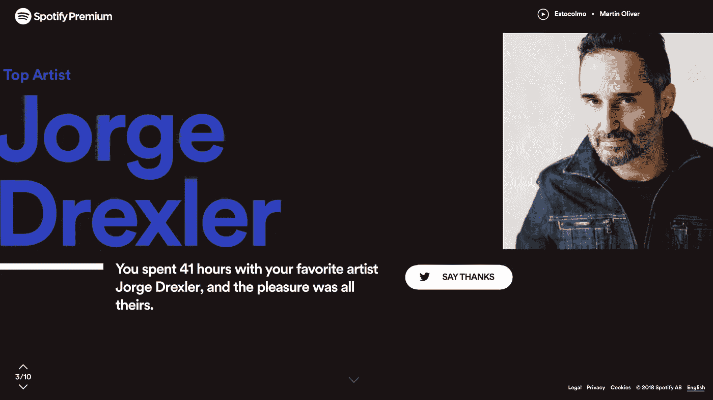

# **4。你和你最喜欢的艺术家荷西·德克勒一起度过了 41 个小时，这是他们的荣幸。**

毫无疑问，今年我最喜欢的艺术家是荷西·德克勒。

Being retwitted by your favorite artist is better than Radiohead’s In Rainbows. Word.

如果你之前浏览过这个博客，你可能知道我对他的音乐和歌词做了深入的分析，他的专辑是我那漫长时光的配乐。关于快乐是他的那部分我真的怀疑，但我知道他喜欢它。

现在让我们检查小时数。

.

```
top_listened = df[df.date < '2018-12-01'].groupby(by=['artist']).agg('sum')['duration'].sort_values(ascending=False)[:1]
top_listened = top_listened / 1000 / 60 / 60 # ms / s / m -> h
top_listened
```

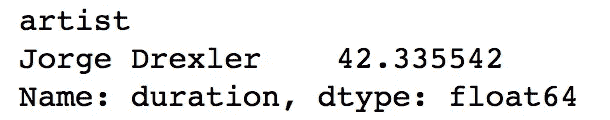

那是 42 小时 40 分钟。这意味着，如果我今年从 Drexler 那里听到的歌曲的平均值是 3:41， **Spotify 的数字相差近 22 首歌曲**。

对不起，斯波提…但这是另一个

## 错误的

Any excuse that I can get to embed a Drexler song, I’ll use.

.

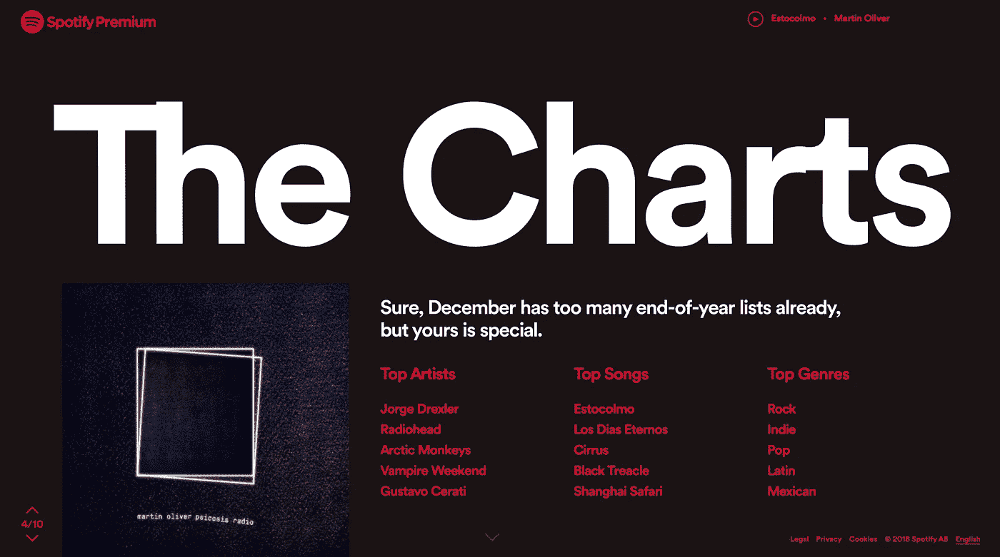

# 5.排行榜

有趣的部分来了。看着顶级艺术家的部分，我意识到一切似乎并不准确。如上所述，**查理·加西亚**和**塞鲁吉兰**都不见了。此外，在热门歌曲中，有 3 首属于马丁·奥利弗的第二张专辑，这张专辑在 4 月份发行时我非常喜欢。**Cirrus**from**Bonobo**，我在一月和二月每天都在重复收听。事实上，我知道今年我最着迷的曲目是安德森的《色彩》。帕克和**肯德里克·拉马尔**——**我的天啊多么有感染力的节拍。当然**色彩**也无处可寻。**

**我们不会进入流派，因为我真的不太相信它们。一个和另一个之间的界限变得如此模糊和武断，我有点看不到这一点。我只想说:“墨西哥人？那是什么意思？”**

# ****顶级艺人****

**Spotify 榜单如下:**荷西·德克勒、电台司令、北极猴子、吸血鬼周末、古斯塔沃·塞拉蒂**。**

```
df[df.date < '2018-12-01'].groupby(by=['artist']).agg('count')['track'].sort_values(ascending=False)[:10]
```

**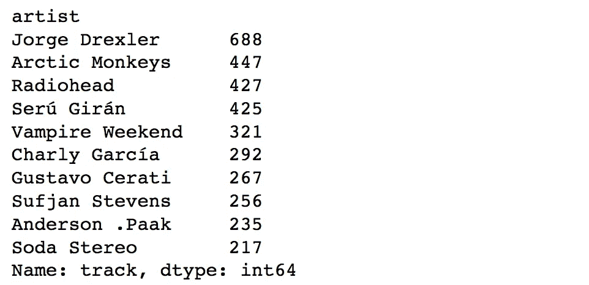**

**I knew it.**

**真的很有趣。**北极猴**和**电台司令**倒相差 20 首(可以接受，也许？).塞鲁吉兰和查理·加西亚怎么样了？！**

**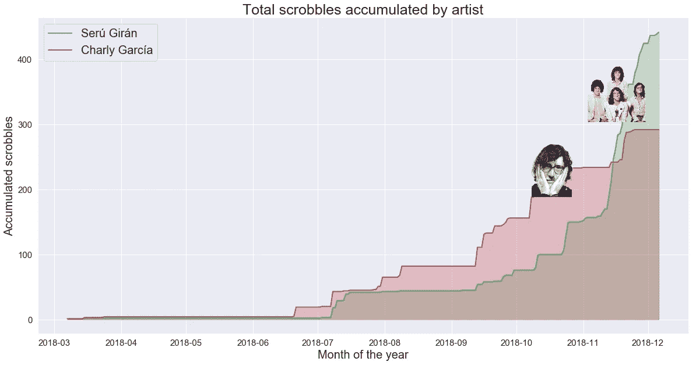**

**首先， **scrobble 是 Last.fm 发明的一个术语，用来描述你听的歌曲的日志**。一个 scrobble 每复制一首歌。**

**从图表中我们可以清楚地看到，在这一年的下半年有一个很大的增长。穿红色衣服的查理·加西亚在九月中旬大幅增加，而塞鲁吉兰则从十一月开始飙升。这与 Spotify 标记为顶级的其他艺术家相比如何？Spotify 的顶级艺术家是否会在某个时间范围内与现实相符？**

**首先，让我告诉你。**那些艺人*那个顺序*在整个 2018 年都没有发生过。**但是如果我们不顾顺序，只关心他们五个是顶级艺术家，会发生什么？**

```
The possible ranges are between 2018-06-18 and 2018-06-19
The possible ranges are between 2018-08-07 and 2018-08-08
The possible ranges are between 2018-08-16 and 2018-11-16
```

**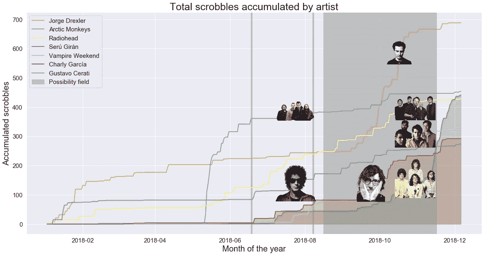**

**这就是可能性域。如果 Spotify 顶级艺术家是在 6 月 16 日、8 月 7 日或 8 月 16 日和 11 月 16 日之间的 3 个月内计算的，那么不管顺序如何，他们都是可以的。这可能没问题，我们可以假设 Spotify 是在 11 月中旬计算出这个列表的。
让我们继续追踪报道。**

```
df[df.date < '2018-12-01'].groupby(by=['title', 'artist']).agg('count')['track'].sort_values(ascending=False)[:20]
```

**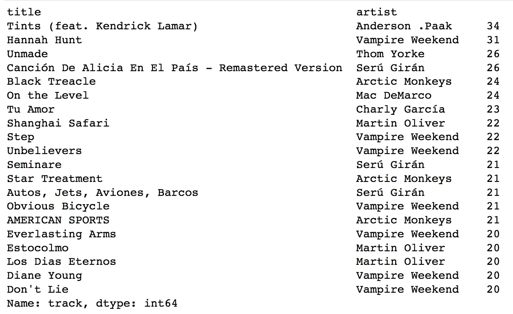**

**我就知道！ **Tints** 是我的 2018 顶级曲目。另一方面，Spotify 表示，我最喜欢的 5 首歌曲依次是: **Estocolmo** (实际上是 17 首) **Los días eternos** (18 首) **Cirrus** (不在前 20 首)**Black trecle**(5 首)和 **Shangai Safari** (8 首)。这里发生了 WTF？**

```
The possible ranges are between 2018-05-14 and 2018-05-21
```

**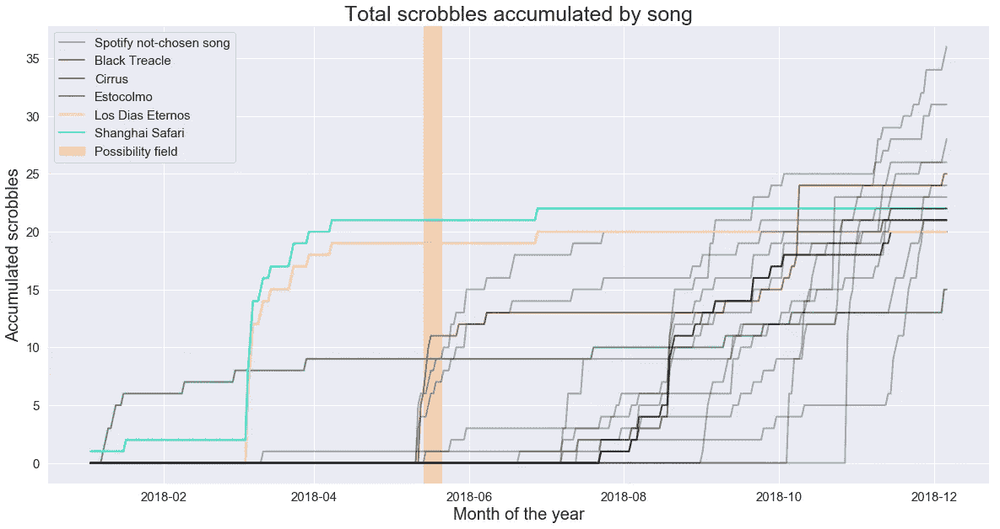**

****Estocolmo** and **Los días eternos** have exactly the same values everyday. Every time I listened to **Martin Oliver**’s album I did sequentially, so that probably explains it.**

**所有灰色线条都是我实际排名前 20 的歌曲，而不是 Spotify 的。Spotify 热门曲目出现的唯一时刻是在 5 月的一周，这是无视顺序的。**回家 Spotify，你醉了！****

## **大错误**

# ****结论****

**我并没有从中吸取太多。有些东西真的很容易看到，比如他们是如何计算出顶级艺术家的，然后**塞鲁吉兰**和**查理加西亚**可能会在我的前五名中占据重要地位。其他的东西是可以理解的，一点点的误差应该被原谅，比如我花在听荷西·德克勒和全球范围内我所有的音乐上的时间。但是有些东西基本上无法解释。
比如说**脸**怎么了？其实并不是 2018 年我没有发现他们……也是我这辈子都没有听过他们的事实。**

```
artist = pylast.Artist(“Faces”, network, username=’alexing10')
print(“Faces has %d scrobbles.” % artist.get_userplaycount())
```

***面孔没有 0 个阴囊。***

**最大的谜团是顶部的轨道。那是怎么回事？怎么会差这么远？
我猜他们认为 Spotify Wrapped 是他们需要在 12 月前快速发布的产品，为了减少资源或计算时间，他们没有使用所有用户的收听历史，而是随机抽取一些样本并从中进行计算。总而言之，我不得不说这是非常草率的。**

**我仍然希望 Spotify 会把我在 GDPR 的数据反馈给我，或许那时我们会对这个谜有更多的了解。**

**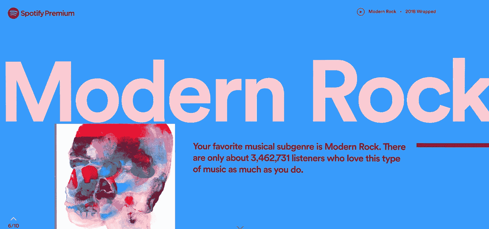**

**有些见解我决定不去核实，一方面是因为很难做到，另一方面是因为我真的不相信它们。例如，Spotify 告诉我**我最喜欢的子类别是“现代摇滚”**。那是什么？比如，有没有一年可以作为一个枢纽？1992 年以前发行的摇滚专辑都不是现代摇滚？格里塔·范·弗利特是现代摇滚吗尽管他们所有的歌听起来都无耻地像 1973 年以前的齐柏林飞艇？**

**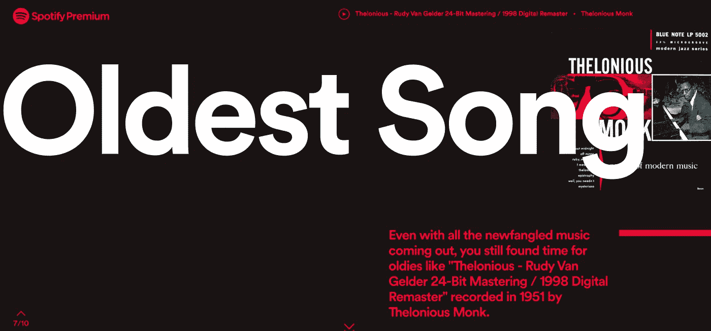**

**Why that song out of that album? It was all released in 1951.**

**Spotify 还告诉我**我听过的最老的歌是**的 T4 的录音，当然还有**塞隆尼斯·蒙克的**。我很确定他们没有得到我的剧本或者坦哥·雷恩哈特 30 年代和 40 年代的录音…或者任何古典作曲家的任何作品。肖邦的钢琴前奏曲出版于 1839 年，马尔塔·阿格里齐在 1977 年录制了它们的最终版本，Spotify 将它们收录在目录中的“翻唱”日期:2002 年。就这样…**

**明年的想法:与其花时间检查你听得最多的黄道星座(说真的，这他妈的是什么？);他们可以检查每个人的最佳专辑。那可能是个更好的主意。**

**再次，你可以在[我的公众 github 账号](https://github.com/alexing/spotify_rewrapped)查看数据库创建、数据分析、数据可视化的完整代码。**

**[](https://github.com/alexing/spotify_rewrapped) [## alexing/spotify_rewrapped

### Spotify 重新包装。通过在 GitHub 上创建一个帐户，为 alexing/spotify_rewrapped 开发做出贡献。

github.com](https://github.com/alexing/spotify_rewrapped) 

# 附赠曲目

这是我 2018 年的顶级专辑:

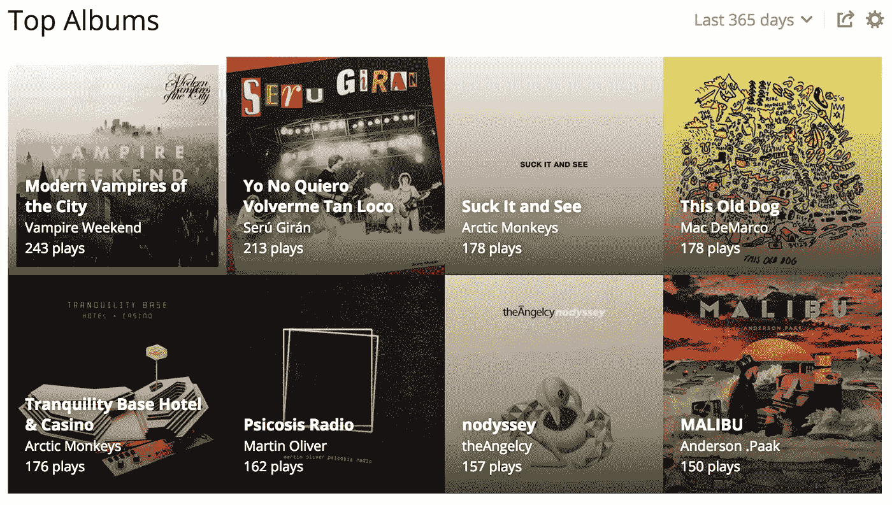

You can check the full list [here](https://www.last.fm/user/alexing10/library/albums?from=2018-01-01&to=2018-12-31)

而且，虽然远不准确，但这是我的 Spotify 2018 年前 100 名播放列表。我非常喜欢它。

非常感谢，新年快乐！****