# 使用电子商务监控解决方案通过双样本假设检验发现转换率下降

> 原文：<https://towardsdatascience.com/spotting-conversion-rate-drop-with-two-sample-hypothesis-testing-using-e-commerce-monitoring-24542ada6122?source=collection_archive---------4----------------------->

# **简介**

假设您有一个在线商店，您的客户必须完成一系列常见的步骤才能买东西:访问->添加到购物车->结帐->购买。假设一些客户在某个步骤卡住了，没有通过漏斗。假设你想知道这是不是因为一些技术问题。如果是，那么某个技术问题会在多大程度上影响您的收入变化？

前一段时间，我被要求帮助一家名为 *Kuoll* 的初创公司解决这样的问题，这是一个防止网上商店损失的电子商务监控解决方案。它估计 JavaScript 和 HTTP 错误等转换阻塞造成的损失，保留收入并控制变化。该团队改变了根据整个漏斗中每一步的转化率下降来衡量收入表现损失的问题。

转换率下降问题可以表述如下。假设有一些具体的电子商务错误，这是一个在你的网站购买漏斗的某个步骤的阻碍。让我们将用户分为两类:A 类用户和 B 类用户。A 类用户是在该步骤中没有遇到该特定拦截器的在线商店购物者，B 类用户是在同一步骤中遇到该特定拦截器的购物者。 *N* —类型为 *A* ， *M* 的用户总数——其中成功通过漏斗步骤的用户数(姑且称之为*转化的*用户)。 *P* —类型 *B* ， *Q* 的用户总数——其中转化的用户数。

*问题:*有没有因为这个特定的错误/拦截器导致转化率下降？

这个问题类似于经典的 A/B 测试问题。现在很流行。毫无疑问，使用双样本假设检验的模型种类繁多。我们测试了其中一些。这里需要注意的是，我们在某一点上卡住了。小观察数就是这种情况。它包括小样本量(其中 *N* 和 *P* 不够大)和极端频率(其中比例 *M/N* 和 *Q/P* 接近零或一)。我们习惯于谈论从海量数据中获取价值。但如果我们在没有足够数据的情况下不得不下结论呢？统计学的挑战性和艰巨性在于从有限的数据中得出一般性的结论。

# **双样本假设检验解决方案**

为了更深入地研究数学，让我们记住下面的定义。

*   一个 ***假设*** 是关于一个概率模型的陈述。
*   一个 ***零假设*** *H₀* 是一个关于概率模型的特定陈述，可能会被拒绝。
*   一个 ***替代假设*** *H₁* 是一组与原假设相矛盾的假设。
*   ***统计*** 是可以从数据样本中计算出来的数值。
*   ***p 值*** 是假设零假设为真，观察到至少与实际观察到的一样极端的检验统计的概率。
*   一个***I 型错误*** 是当零假设为真时拒绝该假设。第一类错误的概率称为 ***测试的显著性*** 水平，表示为 *α* 。
*   一个 ***第二类错误*** 当其为假时不拒绝零假设。第二类错误的概率称为 *β* ，但是 *β* 的值通常取决于哪个特定的替代假设为真。
*   对于一个特定的备选假设，假设检验的 ***功效*** 为*1-β*，即拒绝一个特定的真备选假设的概率。

现在让我们考虑 *2x2* 列联表，其中一个二元变量由两行表示，另一个由两列表示:

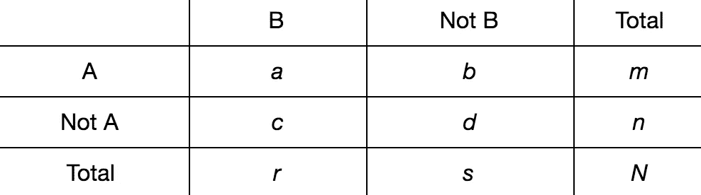

其思路是使用 ***样本比例*** *p̂₁=a/m* 和 *p̂₂=c/n* 以便比较相应的未知 ***人口比例*** *p₁* 和 *p₂* 。比较这些比例的传统策略是统计假设检验。它通常由以下步骤组成。

1.陈述了 ***null*** 和 ***的替代假设*** 。
在零情况下(在零假设下)，比例 *p₁* 和 *p₂* 之差为零，双侧检验比例为 1。在大多数文献中，在单侧检验的情况下，比例 *p₁* 和 *p₂* 的差也是零，但是一些假设“它大于(小于)零”并且比率“大于(小于)一”。我们将使用第二个变量来表示单侧检验的零假设。
在我们的案例中 *H₀* : *错误/阻断器不会导致转换下降*和 *H₁* : *错误导致转换下降*。数学上*h₀*:*p₁*≤*p₂*对*h₁*:*p₁*>*p₂*。

2.定义 ***置信区间*** 和对应的 ***显著性水平****α*(***α****)*。
如果原假设为真， *α* 为拒绝原假设的概率。

3.选择一个 ***测试统计*** 来运行您的测试/实验。
这里你应该决定比较两个比例 *p₁* 和 *p₂* 时要考虑哪个*。比较这些量的常用方法是差值和比值。另一个常见的衡量标准是优势比。*

*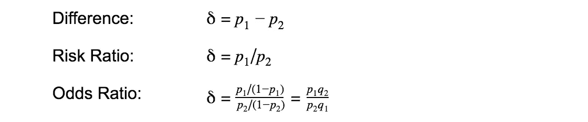*

*4.然后应计算出 ***p 值*** 。*

*5.比较 *p 值*和 alpha。
如果 *p 值*小于α，则应拒绝零假设，否则不能拒绝。*

*6.***力量*** 分析。对于大样本，各种检验的功效大致相同。然而，对于小样本来说，*功率*的差异可能相当大。*功效分析*应在用于分析数据的测试统计数据上进行。因此，您必须比较各种测试的功效，以确定使用哪种测试。本文不涉及功耗分析。我们进行了实验，但我们对测试统计数据的选择主要是由于后面将讨论的比较研究。*

*下面是一些测试和相应的测试统计数据的列表(这个例子应用于我们的数字),我们发现它们可以解决我们的问题。*

## ****两比例 Z-检验****

*无效假设和替代假设分别是:
*h₀*:*p₁*≤*p₂*对*h₁*:*p₁*>*p₂*。*

*这里 p 值是使用 z 分布得到的。让我们考虑一些(还有很多)比例的差异、比率和优势比的 z 检验。*

*1)对于足够大的样本，比例差近似正态分布。两个比例之差的 z 值由以下公式给出*

*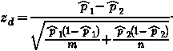*

*在给定数据的情况下， *p* 值为*

*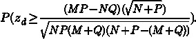*

*我们可以使用 Python 代码作为计算该值的示例:*

**

*2)对于足够大的样本，比例比的对数近似呈正态分布。用于检验比率是否等于 1:*

**

*在哪里*

**

*在带有数字 *M、N、P* 和 *Q* 的情况下， *p* 值为:*

*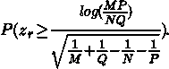*

*计算该值的 Python 代码:*

*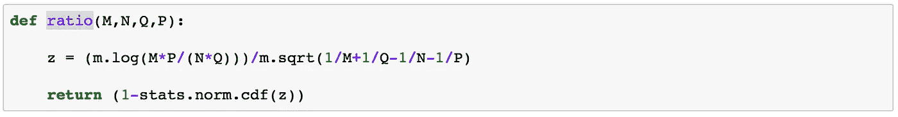*

*3)对于足够大的样本，比例比值比的对数近似呈正态分布。检验比值比是否等于 1 的检验统计量:*

*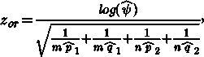*

*在哪里*

**

*在有数字 *M、N、P* 和 *Q* 的情况下， *p* 值为:*

*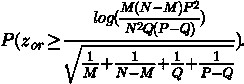*

*计算该值的 Python 代码:*

*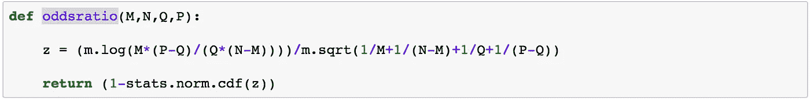*

*还有一个测试统计的修正版本，其中 z 乘以*

*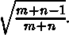*

## **两个比例之差的方差不等的双样本 t 检验**

**无效假设和替代假设分别是:
*h₀*:*p₁*≤*p₂*对*h₁*:*p₁*>*p₂*。**

**这里我们考虑 t 分布**

**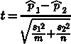**

**有自由度的**

**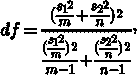**

**在我们的例子中**

**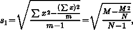****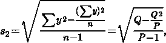**

**p 值为**

**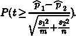**

**这种概率是使用带自由度的 1 尾 t 分布得到的**

**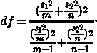**

**计算该值的 Python 代码:**

**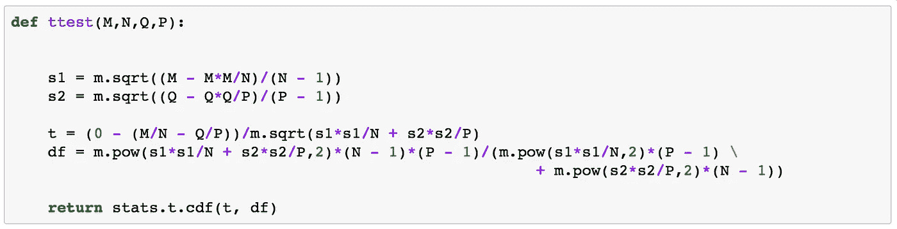**

## *****费雪精确测验(中 P 版)*****

**无效假设和替代假设分别是:
*h₀*:*p₁*≤*p₂*对*h₁*:*p₁*>*p₂*。**

**该测试使用超几何分布。Fisher 精确检验的 p 值是通过求和超几何概率来计算的。让我们考虑 2x2 表提供的给定数字:**

**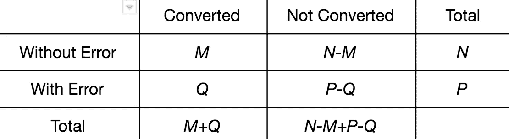**

**以下是其他表格，在“有误差的转换”的比例上有更大的差异，但边际总数相同:**

**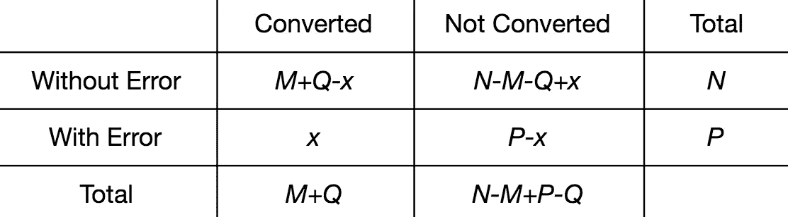**

**其中 x 介于 0 和 Q 之间。p 值是每个表的概率之和，其中只包括观察表概率的一半:**

**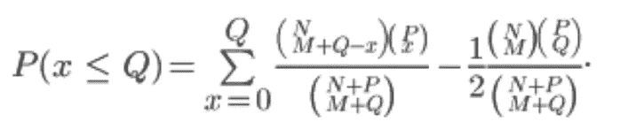**

**计算该值的 Python 代码:**

**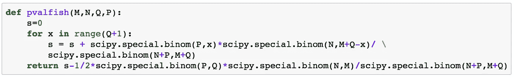**

## *****二项式检验*****

**无效假设和替代假设分别是:
*h₀*:*p₁*≤*p₂*对*h₁*:*p₁*>*p₂*。**

**在这种情况下，假设:
(1)某总体概率 *p0=M/N* (类似地，我们可以使用 *Q/P* )。
②下 *H₀* ，*x∾binomial(p,p₀)*。所以在从总体中随机抽取的 *P* 个样本中，如果有 *X* 个正面结果，那么 *p₂=X/P* 就是样本比例。
我们观察到 *Q* 的正计数，因此 *p* 的值为**

**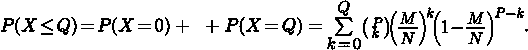**

**计算该值的 Python 代码(我们使用了 Fisher 精确测试中观察值的一半概率):**

**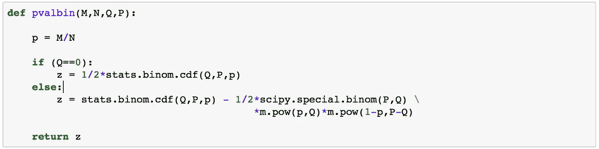**

**应该注意的是，有一些测试我们没有使用，因为它们是双面的。如果我们想知道是否有因特定阻断剂引起的*转换率变化，我们可以使用它们。这些测试是:***

## *****卡方独立性检验*****

**无效假设和替代假设是
*H₀* : *数据来自特定的离散分布*和
*H₁* : *数据来自不同的分布*。**

**该测试的测试统计数据为**

****

**其中
*Oij* —第 *i 行*和第 *j 列对应的观察计数；***

**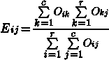**

**—对应于行 *i* 和列 *j.* 的预期计数**

**考虑到我们的 *2x2* 表，在提供测试统计数据的情况下，计算出 *p* 值**

**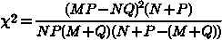**

**而且对应的是 1 个自由度的 *Chi* 平方分布。**

**计算该值的 Python 代码:**

**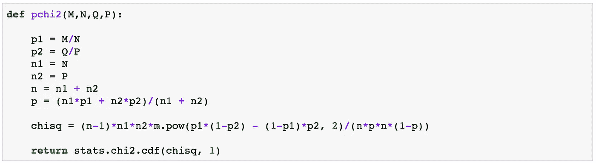**

## *****【似然比检验】*****

**无效假设和替代假设是*h₀*:*数据来自特定的离散分布*和
*H₁* : *数据来自不同的分布*。**

**这个测试是似然比测试的一个例子。在 *rxc* 表的一般情况下， *G* 测试的测试统计为**

**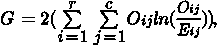**

**其中
Oij-对应于行 *i* 和列 *j 的观察计数；***

****

**—对应于行 *i* 和列 *j.* 的预期计数**

**假设零假设为真并且 *n* 足够大，该测试统计具有一个近似的*卡方分布，具有 *(r-1)(c-1)* 个自由度。
在我们的案例测试统计中:***

**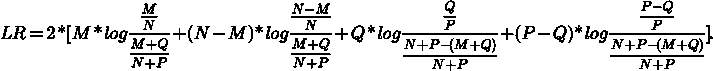**

***p*-值是在考虑 LR 具有一个自由度的近似*卡方分布的情况下得到的。***

**计算该值的 Python 代码:**

**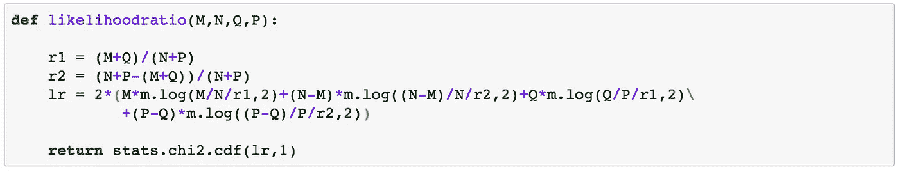**

# **讨论**

**自从 1900 年以来，一直有很多关于解决 2 x2 T1 桌子问题的争论。在这个问题上仍然没有达成共识。下面是一个简短的回顾，它引导我们找到了自己的解决方案。**

**测试假设的传统方法(用于测量差异)是对大样本使用皮尔逊卡方检验(或*z*-单侧检验情况下的比例差异检验)，对中间样本大小使用耶茨卡方检验(具有连续性校正)，对小样本使用费希尔精确检验。一些科学家已经开始质疑这个解决方案。例如，一些人认为费希尔精确检验和耶茨检验不应该使用[3]。**

**E.Pearson 推荐了他的卡方检验的一个版本，其中将表达式*(ad BC)2(n1)/mnrs*(参见原始的 *2x2* 表)与具有一个自由度的卡方分布进行比较，即与原始分布相差因子*(n1)/N*。对于大样本量，与原始版本的差异很小，但在小样本量的分析中，这种差异变得至关重要[2]。**

**当卡方检验在小样本情况下无效时的标准通常基于零假设下的最小期望细胞数，其等于(m*m*和 N*N*中的较小者)乘以(r*r*和 *s* ) */N* 中的较小者)。大多数建议是，如果最小预期数小于 5，则不应使用卡方检验。这条规则通常被认为是科克伦的。他指出，数字 5 似乎是随意选择的，当有新的证据时，这些建议可能需要修改。[2]但这反而成了一种普遍的做法。**

**当基线比例很小(接近 0)或很大(接近 1)时，比率度量通常优于差异，因为它将差异表示为百分比而不是数量。**

**在极端情况下， *2x2* 表格的某些单元格为零，需要特殊的方法。在这里，我们可以使用 Fisher 精确检验、二进制检验，或者将零改为一个小的正数，如 0.01。**

**I.Campbell (2007)在论文中提出的比较研究和论证数据提供了一组令人信服的证据，表明在分析 *2×2* 表时，就 I 型误差和功效而言(研究中考虑了双边检验)[2]:**

**(1)当所有预期数字至少为 1 时，通过'*n1*'卡方检验进行分析(K. Pearson 卡方检验，但用*n1*代替*n1*)**

**(2)否则，通过 Fisher–Irwin 检验进行分析，根据 Irwin 规则进行双边检验(根据观察结果尽可能或尽可能少地从任一尾部获取表格)。**

# **我们的解决方案**

**我们对上述测试统计数据进行了实验，在我们为客户提供的报告框架内对结果进行了比较，并决定采用 I.Campbell 的研究并对其进行修改，以进行单侧测试。**

**我们选择测试统计的规则是:**

**(1)在所有预期数*至少为 1 的情况下，我们通过'*N*-1 ' z 检验来分析比例差异
*)这里我们找到最小预期数，即
*min(M+Q，N+P-(M+Q))*min(N，P)/(N+P)* ，并将其与 1 进行比较**

**(2)否则，我们通过 Fisher–Irwin 检验(单侧检验的中间 P 版本)进行分析**

**应该提到的是，我们决定报告 *p 值*，而不是在假设检验中做出是/否的决定，因为我们希望向我们的客户展示证据的力度，而不是做出正式的决定。假设检验由以下步骤组成:**

**1.陈述无效假设和替代假设(*h₀*:*p₁*≤*p₂*对*h₁*:*p₁*>*p₂*)；**

**2.计算检验统计量(根据每种类型的观察值的样本大小，使用上述规则选择正确的检验)；**

**3.计算一个*p*-值；**

**4.解释并报告结果。**

# **进一步研究**

**我们决定将问题扩展到这样一种情况，即不是单独考虑每个阻碍因素，而是考虑一组影响转化率下降的阻碍因素。**

# **结论**

**乔治·博克斯:“所有的模型都是错误的，但有些是有用的”。**

# **指称**

1.  **[https://OCW . MIT . edu/courses/mathematics/18-05-introduction-to-probability and-statistics-spring-2014/readings/MIT 18 _ 05s 14 _ reading 19 . pdf](https://ocw.mit.edu/courses/mathematics/18-05-introduction-to-probability-and-statistics-spring-2014/readings/MIT18_05S14_Reading19.pdf)**
2.  **[https://onlinelibrary.wiley.com/doi/pdf/10.1002/sim.2832](https://onlinelibrary.wiley.com/doi/pdf/10.1002/sim.2832)或[http://www.iancampbell.co.uk/twobytwo/twobytwo.htm](http://www.iancampbell.co.uk/twobytwo/twobytwo.htm)**
3.  **[https://NCSs-wpengine . net DNA-SSL . com/WP-content/themes/NCSs/pdf/Procedures/ncss/Two _ proportions . pdf](https://ncss-wpengine.netdna-ssl.com/wp-content/themes/ncss/pdf/Procedures/NCSS/Two_Proportions.pdf)，NCSS 文档。
    https://www.ncss.com/software/ncss/ncss-documentation/[NCSS 文档主页](https://www.ncss.com/software/ncss/ncss-documentation/)提供了大量的统计理论资源**
4.  **Bret Hanlon 和 Bret Larget 的课堂笔记可在[http://www.stat.wisc.edu/~st571-1/](http://www.stat.wisc.edu/~st571-1/)获得**
5.  **维基百科资源:
    [*https://en.wikipedia.org/wiki/Binomial_test*](https://en.wikipedia.org/wiki/Binomial_test) *[https://en.wikipedia.org/wiki/Fisher%27s_exact_test](https://en.wikipedia.org/wiki/Fisher%27s_exact_test) [https://en.wikipedia.org/wiki/Z-test](https://en.wikipedia.org/wiki/Z-test) [https://en.wikipedia.org/wiki/Student%27s_t-test](https://en.wikipedia.org/wiki/Student%27s_t-test) [https://en.wikipedia.org/wiki/Likelihood-ratio_test](https://en.wikipedia.org/wiki/Likelihood-ratio_test) [https://en.wikipedia.org/wiki/Chi-squared_test](https://en.wikipedia.org/wiki/Chi-squared_test)***