# 冲刺可视化轨道(第 1 部分):Matplotlib

> 原文：<https://towardsdatascience.com/sprinting-into-the-visualization-track-part-1-matplotlib-6c069ac91e40?source=collection_archive---------6----------------------->


“A race on the running track at Anglo-Chinese School in Singapore” by [Goh Rhy Yan](https://unsplash.com/@gohrhyyan?utm_source=medium&utm_medium=referral) on [Unsplash](https://unsplash.com?utm_source=medium&utm_medium=referral)

我们已经用 DataFrame 走了很久，

[](/beginning-to-walk-the-data-science-road-part-2-pandas-dataframe-c3e898499d90) [## 开始走数据科学之路(下) :熊猫数据框架

### 在第 1 部分中，我们开始走这条路，一路上，我们遇到了系列。

towardsdatascience.com](/beginning-to-walk-the-data-science-road-part-2-pandas-dataframe-c3e898499d90) 

并获得了相当大的势头。现在，我们准备开始冲刺。在这篇文章中，我们将开始研究可视化。到目前为止，我们看到的都是数字，文本，数组。无聊的东西。可视化是我们可以更好地交流我们的发现的方法。在这篇文章中，我们将看看可能是最流行的可视化库— [Matplotlib](https://matplotlib.org/index.html) 。特别是，我们将使用 Matplotlib 库中的 [pyplot](https://matplotlib.org/api/pyplot_summary.html) 模块。

一如既往，我们将寻求解决问题。首先，我们来看一个在图像处理中使用的著名图像——Lenna 图像[](https://en.wikipedia.org/wiki/Lenna)**。之后，我们将使用温度变化数据集在 pyplot 上再玩一些。**

**这篇文章的完整代码可以在下面的资源库中找到。**

**[](https://github.com/bajracharya-kshitij/matplotlib) [## bajracharya-kshitij/matplotlib

### 边解题边探索 matplotlib。为 bajracharya-kshitij/matplotlib 开发做出贡献，创建一个…

github.com](https://github.com/bajracharya-kshitij/matplotlib) 

重要的事情先来。使用 [anaconda](https://anaconda.org/) 和 Python 3 安装 matplotlib。之后，导入 pyplot 模块。

```
import matplotlib.pyplot as plt
```

# 问题 1

Lenna 图像是图像处理中广泛使用的测试图像。

a)找出其广泛使用背后的原因。调查一下它有什么特别之处。

b)为图像的 RGB 值创建堆叠直方图。

c)表示饼图中(50，100)处像素的 RGB 值。

d)表示饼图中(100，100)处像素的 RGB 值。这个饼状图有什么不寻常的地方？

e)生成该图像的负片。

# 解决方案 1

快速的谷歌搜索应该会显示 Lenna 图片的结果。原图可以在这里[找到](http://www.lenna.org/)，是 512x512 的 tif 图像。在这篇文章中，我将使用在这个[链接](https://upload.wikimedia.org/wikipedia/en/thumb/7/7d/Lenna_%28test_image%29.png/220px-Lenna_%28test_image%29.png)中找到的图像，这是一个 220x220 的 png 图像。

## 注意:

关于这一形象的使用一直存在一些争议。但是用于测试的图像的裁剪版本对于工作是安全的。

让我们使用`imread`来读取图像`lenna.png`。

```
img = plt.imread('lenna.png')
```

如果你现在打印`img`，你会看到它是一个 3D 数组，每个条目的值在 0 和 1 之间。其他图像没有必要具有介于 0 和 1 之间的条目。例如，原始 tif 具有 0 到 255 之间的条目；只有我们选择的图像的值在 0 和 1 之间。然而，所有的 2D 图像都会形成一个 3D 阵列。如果你检查`img.shape`，你会得到`(220,220,3)`，表明这是一个三维数组。前两个维度代表图像的维度。但是最后那个`3`代表什么？

lenna 图像有 3 个颜色通道—红色( **R** )、绿色( **G** )和蓝色( **B** )。`3`代表这三个颜色通道。因此，前两个维度给出一个像素，最后一个给出该像素的 3 个颜色通道的值。为了更清楚起见，`img[0][0][0]`给出了第一个像素的 **R** 通道的像素值，`img[219][219][2]`给出了最后一个像素的 **B** 通道的像素值，所有剩余像素也是如此。

让我们现在显示图像。为此，我们使用`imshow`。

```
plt.imshow(img)
```

然而，单独这样做，我们会在结果中看到类似这样的内容。

```
<matplotlib.image.AxesImage at 0x119434fd0>
```

为了显示图像，我们需要使用`plt.show()`,之后我们将看到下图


如果你使用的不是 Jupyter 笔记本，每次你需要显示一个图形时，你都必须使用`plt.show()`。幸运的是，Jupyter 笔记本有一个[魔法函数](https://www.dummies.com/programming/python/common-jupyter-notebook-magic-functions/)，你可以用它来显示图像，而不需要每次都调用 show 函数。你需要做的就是添加下面一行。

```
%matplotlib inline
```

然后你可以简单地使用`plt.imshow(img)`，它将返回图像。

## 那么，这张图片有什么特别之处呢？

为了理解这一点，让我们生成此图像的灰度版本。为此，首先我们将原始图像复制到一个新的 NumPy 数组中，并找到 3 个颜色通道的平均值。

```
import numpy as np
img_gray = np.copy(img)
img_gray[:] = img.mean(axis=-1,keepdims=1)
```

这将为每个像素在 3 个条目的每一个中放置平均值。这里，`axis=-1`将取最里面的轴，即每个像素的所有 3 个值，并求其平均值。当我们这样做的时候，其中一个维度被删除，得到的数组将是 2D。但是，我们希望通过用平均值替换三个值中的每一个来保留一个像素的所有三个值。这可以通过保留原始数组的尺寸的`keepdims=1`来实现。现在，`plt.imshow(img_gray)`将显示如下图像。


灰度图像的形状仍然保持`(220,220,3)`。让我们把它弄平，这样我们就可以在一个维度上得到所有的像素值。我们`reshape`它来获取像素值。

```
pixels = img_gray.reshape(220*220*3)
```

所以，`pixels.shape`现在返回(145200，)。现在我们有了平面阵列中的所有像素，让我们为这些像素值绘制一个直方图。

```
plt.hist(pixels,bins=255)
```

`hist`函数将所有像素值作为第一个参数。它还需要一个我们设置为 255 的`bin`参数。

## 什么是垃圾箱？

为了更好地解释直方图和条柱，请查看此[链接](https://courses.lumenlearning.com/wmopen-concepts-statistics/chapter/histograms-2-of-4/)。

当您运行上面包含`hist`函数的代码块时，它返回两个数组。第一个数组的前 5 个条目如下所示:

```
6.,     0.,     0.,     9.,     6.
```

第二个数组如下所示:

```
0.12679739,  0.12989876,  0.13300014,  0.13610151,  0.13920288
```

那么，这些数字是什么？如果仔细观察，您会发现两个数组都有 256 个条目，比我们在`bins`中设置的多一个。现在，如果你生成一个线性间隔的数组，比如

```
np.linspace(pixels.min(),pixels.max(),256)
```

它将生成与上面第二个数组完全相同的数组。因此，`bins`正在做的是，从像素阵列中获取最小和最大值，生成 256 个线性间隔的数字，然后创建块(其中 255 个)。因此，第一个块将具有范围`0.12679739-0.12989876`，第二个块将具有范围`0.12989876-0.13300014`，以此类推，直到上限等于`pixels.max()`的最后一个块。那么第一个数组呢？嗯，它是值落在相应块内的频率。因此，有 6 个像素的值落在第一个范围内，9 个像素的值落在第四个范围内，依此类推。为什么是 256？你可以选择任何你喜欢的数字。我选择 256 是因为这是一个很好的数字，因为在灰度图像中有 256 种不同的亮度。如果没有为`bins`提供值，缺省值是 10。

使用这些值，`hist`函数将生成一个如下所示的直方图

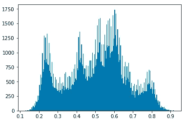

从图中可以看出，lenna 图像几乎覆盖了整个面元范围。几乎每个箱都有强度值。正如在[这个链接](http://www.ee.cityu.edu.hk/~lmpo/lenna/Lenna97.html)中提到的，Lenna 图像包含了细节、平坦区域、阴影和纹理的良好混合，可以很好地测试各种图像处理算法。这就是该图像被视为标准测试图像的原因。

现在，让我们分别看看每个颜色通道。我们在单独的数组中提取对应于每种颜色的像素。

```
img_r = img[:,:,0]
img_g = img[:,:,1]
img_b = img[:,:,2]
```

如果你检查这些数组的`shape`，你会得到(220，220)。所以我们现在有三个 2D 阵列。像前面一样，让我们为这三个元素创建一个平面一维数组。

```
img_r_pixels = img_r.reshape(220*220)
img_g_pixels = img_g.reshape(220*220)
img_b_pixels = img_b.reshape(220*220)
```

现在，我想看看这三个像素的亮度是如何分布的。如果所有的颜色都可以并排比较就好了。我们可以使用`subplot`来做到这一点。

```
plt.subplot(1,3,1)
plt.hist(img_r_pixels,bins=100)plt.subplot(1,3,2)
plt.hist(img_g_pixels,bins=100)plt.subplot(1,3,3)
plt.hist(img_b_pixels,bins=100)
```

如果你用过 MATLAB，你可能对支线剧情很熟悉。`subplot`函数有三个参数——第一个是行数，第二个是列数，第三个是索引号。然后对于`plt.subplot(1,3,2)`上面的第二个支线剧情表示我们要取剧情，把它分成 1×3 的格子，这样一共 3 个支线剧情都是可能的，然后我们要用第 2 个支线剧情。之后，我们用`plt.hist(img_g_pixels,bins=100)`绘制绿色像素的直方图。这里我们用`bins=100`。同样，您可以使用任何您喜欢的数字。或者直接跳过。

然后我们有这样的东西:

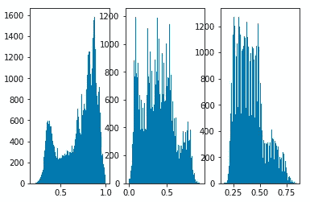

但这看起来不太好。这些地块非常拥挤，纵轴上的数字相互重叠。让我们在结尾加上`plt.tight_layout()`让它更漂亮一点，就像

```
plt.subplot(1,3,1)
plt.hist(img_r_pixels,bins=100)plt.subplot(1,3,2)
plt.hist(img_g_pixels,bins=100)plt.subplot(1,3,3)
plt.hist(img_b_pixels,bins=100)plt.tight_layout()
```

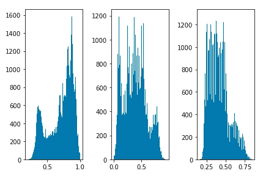

很好。我们还可以使用`hist`函数中的`histtype`参数来生成不同类型的直方图。现在，直方图在宽度方向上看起来仍然有点拥挤；这个数字比我们想要的要小得多。所以，让我们用`plt.figure`来设置支线剧情的大小。

```
plt.figure(figsize=(15,5))
plt.subplot(1,3,1)
plt.hist(img_r_pixels,bins=100,histtype='barstacked')plt.subplot(1,3,2)
plt.hist(img_g_pixels,bins=100,histtype='step')plt.subplot(1,3,3)
plt.hist(img_b_pixels,bins=100,histtype='stepfilled')plt.tight_layout()
```

`figsize`将元组作为参数—元组的第一个条目是宽度，第二个条目是高度，以英寸为单位。我们可以将这些值更改为最适合该图的值。对于上面的例子，我们现在有一个类似于

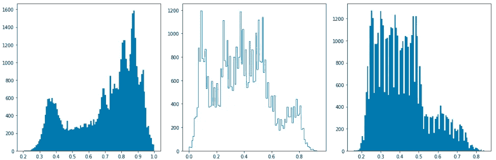

好多了。现在，只有 3 种颜色，但还是让我们通过给这些图添加颜色来使它更清晰。

```
plt.figure(figsize=(15,5))
plt.subplot(1,3,1)
plt.hist(img_r_pixels,bins=100,histtype='barstacked',color='r')plt.subplot(1,3,2)
plt.hist(img_g_pixels,bins=100,histtype='step',color='g')plt.subplot(1,3,3)
plt.hist(img_b_pixels,bins=100,histtype='stepfilled',color='b')plt.tight_layout()
```

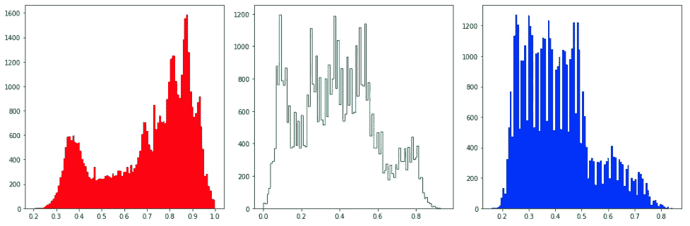

接下来，让我们标记坐标轴，并给每个支线剧情一个标题。使用`xlabel`和`ylabel`作为轴，使用`title`作为子剧情标题。

```
plt.figure(figsize=(15,5))
plt.subplot(1,3,1)
plt.hist(img_r_pixels,bins=100,histtype='barstacked',color='r')
plt.title('Histogram for Red Pixels')
plt.xlabel('Pixel Intensity')
plt.ylabel('Frequency')plt.subplot(1,3,2)
plt.hist(img_g_pixels,bins=100,histtype='step',color='g')
plt.title('Histogram for Green Pixels')
plt.xlabel('Pixel Intensity')
plt.ylabel('Frequency')plt.subplot(1,3,3)
plt.hist(img_b_pixels,bins=100,histtype='stepfilled',color='b')
plt.title('Histogram for Blue Pixels')
plt.xlabel('Pixel Intensity')
plt.ylabel('Frequency')plt.tight_layout()
```

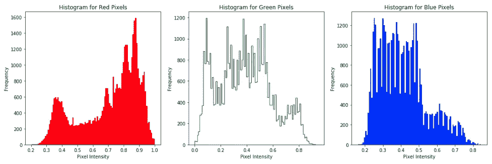

最后，让我们把这三个支线剧情叠加成一个

```
colors = ['red','green','blue']
plt.hist([img_r_pixels,img_g_pixels,img_b_pixels],bins=100,stacked=True,color=colors,normed=1)
plt.title('Stacked Histogram')
plt.xlabel('Pixel Intensity')
plt.ylabel('Frequency')
```


这里，`hist`接受一个像素值数组，这个数组的每个元素都用`color`参数赋予适当的颜色。`stacked=True`创建堆积直方图。由于 3 个颜色通道具有不同的频率范围，如单独的子图所示，我们使用`normed=1`标准化直方图。

使用`normed=1`，强度值将以这样一种方式绘制，即强度值和相应箱宽度的乘积总和等于 1。有关`normed`的更多信息，请参见[此链接](https://stackoverflow.com/questions/5498008/pylab-histdata-normed-1-normalization-seems-to-work-incorrect)。

在我们的例子中，如果我们设定

```
x = plt.hist([img_r_pixels,img_g_pixels,img_b_pixels],bins=100,stacked=True,color=colors,normed=1)
```

打印出 x，我们将看到它返回一个元组—第一个元素是每种颜色的像素强度数组，第二个元素是 bin 大小数组。我们将把它设置为

```
r = x[0][0]
g = x[0][1]
b = x[0][2]
bins = x[1]
```

如果我们检查每一个的尺寸(像`r.size`，我们会看到`r`、`g`和`b`的尺寸是 100，而`bins`的尺寸是 101 (100 个间隔)。然后，如果我们找到总和，

```
def getSum(frequency_array, bins_array):
    _sum = 0
    for i in range(frequency_array.size):
        _sum += frequency_array[i] * (bins_array[i+1]-bins_array[i])
    return _sum

print("red px: ", getSum(r,bins))
print("green px: ", getSum(g,bins))
print("blue px: ", getSum(b,bins))
```

我们会回来的

```
red px:  0.333333333333
green px:  0.666666666667
blue px:  1.0
```

显示总和为 1，因此强度已经被归一化。

## 只有直方图？pyplot 能做的就这些吗？

我们已经看到了很多使用直方图的东西。但这只是 pyplot 可以生成的各种图之一。查看官方 matplotlib 网站中的[图库](https://matplotlib.org/gallery/index.html)页面，查看可以使用 pyplot 绘制的所有各种类型的绘图。现在，让我们转移到一些其他类型的情节。

接下来，让我们看看饼状图。让我们取(50，100)处的一个像素，并找出该像素处的主色。

```
intensities = img[50][100]
```

`intensities`给出一个类似于

```
array([0.8745098 , 0.7058824 , 0.64705884], dtype=float32)
```

因此，在(50，100)处，3 种颜色有 3 个强度值。要绘制一个代表该像素亮度的饼图，我们需要做的就是

```
plt.pie(intensities)
```

饼状图将被绘制成

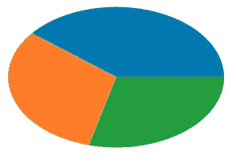

但目前看起来不太好看。第一，它不是一个规则的圆。让我们解决这个问题。

```
plt.pie(intensities)
plt.axis('equal')
```


好多了。现在，我们不能真正区分哪个部分代表哪个颜色。请注意，这个饼图中的蓝色和绿色不一定表示蓝色和绿色部分。这只是 pyplot 分配的 3 种默认颜色。所以，让我们给馅饼添加一些更多的信息。

```
colors = ['red', 'green', 'blue']
explode = (0, 0.1, 0)
plt.pie(intensities,labels=colors,colors=colors,autopct='%1.2f%%',explode=explode)
plt.axis('equal')
```

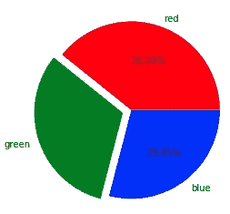

好多了。`plt.pie`这里以`intensities`数组为数据。它使用`colors`数组将`labels`和`colors`应用于截面。`autopct=’%1.2f%%’`格式化区段的百分比，对于`explode`参数，它只是从圆形饼图中分离出一个区段。我们将`explode=(0,0.1,0)`定义为我们想要将第二个元素(绿色元素)分解 0.1。如上图所示，绿色部分已被分离。因此，从这个饼图中我们可以看到，在 pixel (50，100)处，像素值几乎相似，但红色比其他两个略占优势。

让我们再次做同样的事情；这次是像素(100，100)。

```
intensities2 = img[100][100]
print(intensities2)
colors = ['red', 'green', 'blue']
plt.pie(intensities2,autopct='%1.2f%%',labels=colors,colors=colors)
plt.axis('equal')
```

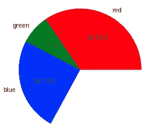

太奇怪了。它看起来不像普通的馅饼。如果你把各部分加起来，它甚至不是 100%。那么，为什么会这样呢？如果你看看文件，你会发现

> 每个楔形的分数面积由`x/sum(x)`给出。如果`sum(x) < 1`，那么 *x* 的值直接给出分数面积，数组不会被归一化。生成的饼图将有一个大小为`1 - sum(x)`的空楔形区

如果你打印出`intensities2`，你会得到

```
array([0.34509805, 0.07843138, 0.24705882], dtype=float32)
```

的确，如果你把它们都加起来，总和在 1 以下。这就是为什么数组没有被规范化，并且有一个空的楔形，一个空的部分覆盖了大约 33%的饼图。

现在，要生成图像的负片，我们只需要从 255 减去原始亮度值。

```
plt.imshow(255-img)
```

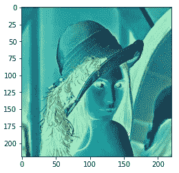

就这么简单。但是让我们来硬的，看看会发生什么。首先，我们为 3 个颜色通道中的每一个通道生成一个反向像素阵列。

```
img_r_pixels_inv = 255 - img_r_pixels
img_g_pixels_inv = 255 - img_g_pixels
img_b_pixels_inv = 255 - img_b_pixels
```

然后我们把这些组合成一个数组。

```
pixels_inv = np.append(img_r_pixels_inv,(np.append(img_g_pixels_inv,img_b_pixels_inv)))
```

我们一个接一个地为每种颜色添加像素，现在如果我们检查`pixel_inv`的`shape`，我们将得到(145200，)即 220*220*3。接下来我们`reshape`将这些像素还原到原始的三维空间并绘制图像。

```
img_inv = pixels_inv.reshape(220,220,3)
plt.imshow(img_inv)
```

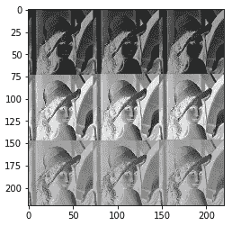

这很有趣，但这不是我们想要的形象。为什么会这样？如果你检查`255-img`和`img_inv`，你会发现它们是两个不同的数组。原因是在后一种方法中，我们首先堆叠所有的 **R** 像素，然后是 **G** 像素，最后是 **B** 像素。我们应该做的是取第一个 **R** 像素、第一个 **G** 像素和第一个 **B** 像素，它们将形成数组的第一个分量，并对所有像素重复同样的操作。

让我们试试别的东西。让我们首先用全零初始化一个(220，220，3)数组`img_inv`。然后，我们为 3 个通道中的每一个找到逆像素。我们使用两个循环，找到每个颜色通道的`i*j`像素的倒数。

```
img_inv = np.zeros((220,220,3))
for i in range(220):
    for j in range(220):
        img_inv[i][j][0] = 255 - img_r_pixels[i*j]
        img_inv[i][j][1] = 255 - img_g_pixels[i*j]
        img_inv[i][j][2] = 255 - img_b_pixels[i*j]
```

现在，如果我们检查`img_inv`，我们将得到一个看起来像这样的图像

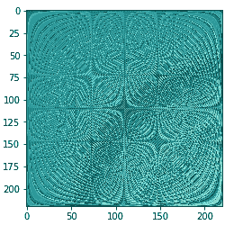

那确实是一件很好的艺术品，但不是我们想要的。然而，我们可以看到，这可以用来如果你想加密你的图像。当然，这是一种非常幼稚的加密方法，但如果你愿意，你也可以这样做。

上面的方法行不通，因为我们不想要第`i*j`个像素；我们想要第`[i][j]`个像素。让我们最终做到这一点。

```
img_inv = np.zeros((220,220,3))
for i in range(220):
    for j in range(220):
        img_inv[i][j][0] = 255 - img_r[i][j]
        img_inv[i][j][1] = 255 - img_g[i][j]
        img_inv[i][j][2] = 255 - img_b[i][j]
```

最后，我们在`img_inv`中有了我们需要的负像。

让我们使用`savefig`将该图像保存为一个新文件。

```
plt.axis('off')
plt.savefig('lenna_negative.png',dpi=300)
```

`plt.axis('off')`从图像中删除轴和标签。`savefig`的第一个参数是文件名，而`dpi`定义了我们希望图像拥有的每英寸点数。


图像将保存在记事本所在的文件夹中。您可以提供一个不同的路径来将其保存在您想要的位置。

# 所以，pyplot 只对图像起作用？

不，绝对不行。这只是一个应用。事实上，大多数时候，我们会处理文本数据。就像我们接下来要看的一样。

现在，让我们离开图像。在本节中，我们将使用温度变化数据集，通过 pyplot 探索更多的曲线图。

# 问题 2

给定来自[Kaggle](https://www.kaggle.com/berkeleyearth/climate-change-earth-surface-temperature-data)上此链接的 globallandtemperaturesbycount . CSV 数据集，使用 1960 年至 2009 年期间的数据

a)显示尼泊尔的年气温

b)比较美国、英国和中国的年气温

c)从(b)中找出温度的平均值和范围

# 解决方案 2

数据集在一个 csv 文件`GlobalLandTemperaturesByCountry.csv`中，所以让我们首先使用 pandas 来读取它。

```
import pandas as pd
df = pd.read_csv('GlobalLandTemperaturesByCountry.csv')
```

如果我们检查这个数据帧的`info`，我们会看到它有 4 列— `dt`即日期、`AverageTemperature`、`AverageTemperatureUncertainty`和`Country`。您可以使用`head`或`tail`查看更多信息，它列出了从 1743 年到 2013 年所有国家的月平均气温。一些月份的数据丢失了。很难看到所有这些数据，所以让我们只看一个特定的国家。在这里，我们看看尼泊尔。

```
df_nepal = df[df['Country']=='Nepal']
```

现在，我们只有`df_nepal`中尼泊尔的条目。如果我们检查`info`，我们看到它仍然有 2613 个条目。我们不想要 18 世纪的数据。此外，很多 20 世纪以前的数据都丢失了。所以，让我们来看看从 1960 年初到 2009 年底的 50 年间的数据。

```
df_nepal = df_nepal[(df_nepal['dt'] >= '1960-01-01') & (df_nepal['dt'] < '2010-01-01')]
```

因此，我们过滤掉数据，只剩下 600 个条目。现在我们有 50 年的月平均气温。让我们把它改成年平均温度。

```
start_year = 1960
year = np.zeros(50)
avg_temp = np.zeros(50)
for i in range(0,df_nepal.shape[0],12):
    new_df_index = int(((i+12)/12)) - 1
    year[new_df_index] = start_year + new_df_index
    avg_temp[new_df_index] = np.mean(
                      [df_nepal.iloc[i:i+12]['AverageTemperature']])
df_nepal_annual = pd.DataFrame([],columns=['year','avg_temp'])
df_nepal_annual['year'] = year
df_nepal_annual['avg_temp'] = avg_temp
```

我们从`start_year = 1960`开始，设置`year`和`avg_temp`保存 50 年及其各自的年平均温度，并暂时将其设置为全零。接下来，我们遍历 600 个条目，其中 600 由`df_nepal.shape[0]`给出，我们采取 12 的步骤，以便每 12 个条目被分组在一起，并且结果由`new_df_index`给出的单个索引来表示。使用此`new_df_index`，条目被追加到`year`和`avg_temp`中。对于`avg_temp`中的每个条目，取连续 12 行的平均值，并设置为当年的年平均温度。最后，创建一个新的数据帧`df_nepal_annual`，并将`year`和`avg_temp`的更新数组设置到该数据帧的列中。

如果我们现在检查`df_nepal_annual`，这个数据帧中正好有 50 个条目，只有两列——year 和 avg_temp。我们现在可以绘制 avg_temp 对应的年份

```
plt.plot(df_nepal_annual['year'],df_nepal_annual['avg_temp'])
```

以获得以下情节。

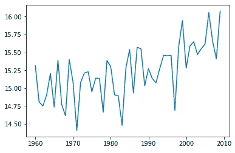

我们可以看到，在过去的半个世纪里，尼泊尔的气温一直在稳步上升。

现在，我们想将同样的概念扩展到绘制其他国家的温度。这里，我们来看看三个国家——美国、英国和中国。因为我们将对所有国家做同样的事情，所以让我们把上面的代码放到函数中。

```
def getDataForCountry(df,countryName):
    df_country = df[df['Country']==countryName]
    return df_country[(df_country['dt'] >= '1960-01-01') &   (df_country['dt'] < '2010-01-01')]
```

`getDataForCountry`提取 1960 年至 2009 年(含)50 年间的数据。

让我们定义另一个函数来计算年平均温度。

```
def getAvgTempByYear(df):
    start_year = 1960
    year = np.zeros(50)
    avg_temp = np.zeros(50)
    for i in range(0,df.shape[0],12):
        new_df_index = int(((i+12)/12)) - 1
        year[new_df_index] = start_year + new_df_index
        avg_temp[new_df_index] = np.mean([df.iloc[i:i+12]['AverageTemperature']])
    df_annual = pd.DataFrame([],columns=['year','avg_temp'])
    df_annual['year'] = year
    df_annual['avg_temp'] = avg_temp
    return df_annual
```

现在，使用这个函数`getAvgTempByYear`，我们可以对所有三个国家进行计算。为了更好地进行比较，让我们在一个图中绘制所有国家的图表。

```
df_usa = getDataForCountry(df,'United States')
df_usa = getAvgTempByYear(df_usa)
plt.plot(df_usa['year'],df_usa['avg_temp'],'r--')df_uk = getDataForCountry(df,'United Kingdom')
df_uk = getAvgTempByYear(df_uk)
plt.plot(df_uk['year'],df_uk['avg_temp'])df_china = getDataForCountry(df,'China')
df_china = getAvgTempByYear(df_china)
plt.plot(df_china['year'],df_china['avg_temp'],'#0be3df')
```

我们可以使用红色虚线`r--`，使用类似`#0be3df`的六进制代码，或者简单地使用默认颜色，而不需要明确定义。最终的图看起来会像这样

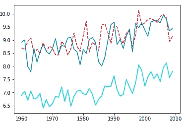

让我们也为这些线条添加一个图例。

```
plt.legend(['USA','UK','China'],loc=(0.2,0.25))
```

第一个参数是标签，第二个参数是`loc`，它是图例的位置。`loc`当给定一个元组时，将图例放置在绘图左下方的该百分比处。所以在这种情况下，20%来自左边，25%来自底部。

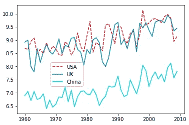

可能很难手动确定图例的最佳放置位置。因此，我们可以使用`loc='best'`，pyplot 将图例放在可能的最佳位置。这一次，让我们也加入一个网格，这样就可以很容易地可视化这些值。

```
plt.legend(['USA','UK','China'],loc='best')
plt.grid()
```


所以，左上角似乎是这个剧情传说的最佳位置。正如我们所看到的，美国和英国的气温变化非常相似，在 20 世纪 70 年代末到 80 年代初有所不同，在 80 年代末，美国似乎每年都比英国热。这些年中国似乎相对更冷。

最后给三国画个`boxplot`。

```
plt.boxplot([df_usa['avg_temp'],df_uk['avg_temp'],df_china['avg_temp']],labels=['USA','UK','China'])
```

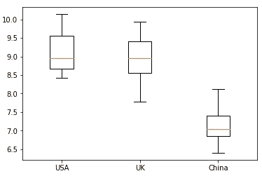

使用单个箱线图可以传达许多信息，如中位数、四分位数和极差。盒状图由盒状图和须状图组成。根据文件，方框从数据的下四分位数延伸到上四分位数，中间有一条线。触须从框中延伸出来，以显示数据的范围。

美国和英国的平均气温非常接近 9 度，而中国的平均气温在 7 度左右。美国的范围超过 1.5，最高和最低温度分别略高于 10 度和低于 8.5 度。中国也有 1.5 左右的类似区间。英国的范围约为 2。

可视化是一种重要的技术，通过这种技术，大量的信息可以以一种更紧凑的方式传达。此外，它比纯文本、数字和表格更具视觉吸引力。和往常一样，这并不是 pyplot 所能做的详尽列表。但现在如果我们需要任何情节，至少我们知道去哪里找。**