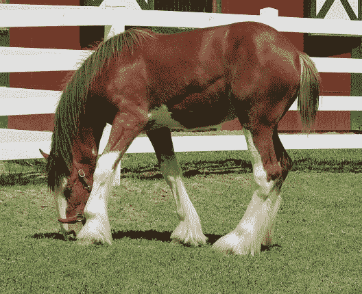
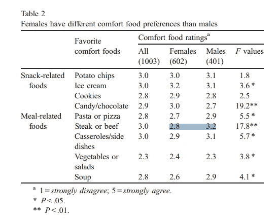
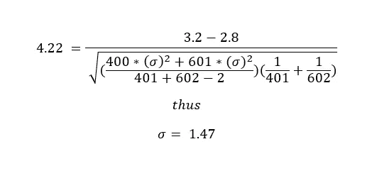
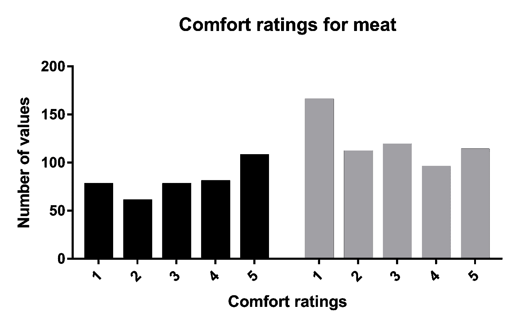
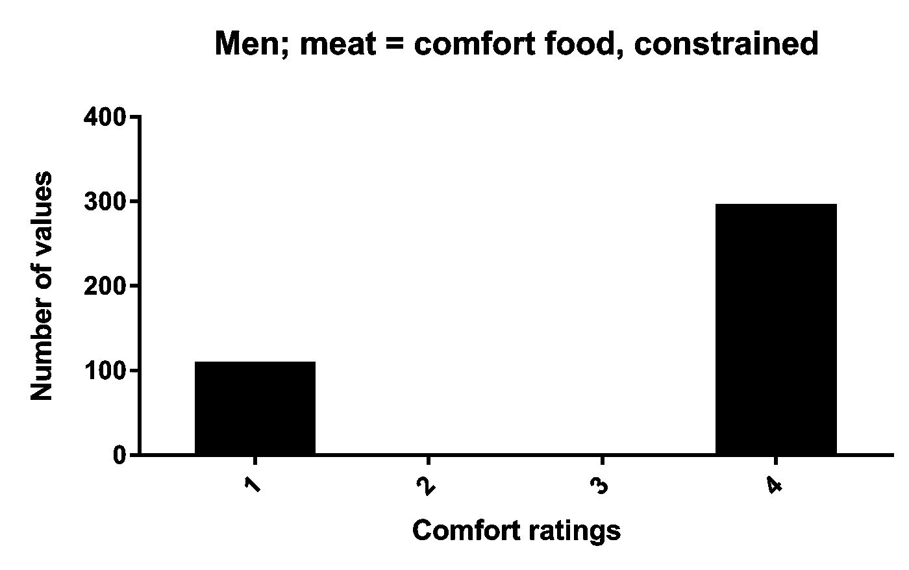
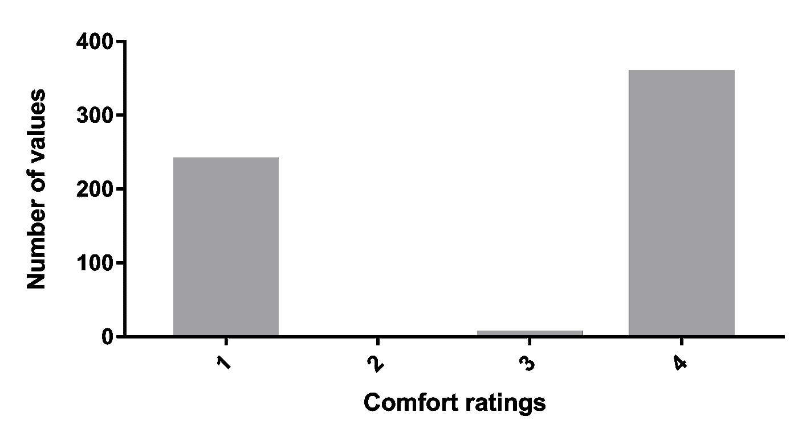
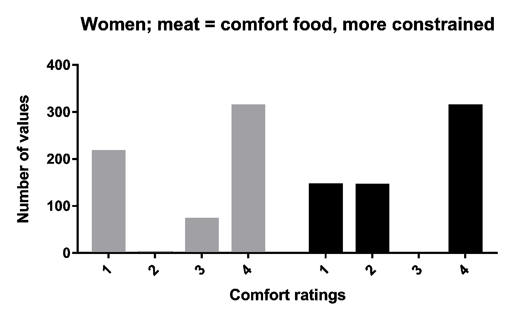

# SPRITE 案例研究#2:极化 Porterhouse 的案例(以及一些更新)

> 原文：<https://towardsdatascience.com/sprite-case-study-2-the-case-of-the-polarizing-porterhouse-and-some-updates-7dfe4d1564fc?source=collection_archive---------0----------------------->

在我之前的文章中，我通过一个例子简单介绍了 SPRITE——cart horse Child。

REGULAR HUMAN CHILD DEMANDS BREAKFAST WILL HAVE 12lb OF OATS PLS

这是我能找到的最简单的案例研究，也是最有趣的，因为它是好马和孩子的交叉。

案例研究探讨了基本问题:*给定样本的常规汇总统计数据(均值、标准差和 n)，符合该描述的假设样本的属性是什么*？

这种情况下的答案是，如果你有 45 个孩子，他们平均吃了 19.4 个胡萝卜(SD=19.9)，那么大多数符合描述的样本至少有一个孩子吃了至少 60 个胡萝卜，因此是一匹马。

许多人有异议和观点:

## 你怎么能确定‘胡萝卜’是完整的胡萝卜呢？

几个原因。我希望你觉得它们很有说服力:

a)在这项研究中，以及同一作者的许多其他类似研究中，它们一直被称为“胡萝卜”。有时它们被明确称为“小胡萝卜”(只是不在本文中)。但是在感兴趣的论文中也没有使用其他语言——切片、切块、缩略等。在美国，以我的经验(作为一个肮脏的偷工作的移民)，当人们提到“胡萝卜”时，他们总是指小胡萝卜。

b)这里是作者对这项研究的文字描述——这种特殊的超级太空胡萝卜在照片和菜肴中都有展示。他们就在那里。看看他们橙色的荣耀。

现在，我想，我希望，我是合理的。我也花了比平时更多的时间去思考胡萝卜。我不想仓促行事，但也非常希望有一些当前的和合适的东西来最终介绍雪碧——我已经断断续续玩了很久了——然后马童出现了。你认为我有多长时间有机会向人们介绍法医元科学技术？？

## 如果我没理解错 SPRITE 的话，你列举的很多问题，难道不能用适当的统计推导来解决吗？没有你的循环重的方法，一些样品是不可能的。

是的，你绝对可以找到适当的统计关系来解决精灵问题。(我们可以在某个时候详细讨论它们。)是的，我的方法也有点丑。它也是 a)多用途 b)直观 c)简单。

(目前正在做一些优化。)

问题是:我不是统计学家。我甚至不确定如何开发更神秘的工具，即使我开发了，我也不确定其他人是否会使用它们。根据我的经验，人们会被他们理解的事物所吸引。

## 你知道你使用的洗牌法背后的所有假设吗？它赋予你的解决方案什么样的属性？会生成一类答案还是所有答案？

非常好的问题，还不是 100%确定。但是——我有不止一种方法，而且它们在相同种类的解决方案上相当集中。我会尽我所能解释它们。

## 你见过类似的方法吗，XYZ？

我现在有了！我已经收到了四封关于这个问题的电子邮件，都是来自致力于解决这个问题的人(而且都是以不同的方式)和有额外分析建议的人。我感谢你们所有人给我发来这些东西，我学到了很多东西(即使是在几天内)，我想和所有相关的人谈谈。请和谢谢你。

## 你的马和胡萝卜的笑话是糟糕的和/或不恰当的。

“摆在委员会面前的建议是:不要再开马的玩笑了。所有赞成的人？”

*一些零散的答案*…

“所有反对的人？”

# * *嘶声！**

(是的，我去了。但是我现在在浪费时间。)

# 案例研究# 2——两极分化住宅的案例

今天，我们要做的事情比胡萝卜的例子稍微复杂一点，那就是 a) *在没有 SD* 的情况下工作，而不是在一系列 SD 上采样以建立一个合理的 SD，b) *在上面的基础上引入一个简单的约束*。

为了让 SPRITE 提供有用的信息，约束非常有用。它们允许我们将大量的可能数字减少到更小的数字。或多或少，任何约束都可以用来以某种方式照亮子画面。

下面的例子来自 Wansink 等人(2003 年)的论文:“探索不同年龄和性别的舒适食品偏好”。它提出了一项关于不同性别和年龄的人对舒适食品偏好的调查。该论文目前有 330 篇引文。下面是表 2 中的结果:

以防不明显，这是一个方法表。它涉及到一项针对美国人的大规模调查，调查者对所提供的食物是否符合“舒适食品”的标准进行评级。标度从 1 到 5——所以 1 是在犯下重罪后站在小巷里被吃掉，5 是在家看《网飞》时在羽绒被下被吃掉。

忽略其他错误，让我们来谈谈**肉**(‘牛排或牛肉’)。

对于男性来说，牛排的平均值为 3.2，我想这意味着它“有点”让人舒服。

而对于女性来说，平均值为 2.8，这“略低于令人欣慰的水平”。

总之。

根据表格，当你用单因素方差分析比较这两个值时，你得到的 F 值是 17.8。在这种情况下，ANOVA 返回与 t 值完全相等的 F 值，t = F。换句话说，对同一组进行常规的旧 t 检验将返回 t 值 4.22。这是一个很大的区别。

因此，为了方便起见，让我们从假设这些组之间的*相同的 SDs* 开始，然后*反算*SDs。

(我们还不需要 SPRITE，但我们可以用它来精确地再现上面的内容——只需运行它而不受规模限制，并迭代地改变 SD，直到我们得到 SD=1.47 的解，这给出了 4.2179 的 t…可爱！)

所以，现在我们的*假设*数据集是:

**男性:平均值= 3.2，标准差= 1.47，n = 401**

**女性:平均值= 2.8，标准差= 1.47，n = 602**

唯一的问题是…？

恶作剧问题。百分之百没问题。

以下是针对每种情况的 SPRITE 解决方案示例:

好吧，那就这样吧。

对吗？当然不是。

事实上，这份报纸继续把它的脚完全放进去:

> 另一种检验男性和女性对安慰性食物评价不同的一般趋势的方法是构建一个百分比接受度的替代测量，将对食物评价为 4 =同意或 5 =非常同意的人编码为接受该食物为安慰性食物的人[93]。在这样做的过程中，发现女性对糖果和巧克力的接受百分比更高[69%对 58%；v2 = 4.8p 在这一过程中，发现女性对糖果和巧克力的接受率更高[69%对 58%…] **，但对牛排或牛肉等与膳食相关的食物的接受率较低[52%对 77%]** 。

这就是我们的限制。

让我们从男人开始:我们必须采用上面那些相当平坦的分布，并以某种方式将 77%的个体值塞进 4 或 5 个容器中。

这可能吗？

嗯，平均值低于 4，所以在我们最受约束的可能情况下，将会有*no 5 .*显然，这是愚蠢的，因为许多美国男人对牛排有什么接近蒸汽般的浪漫，但我们现在让它过去。

如果我们只对从 1 到 4 的值运行 SPRITE，我们会得到最大可能的解决方案，这真的很奇怪:

这是数据能做到的最好的字面意思——除了 1 和 4 什么都没有。平均值仍然在它应该在的地方(3.2)，但即使在这种完全疯狂和极端的情况下，我们只有 1.33 的标准差。

但是你可能还记得以前，我们编造了那个 SD。所以违反它不是一个问题。问题是，这是获得大于 4 的多个值的绝对最佳情况，而不是 77% —它达到了 73.3%。

然而，女性数据*可以*存在。雪碧会把它弹出来。

…只是看起来很滑稽。

是的，看起来很傻，但事实上我们得到了我们想要的——足足 59.4%的值是 4 或 5(也就是所有的 4)，超过了 52%的阈值。

因此，与其最大化我们的分布，不如强制我们的样本的 52%都是 4s。使用 SPRITE 很容易做到这一点:我们需要从 313 个 4 开始，当我们在剩余的 n 个中分割剩余的和时，可以找到样本参数。

具体来说:我们现在需要找到一个平均值为 1.5 的 n=289 的样本，当我们将它添加到 n=313 个 4 的巨大堆栈中时，我们就得到我们的总体平均值。

所以，这里有两个解决方案:

现在，上面的第一种情况将给出最大 SD(都是关于 1 的)，它只比我们开始时的假设值差一点点:SD=1.39。

然而，我们现在面临的前景是，样本中只有极少量的 3，而没有任何 5。你认为这些分布，或者你从 1 到 3 打乱数值的类似分布，是现实的吗？他们不是。但它们是唯一能用的。

## 结论

如前所述,“男人”的案子是不可能的,“女人”的案子简直是不可能的。

即使牛排是有史以来最奇怪的两极分化的食物，是世界各地战争和骚乱的形式，将人们分成一种烹饪阿崔迪斯和哈康宁(这里显示了我的年龄)，也没有可能重建论文中给出的数字。

论文中还有其他不一致的地方，但它们将不得不等待。

下一次，我们会看一些更复杂的东西。