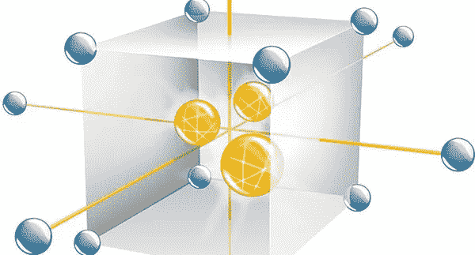
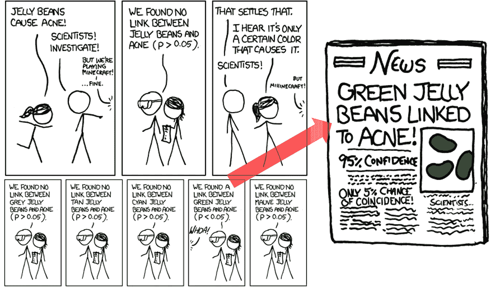
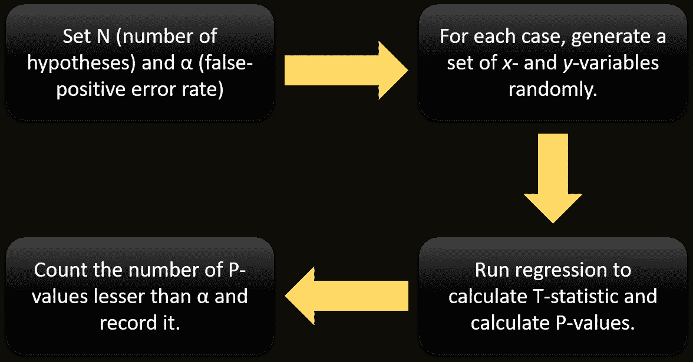
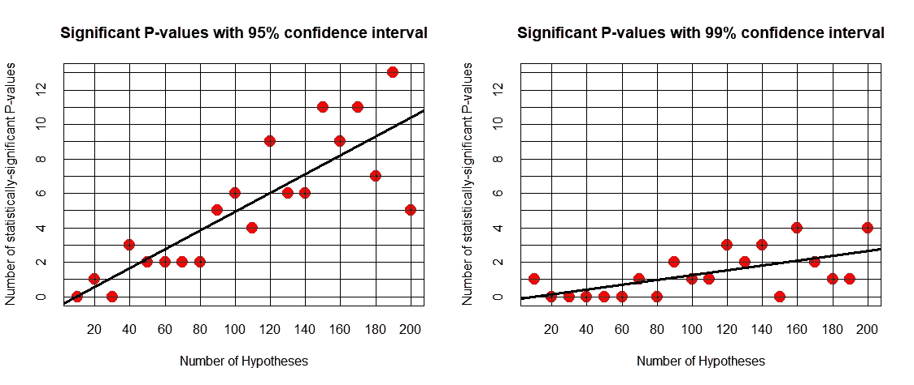

# 虚假统计显著性:为什么大型实验设计可能是危险的

> 原文：<https://towardsdatascience.com/spurious-statistical-significance-why-a-large-design-of-experiment-could-be-dangerous-418eceb189c0?source=collection_archive---------4----------------------->

在半导体工艺或产品设计中，经常会涉及大量的变量。很多时候，在初始学习周期阶段，大量的 PCM(***)过程控制监视器*** )将被插入到布局设计中。这些是 IC 设计参数的各种可能组合，它们与工艺变量混合在一起，进行详尽的 ***实验设计(DoE)*** 研究，希望发现统计上显著的关系(或确认一些现有的但未经验证的理论)，这可以导致良好的设计理解并简化开发过程，即在项目的后期阶段只需要一组较小的实验。

标准 IC 设计参数的例子可以是——有源单元间距、栅极长度、栅极-漏极重叠、晶体管宽度、宽长比、终端单元宽度和形状等。工艺变量包括(但不限于):离子注入能量/剂量/角度、各种薄膜(例如栅极电介质、场氧化物、氮化物掩模)参数、硅或氧化物蚀刻比率和配方、金属成分和沉积变量等。

*从统计角度来说*，这些工艺/设计变量中的每一个都与一个假设相关联，该假设有可能说明其与一个或多个输出参数的关系，即表示最终设备性能或可靠性的数量。

> *然而，关键问题是:在存在大量假设的情况下，即使遵循标准/严格的统计显著性检验方法，是否也有可能出现错误发现？*

不幸的是，答案是肯定的，这是“**假设-购物**”的结果。一个简洁的演示就是 [**这里的**](https://xkcd.com/882/) 。

(非常)粗略地说，如果您使用任何统计建模技术(比如线性回归)测试至少 20 个假设(对应于调查 20 个 PCM 变量中的任何一个是否与特定器件输出参数相关)，并列出 P 值，您可能会发现至少一个 P 值小于 0.05(这通常是拒绝零假设的黄金标准边界值)，即使所有 20 个变量实际上都与输出参数不相关。现在，考虑到 P 值解释的普遍性和诱人的简单性，它们很难在假设检验场景中被忽略，您有义务报告这一发现，即这一特定的过程/设计参数将被标记为控制变量，它可以以统计显著的方式影响输出。

下面的图表说明了当你试图从一大组变量中发现具有统计显著性的关系时，存在大量假设的潜在危险。**在本例中，所有的 *x* 变量都是完全随机生成的，输出 y 变量也是如此，即对于任何场景**，在 *x* 和 *y* 之间都不应该有任何统计上的显著关系。

但是随着假设数量的增加，统计显著 P 值的数量和假设数量之间存在明确的正相关关系(由正斜率线性拟合线显示),即**更大的实验组更有可能发现 *y* 和 *x* 之间的关系，即使它们基本上是由不相关的随机过程**产生的。如图所示，一个明显的趋势是，随着 alpha 值阈值从 0.05 降低到 0.01，这种正相关性变得“弱”。

**有趣的是，这种现象与产生变量和输出的潜在自然过程的性质无关**。我用 R 编写了一小段代码来生成这个图，并使用了 *rnorm* 和 *runif* 函数来运行它，即从*正态高斯*和*均匀分布*中提取了 *x* 和 *y* 变量，但是上面的图的一般性质保持不变。[基本 R 代码在 GitHub](https://github.com/tirthajyoti/HypothesesShopping) 里。

> *现在，在半导体设计领域，大多数时候输入/输出的功能关系是相互关联的，这使得这种现象更加复杂，难以确定和隔离。此外，如果一个人不止一次地进行类似的实验，这种伪性质很容易被发现，但是在半导体设计中，由于与大的/重复的实验周期相关联的大的成本和开销，学习周期信息通常被用于调整未来的实验。*

一般来说，谨慎的做法是在设计 DoE 时从较小的变量子集开始，并在使用尽可能小的 P 值时得出因果关系的结论。**与社会科学或医学研究不同，半导体设计中的统计建模不必符合 0.05 作为 alpha 值。**在分析了具有最显著输入变量的第一组数据并看到最高 P 值仅为 0.0001 后，为什么不将其降至最小可能值？

有许多研究和可用的方法来避免这个陷阱。希望在另一篇文章中写下它们。这是一个很好的介绍性演示。

*原载于 2017 年 7 月 4 日*[*【https://www.linkedin.com*](https://www.linkedin.com/pulse/spurious-statistical-significance-why-large-doe-could-sarkar/)*。*