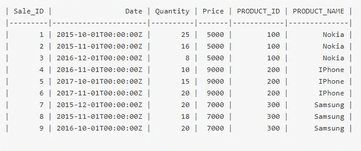

# 简而言之的 SQL:第 1 部分—基本的真实场景

> 原文：<https://towardsdatascience.com/sql-in-a-nutshell-part-1-basic-real-world-scenarios-33a25ba8d220?source=collection_archive---------3----------------------->

## 本系列关注现实世界中最常见的数据科学和分析问题，旨在用 SQL 解决这些问题。

Photo by [Carlos Muza](https://unsplash.com/@kmuza?utm_source=medium&utm_medium=referral) on [Unsplash](https://unsplash.com?utm_source=medium&utm_medium=referral)

**更新(到原帖):**

1.  SQLFiddle 上的查询链接已被移除。未来的更新包括嵌入 SQL 的 Jupyter/IPython 笔记本的链接。
2.  这里的大多数查询都是用 ANSI SQL 编写的。为了便于执行，PostgreSQL 9.6 和 MySQL 5.6 包含在一起，以展示窗口函数等特性(MySQL 不支持这些特性)。您可以在本地安装其中一个或两个来测试我们的查询。
3.  本文已经扩展为一个由 3 部分组成的系列，第三部分涵盖了 SQL 中典型的、重要的任务。

如果您熟悉 SQL 的语法和编写基本的选择查询，您可能会发现本系列有助于快速复习或学习更多的技巧和诀窍，以编写更清晰和优化的查询，如*如何计算六周的滚动平均销售额。*

这是本系列的第一篇文章*,将回顾 SQL 概念以及一些基本问题，这些问题将通过基本的检索、连接、过滤、聚合和转换来回答。
第二篇*文章*将涵盖更复杂的场景，以及如何使用窗口函数、子查询、移动平均、常用表表达式和排序来处理这些场景。
第三篇*文章*将涵盖 SQL 中典型的、重要的任务——例如旋转、从每个组中检索顶级结果的不同方法、处理重复项以及性能查询调优。*

# SQL 简介

SQL(结构化查询语言)是为管理数据库中的数据而设计的通用编程语言。由于它的标准语法，它支持所有的关系数据库以及一些 NoSQL(不仅仅是 SQL)。SQL 之所以受欢迎，是因为它的用法像英语一样易于理解，还因为它可以直接访问数据的存储位置，而不是将数据复制到其他应用程序，这使得分析相对方便。

借助 SQL，我们可以:

*   *定义*数据(DDL)，例如，将缩写值标准化为完整的状态名
*   *处理*数据(DML ),例如用一个单词替换一个空白或空值
*   从数据库(DQL)中检索数据，例如获得本月的销售数字

在本系列的范围内，我们将只处理用于检索的查询( *SELECT* )。对于我们的大多数查询，我们还将使用 SQL:2011 版本的 ANSI SQL——一种在大多数数据库上兼容的标准。为了演示，我们将使用 MySQL 5.6 和/或 PostgreSQL 9.6。

**注意**:针对 SQL 发布的最新标准(ISO/IEC 或 ANSI)是 [SQL:2016](https://en.wikipedia.org/wiki/SQL:2016) ，对 JSON 功能有额外的支持。

## 创建数据库并插入数据

在开始查询数据之前，我们需要创建一个数据库并将数据加载到其中。

[*数据库*](http://en.wikipedia.org/wiki/Database) 是一个有组织的数据集合，由表格等结构和其他元素组成。一个*表*在行(元组)和列(属性)中存储数据。*模式*指的是如何构建数据库(或划分成数据库表)的蓝图。

下面的命令集为我们的数据库构建了模式:

Build Schema (Create tables and Insert data)

在这里，我们创建两个表，分别是由*PRODUCT _ ID*(*产品*的主键，销售*的外键*)关联的*产品*、*销售*

# 检索数据

`**SELECT**`命令用于从数据库中检索数据。

以下是一些获得*销售*数据的不同方法的基本查询:

*   **所有**细节来自一张表
*   **将**结果限制在前 *N* 行(用于测试或取样)
*   表中的特定列
*   **列名的别名**(使信息可读)
*   **不同的**列值(一列或多列中的唯一值)

Basic SELECT queries on Sales table

# 连接表格

连接表允许我们组合多个数据集，以获得更完整的结果集和全面的分析。

在[数据建模](https://en.wikipedia.org/wiki/Relational_model)(数据库设计)*规范化*是一个过程，用于将数据组织在单独的结构良好的表中，以最大限度地减少冗余，并避免插入、更新和删除异常。这种分离也有助于简化逻辑，提高精确装配特定用途所需物品的灵活性。这种装配是通过“连接”操作来完成的。

假设我们有一个单独的表 *ProductSales* 存储我们所有的数据:

Raw Data into ProductSales *table*

比如说，企业希望通过产品名称来了解产品，而不仅仅是品牌名称。这意味着他们可以要求我们将“诺基亚”更新为“诺基亚 Lumia”，将“三星”更新为“三星 S5”。在这种情况下，如果有一百万行，改变每一行 *Product_Name* 是“诺基亚”或“三星”的操作在计算上是相当昂贵的。

相反，如果我们以这样一种方式构建我们的数据，即在一个单独的表中取出*产品*数据，每种产品有一行信息，那么*销售*表中的每笔销售都可以与一个*产品 ID 相关联。*这叫做*一对多关系。*现在对 *Product_Name* 的任何更改都只是一行操作，所有与更新产品相关的*销售*数据都可以通过 *Product_ID* 上的`join`轻松访问。

## 连接的用例:

*   *为了组合相关的数据集*，例如，为了找到已售出产品的名称，我们将把*销售*表和*产品*表连接起来
*   *例如，为了执行比较*——为了执行同比分析，我们可以将相似数据的分区按年份值进行组合
*   *使用表格作为查找资源*，例如，为了获得运输交付类型的状态，存储状态代码的枚举器以映射到相应的文本会更有效。

## 连接的类型

1.  内部连接:*内部连接*是一个连接，它只返回两个表中那些*连接条件*为真的结果。

例如— *获取已销售产品的详细信息:*

Inner Join

在本例中，从结果集中可以观察到，没有产品“LG”的销售，因为在 *Sales* 表中没有产品“LG”的列表(或者没有 *Product_ID* ) )。

*连接条件*通过一个`**ON**`子句指定。我们还可以使用`AND`操作符向它添加多个条件。例如，*获取 2017 年销售的产品明细:*

Inner Join with condition

2.外部联接:*外部联接*是返回一个或两个表的所有结果的联接(取决于*联接类型——左、右或全*),并且不满足*联接条件*的行返回空值。

为了更好地解释这一点，我们以前面的例子为例，稍微修改了一下需求— *获取所有产品及其相应的销售信息，如果有的话:*

Left Join

在这里，我们有每一个产品清单以及每一笔销售。对于“LG”，结果集显示该产品存在于我们的数据库中，但是还没有销售。这是一个`**LEFT JOIN**`的例子。

一个`RIGHT JOIN`以类似的方式工作，但是相反，即返回右边表格的所有行，左边不匹配的行作为空值返回。尽可能使用左连接(右连接之上)是一种标准做法。

**注意:** `FULL JOIN` 在 MySQL 中不支持，但通过`UNION`可以完成类似的查询。这篇文章的下一次更新将包括关于在 PostgreSQL 等其他数据库中使用的*完全连接*和*自连接*的主题。*工会*和*工会所有*将在下一篇帖子中涉及。

# 过滤和排序数据

通过过滤数据集，我们可以根据搜索条件限制我们的结果。

*   *集中分析*，例如，将销售趋势的结果缩小到特定区域
*   *要限制集合条件的数据集，例如，*获取平均评分为 4 或更高的产品，其总评论数至少为 10
*   *减少用于计算的数据集大小*，例如——对一个假设进行采样

以下是过滤中常用的一些运算符:

过滤数据的基本方法是使用`WHERE`子句以及一个或多个适合您的搜索条件的操作符。

以下是一些常用的运算符:

*   *比较运算符* : `=`(等于)、`<>`或`!=`(不等于)，以及其他一些不言自明的运算符— `>`、`<`、`>=`、`<=`
*   *逻辑运算符:*、`AND`、`OR`、`NOT`、`IN`(在一组值中查找)、`BETWEEN`(具有开始和结束范围)、`LIKE`(匹配相似的值)

## 整理

SQL 查询中的排序是可选的。默认情况下，如果主键存在，则结果按主键的顺序返回，否则按随机顺序返回。如果我们希望以特定的方式对结果进行排序，我们必须显式地添加一个`ORDER BY`子句，后跟一个*列名列表*进行排序，最后是*订单类型(ASC —* 升序*，DESC —* 降序 *)* 。

让我们从一个简单的例子开始— *获取一部“iPhone”的所有销售细节:*

Filter Data

请注意，在第一个查询中，我们已经按 Product_ID(如果已知)进行了筛选。在第二个查询中，我们将 *Sales* 与 *Products* 表连接起来，并筛选出以“-Phone”结尾的产品。注意“%”是一个通配符，它可以搜索其位置上的任何文本。

再举一个例子— *获取 2015 年 11 月 1 日到 2017 年 10 月 1 日之间的销售明细，按日期排序:*

Filter and Sort

这里，在第一个查询中，我们使用了一组比较运算符。在第二个查询中，我们使用`BETWEEN`来搜索相同范围内的日期值。

现在，如果我们需要*获得产品的销售细节——“诺基亚”、“三星”和“LG”，该怎么办？*或者说这是我们需要搜索的大约 20 种产品的列表。与其包含 20 个`AND`条件，不如使用`IN`操作符来编写这个查询:

Filter with IN

# 聚集

当我们沉浸在周围数以百万计的细节中时，我们经常会失去上下文，并希望从中寻找有意义的信息。通过汇总数据，我们可以观察到每月总计或按类别划分的销售订单平均值等洞察。这有助于我们更深入地了解我们的数据，并允许我们提出更深入的问题。在高层次上，我们还可以识别数据中的模式和趋势。

为此，我们将使用 SQL 中内置函数的集合，这些函数汇总或汇总我们的值。一些基本的包括最小值、最大值、平均值、总和、计数，更具分析性的包括标准差、方差和等级。

让我们从使用一些基本功能开始，例如—

Basic Aggregation

这对初学者来说很好，但是除了告诉我们表包含多少行或者价格的最小/最大值是多少之外，它实际上没有多少业务洞察力。如果我们想知道每件产品的销售额是多少呢？*小组来了，由*来救援！

`**GROUP BY**`允许您将数据分成组，这些组可以彼此独立地进行聚合。

例如— *获取我们数据库中每种产品的总销售额、平均价格和总销售量:*

Aggregate by Product

现在这给出了一个更全面的图片！

**注**:使用`COALESCE`、`IFNULL`(或等效物)可以用指定值替换空值。

让我们考虑另一个示例— *对于从 2016 年 10 月 1 日开始销售的每件产品，获取每年的总销售额、平均价格和总数量，并只返回那些至少销售了 10 件商品的产品，按产品名称和年份排序。*

现在可能有很多要处理，但下面是对其解决方案的分解分析:

Aggregation with multiple conditions

**注意**:`HAVING`子句在执行聚合后应用过滤器。

聚合是 SQL 分析的核心部分，是任何优秀的数据科学家/工程师都必须掌握的。随着本系列的继续，我们将学习更多类似的复杂场景以及如何处理它们。

# 内置函数的数据转换

在收集的数据质量差、需要清理的情况下，通常需要进行数据转换；这种过程被称为数据争论(或蒙骗)。还需要转换来以更易于阅读的格式呈现数据报告。

以下是使用内置函数的季度和月度销售报告的一些示例:

Quarterly and Monthly Sales

第一个查询显示季度销售报告。这里，`MONTH`和`YEAR`函数将日期值转换成整数形式的相应月份和年份值，而`CAST`用于*价格*以从*整数*转换成*小数。*`CASE`函数(一个`IF-ELSE`的变体)检查然后检查条件并将每个日期值映射到季度桶中，之后结果按季度分组。类似地，为了显示月度销售报告，我们需要对*年*和*月*进行分组，如第二个查询所示。

SQL 中有许多更方便的函数，您可以在您正在使用的 SQL 版本的文档中找到它们。更多的内容将在本系列的后续文章中讨论。

# 参考

在您等待下一篇文章的时候，请查看 SQL 上一些有趣的链接以获取更多知识:

 [## 结构化查询语言- Wikibooks，开放世界的开放书籍

### 这本 Wikibook 提供了对 SQL、其起源、基本概念和组件的简短描述，以及大量示例…

en.wikibooks.org](https://en.wikibooks.org/wiki/Structured_Query_Language)  [## 数据分析的 SQL 教程

### 本教程是为想用数据回答问题的人设计的。对许多人来说，SQL 是“肉和土豆…

community.modeanalytics.com](https://community.modeanalytics.com/sql/tutorial/introduction-to-sql/)  [## 数据科学的 SQL 提示和技巧

### 获取 Ben Sullins 为数据科学专业人士(工程师、开发人员、数据挖掘人员、程序员和其他人员)提供的 12 个必备 SQL 技巧

bensullins.com](https://bensullins.com/sql-tips-tricks-data-science/) 

希望这篇文章对你有帮助！如果你喜欢这篇文章，请为它鼓掌。有什么想法吗？把它们写在下面的评论里。