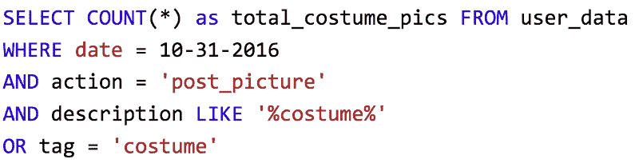

# SQL:所有非技术人员都需要知道的一项技术技能

> 原文：<https://towardsdatascience.com/sql-the-one-technical-skill-all-non-technicals-need-to-know-843db07d9bc8?source=collection_archive---------4----------------------->

## 技术领域的商业、营销或战略人员指南。

如果你想从事技术工作，你会被大量的数据包围，无论是营销活动的打开率，应用内的用户活动，还是网络性能。根据经济学家的说法，数据已经成为新的石油，各公司都在加强他们的数据收集和分析团队，以优化他们的平台并创建“数据驱动的战略”。

在 Tumblr 全球增长战略品牌团队的[实习](https://www.tumblr.com/internships)期间，我成为了这一趋势的一部分。我需要了解我们的用户如何在国际上与平台互动，以便推动用户增长、保留和货币化。更具体地说，我需要一种方法来浏览、组织和理解每天来自全球 3 . 5 亿多个博客的数据，为此我需要 SQL。

**简而言之，如果你想使用大量的数据，你需要知道如何使用 SQL** 。

首先，我想说我不是 SQL 方面的专家。事实上，科技公司的大多数人不需要成为专家。重要的是，我们了解足够多的 SQL，能够提取、组织和利用我们的角色所需的数据，无论是作为业务分析师、营销经理还是产品经理。换句话说，我们需要知道“足够危险”。

# 什么是 SQL？

[SQL](https://www.w3schools.com/sql/sql_intro.asp) ，表示结构化查询语言，是一种访问和操作数据库的语言。不要让这个定义吓倒您——使用 SQL 实现基本功能并不需要太复杂。可以把它看作是通过提供一系列标准来选择您想要访问的数据的一种方式。如果你想知道有多少用户在万圣节登录并发布了他们的服装照片，你的列表可能包括:

*   2016 年 10 月 31 日登录
*   张贴的图片
*   图片描述包含单词“服装”或“#服装”

然后，您将生成类似如下的查询:

一旦您理解了语法，您将开始看到提取数据是多么的逻辑和简单。然而，SQL 真正令人兴奋的地方是，当你开始将整个公司的数据拼凑在一起，以便形成新的见解。例如，您想了解您的电子邮件营销活动如何为 2017 年 Q2 世博会在墨西哥的日活跃使用量做出贡献。如果收集了正确的数据，您可以将整个组织的数据表拼接在一起，回答这个问题并优化墨西哥的电子邮件活动。

# 为什么这很重要？

学习 SQL 很重要有两个原因。首先，它允许您直接处理原始数据，而不是要求其他人向您提供有组织的数据集。这允许你在战略上更快地行动，独立地领导项目，并且成为你的团队的技术资产。

其次，SQL 增加了你的经济护城河——沃伦·巴菲特用这个术语来描述你相对于同行业其他人的竞争优势。SQL 是目前市场上[最受欢迎的技能之一，它肯定会让你从你的同行中脱颖而出。](https://www.cnbc.com/2017/04/26/5-skills-that-will-lead-to-a-high-paying-in-demand-job.html)

# 怎样才能学好 SQL？

有大量免费资源可以帮助您学习 SQL 的基础知识:

1.  [可汗学院](https://www.khanacademy.org/computing/computer-programming/sql)——这是我曾经入门的一个。他们使用的慢节奏和沙盒系统对我们这些很少或没有编码经验的人特别有帮助。
2.  [Code Academy](https://www.codecademy.com/learn/learn-sql) — Code Academy 因提供高质量的课程计划和项目而在技术社区享有盛誉。虽然你可以从一些免费的模块开始，但最终你会看到每月 20 美元——这对他们提供的内容来说并不算太坏。
3.  [W3 Schools](https://www.w3schools.com/sql/) —如果你有一些技术背景，我会推荐 W3 Schools 的命令和 SQL 特性 DIY 列表。他们用例子清楚地解释概念，甚至有一个 SQL 接口供你使用。

一旦你掌握了基础知识，请查看[本指南](https://www.thinkful.com/learn/google-bigquery-tutorial/)中的 [Google BigQuery](https://cloud.google.com/bigquery/what-is-bigquery) ，这是一款工具，可以让你在任何你想要查询的数据集上运行类似 SQL 的查询。对于少量的处理能力来说，它非常简单而且免费。

# 这是所有的乡亲。

随时联系并在 Twitter 或 LinkedIn 上聊天！