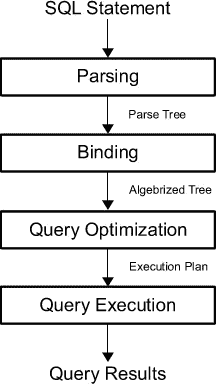
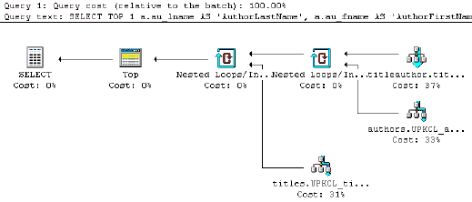
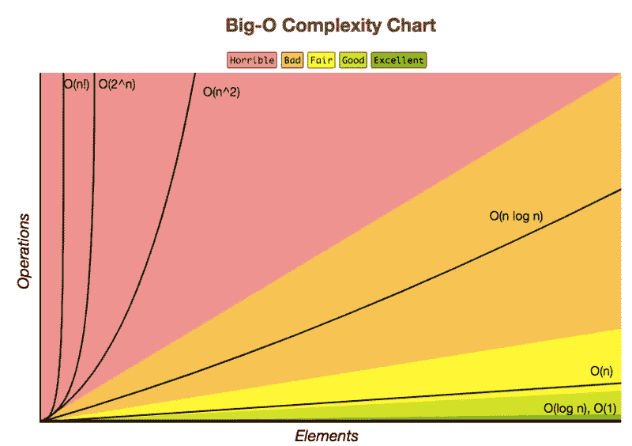

# SQL 教程:如何编写更好的查询

> 原文：<https://towardsdatascience.com/sql-tutorial-how-to-write-better-queries-108ae91d5f4e?source=collection_archive---------1----------------------->

结构化查询语言(SQL)是数据科学行业中不可或缺的技能，一般来说，学习这项技能相当容易。然而，大多数人忘记了 SQL 不仅仅是编写查询，这只是前进道路上的第一步。确保查询是可执行的，或者它们适合您正在工作的环境，这完全是另外一回事。

这就是为什么本 SQL 教程将为您提供一些步骤，您可以通过这些步骤来评估您的查询:

*   首先，你将从学习 SQL 对于数据科学工作的重要性[开始；](https://www.datacamp.com/community/tutorials/sql-tutorial-query#importance)
*   接下来，您将首先了解更多关于 [SQL 查询处理和执行](https://www.datacamp.com/community/tutorials/sql-tutorial-query#execution)的知识，以便您能够正确理解编写定性查询的重要性:更具体地说，您将看到查询被解析、重写、优化并最终被评估；
*   记住这一点，你不仅会复习一些初学者在编写查询时会犯的[查询反模式](https://www.datacamp.com/community/tutorials/sql-tutorial-query#antipattern)，还会学到更多关于那些可能错误的替代方案和解决方案；您还将了解更多关于基于集合的查询方法与基于过程的查询方法的对比。
*   您还将看到，这些反模式源于性能考虑，并且除了改进 SQL 查询的“手动”方法之外，您还可以[通过使用一些其他工具来帮助您查看查询计划，以更结构化、更深入的方式来分析您的查询](https://www.datacamp.com/community/tutorials/sql-tutorial-query#queryplan)；而且，
*   在执行查询之前，您将简要地更深入地了解[时间复杂性和大 O 符号](https://www.datacamp.com/community/tutorials/sql-tutorial-query#bigo),以了解执行计划的时间复杂性；最后，
*   您将简单地得到一些关于如何进一步调优您的查询的提示。


你对 SQL 课程感兴趣吗？参加 DataCamp 的[数据科学 SQL 简介](https://www.datacamp.com/courses/intro-to-sql-for-data-science)课程！

# 为什么要学数据科学的 SQL？

SQL 远未消亡:它是数据科学行业工作描述中最受欢迎的技能之一，无论你申请的是数据分析师、数据工程师、数据科学家还是其他任何角色。2016 年 O'Reilly Data Science 薪酬调查的 70%受访者证实了这一点，他们表示在自己的专业背景下使用 SQL。此外，在这项调查中，SQL 远远超过 R (57%)和 Python (54%)编程语言。

你明白了:当你想在数据科学行业找到一份工作时，SQL 是一项必备技能。

对于 20 世纪 70 年代早期开发的语言来说，这已经不错了，对吗？

但是为什么它被如此频繁地使用呢？为什么它已经存在了这么长时间却没有死？

有几个原因:第一个原因是，公司大多将数据存储在关系数据库管理系统(RDBMS)或关系数据流管理系统(RDSMS)中，您需要 SQL 来访问这些数据。SQL 是数据的通用语言:它让您能够与几乎任何数据库进行交互，甚至在本地构建自己的数据库！

似乎这还不够，请记住，有相当多的 SQL 实现在供应商之间是不兼容的，并且不一定遵循标准。因此，了解标准 SQL 是你在(数据科学)行业中找到出路的一项要求。

最重要的是，可以肯定地说，SQL 也已经被更新的技术所接受，例如 Hive，一个用于查询和管理大型数据集的类似 SQL 的查询语言接口，或者 Spark SQL，您可以使用它来执行 SQL 查询。同样，您在那里找到的 SQL 将不同于您可能已经学习过的标准，但是学习曲线将会容易得多。

如果你确实想做一个比较，就把它当作学习线性代数:通过把所有的努力投入到这个科目中，你知道你也能够用它来掌握机器学习！

简而言之，这就是为什么您应该学习这种查询语言:

*   这很容易学，即使对完全的新手来说也是如此。学习曲线非常简单且循序渐进，因此您很快就可以编写查询了。
*   它遵循“学一次，用在任何地方”的原则，所以这是一个伟大的投资你的时间！
*   这是对编程语言的极好补充；在某些情况下，编写查询甚至比编写代码更受欢迎，因为它更具性能！
*   …

你还在等什么？:)

# SQL 处理和查询执行

为了提高 SQL 查询的性能，您首先必须知道当您按快捷键运行查询时内部发生了什么。

首先，将查询解析成“解析树”；分析该查询以查看它是否满足语法和语义要求。解析器创建输入查询的内部表示。这个输出然后被传递给重写引擎。

然后，优化器的任务就是为给定的查询找到最佳的执行或查询计划。执行计划确切地定义了每个操作使用什么算法，以及如何协调操作的执行。

为了找到最佳的执行计划，优化器会列举所有可能的执行计划，确定每个计划的质量或成本，获取有关当前数据库状态的信息，然后选择最佳的执行计划作为最终的执行计划。因为查询优化器可能并不完美，所以数据库用户和管理员有时需要手动检查和调整优化器生成的计划，以获得更好的性能。

现在您可能想知道什么被认为是“好的查询计划”。

正如你已经读到的，计划成本的质量起着巨大的作用。更具体地说，评估计划所需的磁盘 I/o 数量、计划的 CPU 成本、数据库客户端可以观察到的总响应时间以及总执行时间等都是必不可少的。这就是时间复杂性概念的由来。稍后你会读到更多这方面的内容。

接下来，执行选择的查询计划，由系统的执行引擎进行评估，并返回查询结果。



从上一节中可能还不清楚的是，垃圾输入、垃圾输出(GIGO)原则在查询处理和执行中自然地显现出来:制定查询的人也掌握着 SQL 查询性能的关键。如果优化器得到一个错误的查询，它只能做同样多的事情…

这意味着当你写一个查询时，有些事情*你*可以做。正如您在简介中已经看到的，责任是双重的:不仅要编写符合特定标准的查询，还要收集查询中潜在性能问题的想法。

一个理想的起点是在您的查询中考虑问题可能潜入的“点”。一般来说，有四个条款和关键字，新手可能会遇到性能问题:

*   `WHERE`条款；
*   任何`INNER JOIN`或`LEFT JOIN`关键字；而且，
*   `HAVING`条款；

诚然，这种方法简单而幼稚，但作为初学者，这些子句和语句是很好的指针，可以肯定地说，当你刚刚开始时，这些地方就是错误发生的地方，讽刺的是，它们也是很难发现的地方。

然而，您还应该认识到，性能需要一个上下文才有意义:当您考虑 SQL 性能时，简单地说这些子句和关键字不好是不可取的。在您的查询中有一个`WHERE`或`HAVING`子句并不一定意味着它是一个糟糕的查询…

请看下一节，了解更多关于反模式和构建查询的替代方法。这些提示和技巧是作为指南。实际上，如何以及是否需要重写查询取决于数据量、数据库以及执行查询的次数等。这完全取决于您的查询目标，并且对您想要查询的数据库有一些先验知识是至关重要的！

# 1.仅检索您需要的数据

当您编写 SQL 查询时，“数据越多越好”的思维定势并不是您必须遵循的:您不仅会因为获取了超过实际需要的数据而有模糊见解的风险，而且您的性能可能会因为查询提取了太多数据而受到影响。

这就是为什么寻找`SELECT`语句、`DISTINCT`子句和`LIKE`操作符通常是个好主意。

当您编写查询时，首先可以检查的是`SELECT`语句是否尽可能紧凑。你的目标应该是从`SELECT`中删除不必要的列。通过这种方式，您可以强迫自己只提取符合查询目标的数据。

如果您有包含`EXISTS`的相关子查询，您应该尝试在该子查询的`SELECT`语句中使用一个常量，而不是选择一个实际列的值。当您只检查存在性时，这尤其方便。

**记住**相关子查询是使用外部查询中的值的子查询。请注意，尽管`NULL`在这种情况下可以作为一个“常量”工作，但这非常令人困惑！

考虑下面的例子来理解使用常数的含义:

```
SELECT driverslicensenr, name 
FROM Drivers 
WHERE EXISTS (SELECT '1' FROM Fines 
              WHERE fines.driverslicensenr = drivers.driverslicensenr);
```

**提示**:知道拥有一个相关子查询并不总是一个好主意是很方便的。你总是可以考虑去掉它们，比如用一个`INNER JOIN`重写它们:

```
SELECT driverslicensenr, name 
FROM drivers 
INNER JOIN fines ON fines.driverslicensenr = drivers.driverslicensenr;
```

`SELECT DISTINCT`语句仅用于返回不同的值。`DISTINCT`是一个如果可以的话，你绝对应该尽量避免的条款；与您在其他示例中看到的一样，只有在查询中添加这个子句，执行时间才会增加。因此，考虑一下你是否真的需要这个`DISTINCT`操作来获得你想要完成的结果总是一个好主意。

当您在查询中使用`LIKE`操作符时，如果模式以`%`或`_`开头，则不会使用索引。它将阻止数据库使用索引(如果存在的话)。当然，从另一个角度来看，您也可以认为这种类型的查询可能会检索太多不一定满足您的查询目标的记录。

同样，您对存储在数据库中的数据的了解可以帮助您制定一个模式，该模式将正确地过滤所有数据，只找到对您的查询真正重要的行。

# 2.限制你的结果

当你无法避免过滤掉你的`SELECT`语句时，你可以考虑用其他方式限制你的结果。这就是诸如`LIMIT`子句和数据类型转换等方法的用武之地。

您可以在查询中添加`LIMIT`或`TOP`子句来设置结果集的最大行数。以下是一些例子:

```
SELECT TOP 3 * FROM Drivers;
```

**注意**您可以进一步指定`PERCENT`，例如，如果您通过`SELECT TOP 50 PERCENT *`更改查询的第一行。

```
SELECT driverslicensenr, name FROM Drivers LIMIT 2;
```

此外，您还可以添加`ROWNUM`子句，这相当于在查询中使用`LIMIT`:

```
SELECT * 
FROM Drivers 
WHERE driverslicensenr = 123456 AND ROWNUM <= 3;
```

您应该总是尽可能使用最有效的，也就是最小的数据类型。当您提供一个较大的数据类型，而一个较小的数据类型就足够了时，总会有风险。

但是，当您将数据类型转换添加到查询中时，只会增加执行时间。

另一种方法是尽可能避免数据类型转换。这里还要注意，并不总是能够从查询中删除或省略数据类型转换，但是在包含它们时一定要小心，并且当您这样做时，要在运行查询之前测试添加的效果。

# 3.不要让查询变得不必要的复杂

数据类型转换把您带到了下一点:您不应该过度设计您的查询。尽量保持简单高效。这可能看起来太简单或太愚蠢，甚至不能作为提示，尤其是因为查询可能会变得复杂。

然而，您将在下一节提到的示例中看到，您可以很容易地将简单的查询变得比实际需要的更复杂。

当您在查询中使用`OR`操作符时，很可能您没有使用索引。

**记住**索引是一种数据结构，可以提高数据库表中数据检索的速度，但这是有代价的:需要额外的写操作和额外的存储空间来维护索引数据结构。索引用于快速定位或查找数据，而不必在每次访问数据库表时搜索数据库中的每一行。可以通过使用数据库表中的一列或多列来创建索引。

如果您不利用数据库包含的索引，您的查询将不可避免地需要更长的时间来运行。这就是为什么最好在查询中寻找使用`OR`操作符的替代方法；

考虑以下查询:

```
SELECT driverslicensenr, name 
FROM Drivers 
WHERE driverslicensenr = 123456 OR driverslicensenr = 678910 OR driverslicensenr = 345678;
```

您可以通过以下方式替换操作员:

```
SELECT driverslicensenr, name 
FROM Drivers 
WHERE driverslicensenr IN (123456, 678910, 345678);
```

*   两个`SELECT`语句带一个`UNION`。

**提示**:这里，你需要小心不要不必要地使用`UNION`操作，因为你要多次遍历同一个表。同时，您必须意识到，当您在查询中使用一个`UNION`时，执行时间将会增加。`UNION`操作的替代方法是:重新制定查询，将所有条件放在一个`SELECT`指令中，或者使用`OUTER JOIN`代替`UNION`。

**提示**:这里也要记住，即使`OR`——以及下面几节将要提到的其他操作符——可能不使用索引，索引查找也不总是首选！

当您的查询包含`NOT`操作符时，很可能没有使用索引，就像使用`OR`操作符一样。这将不可避免地降低您的查询速度。如果您不知道此处的含义，请考虑以下查询:

```
SELECT driverslicensenr, name FROM Drivers WHERE NOT (year > 1980);
```

这个查询的运行速度肯定会比您预期的要慢，这主要是因为它的表述比实际情况要复杂得多:在这种情况下，最好寻找一种替代方法。考虑用比较运算符代替`NOT`，如`>`、`<>`或`!>`；上面的例子可能真的会被改写成这样:

```
SELECT driverslicensenr, name FROM Drivers WHERE year <= 1980;
```

看起来已经整洁多了，不是吗？

`AND`操作符是另一种不使用索引的操作符，如果以过于复杂和低效的方式使用，会降低查询速度，如下例所示:

```
SELECT driverslicensenr, name 
FROM Drivers 
WHERE year >= 1960 AND year <= 1980;
```

最好重写这个查询并使用`BETWEEN`操作符:

```
SELECT driverslicensenr, name 
FROM Drivers 
WHERE year BETWEEN 1960 AND 1980;
```

另外，`ALL`和`ALL`操作符是一些你应该小心使用的操作符，因为将它们包含在你的查询中，索引将不会被使用。这里有用的替代方法是聚合函数，如`MIN`或`MAX`。

**提示**:在使用建议的替代方法的情况下，您应该意识到这样一个事实，即许多行上的所有聚合函数，如`SUM`、`AVG`、`MIN`、`MAX`，都可能导致长时间运行的查询。在这种情况下，您可以尽量减少要处理的行数，或者预先计算这些值。您再次看到，当您决定使用哪个查询时，了解您的环境、您的查询目标……是非常重要的！

此外，在计算或标量函数中使用列的情况下，不使用索引。一个可能的解决方案是简单地隔离特定的列，使其不再是计算或函数的一部分。考虑下面的例子:

```
SELECT driverslicensenr, name 
FROM Drivers 
WHERE year + 10 = 1980;
```

这看起来很时髦，是吧？相反，尝试重新考虑计算，并将查询重写为如下形式:

```
SELECT driverslicensenr, name 
FROM Drivers 
WHERE year = 1970;
```

# 4.没有暴力

最后一个技巧实际上意味着您不应该过多地限制查询，因为这会影响它的性能。对于连接和`HAVING`子句来说尤其如此。

当连接两个表时，考虑连接中表的顺序是很重要的。如果您注意到一个表比另一个表大得多，您可能希望重写查询，以便将最大的表放在连接的最后。

*   **连接上的冗余条件**

当您向连接中添加太多条件时，您基本上是在迫使 SQL 选择某个路径。然而，这可能并不总是更有效的方法。

最初将`HAVING`子句添加到 SQL 中是因为`WHERE`关键字不能用于聚合函数。`HAVING`通常与`GROUP BY`子句一起使用，将返回的行组限制为仅满足特定条件的那些行。但是，如果在查询中使用这个子句，就不会使用索引，正如您已经知道的那样，这可能会导致查询的执行效果不太好。

如果你正在寻找一个替代方案，考虑使用`WHERE`条款。考虑以下查询:

```
SELECT state, COUNT(*) FROM Drivers WHERE state IN ('GA', 'TX') GROUP BY state ORDER BY stateSELECT state, COUNT(*) FROM Drivers GROUP BY state HAVING state IN ('GA', 'TX') ORDER BY state
```

第一个查询使用`WHERE`子句来限制需要求和的行数，而第二个查询对表中的所有行求和，然后使用`HAVING`丢弃它计算的总和。在这些类型的情况下，带有`WHERE`子句的替代选项显然是更好的，因为您不会浪费任何资源。

您会看到，这不是限制结果集，而是限制查询中的中间记录数。

**请注意**这两个子句的区别在于,`WHERE`子句引入了单个行的条件，而`HAVING`子句引入了聚合或选择结果的条件，其中单个结果，如`MIN`、`MAX`、`SUM`、…是从多个行中产生的。

你看，当你考虑到它们需要尽可能高的性能时，评估质量、编写和重写查询并不是一件容易的工作；当您编写希望在专业环境中的数据库上运行的查询时，避免反模式和考虑替代方案也将是您的职责的一部分。

这个列表只是一些反模式和技巧的一个小概述，希望对初学者有所帮助；如果您想深入了解更多高级开发人员认为最常见的反模式是什么，请查看本讨论。

# 基于集合和过程的查询方法

上述反模式中隐含的事实是，它们实际上归结为基于集合的方法与构建查询的过程方法之间的差异。

查询的过程化方法是一种很像编程的方法:您告诉系统做什么以及如何做。

这方面的一个例子是连接中的冗余条件或滥用`HAVING`子句的情况，就像上面的例子一样，其中通过执行一个函数然后调用另一个函数来查询数据库，或者使用包含循环、条件、用户定义函数(UDF)、游标等的逻辑来获得最终结果。在这种方法中，您经常会发现自己在请求数据的一个子集，然后从数据中请求另一个子集，以此类推。

毫不奇怪，这种方法通常被称为“逐步”或“逐行”查询。

另一种方法是基于集合的方法，您只需指定要做什么。您的角色包括为希望从查询中获得的结果集指定条件或要求。如何检索数据，由决定查询实现的内部机制决定:让数据库引擎决定执行查询的最佳算法或处理逻辑。

由于 SQL 是基于集合的，所以这种方法比过程方法更有效就不足为奇了，这也解释了为什么在某些情况下，SQL 比代码运行得更快。

**提示**基于集合的查询方法也是数据科学行业大多数顶级雇主要求你掌握的方法！您经常需要在这两种方法之间切换。

注意如果你发现自己有一个过程化的查询，你应该考虑重写或者重构它。

# 从查询到执行计划

知道反模式不是静态的，而是随着您作为 SQL 开发人员的成长而发展的，并且当您考虑替代方案时有许多要考虑的事实也意味着避免查询反模式和重写查询可能是一项相当困难的任务。任何帮助都可以派上用场，这就是为什么用一些工具优化查询的更结构化的方法可能是可行的方法。

**还要注意**上一节提到的一些反模式源于性能问题，比如`AND`、`OR`和`NOT`操作符以及它们缺乏索引使用。思考性能不仅需要更结构化的方法，还需要更深入的方法。

无论如何，这种结构化和深入的方法将主要基于查询计划，正如您所记得的，查询计划是查询的结果，它首先被解析为“解析树”,并准确地定义了每个操作使用什么算法以及如何协调操作的执行。

正如您在简介中所读到的，您可能需要检查和调优由优化器手动生成的计划。在这种情况下，您需要通过查看查询计划来再次分析您的查询。

为了掌握这个计划，您需要使用数据库管理系统提供的工具。您可能拥有的一些工具如下:

*   有些包具有可以生成查询计划的图形表示的工具。看一下这个例子:



*   其他工具将能够为您提供查询计划的文本描述。一个例子是 Oracle 中的`EXPLAIN PLAN`语句，但是该指令的名称根据您使用的 RDBMS 而有所不同。在其他地方，你可能会发现`EXPLAIN` (MySQL，PostgreSQL)或者`EXPLAIN QUERY PLAN` (SQLite)。

**请注意**如果您正在使用 PostgreSQL，您会发现`EXPLAIN`与`EXPLAIN ANALYZE`的不同之处，前者只是得到一个描述，说明计划者打算如何执行查询而不运行它，而后者实际执行查询并返回预期与实际查询计划的对比分析。一般来说，实际的执行计划是您实际运行查询的计划，而估计的执行计划是在不执行查询的情况下计算出它将做什么。虽然在逻辑上是等价的，但是实际的执行计划更有用，因为它包含了关于执行查询时实际发生的事情的更多细节和统计信息。

[在本节](https://www.datacamp.com/community/tutorials/sql-tutorial-query)的剩余部分，您将了解更多关于`EXPLAIN`和`ANALYZE`的内容，以及如何使用这两个工具来了解更多关于您的查询计划和查询的可能性能的内容。

**提示**:如果你想更多地了解`EXPLAIN`或者更详细地看例子，可以考虑读一下 Guillaume Lelarge 写的书[“理解解释”](http://www.dalibo.org/_media/understanding_explain.pdf)。

# 时间复杂性&大 O

现在，您已经简要地检查了查询计划，您可以开始更深入地研究，并借助计算复杂性理论以更正式的术语来考虑性能。理论计算机科学中的一个领域，主要是根据计算问题的难度对其进行分类。这些计算问题可以是算法，也可以是查询。

然而，对于查询，您不一定要根据它们的难度来分类，而是根据运行它并获得一些结果所花费的时间来分类。这具体被称为时间复杂性，为了清楚地表达或度量这种类型的复杂性，您可以使用大 O 符号。

使用大 O 符号，您可以根据运行时相对于输入的增长速度来表示运行时，因为输入会变得任意大。大 O 符号排除了系数和低阶项，这样您就可以专注于查询运行时间的重要部分:增长率。当以这种方式表达时，去掉系数和低阶项，时间复杂度被认为是渐近描述的。这意味着输入大小趋于无穷大。

在数据库语言中，复杂性衡量的是随着数据表和数据库大小的增加，一个查询需要运行多长时间。

**注意**数据库的大小不仅会随着更多数据存储在表中而增加，而且数据库中存在索引这一事实也会影响数据库的大小。

正如您之前看到的，执行计划定义了每个操作使用的算法，这使得每个查询执行时间都可以在逻辑上表示为查询计划中涉及的表大小的函数，这被称为复杂性函数。换句话说，您可以使用大 O 符号和您的执行计划来估计查询复杂性和性能。

在下面的小节中，您将对四种类型的时间复杂性有一个大致的了解，并且您将看到一些示例，说明查询的时间复杂性如何根据您运行它的上下文而变化。

提示:索引是故事的一部分！

**不过请注意**，不同的数据库需要考虑不同类型的索引、不同的执行计划和不同的实现，因此下面列出的时间复杂度非常笼统，可以根据您的具体设置而有所不同。

在这里阅读更多。

总而言之，您还可以查看备忘单后面的[来根据时间复杂度和查询的执行情况评估查询的性能:](http://bigocheatsheet.com/)



# SQL 优化

考虑到查询计划和时间复杂性，您可以考虑进一步调优 SQL 查询。你可以从特别注意以下几点开始:

*   用索引扫描替换不必要的大表全表扫描；
*   确保您应用了最佳的表连接顺序；
*   确保您正在以最佳方式使用索引；和
*   缓存小表全表扫描。

恭喜你。您已经完成了这篇博文的结尾，这篇博文只是让您对 SQL 查询性能有了一点了解。希望您对反模式、查询优化器以及用于检查、评估和解释查询计划复杂性的工具有了更多的了解。然而，还有更多的发现！如果你想了解更多，可以考虑读读 R. Ramakrishnan 和 J. Gehrke 写的《数据库管理系统》这本书。

最后，我不想隐瞒 StackOverflow 用户的这句话:

> “我最喜欢的反模式不是测试您的查询。
> 
> 这适用于以下情况:
> 
> -您的查询涉及多个表。
> 
> -您认为您有一个针对查询的最佳设计，但不想测试您的假设。
> 
> -您接受第一个有效的查询，不知道它是否接近优化。"

如果你想开始学习 SQL，可以考虑参加 DataCamp 的[数据科学 SQL 入门](https://www.datacamp.com/courses/intro-to-sql-for-data-science)课程！

*最初发表于*[T5【www.datacamp.com】](https://www.datacamp.com/community/tutorials/sql-tutorial-query)*。*