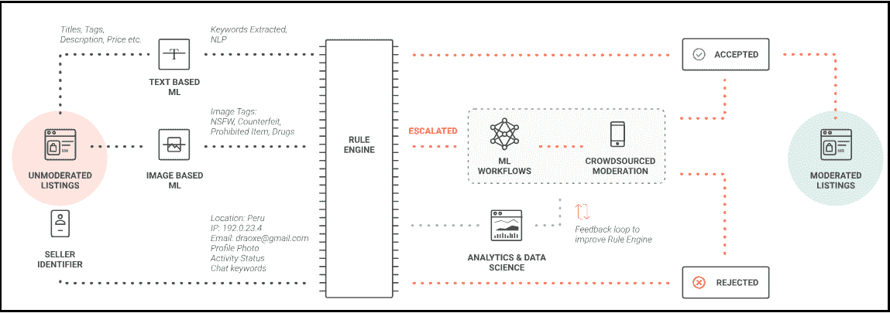
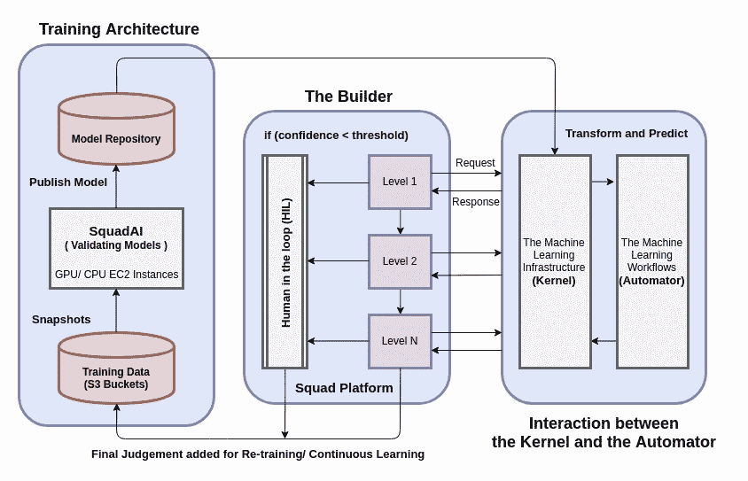
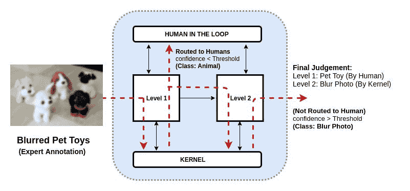
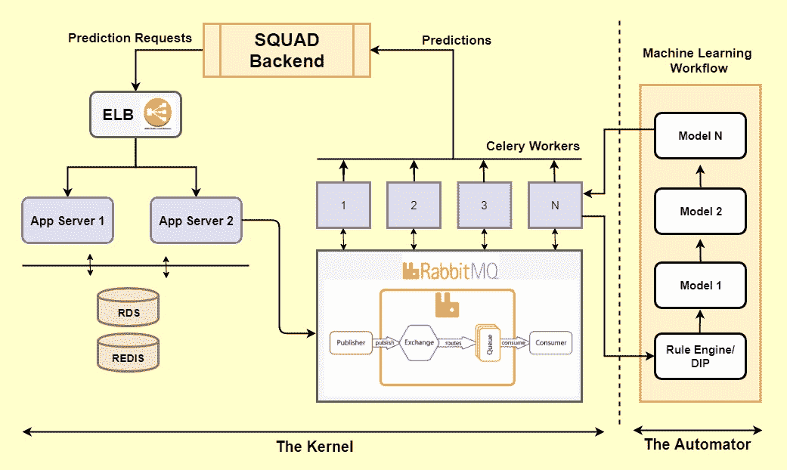

# SquadAI:用于构建、管理和评估机器学习工作流的群体驱动平台

> 原文：<https://towardsdatascience.com/squadai-crowdsourced-driven-platform-for-building-managing-and-evaluating-machine-learning-ca5d28ac9b23?source=collection_archive---------8----------------------->

由于近年来非结构化数据的爆炸式增长，企业缩小准确数据的监管和提取可操作的见解之间的差距变得越来越具有挑战性。随着众包的出现，现在更容易收集和注释训练机器学习(ML)模型所需的前所未有的大量数据。建立一个高效的机器学习模型需要不断的迭代和修正。

ML 工程师构建和部署机器学习模型所遵循的典型流程包括:

1.  训练、验证和测试数据集的管理，
2.  数据集的清理和预处理，
3.  特征选择和参数调整，
4.  比较各种验收指标(准确性、敏感性、特异性、精确度等)和
5.  将模型移至生产环境，以进行大规模预测。

当一个人需要为不同的业务问题训练、部署和管理数百个这样的模型时，就会出现令人畏惧的情况。

在 [Squad](https://www.squadplatform.com/) ，我们正在构建 SquadAI，这是一个人在回路中的机器学习平台，用于管理 ML 模型的数据管理、培训、测试、评估和部署的整个过程。在这篇博文中，我们将讨论 SquadAI 的架构和各个模块，以及它对扩展业务流程和满足我们的客户和 Squad 机器学习团队的速度、准确性、灵活性和成本 SLA 的影响。

**小队的诞生**

在每一个行业中，为了达到规模，都需要执行某些流程和数字操作。例如，像阿里巴巴和亚马逊这样的大型电子商务市场维护着数百万种产品。这些产品经过质量控制操作，如产品分类和标签，内容审核和丰富。所有这些操作都需要特定的数据工作流来将庞大的非结构化数据转换为更有用的格式，以便于分析和业务洞察。由于深度、密集和多样化数据的爆炸式增长，企业采用不同的方法使准确和可用的数据可用于数据驱动的流程变得至关重要。

在 Squad，我们正在使用一个智能工作流构建器来颠覆业务流程外包行业，该构建器在单个平台上结合了众包和机器学习的力量。众包利用高质量分布式劳动力的经验来执行定制的微任务。在对从这种微任务获得的注释数据进行严格检查之后，它可以用于训练机器学习模型。

**机器学习团队的挑战**

为现实世界的微任务创建 ML 模型需要不断的迭代、评估，当然还有修正。为了建立有效的 ML 模型，机器学习团队为给定的任务收集数据，为精选的数据构建假设，预处理数据以提取特征，运行算法以学习模型，对照假设验证模型，并基于它们的评估来改进模型和假设。

一旦密集的实验完成，模型就被部署到生产环境中进行实时推理。团队通常必须执行几个这样的实验，以便为给定业务流程的自动化在各种微任务上建立 ML 模型的优化工作流。

存在各种挑战，包括:

1.  无法追溯模型构建的整个过程和不同实验的见解，
2.  无法在团队中重用和共享公共模型管道，
3.  花费在维护培训、发布和管理新模型的基础设施上的大量时间，
4.  存储和分析不同阶段模型性能的效率低下，导致重复昂贵的实验。

Figure 1\. Optimized Workflow for Data Quality Control with Human-in-the-Loop Machine Learning for Our [Trust and Safety Product](https://www.squadplatform.com/trust-and-safety/)

**小队概述**

我们介绍了正在进行的 SquadAI 工作，这是一个用于构建、管理和评估机器学习工作流的人在回路平台。我们讨论了小队的不同组成部分。

SquadAI 是一个平台，旨在大规模地简化跨 Squad 的数据管理和模型构建过程。我们的愿景是构建一个产品，只需点击几下鼠标，就可以轻松地将新构建的 ML 工作流集成到生产环境中并进行管理。图 1 展示了使用 SquadAI 进行数据质量控制的优化工作流程。它由不同级别的各种块组成，使用 SquadAI 固有的共享代码块和管道构建。“人在回路”模块用于获取不同现实世界任务的学习模型的注释数据，以及基于专家反馈对这些模型的持续改进。这个平台的三个主要组件是构建器、自动机和内核。

Figure 2, illustrates major components of SquadAI training architecture. The Builder, Automator and Kernel.

**建造者**

构建器用于配置我们的机器学习工作流。一个**工作流**是一个带有边的图，只有在满足特定条件时才会被激活。例如:如果其中一个级别的答案是 ***A*** ，则可能流向节点 ***Na*** 或者答案是 ***B*** ，则应流向节点 ***Nb*** 。就像一个图一样，一个工作流由许多**节点** ( ***级*** )组成。这些级别具有不同的复杂性，类似于现实世界的任务。例如，验证假货、NSFW、服装和模糊检查的列表的 C2C 问题的典型工作流程可以包括四个级别，每个级别用于假货检测、NSFW、布料分类和模糊检测。

对于任何复杂的 C2C 问题，我们都有一个由许多级别组成的工作流，机器学习团队在这些特定的级别上工作，并试图通过建立相关的机器学习模型来实现自动化。为了实现这一点，图中有一个节点将数据和级别名称发送给内核[*、小队骨干*](https://medium.com/@om.vedvasu/evolution-of-kernel-the-backbone-of-squadai-7c605ec64b28)*。内核根据为该级别设计的工作流异步运行数据。 ***自动机*** 对该数据调用一系列集成模型，并将预测返回给内核。所有这些预测都通过一个网络挂钩发送回构建器。整个过程必须满足特定的 SLA，时间从几秒钟到几分钟不等。如果内核没有在定义的 SLA 内回传结果，数据流向***【HIL】***模块进行判断。在满足 SLA 的情况下，针对特定级别超过 HIL 块，并且针对内容调节，将传入的样本***【SKU】***路由到进一步的级别。图 3 示出了一个典型的工作流构建，使用构建器来检测输入的 SKU 是否模糊以及它是否包含宠物玩具。*

**

*Figure 3, a typical two level workflow build using **Builder** for detecting if incoming **SKU** is blur or not and contains a Pet toy. Data Points are sent to each level, and corresponding model workflow at each level is used for predicting the target label, if the prediction score is above a threshold it is routed to next level, if the socre is below thresold, the data unit is routed to Human-in-the-loop.*

***自动机***

*Automator 由 ***BaseNode*** 组成，原生支持 [*python*](https://www.python.org/) 中各种机器学习算法的开发。它还支持外部框架和库，如 [TensorFlow](https://www.tensorflow.org/) 、 [Tesseract](https://github.com/tesseract-ocr/tesseract) 等。BaseNode 可以灵活地重复使用代码，并为不同的微观任务构建模型，例如检测假货、NSFW、基于价格和描述的可疑列表、基于文本分类的类别校正或图像中的对象检测。然后，可以将多个模型集成在一起，以对工作流所代表的复杂任务进行预测。任何新的工作流都可以轻松配置，相应的信息存储在内核中，这使得我们的机器学习团队可以轻松地将任何工作流投入生产。下面是我们的***BaseTrainingPipeline***的一些方法的代码片段。*

***内核***

*内核用于存储自动机和构建器的每个阶段。SKU 是由*构建器*消耗的非结构化数据，然后被转换成单个单元 ***数据点*** 并存储在表中的单独行中。每当数据单元 DU 被加载时，一个 *DU_workflow_prediction* 请求被创建并存储在相应的表中。这些预测请求 id 随后由*自动机*一起缓冲。每次从*自动机*接收到一个预测，它被保存在不同的表***DU _ Workflow _ Prediction***中。我们还节省了每个模型和模型管道每个阶段所花费的时间，包括预测时间。集合模型系列的所有预测都存储在表***DP _ ML _ model _ prediction***中，用于评估和分析。我们将从*生成器*获得的数据缓冲一段时间，然后进行批处理，而不是对每个数据单元进行单个预测。我们使用 R [edis 队列](https://github.com/rq/django-rq)来缓冲数据的预测请求 id，在定义的时间限制(可配置)后，我们弹出队列，获取它们的预测，并将其返回给*构建器*。我们使用类似于 [***芹菜***](http://www.celeryproject.org/) ***和*** [***兔子 MQ***](https://www.rabbitmq.com/) 的工具用于异步基础设施。我们已经使用 [Docker](https://www.docker.com/) 设置了 RMQ 和芹菜工人。*

**

*Figure 3, illustrates interaction of *Automator with Kernel. Automator is used to configure* machine learning model workflow at a particular level of our C2C Data Quality Control workflow.*

***未来***

*正在进行的 SquadAI 工作是一个单一的平台，利用群体的智慧提取、预处理非结构化数据并将其转化为可用的形式，这将使我们能够解决复杂的问题，如 C2C 市场的内容审核。由于该平台不依赖于任何特定的领域，它可以用于任何类型的数据，无论是文本、图像还是语音。我们使用通过我们的劳动力获得的带注释的数据来学习一系列机器学习模型，这些模型可以通过最少的代码更改轻松配置。内核为 SquadAI 的每个阶段建立了索引，以便于查询和评估。SquadAI 的不同模块有助于管理模型构建过程中涉及的不同阶段，从而提高了 Squad 的数据科学团队的工作效率。squad 的 ML 工程师现在可以轻松地配置新的实验，将它们与基线进行比较，并且只需点击几下鼠标就可以概括见解。*

*感谢 [Vedvasu Sharma](https://www.linkedin.com/in/ved-vasu-sharma-34588ba2/) 令人印象深刻的数字和整个 ML 团队( [Aniket Bhatnagar](https://www.linkedin.com/in/aniket-bhatnagar-a323a7117/) 、 [Medha Katehar](https://www.linkedin.com/in/medhakatehara/) a、 [Pragya Jaiswal](https://www.linkedin.com/in/pragya-jaiswal-61016172/) 、 [Priyank Jain](https://www.linkedin.com/in/priyank-jain-a0566a113/) 和 [Ketan Bhatt](https://www.linkedin.com/in/bhattketan/) )为 SquadAI 做出的贡献。*

*点击链接阅读更多关于[进化“内核”的进化:小队的骨干](/evolution-of-kernel-the-backbone-of-squadai-7c605ec64b28)。*

*Squad 的机器学习团队最近冒险为我们的主要资格产品 [SquadVoice](https://www.squadvoice.co/) 构建了一个令人惊叹的质量评分框架。请继续关注我们如何利用 SquadAI 进行语音数据快速实验的更多更新。*