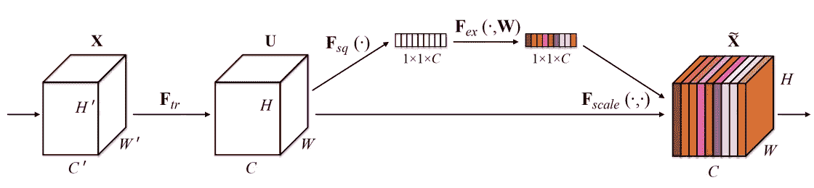
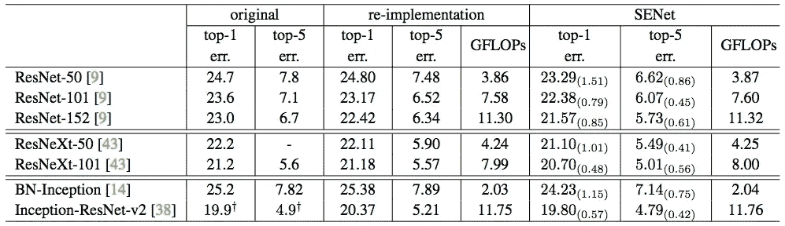

# 压缩和激励网络

> 原文：<https://towardsdatascience.com/squeeze-and-excitation-networks-9ef5e71eacd7?source=collection_archive---------1----------------------->

## 在 ImageNet 上建立一个新的艺术状态



挤压和激励网络( [SENets](https://arxiv.org/abs/1709.01507) )为 CNN 引入了一个构建模块，以几乎没有计算成本的方式改善了通道的相互依赖性。它们被用于今年的 ImageNet 比赛，并帮助将结果比去年提高了 25%。除了这种巨大的性能提升，它们可以很容易地添加到现有的架构。主要想法是这样的:

> 让我们为卷积块的每个通道添加参数，以便网络可以自适应地调整每个特征图的权重。

虽然听起来很简单，但就是这样。所以，让我们更仔细地看看为什么这工作得这么好，以及我们如何用五行简单的代码潜在地改进任何模型。

# “为什么”

CNN 使用他们的卷积滤波器从图像中提取等级信息。下层可以发现边缘或高频等琐碎的上下文，而上层可以检测人脸、文本或其他复杂的几何形状。他们提取有效解决任务所需的任何东西。

所有这些都是通过融合图像的空间和通道信息来实现的。不同的过滤器将首先在每个输入通道中找到空间特征，然后在所有可用的输出通道中添加信息。我在另一篇[文章](https://medium.com/towards-data-science/types-of-convolutions-in-deep-learning-717013397f4d)中详细介绍了这个操作。

您现在需要了解的是，在创建输出要素地图时，网络会对其每个通道进行同等加权。SENets 通过添加内容感知机制来自适应地加权每个频道来改变这一点。在最基本的形式中，这可能意味着给每个通道添加一个参数，并给它一个线性标量，表示每个通道的相关程度。

然而，作者把它推进了一点。首先，他们通过将特征图压缩为单个数值来获得每个通道的全局理解。这导致大小为 *n* 的向量，其中 *n* 等于卷积信道的数量。之后通过一个两层的神经网络进行馈入，输出一个同样大小的向量。这些 *n* 值现在可以用作原始特征图上的权重，根据重要性缩放每个通道。

# “如何”

在最后一段中，你可能已经失去了一点信心，这真的像我承诺的那样简单。因此，让我们直接开始实施 SE-block。

```
def se_block(in_block, ch, ratio=16):
    x = GlobalAveragePooling2D()(in_block)
    x = Dense(ch//ratio, activation='relu')(x)
    x = Dense(ch, activation='sigmoid')(x)
    return multiply()([in_block, x])
```

1.  给该函数一个输入卷积块和它所拥有的当前通道数
2.  我们使用平均池将每个通道压缩为一个数值
3.  一个全连接层后接一个 ReLU 函数，增加了必要的非线性。它的输出通道复杂度也降低了一定的比例。
4.  第二个完全连接的层之后是 Sigmoid 激活，为每个通道提供平滑的门控功能。
5.  最后，我们根据侧网络的结果对卷积块的每个特征图进行加权。

这五个步骤几乎不会增加额外的计算成本(不到 1%)，并且可以添加到任何模型中。


Vanilla ResNet Module vs the proposed SE-ResNet Module

作者表明，通过向 ResNet-50 添加 SE-blocks，您可以期望获得与 ResNet-101 几乎相同的精度。这对于一个只需要一半计算成本的模型来说是令人印象深刻的。本文进一步研究了其他体系结构，如 Inception、Inception-ResNet 和 ResNeXt。后者引导他们修改版本，在 ImageNet 上显示 3.79%的前 5 名错误。



How SENets improve existing architectures

SENets 最让我惊讶的是它们是如此简单而有效。能够以几乎零成本的方式将这种方法添加到任何模型中，应该会让您跳回绘图板，重新训练您曾经构建的所有东西。

这是我计划写的一系列论文摘要的第一篇。我想强迫自己阅读和理解新的论文，以跟上最近的 AI 趋势。如果你想投稿或者在我的文章中发现错误，请联系我。