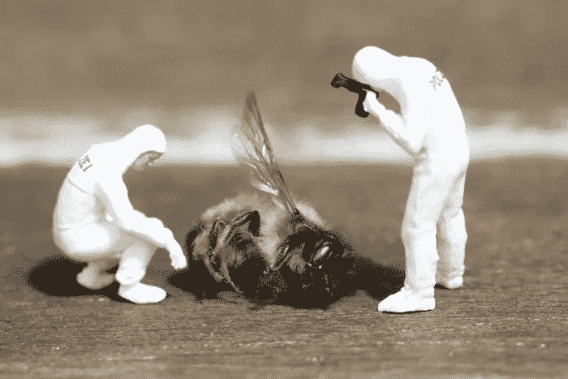
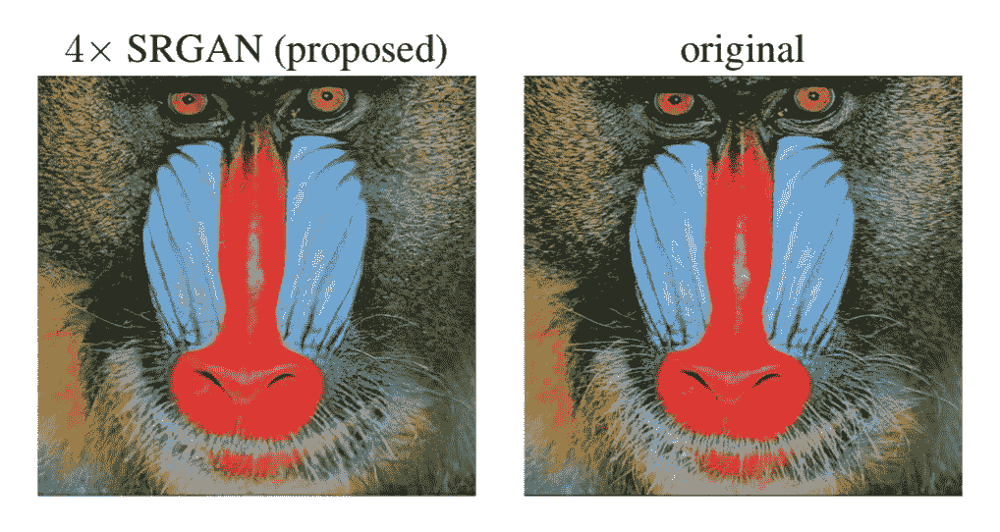
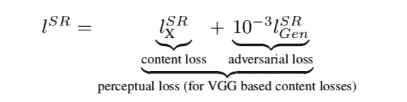
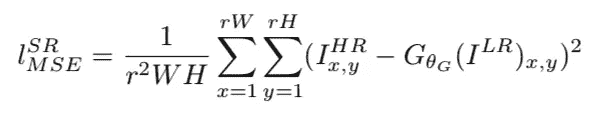
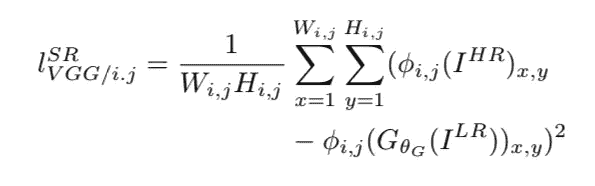
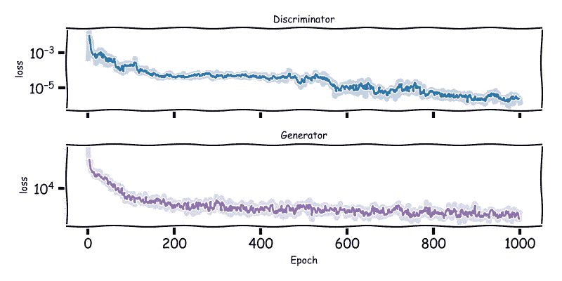
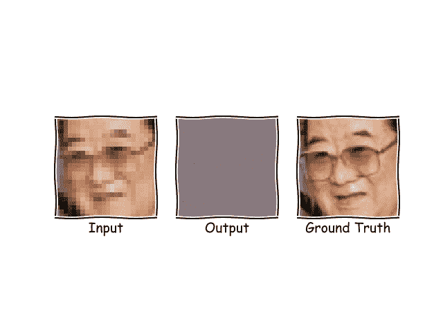
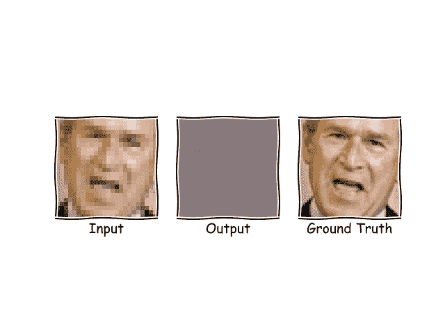
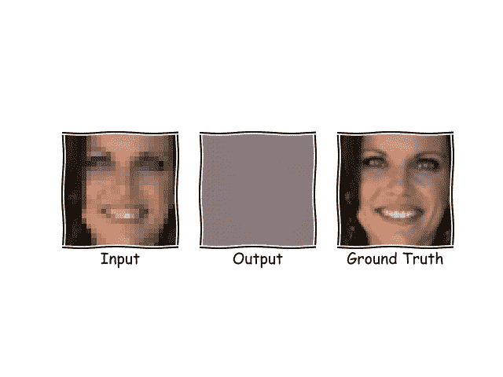

# SRGAN，TensorFlow 实现

> 原文：<https://towardsdatascience.com/srgan-a-tensorflow-implementation-49b959267c60?source=collection_archive---------3----------------------->

(查找代码关注本帖[此处](https://gitlab.cern.ch/smaddrel/faces-SRGAN)。)

我们都在一部犯罪惊悚片中看到过这样的时刻，主人公让技术人员放大并增强图像，车牌变得可读，像素化的面孔变得清晰，破案所需的任何证据都被找到了。

我们都嘲笑过、笑过、小声嘀咕过丢失的信息是如何无法恢复的。

不再是了。嗯，算是吧。原来信息只是部分丢失了。类似地，作为人类，我们可能会根据我们对世界的了解来推断模糊图像的细节，现在我们可以成功地将相同的逻辑应用于图像，以恢复因分辨率效果而丢失的“*照片级真实感*”细节。

这是超分辨率的本质，通过对低到高分辨率图像转换的复杂理解，在亚像素尺度上解锁信息。

撇开 CSI 的陈词滥调不谈，超分辨率在现实生活中的应用数不胜数，而且利润丰厚。

缺乏细节的旧家庭照片可以被恢复和增强，以看到人们的脸，你手机上的相机现在可以像单反相机一样捕捉图像，一直到医学成像或自动驾驶汽车的传感器数据。

然后是商业方面，*数据是新的石油*。不管这种陈词滥调有多老套，可以肯定的是，高质量的数据是昂贵的，人们会为此付出高昂的代价。就数据科学项目而言，高质量的数据可能意味着燃煤和火箭燃料之间的差异。因此，有可能简单地“T6”增强“T7”公司已经拥有的形象集的想法？这是一个非常诱人的提议。

在过去的十年里，相机技术不断进步，我们现在希望我们看到的任何东西都有像素完美、丰富的图像。这听起来可能很有趣，但这种技术的早期采用者是用户策划的食谱网站，其图像可以追溯到十多年前。通过增强旧图像，他们希望保留旧食谱的价值。([此处](http://delivery.acm.org/10.1145/3240000/3230587/p33-nagano.pdf?ip=82.41.236.141&id=3230587&acc=OA&key=4D4702B0C3E38B35%2E4D4702B0C3E38B35%2E4D4702B0C3E38B35%2E0A01D71C9AF92678&__acm__=1540588693_c9e1b8e5a55d11ea619939eb88e400a6))

将智能手机变成单反相机暗示了超分辨率方法的一个更微妙的细节，正在学习的是从一个空间到另一个空间的映射，在我们的情况下是从低分辨率到高分辨率。但是没有什么说这就是它所能做的，为什么不包括风格转换呢？将图像增强到高分辨率，同时调整曝光和对比度，增加一些深度，也许会让人们大开眼界？这些都是相同方法的例子。一篇涵盖更多“*香草*”式转会例子的精彩文章，请看[这里](https://medium.com/data-science-group-iitr/artistic-style-transfer-with-convolutional-neural-network-7ce2476039fd)。

在许多方面，最有趣的例子是传感器技术。大量的时间和金钱花费在开发用于医疗成像、安全和监控的传感器上，然后这些传感器通常被部署在具有挑战性的条件下，而没有预算来利用尖端硬件。

这在最近这篇关于 MRI 数据(这里是)或用于实验室显微镜检查(这里是)的 3D SRGANs 的论文中以多种方式达到高潮。将来，医院或实验室可以花必要的钱购买一台最先进的机器，或者购买几台较便宜的型号，雇用更多的员工，看更多的病人，但结果却是一样的？

不管应用程序如何，超分辨率将会一直存在，但事实是它已经存在很长时间了。

自从图像处理出现以来，各种方法就一直存在，(双三次，线性等)..)最近发展到一些非常有前途的神经网络方法来描述 LR 空间到 HR 空间之间复杂的多维转换矩阵。

然而，所有这些方法都遇到了最重要的绊脚石。它们都不能始终如一地产生人眼看起来自然的图像。

2017 年，Twitter 的一个小组取得了突破性进展([此处为](https://arxiv.org/pdf/1609.04802.pdf))，他们没有在神经网络中做任何与同行完全不同的架构，而是将注意力转向了谦逊的损失函数。

他们实现了一种叫做感知损失函数的东西，这种函数可以更好地调整网络，以产生人眼满意的图像。

部分是通过使用一个聪明的表示技巧，其中预先训练的最先进的 CNN 模型( [VGG](http://www.robots.ox.ac.uk/~vgg/research/very_deep/) 来自牛津大学的小组)基于生成的图像与其高分辨率真相相比的特征映射来计算损失。

这些改进产生了惊人的结果。细节并不总是完美的，但与大多数尝试不同的是，细节是存在的，图像的整体感觉非常好。

From the SRGAN paper, the proposed image is almost identical to the original even with a four times downsampling factor. Look at the details around the eyes or the whiskers.

与纯生成相比，当有一个参考图像开始时，为什么生成真实的图像会更难，这不是很直观，所以为了探索这个想法，让我们回到我们的伪造者和专家，考虑这个新的范式对他们意味着什么。

他们没有出售任何珍贵的旧艺术品，而是展出了几件著名的艺术品，预计会以创纪录的价格售出。

我们的伪造者对艺术界知之甚少(喜欢把工作和家庭生活分开)，也不知道这些画应该是什么样子。然而，就在他们坐下来画他们提交的作品之前，他们看到了传单上的一个小图像，上面有将要拍卖的画。太好了，现在他们有参考图像了！

唯一的问题是传单很小，而真正的画很大，他们知道专家会非常仔细地观察。他们必须弄清楚细节。

所以现在，画一幅伟大的作品不仅足够好，而且必须是那种特定的作品。尽管对细节一无所知，但伪造者并没有因此却步。

最初，伪造者决定最好的方法是改变细节，这样平均来说，在传单的像素大小上，伪造品与像素的颜色相匹配，并且作为一种现实主义的尝试，试图避免颜色的明显不连续，并确保笔触(像素)平滑地运行在一起。他们让一个朋友溜进拍卖行，对照真实图像逐一检查每一笔。

第一种方法类似于 MSE(均方误差，有艺术许可。)

这在最初对伪造者来说效果很好，但是遇到了一个绊脚石，专家不能很好地指出它，但是这些图像似乎有些不对劲。有一种与画布大小不匹配的模糊或缺乏清晰度，这些图像大多被视为赝品而被拒绝。通过匹配笔触，伪造者失去了整个图像的感觉，笔触的技术是完美的，但作为一个集合，笔触没有完全捕捉到风格，从图像到图像的概括是很难的工作。

因此，伪造者采取了不同的方法，而不是担心单独的笔触与图像匹配，他们希望这幅画类似于世界上的真实物体。于是他们请另一位朋友描述他们创作的画，这位朋友不是艺术家，所以不在乎技巧，但却一丝不苟地描述画中的物体。

然后，他们让同一位朋友去拍卖行，在伪造者试图复制的画作上做笔记。然后伪造者比较这些笔记，伪造品与真实图像的描述相符吗？这是 VGG 的感性损失。

因此，最终通过结合这两个朋友的反馈，伪造者了解到图像的细节，如此精致的细节，以至于他们可以仅仅从传单上的小图像和几个内部人士反馈的信息中制作出杰作的复制品，这样做让他们都赚了很多钱。

如果我们从技术角度考虑一下。在我之前的[文章](https://medium.com/@sam.maddrellmander/conditional-dcgan-in-tensorflow-336f8b03b7b6)中，我们使用条件网络从 MNIST 数据集生成数字，即指定所生成图像的类别。这是一个约束，将产生的图像限制在学习分布的特定区域内。然而，通过选择一个特定的图像来填充，我们更明显地限制了生成器的自由。

我们现在需要一个长范围的连续性和细节，这样才能在大量信息丢失的情况下看起来令人信服。

突破来自感知损失函数的出现。这是上面伪造者使用的第二种方法。

这个令人惊讶的简单想法只是将内容损失(VGG)与适当加权的对抗性损失以 1000:1 的比例结合起来。这足以鼓励生成器在自然图像的 PDF 中找到解决方案，而不会过度限制网络进行复制而不是生成。

虽然再现正确的像素很重要，但通过 MSE 学习此制图表达缺乏上下文，使用 VGG 网络的想法是它对要素总体上有很好的“感觉”,并且像素之间的空间关系具有更大的权重，因此通过比较 VGG 网络每一层要素制图表达的潜在空间，高级别和低级别的要素都可以以现实的方式得到鼓励，并可以指导生成的图像的样式。

值得花一点时间来看看这些损失函数背后的数学原理，以理解其实现方式，但对于那些不感兴趣的人，可以直接跳到结果部分。

第一个等式显示了由鉴别器和发生器进行的标准最小/最大游戏。这是调节 gan 的标准方法，依赖于找到某种平衡，但相信鉴别器是发电机上的导向力。

The expectation values are minimised with respect to the generator parameters, and maximised w.r.t. the discriminator parameters, until an equilibrium is reached

感知损失在第二个等式中描述，这是本文的关键原创贡献，其中内容损失(本例中为 MSE 或 VGG)与试图欺骗鉴别器的标准发生器损失配对。

The Super Resolution loss is a sum of content loss (either MSE or VGG based) and the standard generator loss (to best fool the discriminator.)

在 MSE 损失(第三个等式)的情况下，它只是生成图像和目标图像的差和，当生成的图像接近目标时，这显然被最小化，但是使一般化变得困难，因为没有任何东西明确地鼓励上下文感知生成。

The MSE loss is summed over the width (W) and height (H) of the images, this is minimised by perfectly matching the pixels of the generated and original image

第四个等式显示了 SRGAN 论文中的突破，通过采用来自 VGG 网络的特征空间的差和而不是像素，特征被匹配。使得发生器比单纯的像素匹配更能产生看起来自然的图像。

The VGG loss is similar to MSE, but instead of summing over the image pixels, summing over the feature mapping of the image from the VGG network.

网络的结构在大多数方面类似于典型的 GAN，鉴频器网络只是一个标准的 CNN 二进制分类，末端有一个密集层，发生器的标准程度稍低，有去卷积层( *conv2d_transpose* )和增加的 skip 连接，以产生 4 倍的放大。

跳跃连接是网络循环块中的常规特征，本质上它意味着矩阵的状态在块开始时被保存，并在块结束时被添加到结果中。对于前五个块中的每一个，以及绕过整个前五个块的跳过连接，都会发生这种情况。最后一层的输出 *deconv5* 是期望的图像尺寸。请注意，由大约 15 个反卷积层组成，每一层都有一个批量规格化层(除了第一层是典型的)，并且始终有 relu 激活。

VGG 网络也是 15 个卷积层深(具有三个密集层),但在其他方面是相当标准的，唯一的附加是通过三层提取不同阶段的矩阵状态，以馈入感知损失。

实施细节可以在[这里](https://gitlab.cern.ch/smaddrel/faces-SRGAN)找到。

可以看出，训练进行得很快，仅在几个批次后，逼真的图像开始出现，然而，图形的长尾表明，找到照片级的细节是一个缓慢的过程。这个网络显然没有产生最先进的结果，但对于训练时间(几个小时的 CPU)来说，结果是惊人的。下面的三张 gif 展示了图像被打磨和细节显现的过程。

Example 1\. From initial haze a clear face starts to emerge quickly, then fluctuates in exact tone before settling on a stable solution. Impressive detail reconstruction can be seen in the glasses frame, largely invisible in the input image. (Although less well recovered off the face.)

Example 2\. The detail here is subtle, lines around the eyes and shapes of features. Features like mouth shape are close, bags under the eyes come out appropriately, and the appearance becomes much sharper.

Example 3\. Details like the dark makeup and clean smile come out fairly well, but finer grain details like teeth and eyebrows are less well recovered. This may reflect the training data, this face is more of a portrait and closer up than typical, and shows the limitations of this implementation shown here. Despite this the result is still a significant improvement.