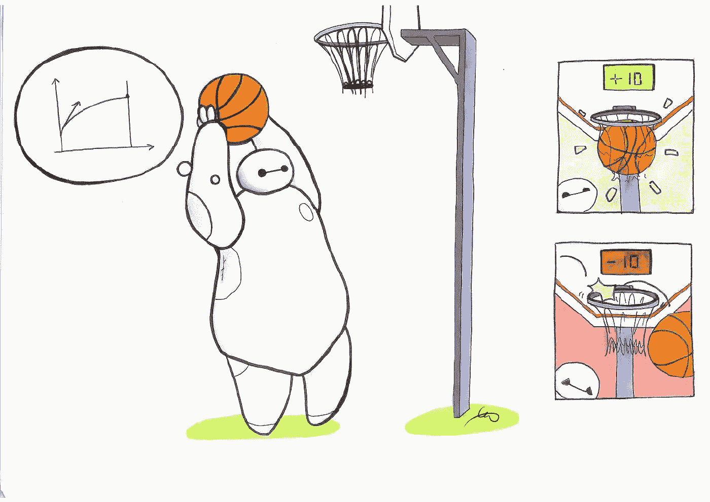
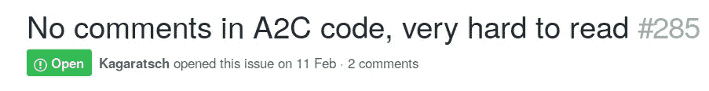
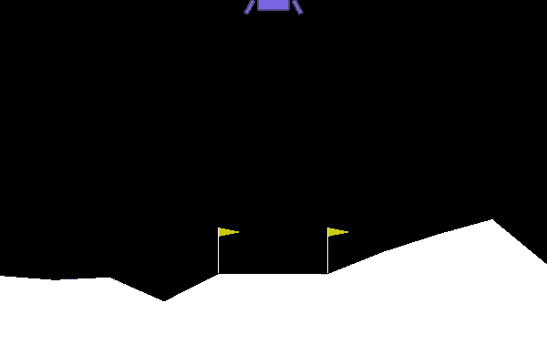
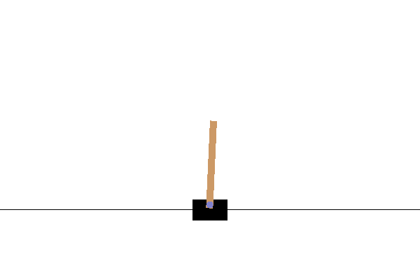
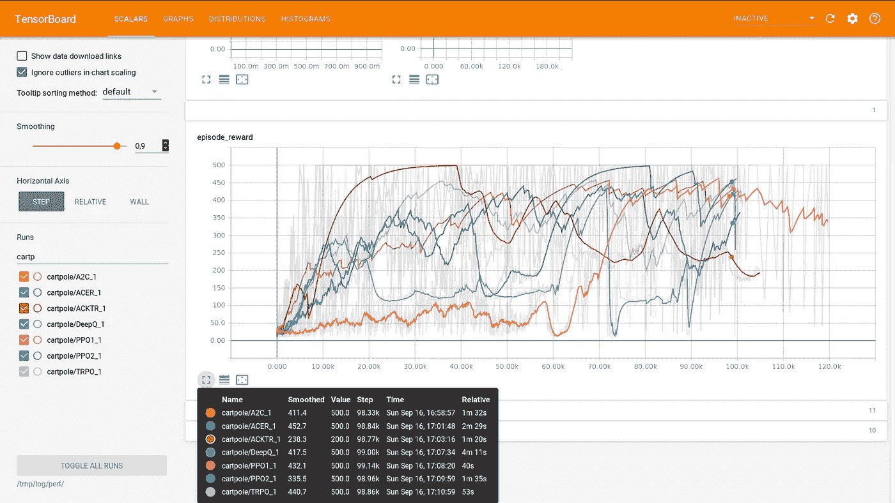
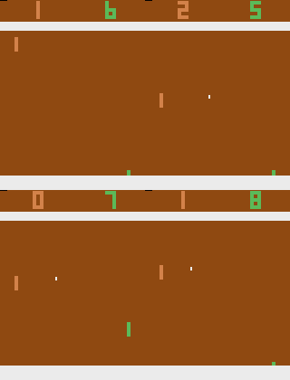

# 稳定基线:OpenAI 基线的一个分支——强化学习变得简单

> 原文：<https://towardsdatascience.com/stable-baselines-a-fork-of-openai-baselines-reinforcement-learning-made-easy-df87c4b2fc82?source=collection_archive---------5----------------------->

## *统一的结构(scikit-learn like 接口)和单一的代码样式以及文档*

Image Credit: L.M. Tenkes

经过几周的努力，我们很高兴地宣布[稳定基线](https://github.com/hill-a/stable-baselines)的发布，这是一组基于 OpenAI 基线的具有公共接口的强化学习(RL)算法的实现。我们关注易用性和一致性。在本文中，我们将展示各种例子(基本用法、保存/加载代理、简单的多重处理、Atari 游戏培训等等)以及 fork 的起源。

**更新(2020 年 5 月)**:稳定-基线 3 (PyTorch 版)现已上线！[https://github.com/DLR-RM/stable-baselines3](https://github.com/DLR-RM/stable-baselines3)

**更新**:文档现已在[http://stable-baselines.readthedocs.io/](http://stable-baselines.readthedocs.io/)上线，并增加了 Tensorboard 支持

**更新:**我们增加了一个 rl 基线动物园，集合包含 70+训练有素的特工[https://github.com/araffin/rl-baselines-zoo](https://github.com/araffin/rl-baselines-zoo)

**更新**:我们写了一个完整的教程:[https://github.com/araffin/rl-tutorial-jnrr19](https://github.com/araffin/rl-tutorial-jnrr19)

 [## 丘陵/稳定基线

### 稳定基线 OpenAI 基线的一个分支，强化学习算法的实现

github.com](https://github.com/hill-a/stable-baselines) 

## TL；博士:

有了稳定的基线，培训 PPO 代理就像以下一样简单:

Basic Usage: training an agent with stable baselines

但是我们能不能简单点？当然，我们可以！有了稳定的基线，你现在可以用一行代码定义和训练一个强化学习代理:

Train a RL agent in one line of code!

可以使用 Colab 笔记本[**在线试一试**](https://colab.research.google.com/github/Stable-Baselines-Team/rl-colab-notebooks/blob/master/stable_baselines_getting_started.ipynb) 。

# 叉子的历史

当我们开始使用 OpenAI 基线进行研究时，我们很高兴地发现*强化学习算法正在工作* (1)。然而，从我们试图稍微调整它的那一刻起，例如用学习到的功能而不是图像工作，它就变成了地狱，我们必须修补未注释的代码。

在我们经历的困难中，有缺少注释，缺少有意义的变量名和一致性(没有共同的代码风格)以及大量重复的代码(2)。

Example of issue found in the OpenAI Baselines repo

当我们在 Github 库上查看问题时，我们并不孤单: [#285](https://github.com/openai/baselines/issues/285) 、 [#400](https://github.com/openai/baselines/issues/400) 、 [#413](https://github.com/openai/baselines/issues/413) 、 [#445](https://github.com/openai/baselines/issues/445) 、 [Reddit](https://www.reddit.com/r/MachineLearning/comments/7l23y8/d_is_it_me_or_can_openai_baselines_be_difficult/) 。

因此，在基线存储库的主分支上的一个新提交破坏了我们的代码之后，我们决定创建一个 fork，并牢记两个想法:

*   注释代码和单一代码样式
*   每种算法的通用接口

(1)在我们的实验中，与其他代码库相比，基线代码库提供了最好的结果(就性能而言)。此外，在 [*重要的深度强化学习*](https://arxiv.org/abs/1709.06560) *，*中，他们显示基线 DDPG 实现优于其他代码库*。*最近玩 Dota 2 的 OpenAI 5 在核心使用 PPO*。*

(2)在撰写本文的时候，OpenAI 似乎在[改进他们的基准](https://github.com/openai/baselines/pull/490)上付出了一些努力，然而仍然缺少很多。

## 包括什么？

OpenAI 基线(以及稳定的基线)包括 A2C、PPO、TRPO、DQN、ACKTR、ACER 和 DDPG。你可以在[自述文件](https://github.com/hill-a/stable-baselines)中找到一个关于支持的内容(动作空间、多处理)的总结表。

基线还带有有用的包装器，例如用于预处理或多重处理。我们将在示例中展示它们的效用。

# 有什么新鲜事？

## 统一界面

所有算法都遵循相同的结构，**我们希望有一个 scikit-learn like 接口**，正如你将在示例中看到的，这使事情变得容易得多！

我们为所有算法提供了通用的方法，如 *train* (相当于 fit) *、save、load* 和 *predict* (与 sk-learn 中相同)。

## 支持加载、保存等

我们为所有算法添加了保存和加载功能，传递回调的能力(用于实时绘图)，全面的 tensorboard 支持和一个额外的输出动作概率的方法。

## 任何类型功能的培训

我们增加了对任意特征的 **RL 训练的支持，也就是说 RL 算法可以在像素之外的其他东西上训练(当前的 OpenAI 基线只支持不使用图像作为输入时的连续动作)。**

事实上，**解耦** [**状态表示学习**](https://arxiv.org/abs/1802.04181) ，从策略学习中提取特征**是我们研究的主要课题，也是近期工作的重点(例如[世界模型](https://worldmodels.github.io/)和[好奇心驱动学习](https://pathak22.github.io/large-scale-curiosity/))。因此，我们认为这是我们 fork 的一个重要特性。**

## 更多测试和覆盖范围

当我们开始重构 OpenAI 基线时，只有 16%的代码覆盖率。也就是说，只测试了所有代码语句的 16%。在重构过程中，我们添加了更多的测试，并且**达到了 65%** 的覆盖率！(大部分未被覆盖的代码来自 Mujoco 相关特性，而且由于这是一个商业物理引擎，很难与之有持续的集成)。

编辑:经过更多的重构(盖尔和她)，覆盖率现在是 85%！

## 错误修复

我们利用注释代码来[修复一些问题](https://github.com/hill-a/stable-baselines/releases)。例如，用于帧堆叠的包装器只能处理灰度图像(完整的故事是，OpenAI 之前的一个[错误修复被他们的](https://github.com/openai/baselines/commit/4993286230ac92ead39a66005b7042b56b8598b0)[新提交](https://github.com/openai/baselines/commit/9fa8e1baf1d1f975b87b369a8082122eac812eb1) …)之一删除了)。

# 例子:“空谈是廉价的。给我看看代码”

在下一节中，我们将通过不同的例子来说明如何使用稳定的基线。我们将涵盖 [**基本用法**](https://colab.research.google.com/github/Stable-Baselines-Team/rl-colab-notebooks/blob/master/stable_baselines_getting_started.ipynb) ，保存/加载，多重处理，绘图，雅达利游戏上的训练等等！

## Colab 笔记本列表

*   [完整教程](https://github.com/araffin/rl-tutorial-jnrr19)
*   [入门](https://colab.research.google.com/github/Stable-Baselines-Team/rl-colab-notebooks/blob/master/stable_baselines_getting_started.ipynb)
*   [训练、保存、加载](https://colab.research.google.com/github/Stable-Baselines-Team/rl-colab-notebooks/blob/master/saving_loading_dqn.ipynb)
*   [多重处理](https://colab.research.google.com/github/Stable-Baselines-Team/rl-colab-notebooks/blob/master/multiprocessing_rl.ipynb)
*   [监控训练和绘图](https://colab.research.google.com/github/Stable-Baselines-Team/rl-colab-notebooks/blob/master/monitor_training.ipynb)
*   [雅达利游戏](https://colab.research.google.com/github/Stable-Baselines-Team/rl-colab-notebooks/blob/master/atari_games.ipynb)

## 基本用法:训练、保存、加载

在下面的例子中，我们将在月球着陆器环境中训练、保存和加载一个 A2C 模型。

关联 Colab 笔记本: [**在线试用**](https://colab.research.google.com/github/Stable-Baselines-Team/rl-colab-notebooks/blob/master/saving_loading_dqn.ipynb) ！

Lunar Lander Environment

## 多重处理:释放矢量化环境的力量

关联 Colab 笔记本: [**在线试用**](https://colab.research.google.com/github/Stable-Baselines-Team/rl-colab-notebooks/blob/master/multiprocessing_rl.ipynb) **！**

CartPole Environment

## 使用 Tensorboard 监控训练

*v 2 . 0 . 0 中的新功能*

OpenAI 提供了基本的 tensorboard 支持(参见文档中的 [*传统集成*](https://stable-baselines.readthedocs.io/en/master/guide/tensorboard.html) )，我们添加了完整的 tensorboard 集成(图形可视化、学习曲线等)。

要启用 tensorboard 日志记录，只需用有效路径填充`tensorboard_log`参数:

Tensorboard integration

Cartpole does not seem so easy after all…

重现实验的代码:[https://gist . github . com/araffin/ee 9 daee 110 af 3b 837 b 0 e 3 a 46 a6 bb 403 b](https://gist.github.com/araffin/ee9daee110af3b837b0e3a46a6bb403b)

## 使用回拨:监控培训

您可以定义一个将在代理内部调用的自定义回调函数。当你想监控训练时，这可能是有用的，例如在 Tensorboard(或 Visdom)中显示实时学习曲线或保存最佳代理。

关联笔记本(含标图): [**在线试用**](https://colab.research.google.com/github/Stable-Baselines-Team/rl-colab-notebooks/blob/master/monitor_training.ipynb) ！

## 雅达利游戏

关联笔记本: [**在线试用**](https://colab.research.google.com/github/Stable-Baselines-Team/rl-colab-notebooks/blob/master/atari_games.ipynb) ！

Pong Environment

多亏了`make_atari_env`助手功能，在 Atari 游戏上训练一个 RL 代理变得很简单。它会为你做所有的预处理和多重处理。

## Mujoco:规范化输入要素

规范化输入特征可能是成功训练 RL 代理的关键(默认情况下，图像被缩放，但其他类型的输入不被缩放)，例如在 [Mujoco](http://www.mujoco.org/) 上训练时。为此，存在一个包装器，它将计算输入要素的运行平均值和标准差(它可以对奖励做同样的事情)。

注意:我们无法为此示例提供笔记本电脑，因为 Mujoco 是一个专有引擎，需要许可证。

## 复古索尼克

## 自定义策略网络

稳定基线为图像(CNN 策略)和其他类型的输入(MLP 策略)提供默认策略网络。但是，您也可以轻松地为策略网络定义自定义架构:

## 额外收获:持续学习

你也可以从一个学习环境转移到另一个环境进行[持续学习](https://www.continualai.com/) (PPO2 在`DemonAttack-v0`上，然后转移到`SpaceInvaders-v0`):

# 结论

我们提出了稳定的基线，这是一个旨在使强化学习面向广大受众的分叉。我们简化并统一了不同的算法，现在提供了一个类似 scikit-learn 的接口来进行 RL 实验。

对于任何对改进基线感兴趣的人来说，仍然有一些文档需要完成。因此，您可以随意在存储库上创建问题和提出请求。

当前 WIP:添加对 ACER/ACKTR 连续操作的支持

这篇文章是与阿什利·希尔共同撰写的。

## 感谢

稳定的基线是在 [ENSTA ParisTech](http://www.ensta-paristech.fr/en) 的[机器人实验室 U2IS](http://u2is.ensta-paristech.fr/index.php?lang=en) ( [INRIA 弗劳尔斯](https://flowers.inria.fr/)团队)创建的。

这项工作由[梦想项目](http://www.robotsthatdream.eu)通过欧盟 Horizon 2020 FET 研究和创新计划根据第 640891 号拨款协议提供支持。

## 关于作者

我们都在研究机器人的强化学习。我们的研究重点是状态表示学习(RL 的特征提取)。在业余时间，我们喜欢做 DIY 项目的实验，例如[建造一辆自主赛车](https://medium.com/@araffin/autonomous-racing-robot-with-an-arduino-a-raspberry-pi-and-a-pi-camera-3e72819e1e63)。

## Colab 笔记本列表

*   [完整教程](https://github.com/araffin/rl-tutorial-jnrr19)
*   [入门](https://colab.research.google.com/github/Stable-Baselines-Team/rl-colab-notebooks/blob/master/stable_baselines_getting_started.ipynb)
*   [训练、保存、加载](https://colab.research.google.com/github/Stable-Baselines-Team/rl-colab-notebooks/blob/master/saving_loading_dqn.ipynb)
*   [多重处理](https://colab.research.google.com/github/Stable-Baselines-Team/rl-colab-notebooks/blob/master/multiprocessing_rl.ipynb)
*   [监控训练和绘图](https://colab.research.google.com/github/Stable-Baselines-Team/rl-colab-notebooks/blob/master/monitor_training.ipynb)
*   [雅达利游戏](https://colab.research.google.com/github/Stable-Baselines-Team/rl-colab-notebooks/blob/master/atari_games.ipynb)

PS:如何制作一个训练有素的特工的 gif？

One line RL gif using terminalizer