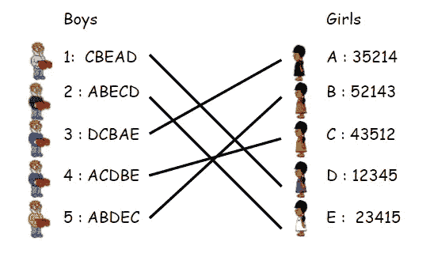
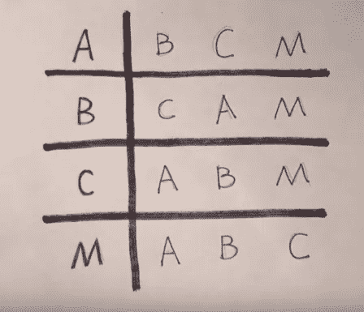

# 稳定匹配，作为游戏

> 原文：<https://towardsdatascience.com/stable-matching-as-a-game-a68c279d70b?source=collection_archive---------0----------------------->



长期以来，我一直对选举和拍卖的数学很感兴趣。它们是经济学中更广阔领域的一部分，社会选择理论充满了有趣的组合问题和悖论。

最近，我(再次)偶然发现了**稳定匹配**的主题，这个主题显然也属于社会选择理论，它有一些相同的有趣方面。

在这篇文章中，我讨论了这个问题是否可以看作一个游戏。

## 问题的定义

我们有一组要配对的元素。每个元素/代理都有一个优先级列表。这种匹配必须以一种*稳定的方式来完成。*如果存在元素 A 和 B，则匹配不稳定，因此

*   a 和 B 当前彼此不匹配
*   a 更喜欢 B 而不是它当前的配对
*   b 也更喜欢 A 而不是它当前的配对

这种情况意味着 A 和 B 可能会忽略其他元素的偏好，彼此跑掉。这种情况并不稳定。

这个问题有两种变体:

1.  有两组大小相等的元素，S 和 T，并且配对必须由来自 S 的一个元素和来自 T 的一个元素组成。考虑到男性 S 和女性 T，这种变体也被称为**稳定婚姻问题*。***
2.  只有一个组具有偶数个元素。这叫**稳定室友问题。**

这两种变体有一些关键的要点，我在这里不详细介绍，只是总结一下:

(1)对于稳定的婚姻问题，总有一个稳定的匹配，并且有一个有效的算法来找到它:1962 年发明的 Gale-Shapley 算法。这个算法在[这个 YouTube 视频](https://www.youtube.com/watch?v=RE5PmdGNgj0)中有介绍。令人惊讶的是，可以有多个稳定的匹配。Gale-Shapley 算法找到对“左集合”中的所有元素来说是最佳的匹配:左集合中的所有元素将在所有稳定的匹配中获得最佳可能的伙伴。这意味着(令我惊讶的是)，从左边集合的角度来看，没有权衡。这个解同时对左边集合中的每个人都是最优的。对正确的人来说，情况正好相反:每个人都可能得到最坏的结果。注意:这并不意味着他们都得到了他们最不喜欢的选择——但是在所有可能的*稳定*匹配中，他们得到了他们最不喜欢的伙伴。

(2)对于稳定的室友问题，并不总是存在稳定的匹配！这个问题是 D.E. Knuth 提出的稳定婚姻变异的 11 个难题之一。他寻求多项式解，而第一个构建这种算法的是 R. W. Irving，他在论文[中提出了“稳定室友”问题的有效算法](http://www.dcs.gla.ac.uk/~pat/jchoco/roommates/papers/Comp_sdarticle.pdf) (1984)。如果存在稳定的匹配，该算法将找到一个稳定的匹配。它比 Gale-Shapley 更复杂，证明正确性也更复杂。该算法在几个 YouYube 的视频中都有讲解，比如[【1】](https://www.youtube.com/watch?v=9Lo7TFAkohE)[【2】](https://www.youtube.com/watch?v=mq1aYnXnCNI)。

[这里有一个例子(视频)](https://www.youtube.com/watch?v=5QLxAp8mRKo&t=6m12s)稳定的室友问题无解

[](https://www.youtube.com/watch?v=5QLxAp8mRKo&t=6m12s)

No solution to stable roommate

例如，匹配的 AB CM 不稳定，因为 A 和 C 都更喜欢对方而不是他们当前的匹配，这使得我们切换到 AC BM，AC BM 也因为类似的原因不稳定，等等。*(这种情况类似于社会选择理论中的阿罗悖论:多数人可以偏好 B 而非 A，C 而非 B，A 而非 C，一个群体的多数偏好可以形成一个循环)。*

## 作为游戏的变现？

事实上，每个元素都有一个排序的偏好列表，这使得这个问题显然可以被视为一个多代理人的游戏，每个元素都是一个自主代理人，寻求最大化他的自私的游戏结果。

匹配稳定的标准让我产生了疑问:
稳定真的是目标*本身吗*，还是不稳定更像是一种*症状？*也就是说，如果一场比赛不稳定，这只是一个*信号*它不好，出了问题。相反，仅仅是稳定，就足以获得“最佳”解决方案吗？当有多个解决方案时，我们应该如何选择——以及当没有稳定的匹配时该怎么办。随机化是一种解决方案吗？如果是，如何解决？如果问题有随机的一面，我们是否应该用数字分数代替排名，这样我们就可以表达如何权衡不同的概率？(举例:用排名 A B C，“100% B”比“50% A，50% C”好还是差？)

关于一个可能的博弈出现了几个问题:
这个博弈的正式规则是什么，当一个博弈存在时，这个博弈的最优博弈总是导致稳定的匹配吗？这能导致帕累托最优吗？如果没有，是不是有些悖论？是回合制游戏吗，每个回合会发生什么？两个或两个以上的代理人可以合谋来改善他们的游戏结果吗？公布一个人的排名会在多大程度上损害你的结果(反过来，对你的排名撒谎会改善你的结果吗)？规则中需要随机化吗，或者我们可以让代理决定随机化吗？

纳什均衡的框架适用于这个博弈吗？纳什均衡是一个 T2 玩家改变他的策略，而其他人保持他们的策略，在这个游戏中，至少有两个玩家同意改变匹配。这个游戏中的*策略*是什么？排名榜是一种策略吗？可能吧，不过要看游戏是怎么进行的。

这让我很困惑，所以我尝试了不同的方法。

从这里开始，我只考虑稳定的室友问题，假设稳定的婚姻问题是这个问题的一个更简单的子问题。我并不完全清楚稳定的室友是不是一个合适的超集，因为对于稳定的婚姻来说，你只排了一半的元素。

## 方法 1。结果分布

不是玩家同意一个匹配，也许他们可以同意匹配的概率分布？
事实证明并非如此。在室友匹配的反例中，我们可以假设这种分布:

```
**Probability   Paring**
x             AB, CM
y             AC, BM
1-x-y         BC, AM
```

但事实证明，无论我们如何初始化 x 和 y，没有任何更新可以得到所有四个玩家的同意。这意味着( *x* ， *y* ，1- *x* - *y* )的任何组合都是帕累托最优的。这不会让我们更进一步。

## 方法 2。基于回合的提议

游戏是这样进行的:在第 0 轮中，所有玩家同时公布他们的偏好列表。在每一回合，随机(统一)挑选一名玩家。然后，他按照自己的偏好列表向其他玩家求婚，第一个接受的玩家被选中。成对的玩家离开游戏，即被选中的伙伴没有机会求婚。游戏后期是没有办法改变自己的想法的。如果没有提议的玩家接受，提议的玩家将被移到休息组。提议玩家可以向休息组的成员提议。当只剩下休息组时，这些是随机匹配的。

**让我们以上面 ABCM 的例子来玩这个游戏:**
如果 A 被选为第一求婚者，他会向 B 求婚，B 会接受(为什么？因为如果 B 拒绝，他知道 C 会接受，然后 B 会和 M 结束)。通过对称性，B 或 c 会发生类似的匹配，如果 M 是第一个提议者，所有人都会拒绝，然后游戏照常进行。总的来说，我们会有这样的结果概率分布:

```
**Prob.     Matching**
1/3       AB CM
1/3       AC BM
1/3       BC AM
```

## 问题

*   假设存在稳定匹配，假设每个人都最优博弈，结果会是稳定匹配吗？
*   在某些情况下发布错误的偏好会有帮助吗？似乎很明显，应该按照偏好的顺序提出建议，但是公布真实偏好的缺点是其他人会看到它们，并且他们的策略可能会依赖于它们。
*   玩家能在多大程度上成功合谋以提高结果？

我很乐意在评论中听到你的想法或主意。