# 用于预测的堆叠神经网络

> 原文：<https://towardsdatascience.com/stacked-neural-networks-for-prediction-415ef3b04826?source=collection_archive---------8----------------------->


机器学习和深度学习在金融机构中找到了自己的位置，因为它们能够高度准确地预测时间序列数据。有大量的研究正在进行中，以改进模型，使它们能够预测更高精度的数据。这篇文章是对我的项目 [AIAlpha](https://github.com/VivekPa/AIAlpha) 的一个总结，它是一个**堆叠神经网络架构**，可以预测各种公司的股票价格。这个项目也是新加坡大学生黑客马拉松 iNTUtion 2018 的**决赛选手之一。**

## 工作流程

该项目的工作流程主要包括以下步骤:

1.  获取股票价格数据
2.  使用**小波变换**对数据去噪
3.  使用**堆叠自动编码器**提取特征
4.  列车 **LSTM** 使用功能
5.  预测准确性的测试模型

在这篇文章中，我将详细介绍每一步的细节，以及为什么我选择做出某些决定。

## 数据采集

得益于雅虎财经的 API，股票价格数据很容易获得。因此，简单地用`stock_data = pdr.get_data_yahoo(self.ticker, self.start, self.end)`就完成了。

## **去噪数据**

由于股票市场动态的复杂性，股票价格数据经常充满噪声，这可能会分散机器学习对趋势和结构的学习。因此，在保留数据中的趋势和结构的同时，去除一些噪声是我们感兴趣的。起初，我想使用傅立叶变换(不熟悉的人应该[阅读本文](https://medium.com/engineer-quant/fourier-analysis-ii-724c20ee27c1))，但我认为小波变换可能是更好的选择，可以保留数据的时间因素，而不是产生仅仅基于频率的输出。

## **小波变换**

小波变换与傅立叶变换非常相似，只是用于变换的函数不同，并且变换的方式也略有不同。

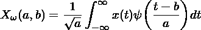

过程如下:使用小波变换对数据进行变换，然后(在所有系数中)移除超过全标准偏差的系数，并对新系数进行逆变换以获得去噪数据。

以下是小波变换如何对时间序列数据进行降噪的示例:

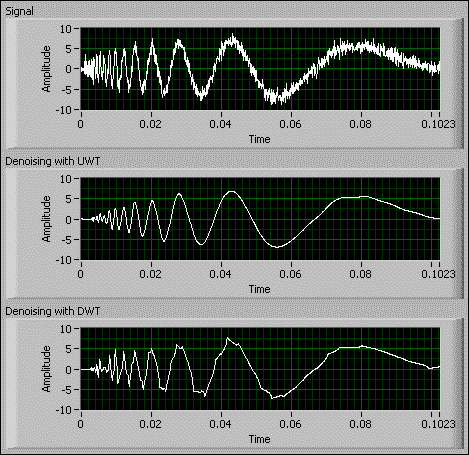

可以看到，初始信号中存在的随机噪声在去噪版本中并不存在。这正是我们希望用股票价格数据做的事情。

以下是如何对数据进行降噪的代码:

```
x = np.array(self.stock_data.iloc[i: i + 11, j])                
(ca, cd) = pywt.dwt(x, "haar")                
cat = pywt.threshold(ca, np.std(ca), mode="soft")                
cdt = pywt.threshold(cd, np.std(cd), mode="soft")                
tx = pywt.idwt(cat, cdt, "haar")
```

库`pywt`是优秀的小波变换工具，极大地减轻了我的负担。

## 提取特征

在通常的机器学习环境中，提取特征将需要专业领域知识。这是我没有的奢侈品。我也许可以尝试使用某种形式的技术指标，如移动平均线或移动平均线收敛发散(MACD)，或动量指标，但我觉得盲目使用它可能不是最佳选择。

然而，自动特征提取可以通过使用堆叠自动编码器或其他机器学习算法(如受限玻尔兹曼机器)来实现。我选择使用堆叠式自动编码器，因为与受限玻尔兹曼机器的概率相比，编码具有可解释性。

## 堆叠自动编码器

本质上，堆叠式自动编码器非常擅长压缩数据并再次将其复制回来。我们感兴趣的是压缩部分，因为这意味着再现数据所需的信息都以某种方式编码为压缩形式。这表明，这些压缩数据在某种程度上可以是我们试图从中提取特征的数据的特征。以下是堆叠式自动编码器的网络结构:

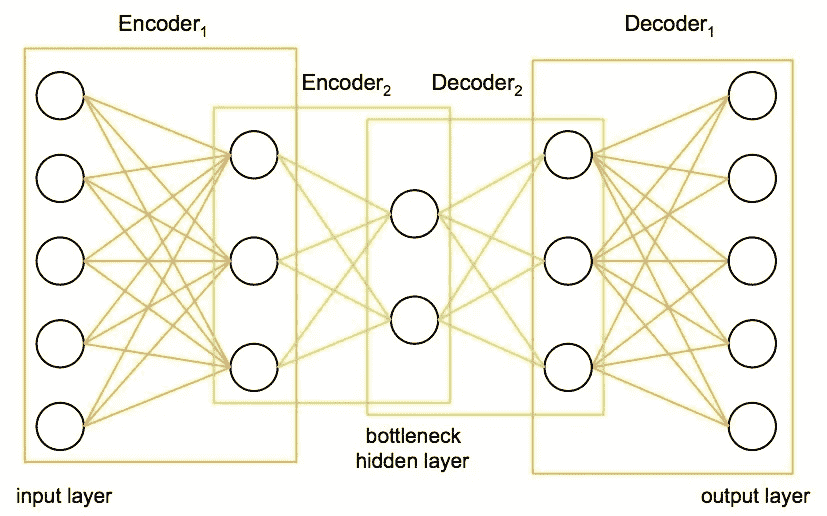

输入数据被压缩成任意数量的神经元，网络被迫使用自动编码器重建初始数据。这迫使模型提取数据的关键元素，我们可以将其解释为特征。需要注意的一个关键点是，该模型实际上属于无监督学习，因为没有输入输出对，但输入和输出是相同的。

我们可以使用`keras`来构建这样一个模型，使用函数式 API 比顺序式 API 更有用。

```
class AutoEncoder:
    def __init__(self, encoding_dim):
        self.encoding_dim = encoding_dim

    def build_train_model(self, input_shape, encoded1_shape, encoded2_shape, decoded1_shape, decoded2_shape):
        input_data = Input(shape=(1, input_shape))

        encoded1 = Dense(encoded1_shape, activation="relu", activity_regularizer=regularizers.l2(0))(input_data)
        encoded2 = Dense(encoded2_shape, activation="relu", activity_regularizer=regularizers.l2(0))(encoded1)
        encoded3 = Dense(self.encoding_dim, activation="relu", activity_regularizer=regularizers.l2(0))(encoded2)
        decoded1 = Dense(decoded1_shape, activation="relu", activity_regularizer=regularizers.l2(0))(encoded3)
        decoded2 = Dense(decoded2_shape, activation="relu", activity_regularizer=regularizers.l2(0))(decoded1)
        decoded = Dense(input_shape, activation="sigmoid", activity_regularizer=regularizers.l2(0))(decoded2)

        autoencoder = Model(inputs=input_data, outputs=decoded)

        encoder = Model(input_data, encoded3)

        # Now train the model using data we already preprocessed
        autoencoder.compile(loss="mean_squared_error", optimizer="adam")

        train = pd.read_csv("preprocessing/rbm_train.csv", index_col=0)
        ntrain = np.array(train)
        train_data = np.reshape(ntrain, (len(ntrain), 1, input_shape))

        # print(train_data)
        # autoencoder.summary()
        autoencoder.fit(train_data, train_data, epochs=1000)
```

我用 2000 年到 2008 年去噪后的股价数据来训练自动编码器。经过 1000 个周期的训练后，RMSE 下降到 0.9 左右。然后，我使用该模型将我剩余的股票价格数据编码成特征。

## LSTM 模型

LSTM 模型无需介绍，因为它在预测时间序列方面已经变得非常广泛和流行。它从细胞状态的存在中获得其特殊的预测能力，这允许它理解和学习数据中的长期趋势。这对我们的股价数据尤其重要。下面我将讨论我认为重要的设计选择的一些方面。

## 【计算机】优化程序

所使用的优化器类型会极大地影响算法收敛到最小值的速度。此外，重要的是有一些随机性的概念，以避免陷入局部最小值，而不是达到全局最小值。有几个伟大的算法，但我已经选择使用亚当优化。Adam 优化器结合了其他两个优化器的优势:ADAgrad 和 RMSprop。

ADAgrad 优化器本质上对每个参数和每个时间步使用不同的学习率。ADAgrad 背后的推理是，不频繁的参数必须具有较大的学习率，而频繁的参数必须具有较小的学习率。换句话说，ADAgrad 的随机梯度下降更新变为

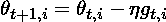

在哪里


学习率是基于已经为每个参数计算的过去梯度来计算的。因此，

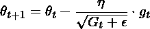

其中 G 是过去梯度的平方和的矩阵。这种优化的问题在于，随着迭代次数的增加，学习率会很快消失。

RMSprop 考虑通过仅使用一定数量的先前梯度来固定递减的学习速率。更新变成了

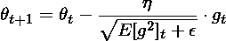

在哪里

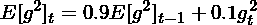

既然我们理解了这两个优化器是如何工作的，我们就可以研究 Adam 是如何工作的了。

自适应矩估计或 Adam 是另一种通过考虑过去平方梯度的指数衰减平均值和过去梯度的指数衰减平均值来计算每个参数的自适应学习率的方法。这可以表示为


v 和 m 可以分别被认为是梯度的一阶和二阶矩的估计，因此被命名为自适应矩估计。第一次使用这种方法时，研究人员观察到存在一种固有的偏向 0 的倾向，他们通过使用以下估计值对此进行了反驳:

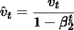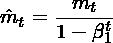

这将我们带到最后的梯度更新规则

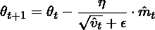

这是我使用的优化器，其优点总结如下:

1.  对于每个参数和每次迭代，学习速率是不同的。
2.  学习并不像阿达格勒那样减少。
3.  梯度更新使用权重分布的矩，允许更统计上合理的下降。

## 正规化

训练模型的另一个重要方面是确保权重不会变得太大，并开始专注于一个数据点，从而过度拟合。因此，我们应该始终包括大重量的惩罚(大的定义将取决于使用的正则化类型)。我选择使用吉洪诺夫正则化，这可以被认为是以下最小化问题:

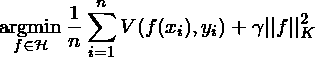

函数空间在再生核希尔伯特空间(RKHS)中的事实确保了范数的概念存在。这允许我们将规范的概念编码到我们的正则化器中。

## 辍学者

一种防止过度拟合的新方法考虑了当一些神经元突然不工作时会发生什么。这迫使模型不要过度依赖任何一组神经元，而要考虑所有的神经元。辍学者发现他们的用途是使神经元更加健壮，从而使他们能够预测趋势，而不用关注任何一个神经元。以下是使用辍学的结果

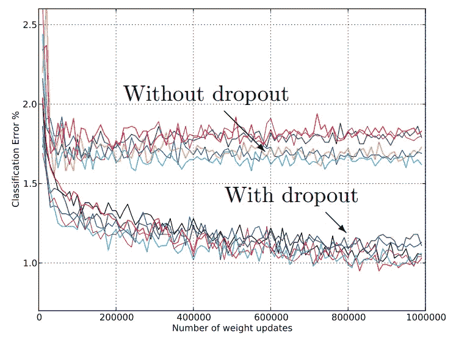

可以看出，存在压差时，误差继续下降，而不存在压差时，误差处于平稳状态。

## 模型实现

由于有了`keras`和它们的功能 API，上述所有分析都可以相对容易地实现。这是模型的代码(要查看完整的代码，请查看我的 GitHub: [AlphaAI](https://github.com/VivekPa/AlphaAI) )

```
class NeuralNetwork:
    def __init__(self, input_shape, stock_or_return):
        self.input_shape = input_shape
        self.stock_or_return = stock_or_return

    def make_train_model(self):
        input_data = kl.Input(shape=(1, self.input_shape))
        lstm = kl.LSTM(5, input_shape=(1, self.input_shape), return_sequences=True, activity_regularizer=regularizers.l2(0.003),
                       recurrent_regularizer=regularizers.l2(0), dropout=0.2, recurrent_dropout=0.2)(input_data)
        perc = kl.Dense(5, activation="sigmoid", activity_regularizer=regularizers.l2(0.005))(lstm)
        lstm2 = kl.LSTM(2, activity_regularizer=regularizers.l2(0.01), recurrent_regularizer=regularizers.l2(0.001),
                        dropout=0.2, recurrent_dropout=0.2)(perc)
        out = kl.Dense(1, activation="sigmoid", activity_regularizer=regularizers.l2(0.001))(lstm2)

        model = Model(input_data, out)
        model.compile(optimizer="adam", loss="mean_squared_error", metrics=["mse"])

        # load data

        train = np.reshape(np.array(pd.read_csv("features/autoencoded_train_data.csv", index_col=0)),
                           (len(np.array(pd.read_csv("features/autoencoded_train_data.csv"))), 1, self.input_shape))
        train_y = np.array(pd.read_csv("features/autoencoded_train_y.csv", index_col=0))
        # train_stock = np.array(pd.read_csv("train_stock.csv"))

        # train model

        model.fit(train, train_y, epochs=2000)
```

## 结果

以上是我对各个公司预测的结果。

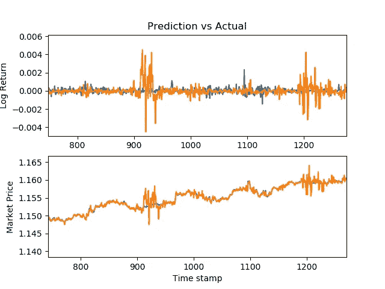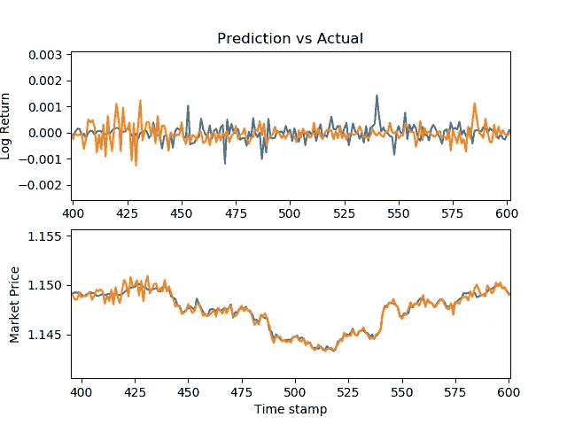

很明显，使用这种神经网络架构的结果是不错的，并且如果在策略中实施，可以是有利可图的。

## 在线学习

除了从历史数据中学习模型之外，我还想让模型一直学习，甚至从预测中学习。因此，我把它变成了一个可以学习和预测的在线模型。换句话说，它学习历史数据，预测明天的价格，明天，当实际价格已知时，它也学习使用这些数据。所以模型一直在改进。

除了使用实际价格进行改进，我还考虑过制作一个二级模型，使用关于公司的新闻和 Twitter 的情感值。我将首先概述这些数据是如何获得的。

## 推特数据

除了股票价格数据，我还想尝试一些自然语言处理。因此，我尝试利用 twitter 和新闻中的情绪数据来改进股票预测。

第一个主要挑战是免费获取推文，因为获取整个档案的 Twitter API 是付费的。然而，我发现了一个 API，它允许我获取过去 10 天的推文，然后我可以实现某种形式的 NLP 来从推文中提取情感数据。这不是最佳的，但对我的在线学习模式仍然有用。

twitter api 用于收集过去 10 天的数据，情绪得分是使用 TextBlob 计算的，并对大量推文进行平均。

## 新闻数据

与 Twitter 类似，获取新闻数据非常困难。我试图分析彭博文章的网址，但意识到从 2000 年开始一直手动删除网站几乎是不可能的。因此，我选择了 Aylien API，它有一个非常强大的抓取模型。

新闻文章被删除，条件是它们只包括股票和金融新闻，过滤到 Alexa 网站的前 150 名，情绪得分使用指数加权移动平均进行平均，以更多地考虑最近的新闻而不是旧新闻。

## 在线模型

鉴于我的情绪得分，我使用了一个额外的神经网络层来纠正我预测的错误。然而，在撰写本文时，还没有得到这方面的结果，因为产生一个数据点需要一天的时间。

## 结论

神经网络非常擅长预测时间序列数据，当与情绪数据相结合时，确实可以做出实用的模型。虽然这里的结果令人印象深刻，但我仍在寻找改进的方法，也许真的能从中发展出一套完整的交易策略。目前，我正在研究使用强化学习来开发一个交易代理，使用预测模型的结果。