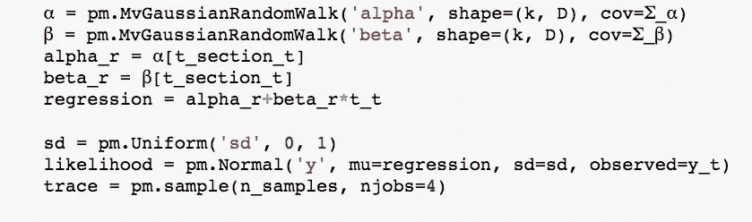
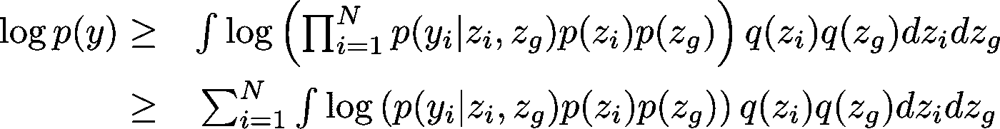
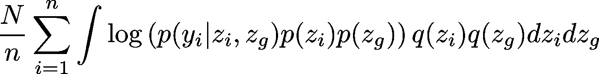

# 斯坦 vs PyMc3 (vs 爱德华)

> 原文：<https://towardsdatascience.com/stan-vs-pymc3-vs-edward-1d45c5d6da77?source=collection_archive---------1----------------------->

神圣的三位一体说到贝氏。我将提供我使用前两个包的经验和我对第三个包的高水平看法(在实践中没有使用过)。当然，还有疯子(变得无关紧要的老教授)，他们实际上做了自己的吉布斯采样。

My reaction to people writing their own samplers

这是我对这三个部分的 30 秒介绍。您可以为数据指定创成式模型。您将数据作为观察值输入，然后它从数据的后面为您取样。神奇！

Stan 是我使用的第一种概率编程语言。如果你来自统计学背景，这将是最有意义的。可以做 mu~N(0，1)这样的事情。文档是绝对惊人的。就个人而言，我不介意使用 Stan 参考作为贝叶斯学习的介绍，因为它向您展示了如何对数据建模。例子相当广泛。

另一方面，PyMC3 是专门为 Python 用户设计的。如今，大多数数据科学社区都在向 Python 迁移，所以这根本不是问题。您可以在下面看到一个代码示例。语法没有 Stan 那么好，但仍然可行。我真的不喜欢你不得不再次命名变量，但这是在后端使用 theano 的副作用。`pm.sample`部分只是从后面取样。我喜欢这样一个事实，即使我有一个离散变量要采样，它也不会被扰乱，这是 Stan 到目前为止做不到的。

PyMC3 sample code

就文档而言，在我看来没有 Stan 那么广泛，但是[的例子](http://docs.pymc.io/examples.html)真的很好。结合 Thomas Wiecki 的[博客](http://twiecki.github.io/)，你就有了一个完整的 Python 数据分析指南。

PyMC3 成为我的(贝叶斯)工具的原因只有一个，那就是`pm.variational.advi_minibatch`函数。当贝叶斯模型必须处理相当大量的数据(大约 10000 多个数据点)时，它真的很难处理。变分推理是进行近似贝叶斯推理的一种方式。Stan 和 PyMC3 都有这个。但 PyMC3 采取了额外的步骤来扩展它，以便能够使用小批量的数据，这使我成为了它的粉丝。

## 数学(可选)

稍微了解一下数学，变分推理所做的是最大化数据 log p(y)的对数概率的下限。

Variational Bayes Equations

我们试图通过改变建议分布 q(z_i)和 q(z_g)的超参数来最大化这个下限。z_i 指的是数据实例 y_i 本地的隐藏变量，而 z_g 是全局隐藏变量。上次我用 PyMC3 检查时，它只能处理所有隐藏变量都是全局变量的情况(这里我可能错了)。

本质上，我觉得 PyMC3 做得还不够，它让我把它当作一个真正的优化问题。第二项可以近似为

其中 N 是小批量的大小，N 是整个集合的大小。这是 Matthew Hoffman 在这篇[论文中所写内容的精髓。我想指定模型/联合概率，让 theano 简单地优化 q(z_i)，q(z_g)的超参数。**这就是 GPU 加速真正发挥作用的地方。** Stan 在这方面确实落后了，因为它没有使用 theano/ tensorflow 作为后端。](http://www.columbia.edu/~jwp2128/Papers/HoffmanBleiWangPaisley2013.pdf)

## 爱德华

到目前为止，我对爱德华一直保持沉默。我没有在实践中使用过爱德华。我觉得主要原因是它没有好的文档和例子来轻松地使用它。的确，我可以将 PyMC3 或 Stan 模型直接提供给 Edward，但是听起来我需要编写 Edward 特定的代码来使用 Tensorflow 加速。我有一种感觉，Edward 可能在做随机变量推理，但遗憾的是文档和例子没有达到 PyMC3 和 Stan 那样的水平。然而，我必须说，当谈到贝叶斯学习的未来时，Edward 是最有前途的(由于在贝叶斯深度学习方面所做的大量工作)。

总之，PyMC3 对我来说是这些天的明显赢家。如果我不必时不时接触到 theano 框架，那就太好了，但除此之外，它确实是一个很好的工具。我希望看到 Edward 或 PyMC3 迁移到 Keras 或 Torch 后端，因为这意味着我们可以建模(和调试得更好)。快乐造型！

看这里是我的关于机器学习和深度学习的[课程](https://www.udemy.com/course/machine-learning-and-data-science-2021/?referralCode=E79228C7436D74315787)(使用代码 DEEPSCHOOL-MARCH 到 85 折)。