# 星巴克的顶点挑战

> 原文：<https://towardsdatascience.com/starbucks-capstone-challenge-8f4075b7a1da?source=collection_archive---------10----------------------->

## DSND uda city 顶石项目

这是 Udacity 数据科学家课程的顶点项目。该数据集包含模拟星巴克奖励移动应用程序上的客户行为的模拟数据。每隔几天，星巴克就会向手机应用程序的用户发出一次报价。当收到优惠的顾客的累计消费超过设计的阈值时，他/她将获得奖励。数据集包括 3 个文件，它们是:

*   投资组合，记录的报价类型
*   个人资料，客户资料
*   文字记录，记录人们收到报价、查看报价、完成报价和消费的时间。

它打算弄清楚顾客对这些广告的反应，以及什么样的人对每种类型的优惠反应最大？

# 问题陈述

我总是很好奇广告是否真的会促进生意。星巴克咖啡等产品曾经是我生活的一部分。即使没有任何折扣和 BOGO(买一送一)，我也会继续购买星巴克。我相信有很多人和我一样，所以我想验证我的假设，即那些发送给顾客的优惠对星巴克没有意义。因此，两个问题都解决了。

1.  谁会对咖啡报价做出反应？
2.  根据人口统计和优惠类型，人们会花多少钱？

# 数据探索和清理

## 1.文件夹文件

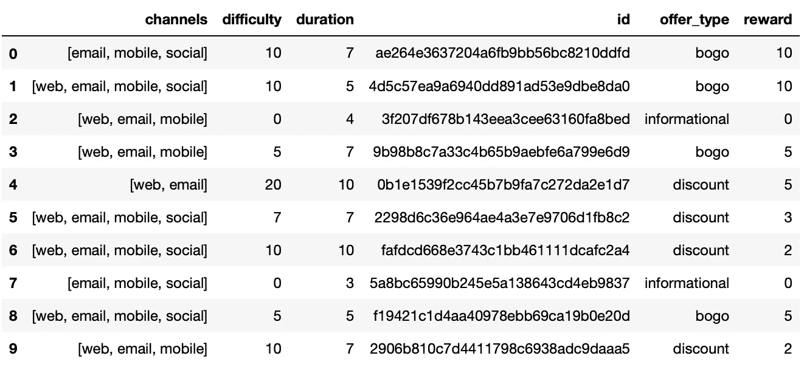

portfolio

*   id(字符串)—优惠 id
*   offer_type (string) —优惠的类型，如 BOGO、折扣、信息
*   难度(int) —完成报价所需的最低花费
*   奖励(int) —为完成一项提议而给予的奖励
*   持续时间(整数)
*   频道(字符串列表)

通过手机、电子邮件、社交网站和网络等渠道发送给客户的报价有 3 种类型，即 BOGO、折扣和信息。每个报价都有不同的难度和奖励。例如，用户可以收到一个买 10 美元减 2 美元的折扣优惠，此后，如果客户累积至少 10 美元的购买，则该优惠完成，并且将给予奖励。然而，信息稍有不同。这种类型的出价没有奖励，所以我们不会在抄本文件中找到任何出价已完成的记录。

## 2.概要文件

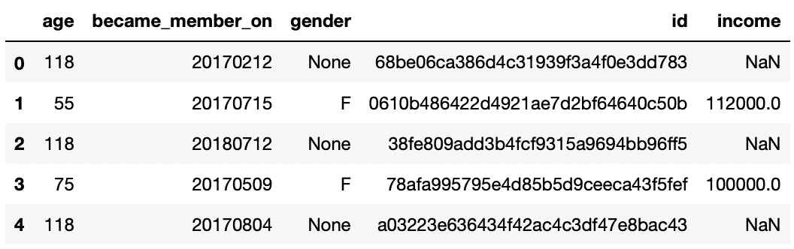

Head of profile

*   年龄(整数)—客户的年龄
*   成为会员日期(整数)—客户创建应用程序帐户的日期
*   性别(str) —客户的性别(请注意，有些条目包含“O”代表其他，而不是 M 或 F)
*   id (str) —客户 id
*   收入(浮动)—客户的收入

17，000 名客户包含在个人资料中，当他们注册他们的 app 帐户时，他们的个人资料会被记录下来。有些信息不准确。有 2，175 名 118 岁人没有与性别和收入有关的信息。

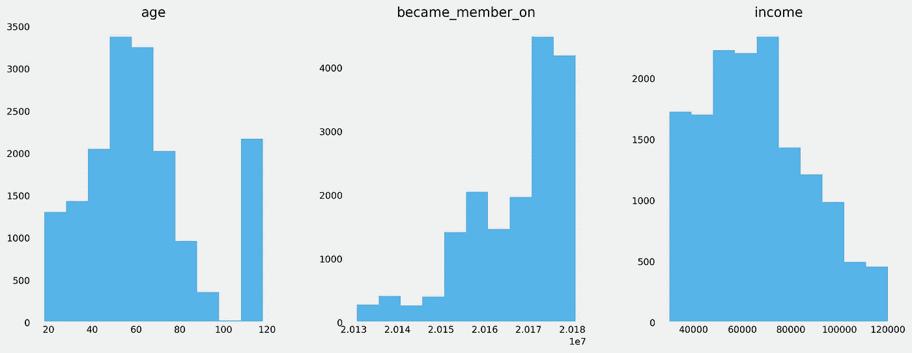

Distributions

剔除这些无效资料后，14，825 名客户中女性占 41.3%，男性占 57.2%。超过 60%的人年龄在 45 到 80 岁之间。而他们的平均收入在每年 6.5 万左右。

## 3.抄本文件

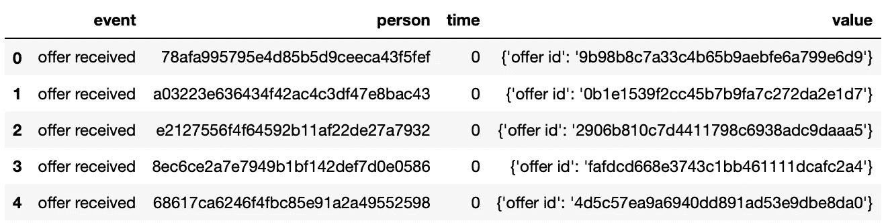

Head of transcript

*   事件(str) —记录描述(即交易、收到的报价、查看的报价等。)
*   人员(字符串)—客户 id
*   time (int) —以小时为单位的时间。数据开始于时间 t=0
*   value —(字符串字典)—报价 id 或交易金额，具体取决于记录

该文件的 306，534 条记录来自应用程序。每个人可能会多次收到每种类型的报价。发送了 76，277 份报价，12，774 人至少完成了一份报价，422 人收到了没有任何消费的报价，16，834 人没有查看他们收到的任何报价，6 人购买了咖啡，而他们没有收到任何报价。

## 数据清理

1.  从抄本文件的值字典中提取值。
2.  替换包括自定义 id 在内的 id，并将 id 提供给更容易识别的 id。
3.  根据事件的 4 种类型，将抄本文件分成 4 个表格。
4.  将个人资料文件中的年龄和年龄的数字数据转换为类别数据。

# Q1:谁会对咖啡有反应？

我们知道，当累计购买量超过阈值时，它将被记录为要约完成。然而，我们无法知道顾客购买咖啡是因为广告还是仅仅出于自然。也许我们可以设定标准来证明谁会对广告做出回应。

## 数据预处理

收到报价、查看报价并及时购买达到阈值金额的客户应被视为对三种报价类型之一做出响应的人。

然后，我用内部方法合并从人员和报价 id 的记录文件中分离出来的报价已接收、报价已查看和报价已完成表，并将新表命名为 response。然后根据报价 id 从投资组合表中添加持续时间变量，以确保每条记录都符合标准。

识别收到信息的人的方法略有不同。由于没有报价完成记录，另一个标准被定了下来。一个人在收到要约的时间加上持续时间内收到并查看了购买量大于零的信息性要约，则推断此人对该要约做出了响应。

## 探索数据分析

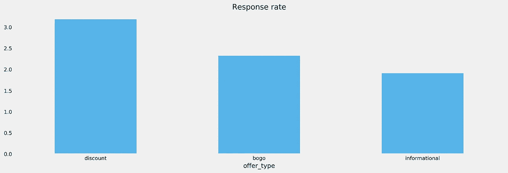

有 1，973 条记录符合标准。总体回答率为 2.59%。折扣要约的回复率最高，为 3.18%，信息要约的回复率最低，为 1.91%，BOGO 的回复率为 2.32%。

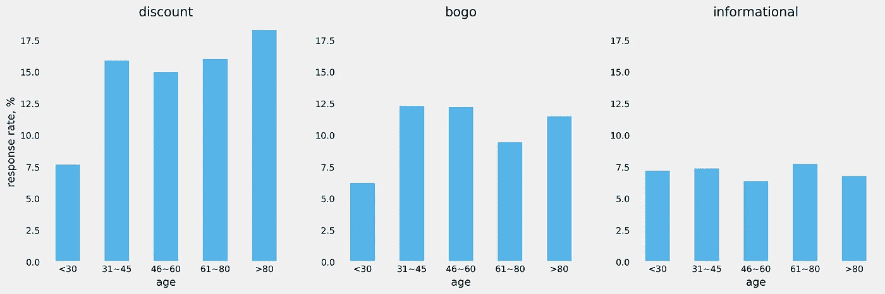

除了年轻人之外，每个年龄层的顾客对这些产品的态度都是一样的。他们喜欢打折，尤其是老年顾客。

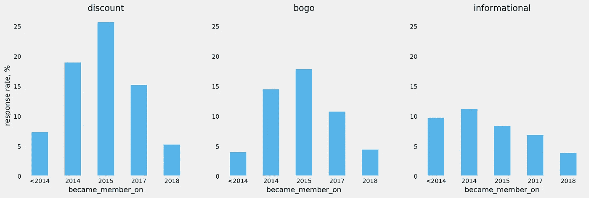

3 年会员更容易受到折扣和 BOGO 的影响。也许他们更熟悉晋升的规则。然而奇怪的是为什么最早的成员不关心推广这么多。可能是样本小的原因。但是他们更容易受到信息的影响。

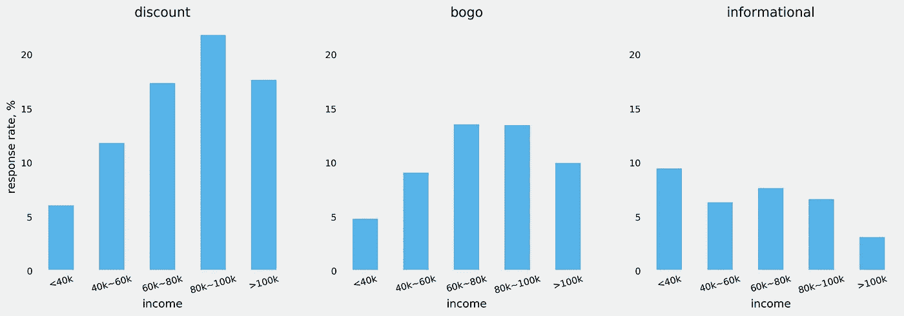

显然，收入较高的人如果得到促销优惠，会更愿意购物。当然，有钱人不在乎升职。为什么低收入人群较少受到星巴克促销的影响？一个合理的解释是，他们负担不起更频繁地去星巴克购物，因为只有 13%的顾客年收入低于 4 万英镑。

# Q2:根据人口统计和产品类型，人们会花多少钱？

可承受的收入应该与消费有较高的正相关性。事实上，在这个给定的数据集中，收入和平均购买量之间的相关性是 0.80。因此，很容易得出结论，高收入的人平均会购买更多的星巴克咖啡。

然而，结果并不是我想要知道的。我更关心其他因素是否会对星巴克的消费产生积极影响。

## 数据预处理

内生变量是购买总量，外生变量是人口统计和优惠类型因素。

客户及其人口统计因素由档案文件提供。优惠类型因素来自响应表。这些广告只对有响应的人有意义。通过使用 subtotal on person 从交易表中得出购买的总金额。

其他变量是分类数据。它们将被转换成虚拟变量。

**数据处理**

1.  received_offer 表通过 left 方法合并到 person id 上的 profile 表中，以便标识身份客户收到的优惠类型。
2.  消除他们没有收到任何报价的 id。
3.  计算按每个人分组的交易金额的总和，然后用 left 方法加入到人员 id 的配置文件表中。
4.  将分类数据转换为虚拟变量。
5.  将数据分为训练集和测试集。

## 度量和模型选择

选择有监督的机器学习模型来解决这个问题。由于购买总额是连续数据，因此选择了三个回归模型作为候选模型。它们是多元线性回归模型、随机森林回归和支持向量回归。

三个度量是 con:
* R 平方，衡量预测值在多大程度上解释了实际值。
*过拟合，训练集和测试集的 R 平方之差。
*误差分布为线性回归模型。

## 结果

三个模型具有相似的 R 平方，但是都是欠拟合，没有过拟合。结果是可以预料的。如上图所示，收入与金额相比，数据集非常嘈杂。

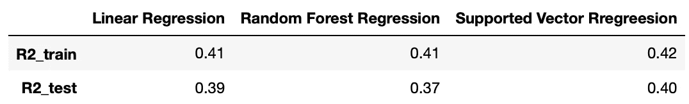

## 改进

由于金额和收入是高度正偏的，最好将其转换为接近正态分布。

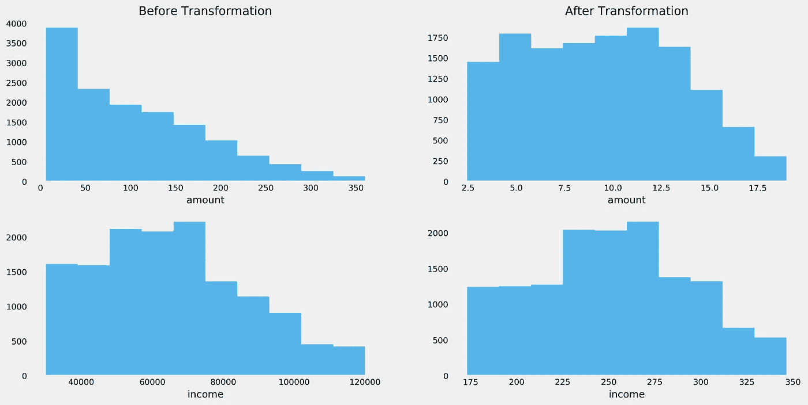

此外，应该消除异常值，并对数据集进行缩放。

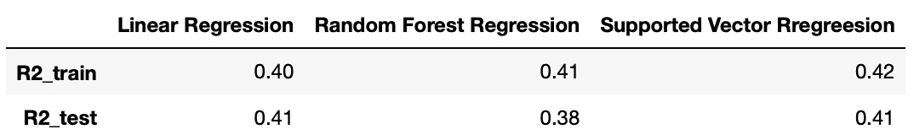

r 平方比原始模型稍好，特别是对于推断过拟合较少而欠拟合仍然难以解决的测试数据集。此外，多因素线性回归模型的误差分布更接近正态分布，偏度为 0.3，峰度为 2.8。由于度量标准相似且易于理解，选择线性模型进行分析。

## 参数分析

尽管 R2 还不够好，但从模型中得到的因素参数提供了更有价值的信息。

*   收入因素、性别因素、成为会员因素和提供类型因素都显著不同于零，而年龄因素则不显著。
*   所有基于优惠类型的因素都有积极的贡献。这意味着广告真的可以帮助星巴克增加收入。
*   正参数值意味着女性比男性更有可能消费。

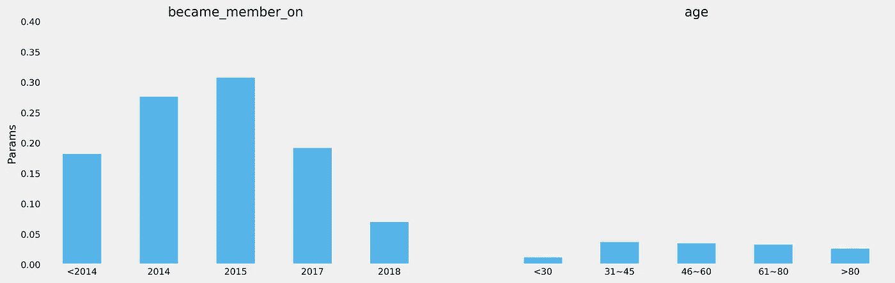

深入观察人口统计因素。

*   年龄大于 30 岁小于 80 岁的人更有可能消费星巴克。这是有道理的，因为他们有收入。因此，年龄并不重要。
*   与上述可视化分析结果类似，2015 年注册会员的客户贡献了更多的消费。

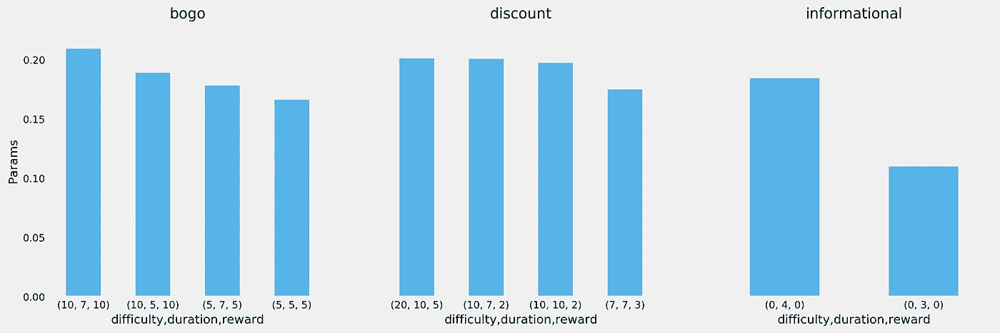

基于优惠类型的因素告诉我们:

*   BOGO 和折扣比信息广告更能刺激消费。
*   持续时间越长，记录的购买量越多。这就产生了另一个问题，如果证明对这些类型的优惠做出反应的客户的标准过于严格。但是这个问题我不想深究。
*   更高的奖励吸引更多的消费。

# 结论

机器学习模型表明，广告确实能帮助增加收入，但不一定能增加利润。信息性报价的效果不如 BOGO 和折扣。然而，如果星巴克打算吸引更多的消费，促销成本可能会抵消收入，而没有足够的顾客反应。

然而，可视化分析显示回复率较低。结合可视化分析和机器学习模型的结论表明，广告 3 年会员的高收入女性似乎是一个好主意，因为她们很可能在星巴克花费更多。