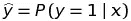
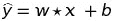
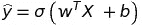
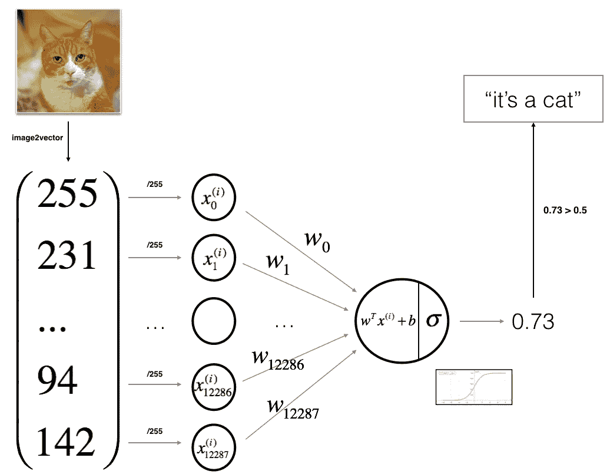
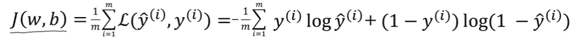

# 用单个神经元启动神经网络

> 原文：<https://towardsdatascience.com/start-neural-network-with-one-neuron-176a9471db04?source=collection_archive---------18----------------------->

image from — [https://unsplash.com/photos/ZiQkhI7417A](https://unsplash.com/photos/ZiQkhI7417A)

# 什么是分类问题？

分类是 ML 中一个重要的中心话题，它与训练机器如何按照特定的标准将数据分组有关。分类是计算机根据预定特征将数据分组的过程——这被称为**监督学习**。有一种**无监督**版本的分类，称为**聚类**，当类别未被指定时，计算机找到共享特征来对数据进行分组。

例如:

1.  垃圾邮件:你的目标是预测一封邮件是否是垃圾邮件，是否应该发送到垃圾文件夹。(垃圾邮件/非垃圾邮件)。文本是输入(X)的简单单词序列。目标是预测二元响应 Y:是否是垃圾邮件。
2.  手写数字识别:你的目标是正确识别 0-9 的图像。每个条目都是从 0(黑色)到 255(白色)像素强度范围内的整数。这个原始数据(X)将被输入，每个图像将被识别为(Y) 0 或 1 或 2 …或 9。

当你考虑第一个问题时，它被称为二项式逻辑回归，其中响应变量有两个值 0 和 1 或通过和失败或真和假。我们可以解释第二个问题，但是通过复杂性，我避免了对它的解释。对了，叫多类分类问题。

# 什么是逻辑回归？

如果你拿任何一个神经网络来说，它最基本的概念将依赖于一个分类算法**逻辑回归。**给定输入，输出为 1 的概率。它可以表示为条件概率:

例如，如果 x 是一封电子邮件，那么这封电子邮件是垃圾邮件的可能性有多大。

假设输入 x 只有一个值，我们需要 ŷ。通过下面的等式，我们推导出 ŷ.**在该等式中，w(称为权重)和 b(偏差)是决定输出 ŷ精确度的参数。**请注意， **ŷ可以是任何值(100 或 103 或 3002.5 或-50)。**为了使它在 0 到 1 之间，**我们使用 Sigmoid 函数**。不仅仅是我们使用的函数，还有许多具有不同特性的函数。为了教程的简单，我不打算深入讲解。

通常输入不是一个单一的值。因此，我们将所有输入表示为矩阵 **X.** 相应的参数值为矩阵 **w 和 b** 。将输入 **x** 作为 n 维矩阵。这里**西格玛**表示西格玛函数

# 让我们深入一点...

从这里你可能会对神经元中发生的事情有一种直觉。在继续下一步之前，请看下图。

Pic has been taken from Andrew Ng’s Data Science Course

这是一个简单的图表，显示了单个神经元对 cat 的预测。这里发生的是每一张猫的图像都被转换成一个矩阵向量。例如，RGB 图像将包含红色、蓝色和绿色的 3 个矩阵。如果我们取一个矩阵为 64*64 像素，那么一个矩阵将包含 64*64 个值。我们将所有三个向量组合成一个矩阵，并作为 1*(64*64*3)矩阵输入。如果你拍摄 n 张照片，那么矩阵就是 n*(64*64*3)。如图所示，最终输出将在 0 到 1 之间，如果值大于 0.5，我们可以区分猫图像。

就是这样…..:D

.

.

.

**等等……那么参数呢——权重和偏差。谁给它赋值？**

是的，神经网络的主要部分是通过训练模型使用损失函数来微调参数。我们使用损失函数来微调参数。

构建神经网络模型包括以下重要步骤。

1.  首先，你必须初始化模型的参数。
2.  通过最小化成本来学习模型的参数(w，b)。
3.  使用学习到的参数进行预测(在测试集上)。
4.  分析结果并得出结论。

以下函数表示 **m** 幅图像的总损失。其中 **ŷ** 是作为输出给出的值，而 **y** 是原始值。举个例子，如果你拍摄一张猫的照片，ŷ就是上面的逻辑回归函数给出的输入 x 的输出。y 是实际的标签，其中 y 表示标签(cat 与否)— 0 或 1

**这个说不通。这些损失你打算怎么处理？**

是的，通过减少损耗，我们提高了精确度。为了减少损失，必须更新参数。如果参数更新正确，那么只有输出 **ŷ会自动靠近 y 轴。我们使用梯度下降来实现。**

> “梯度衡量的是，如果你稍微改变输入，函数的输出会改变多少。”——莱克斯·弗里德曼(麻省理工学院)

**如果你想了解更多关于渐变得体的** [**请参考本教程**](/gradient-descent-in-a-nutshell-eaf8c18212f0) **。**

最后，我们将更新参数，以尽量减少损失，通过这一点，我们得到了良好的准确性。

我觉得，我已经给了你一点关于一个神经元的直觉。下次我会试着想出代码。如果你想了解神经网络，请参考我以前的[教程。](https://blog.goodaudience.com/learn-natural-language-processing-from-scratch-7893314725ff)

感谢阅读。如果这是一本好书，请鼓掌。尽情享受吧！