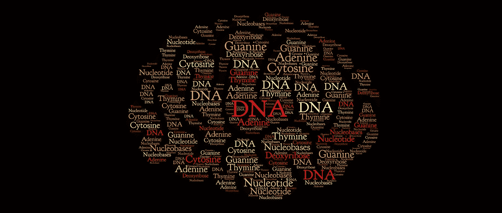
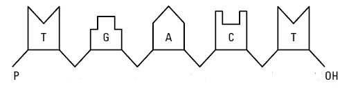
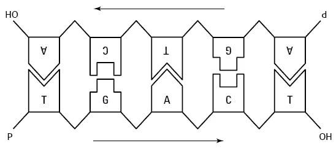
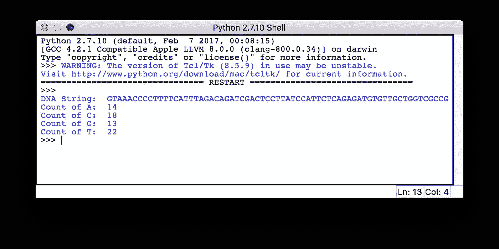
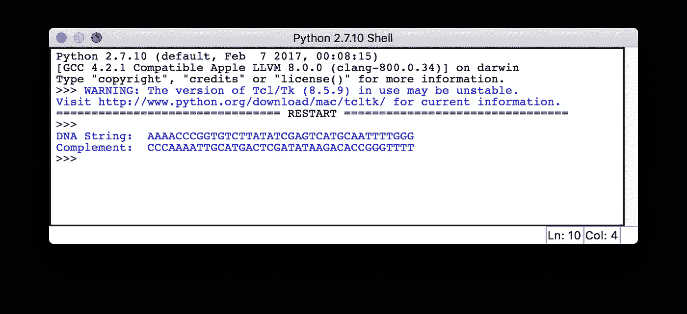

# 从生物信息学开始——DNA 核苷酸和链

> 原文：<https://towardsdatascience.com/starting-off-in-bioinformatics-dna-nucleotides-and-strands-8c32515271a8?source=collection_archive---------2----------------------->



在我介绍生物信息学的第一篇文章中，我提到我们将会学到很多关于 DNA、RNA 和蛋白质序列的知识。因为我对所有这些 DNA/RNA 术语都不熟悉，所以我决定先学习它们，然后尝试一些编码问题。所有的测序问题好像都有一些和遗传学有关的词。首先，让我们开始吧。😊

**注:**我假设你有基本的化学知识，从而假设你知道诸如*氢键*、*磷酸基团*、*羟基*等术语的含义。

# 什么是 DNA？

**DNA** 或**脱氧核糖核酸**，是一种携带所有生物遗传密码的分子。DNA 和它的朋友 RNA 或核糖核酸一起被称为核酸。DNA 是储存生物所有生物信息的结构。

# 什么是核苷酸？

DNA 是一种长的链状分子，由两条拧成双螺旋的链组成。这两条链由更简单的分子组成，叫做核苷酸 T21。每个核苷酸由四个含氮的**核碱基** *、*中的一个组成


DNA chemical structure ([https://en.wikipedia.org/wiki/Nucleobase](https://en.wikipedia.org/wiki/Nucleobase))

1.  ***胞嘧啶****(****C****)*
2.  ***鸟嘌呤****(****G****)*
3.  ***腺嘌呤*** *(* ***一*** *)*
4.  ***胸腺嘧啶****(****T****)*

连同一种糖叫做*，还有一种 [***磷酸***](https://en.wikipedia.org/wiki/Phosphate) ***基团*** 。*

*这些核碱基通过在一个核碱基的糖和下一个核碱基的磷酸之间形成共价键而以链状结构相互连接，从而产生交替的**糖-磷酸骨架**。你可以参考上面给出的图表来清楚地理解。*

# *代表一条 DNA 链*

*如上所述，通过连接核碱基形成的单个 DNA 链可以简单地表示如下。您可以将此表示映射到之前的图像。这将是上图中分子的一面。*

**

*Chained nucleotides constituting a DNA strand (Wiley: Bioinformatics For Dummies, 2nd Edition)*

*你可能会注意到，最左端有一个未使用的 [**磷酰基**](https://en.wikipedia.org/wiki/Phosphoryl_group) (也叫***5’-末端*** )和最右端有一个未使用的 [**羟基**](https://en.wikipedia.org/wiki/Hydroxy_group) (也叫***3’-末端*** )。单链的 DNA 序列总是被定义为一系列组成它的核苷酸，按从未使用的磷酰基到未使用的羟基的顺序排列。上述 DNA 序列可以表示为:*

```
***TGACT** = **Thymine-Guanine-Adenine-Cytosine-Thymine***
```

# *DNA 序列的两个部分*

*根据碱基配对规则，两条独立链的核碱基连接在一起； **A 带 T** 和 **C 带 G** ，连同 [**氢键**](https://en.wikipedia.org/wiki/Hydrogen_bond) 。DNA 分子由两条**互补链**组成，如下图所示。也标记了核苷酸的阅读方向。*

**

*The two complementary strands of a complete DNA molecule (Wiley: Bioinformatics For Dummies, 2nd Edition)*

*互补性意味着两条链遵循碱基配对规则。一条链上的胸腺嘧啶总是面对腺嘌呤，反之亦然；鸟嘌呤总是面对着胞嘧啶，反之亦然。当你知道一条 DNA 链的核苷酸序列时，你可以自动推断出另一条链的序列。*

*上述 DNA 分子的相对链的表示将是，*

```
***TGACT** and **AGTCA***
```

# *该练习了*

*我偶然发现了这个名为 [**Rosalind**](http://rosalind.info/problems/list-view/) 的有趣的编程平台，在这里你可以通过解决现有的问题来学习生物信息学和编程。我将讨论与我在本文中讨论的内容相关的两个问题，并解释我是如何解决它们的。我将用我自己的例子来解释。你可以从上面的链接中尝试一下。*

## *计算 DNA 核苷酸*

*给定的一个 DNA 序列可以被认为是一个带有字母表的字符串{"A "、" C "、" G "、" T"}。我们可以计算每个字母在字符串中出现的次数。*

*下面是我的 Python 解决方案。*

*Counting DNA Nucleotides solution in Python*

*我的 *sample_dna.txt* 文件包含以下 dna 字符串。*

```
***GTAAACCCCTTTTCATTTAGACAGATCGACTCCTTATCCATTCTCAGAGATGTGTTGCTGGTCGCCG***
```

*下面给出的是输出。*

**

*Counting DNA Nucleotides output*

*我们可以从文件中读取 DNA 字符串，然后使用 Python 的*字符串计数*方法来计算每个字母出现的次数。您还可以在循环中迭代字符串，并分别维护每个字母的计数。*

## *补充一条 DNA 链*

*回忆一下我们所了解的 DNA 分子的**互补链**。这个问题是关于寻找另一个面对的链的序列。*

*下面是我的 Python 解决方案。*

*Complementing a Strand of DNA solution in Python*

*我的 *sample_dna.txt* 文件包含以下 dna 字符串。*

```
***AAAACCCGGTGTCTTATATCGAGTCATGCAATTTTGGG***
```

*下面给出的是输出。*

**

*Complementing a Strand of DNA output*

*在这个解决方案中，我反向遍历字符串，将 A 替换为 T，T 替换为 A，G 替换为 C，C 替换为 G，以获得互补的 DNA 字符串。*

# *最后的想法*

*DNA 序列和相关数据存储在巨大的数据库中，并用于不同的领域，如法医学、系谱学和医学。这些简单的技术将成为开发更复杂问题的解决方案的基础。*

*希望你喜欢读这篇文章，并学到一些有用的东西。*

*因为我对这个领域还很陌生，所以我想听听你的建议。😇*

*感谢阅读…😃*