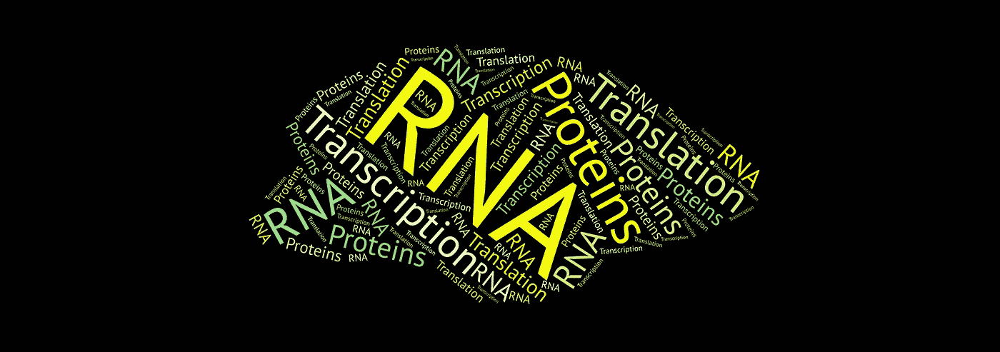
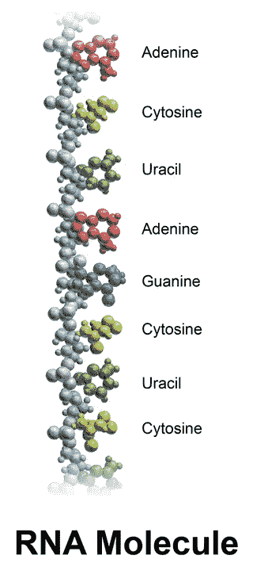
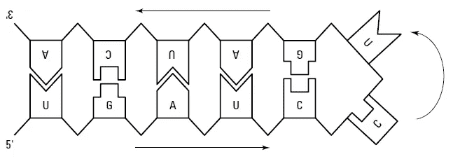
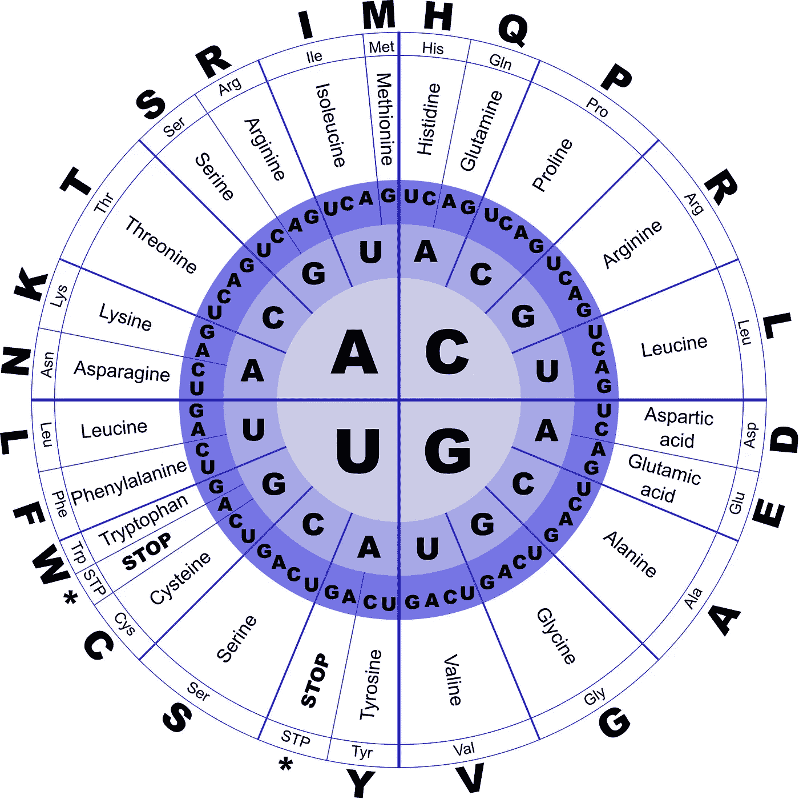
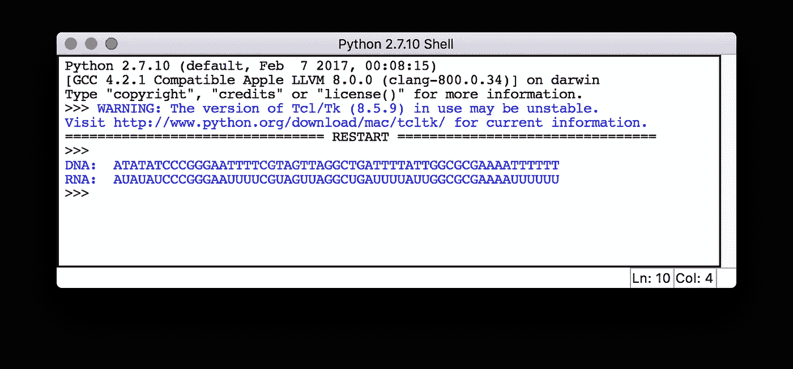
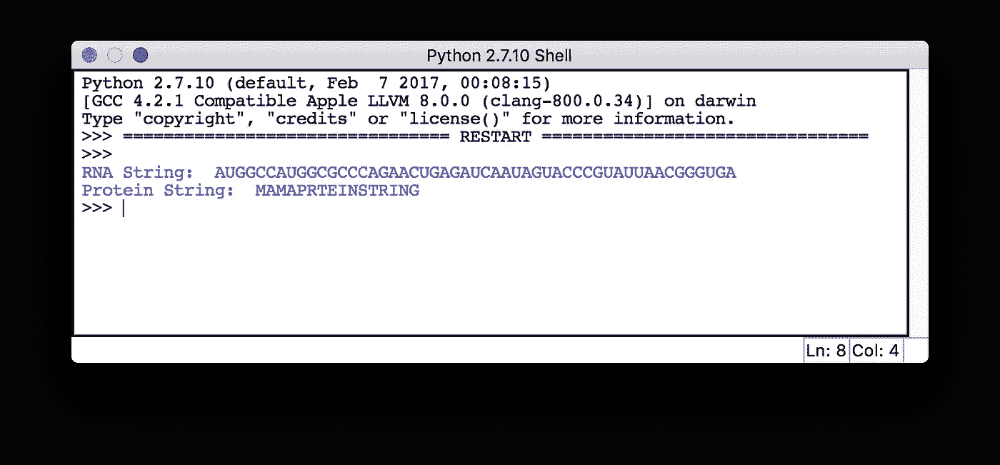

# 从生物信息学开始——RNA 转录和翻译

> 原文：<https://towardsdatascience.com/starting-off-in-bioinformatics-rna-transcription-and-translation-aaa7a91db031?source=collection_archive---------1----------------------->



在我之前的文章中，我已经[介绍了 DNA](https://medium.com/towards-data-science/starting-off-in-bioinformatics-dna-nucleotides-and-strands-8c32515271a8) 以及如何[将 DNA 变成蛋白质](https://medium.com/towards-data-science/starting-off-in-bioinformatics-turning-dna-sequences-into-protein-sequences-c771dc20b89f)。别忘了也去看看。在本文中，我们将涉及以下主题。

1.  什么是 RNA？
2.  如何从 DNA 中获取 RNA？
3.  如何把 RNA 变成蛋白质？

在本文的最后，我们将尝试用 Python 编写一些代码来涵盖我们所学的内容。

# 什么是 RNA？



Nucleobases in an RNA molecule ([https://en.wikipedia.org/wiki/RNA](https://en.wikipedia.org/wiki/RNA))

**RNA** 或**核糖核酸**是一种核酸，类似于 DNA。然而，与非常稳定的 DNA 不同，RNA 是核酸家族中更活跃的成员。在生物信息学的背景下，RNA 和 DNA 之间只有两个重要的区别:

1.  **RNA 与 DNA 相差一个核苷酸。**
2.  **RNA 由单链(一个核苷酸)组成，不是螺旋。**

RNA 由下列核碱基组成，

1.  ***胞嘧啶* (C)**
2.  ***鸟嘌呤* (G)**
3.  ***腺嘌呤*(一)**
4.  ***尿嘧啶* (U)**

连同一种糖叫做 [***核糖***](https://en.wikipedia.org/wiki/Ribose) ，还有一种 [***磷酸***](https://en.wikipedia.org/wiki/Phosphate) ***基团*** 。 ***尿嘧啶*** 是在 RNA 中发现的碱基，不同于在 DNA 中发现的*胸腺嘧啶*。这些核碱基通过在一个核碱基的糖和下一个核碱基的磷酸之间形成共价键而以链状结构相互连接，产生了交替的**糖-磷酸骨架**，类似于 DNA 链。你可以在我之前的文章中读到更多关于链形成过程的信息。

尽管 RNA 分子是单链的，但它们仍然强烈要求与互补序列配对。单链 RNA 分子与其序列的不同区域配对，形成稳定的双螺旋结构。每个 RNA 分子试图配对尽可能多的核苷酸，同时保持它们的形状。**发夹形状**如下图所示，是 RNA 结构的基本元素。它们由**环**(图中未配对的 C-U)和**茎**(图中配对的区域)组成。



How RNA turns itself into a double-stranded structure (Wiley: Bioinformatics For Dummies, 2nd Edition)

# DNA 转录成 RNA

转录是一个过程，其中一条 DNA 链被用作模板，通过一次复制一个核苷酸来构建一条 RNA 链，其中*尿嘧啶*被用于替代*胸腺嘧啶*。

以下面的 DNA 字符串为例。

```
**AATTTGCTTGGCAAATCGTATGCCTTGGG**
```

通过将所有出现的 **T** 替换为 **U** ，可以获得如下相关的 RNA 字符串。

```
**AAUUUGCUUGGCAAAUCGUAUGCCUUGGG**
```

你可以在这里阅读[关于转录的](https://en.wikipedia.org/wiki/Transcription_(biology))从一个更生物学的角度。

# 将 RNA 转化成蛋白质

如果你知道一个 RNA 序列，可以用**遗传密码**翻译成相应的蛋白质序列。这与细胞自身产生蛋白质序列的方式相同。

RNA 的**遗传密码**(也称为 **RNA 密码子表**)展示了我们如何将一个 4 核苷酸序列(A、U、G、C)与一组 20 个氨基酸唯一地联系起来。这和我[上一篇文章](https://medium.com/towards-data-science/starting-off-in-bioinformatics-turning-dna-sequences-into-protein-sequences-c771dc20b89f)讨论的 DNA 密码子表很像，只是我们用了“U”而不是“T”。下图以图表的形式显示了 RNA 的遗传密码。



Genetic code chart for RNA ([https://stackoverflow.com/](https://stackoverflow.com/))

## 如何使用遗传密码图进行 RNA 到蛋白质的翻译

首先你应该得到你的 RNA 字符串。

```
**AUGGCCAUGGCGCCCAGAACUGAGAUCAAUAGUACCCGUAUUAACGGGUGA**
```

然后开始一次读取 3 个核苷酸的序列(一个三联体)。

```
**AUG GCC AUG GCG CCC AGA ACU GAG AUC AAU AGU ACC CGU AUU AAC GGG UGA**
```

现在用遗传密码图读出当前三联体对应的是哪一个氨基酸(技术上称为**密码子**)。从中心开始的第一个圆圈代表三元组的第一个字符，第二个圆圈代表第二个字符，第三个圆圈代表最后一个字符。翻译后，你会得到与上述 RNA 序列相对应的蛋白质序列。

```
**M A M A P R T E I N S T R I N G STOP
M A M A P R T E I N S T R I N G**
```

***UAA*** ， ***UAG*** 和 ***UGA*** 被称为**终止信号**，在此停止翻译过程。

# 该练习了

## 将 DNA 转录成 RNA

RNA 字符串可以用字母表示为{"A "，" U "，" G "，" C"}。通过用“U”替换 DNA 串中所有出现的“T ”,可以将 DNA 串转换成其相应的转录 RNA 串。下面给出了从给定的 DNA 字符串中获取 RNA 字符串的示例代码。请随意尝试代码，看看会发生什么。

Transcribing DNA in to RNA code in Python

我在 *sample_dna.txt* 文件中输入了以下 DNA 字符串。

```
**ATATATCCCGGGAATTTTCGTAGTTAGGCTGATTTTATTGGCGCGAAAATTTTTT**
```

下面给出了获得的输出。



Transcribing DNA in to RNA output

请注意，所有出现的“T”都被替换为“U”。

## 使用 Python 进行 RNA 到蛋白质的翻译

下面给出的 Python 代码获取一个 RNA 序列，并将其转换为相应的蛋白质序列。我已经创建了一个字典来存储遗传密码图的信息。请随意尝试代码，看看会发生什么。

Translating RNA into Protein code in Python

我使用了上面提到的同一个例子，作为对 *sample_rna.txt* 文件的输入。

```
AUGGCCAUGGCGCCCAGAACUGAGAUCAAUAGUACCCGUAUUAACGGGUGA
```

下面给出的是结果。



Translating RNA into Protein output

# 最后的想法

生物信息学中有一个独立的分支，名为 **RNA 生物信息学**，主要研究 RNA。目前有许多工具和技术可用于分析 RNA 序列。

希望你喜欢读这篇文章，并学到一些有用的东西。

因为我对这个领域还很陌生，所以我想听听你的建议。😇

请继续关注我关于生物信息学的下一篇文章。

感谢阅读…😃