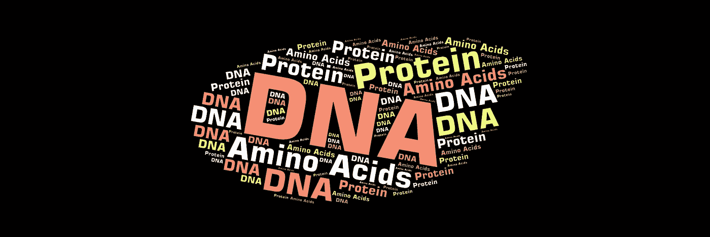
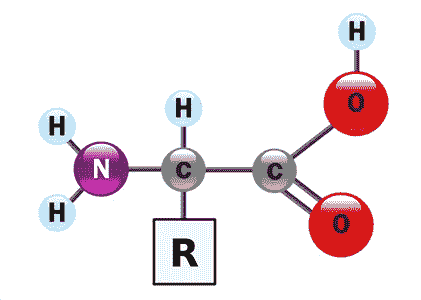
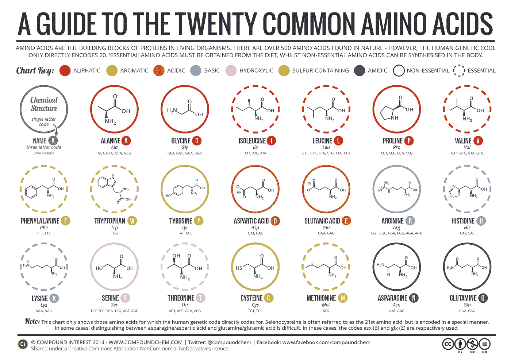
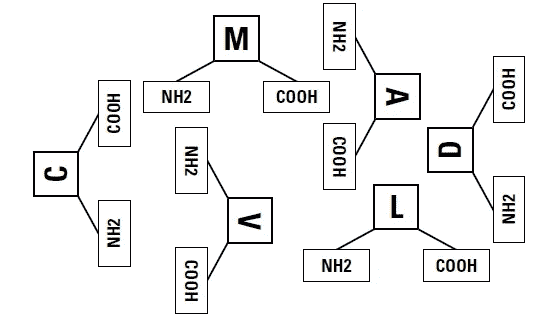
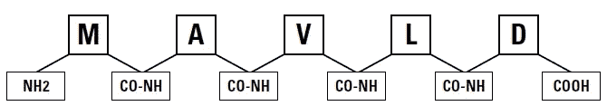
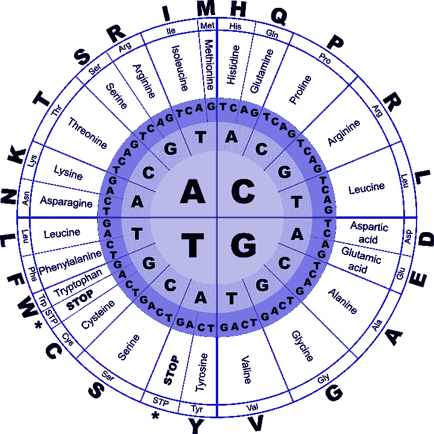
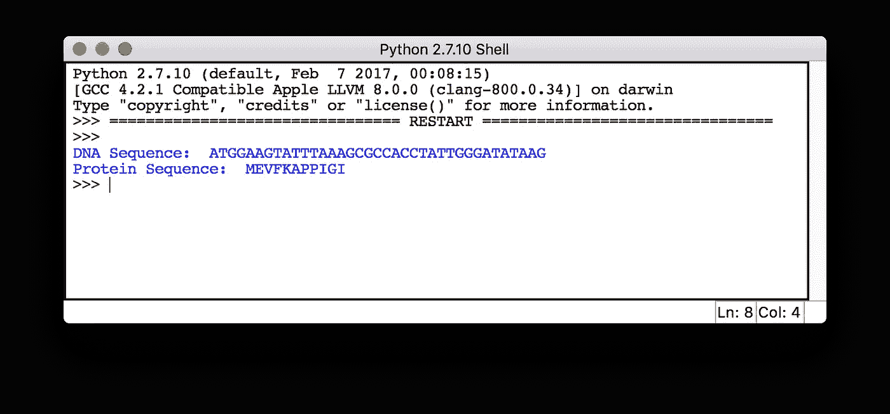

# 从生物信息学开始——将 DNA 序列转化为蛋白质序列

> 原文：<https://towardsdatascience.com/starting-off-in-bioinformatics-turning-dna-sequences-into-protein-sequences-c771dc20b89f?source=collection_archive---------3----------------------->



在这篇文章中，我们将学习蛋白质以及如何将 DNA 序列转换成蛋白质序列。如果你错过了我之前的一篇关于 [DNA 核苷酸和链](https://medium.com/towards-data-science/starting-off-in-bioinformatics-dna-nucleotides-and-strands-8c32515271a8)的文章，我建议你读一读，这样你会觉得这篇文章更有意义。让我们继续来看蛋白质。

# 什么是蛋白质？

**蛋白质**是由**氨基酸**组成的链状大分子。蛋白质之间的区别主要在于它们的氨基酸序列，这是由它们基因的核苷酸序列决定的。在讨论蛋白质之前，让我们看看什么是氨基酸。

# 什么是氨基酸？



**Structure of an amino acid** ([https://en.wikipedia.org/wiki/Amino_acid](https://en.wikipedia.org/wiki/Amino_acid))

**氨基酸**是复杂的有机分子，主要由*碳*、*氢*、*氧*和*氮*以及其他一些原子组成。它包含一个 [***胺基***](https://en.wikipedia.org/wiki/Amine) 和一个 [***羧基***](https://en.wikipedia.org/wiki/Carboxyl) ，以及一个对每种氨基酸特异的 [***侧链***](https://en.wikipedia.org/wiki/Substituent) (R 基团)。

目前已知大约 500 种氨基酸，但只有 20 种出现在我们的遗传密码中。这 20 种氨基酸是我们感兴趣的组成部分。

## 20 种常见的氨基酸

下图显示了在我们的遗传密码中出现的 20 种常见氨基酸，以及它们的全名、三个字母的代码和一个字母的代码。



**The 20 Common Amino Acids** (Compound Interest: [http://www.compoundchem.com/2014/09/16/aminoacids/](http://www.compoundchem.com/2014/09/16/aminoacids/))

# 用氨基酸代表蛋白质

生物化学家已经认识到，特定类型的蛋白质总是以相同的比例包含完全相同数量的总氨基酸(统称为**残基**)。举个例子，

```
**insulin = (30 glycines + 44 alanines + 5 tyrosines + 14 glutamines + . . .)**
```

此外，氨基酸以链的形式连接在一起。蛋白质的特性是从它的组成以及组成它的氨基酸的精确顺序中获得的。因此，胰岛素可以表示为，

```
**insulin = MALWMRLLPLLALLALWGPDPAAAFVNQHLCGSHLVEALYLVCGERG FFYTPKTRREAEDLQVGQVELGGGPGAGSLQPLALEGSLQKRGIVEQCCTSICSLYQLENYCN**
```

# 形成蛋白质

蛋白质是由氨基酸及其*胺*和*羧基*基团在序列中连续的残基之间形成被称为 [**肽键**](https://en.wikipedia.org/wiki/Peptide_bond) 的键而形成的。下面给出的两个图表描述了游离氨基酸如何通过形成肽键来形成蛋白质。



**Free amino acids** (Wiley: Bioinformatics For Dummies, 2nd Edition)



**Amino acids chained together to form a protein molecule** (Wiley: Bioinformatics For Dummies, 2nd Edition)

你可以看到在最左端有一个未使用的胺基，在最右端有一个未使用的羧基。这些末端分别被称为蛋白质链的 **N 端**和 **C 端**。蛋白质的序列是由组成它的氨基酸读出的，这些氨基酸按从 N-末端到 C-末端的顺序排列。因此，在上图中发现的蛋白质序列将是，

```
**MAVLD = Met-Ala-Val-Leu-Asp
      = Methionine–Alanine-Valine–Leucine-Aspartic**
```

# 将 DNA 转化成蛋白质

当你知道一个 DNA 序列时，你可以通过使用**遗传密码**将其翻译成相应的蛋白质序列。这与细胞自身产生蛋白质序列的方式相同。这个过程被称为 **DNA 到蛋白质的翻译**。

**遗传密码**(称为 [**DNA 密码子表**](https://en.wikipedia.org/wiki/DNA_codon_table) 用于 DNA 序列 **)** 显示了我们如何将一个 4 核苷酸序列(A、T、G、C)与一组 20 个氨基酸唯一地联系起来。它描述了一套规则，通过这些规则，活细胞将遗传物质中编码的信息翻译成蛋白质。下图以图表的形式显示了 DNA 密码子表。



Genetic Code Chart for DNA ([http://www.geneinfinity.org/sp/sp_gencode.html](http://www.geneinfinity.org/sp/sp_gencode.html))

## 如何使用遗传密码图进行 DNA 到蛋白质的翻译

首先你应该得到你的 DNA 序列。

```
**ATGGAAGTATTTAAAGCGCCACCTATTGGGATATAAG**
```

然后开始一次读取 3 个核苷酸的序列(一个三联体)。

```
**ATG GAA GTA TTT AAA GCG CCA CCT ATT GGG ATA TAA G...**
```

现在用遗传密码图读出当前三联体对应的氨基酸(技术上称为**密码子**)。从中心开始的第一个圆圈代表三元组的第一个字符，第二个圆圈代表第二个字符，第三个圆圈代表最后一个字符。翻译后，你会得到与上述 DNA 序列相对应的蛋白质序列。

```
**M E V F K A P P I G I STOP
M E V F K A P P I G I**
```

***TAA*** ， ***标签*** 和 ***TGA*** 被称为**终止信号**，在此停止翻译过程。

# **使用 Python 进行 DNA 到蛋白质的翻译**

下面给出的 Python 代码获取 DNA 序列，并将其转换为相应的蛋白质序列。我已经创建了一个字典来存储遗传密码图的信息。请随意尝试代码，看看会发生什么。

我已经在 *sample_dna.txt* 文件中输入了我们之前讨论过的相同 DNA 序列。

```
**ATGGAAGTATTTAAAGCGCCACCTATTGGGATATAAG**
```

下面给出了获得的结果。



Translating DNA into Protein output

# 最后的想法

如果你知道蛋白质编码区在 DNA 序列中的起始位置，你的计算机就可以用简单的代码生成相应的由氨基酸组成的蛋白质序列。许多序列分析程序使用这种翻译方法，因此您可以使用计算机将 DNA 序列作为虚拟蛋白质序列进行处理。

希望你喜欢读这篇文章，并学到一些有用的东西。

因为我对这个领域还很陌生，所以我想听听你的建议。😇

请继续关注我的下一篇关于生物信息学的文章，那将是关于 RNA 序列的。

感谢阅读…😃