# 开始在 PySpark 中开发，Jupyter 安装在一个大数据集群中

> 原文：<https://towardsdatascience.com/starting-to-develop-in-pyspark-with-jupyter-installed-in-a-big-data-cluster-8a84e4db27e4?source=collection_archive---------12----------------------->

众所周知，像 [Jupyter、](http://jupyter.org/) [Apache Zeppelin](https://zeppelin.apache.org/) 或最近推出的[云数据实验室](https://cloud.google.com/datalab/)和 [Jupyter 实验室](https://jupyterlab.readthedocs.io/en/stable/)这样的数据科学工具对于日常工作来说是必不可少的，那么如何将轻松开发模型的能力与大数据集群的计算能力结合起来呢？在本文中，我将分享在 GCP 的一个数据处理集群中开始使用 PySpark 的 Jupyter 笔记本的简单步骤。

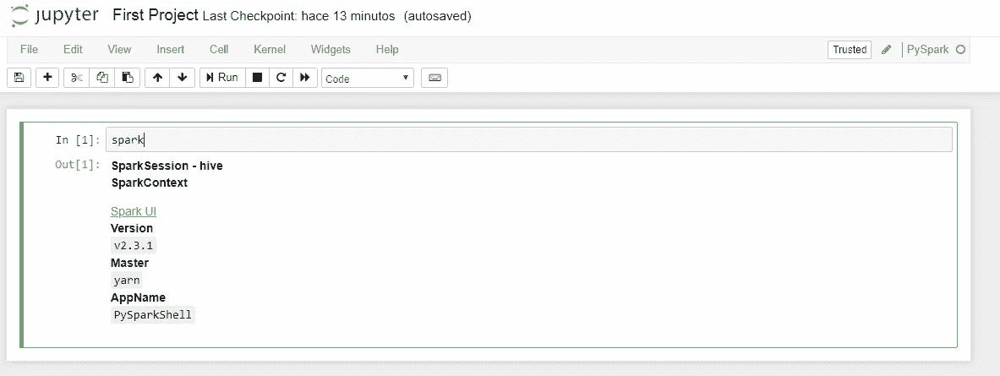

Final goal


**先决条件**

1.拥有一个谷歌云账户(只需登录你的 Gmail，就能自动获得一年 300 美元的信用额度)[1]

2.用您喜欢的名称创建一个新项目

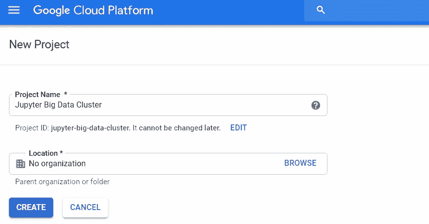

**步骤**

1.  为了使部署更容易，我将使用一个[测试功能](https://cloud.google.com/dataproc/docs/tutorials/jupyter-notebook)，它只能在通过 Google Cloud Shell 创建数据处理集群时应用。对于我们的集群，我们需要定义许多特性，比如工作人员的数量、master 的高可用性、RAM 和硬盘驱动器的数量等。为了简单起见，我建议通过 UI 模拟集群的创建。首先我们需要启用 Dataproc(图 1 和图 2)。

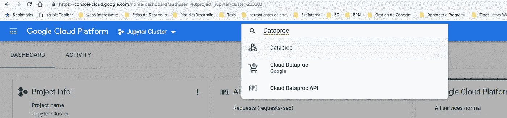

Figure 1 Enable Dataproc API I

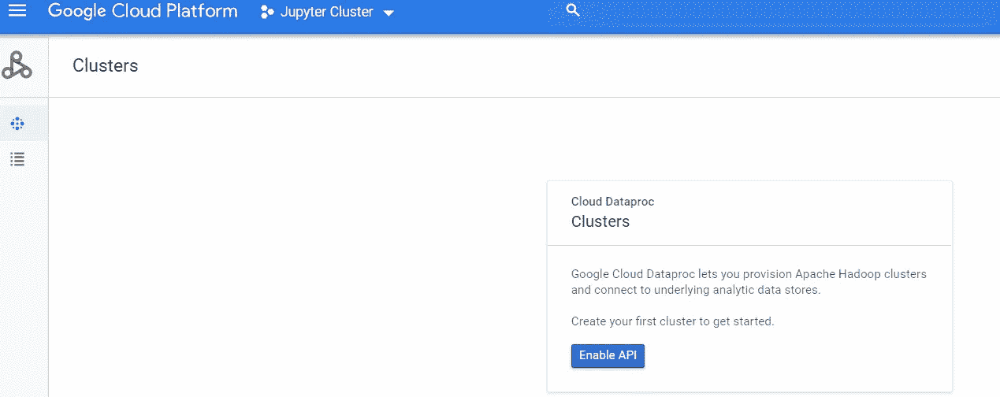

Figure 2 Enable Dataproc API II

2.使用您自己的集群大小获得模拟创建过程的等效命令行*。我将设定基本规格:*

*   区域:全球
*   集群模式:标准
*   主节点:2 个 vCPUs、7.5GB 内存和 300 磁盘大小
*   工作节点:2 个 CPU、7.5GB 内存和 200 个磁盘大小

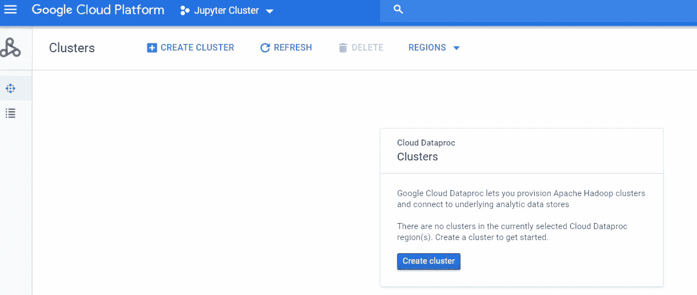

Simulate creating a cluster through UI

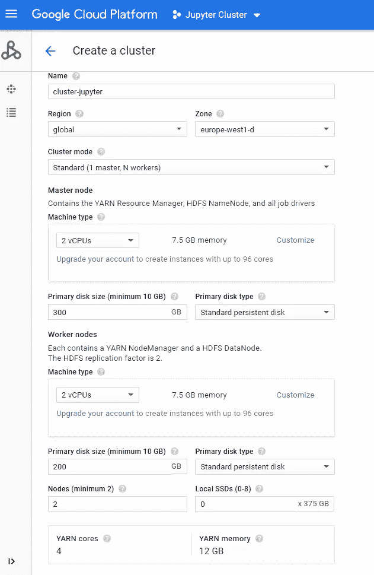

Basic specs

> **重要提示:您应该点击高级选项，将图像更改为 1.3 Debian 9，以使 beta 参数生效。**

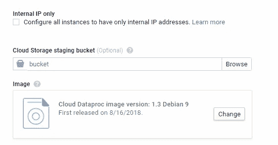

To access click Advance options

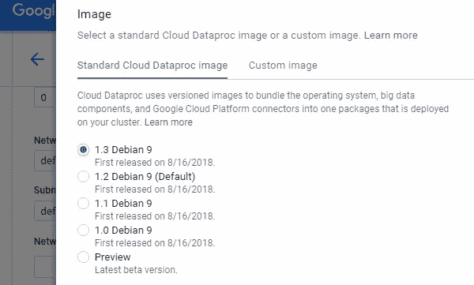

Change to 1.3 Debian 9

3.获取等效命令行

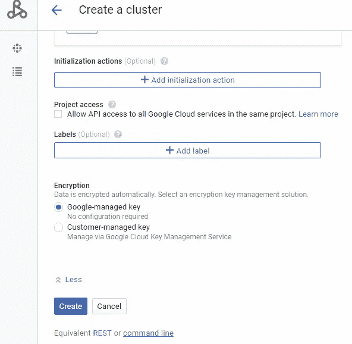

Click in command line

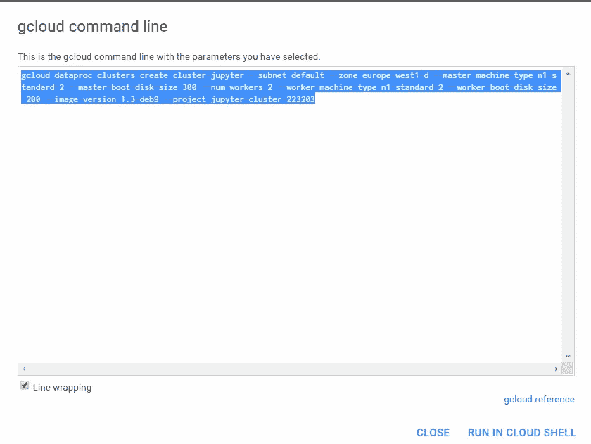

Copy the gcloud command

4.关闭模拟并单击以激活云壳


Activate Cloud Shell

5.修改您的命令添加并运行(可能需要几分钟)

```
--optional-components=ANACONDA,JUPYTER
```

变化

***g cloud data proc****星团*至 ***gcloud beta dataproc 星团***

奔跑

*   **重要信息更改项目 id ctic-227716，**在控制台中用黄色书写的名称，同时将 cluster-ctic 重命名为您喜欢的名称(记住使用小写)

```
gcloud beta dataproc clusters create cluster-ctic --subnet default --zone us-west1-a --master-machine-type n1-standard-2 --master-boot-disk-size 300 --num-workers 2 --worker-machine-type n1-standard-2 --worker-boot-disk-size 200 --optional-components=ANACONDA,JUPYTER --image-version 1.3-deb9 --project ctic-227716
```

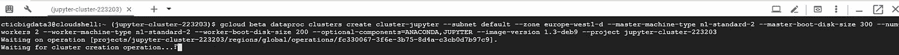

running in shell

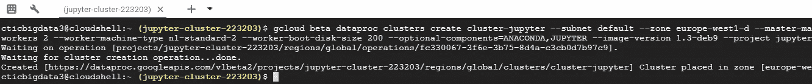

cluster created

6.允许 Jupyter 端口的传入流量，在登录页面中搜索防火墙规则并创建一个规则。


search Firewall rules VPC network


click on create a rule

7.定义防火墙规则开放端口 8123 并保存。

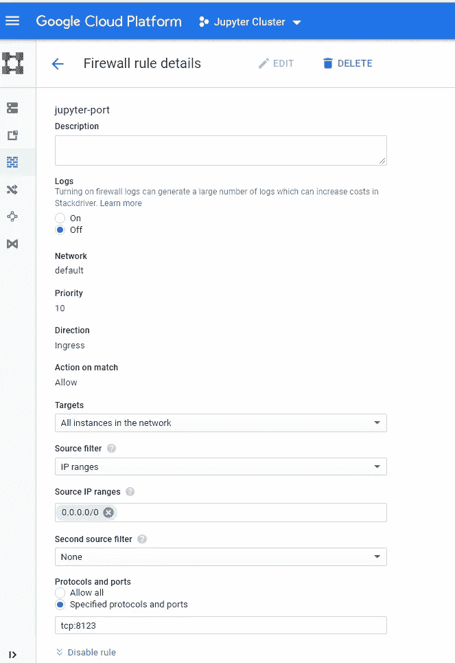

parameters

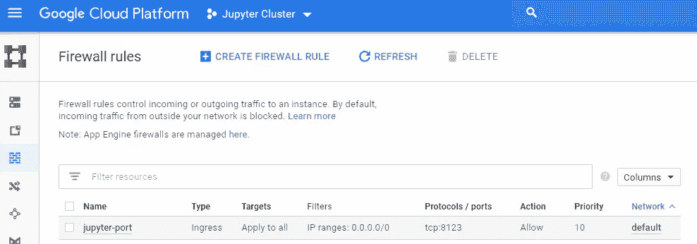

Rule working

8.检查您的所有节点是否都允许 http 和 https 流量，并添加在每个节点中创建的防火墙标记。

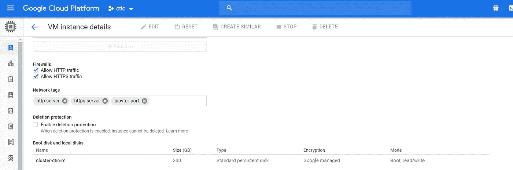

9.输入您的 Jupyter 笔记本！(您需要您的主 IP 并添加 jupyter 默认端口，例如[http://30.195 . XXX . xx:8123](http://30.195.xxx.xx:8123))

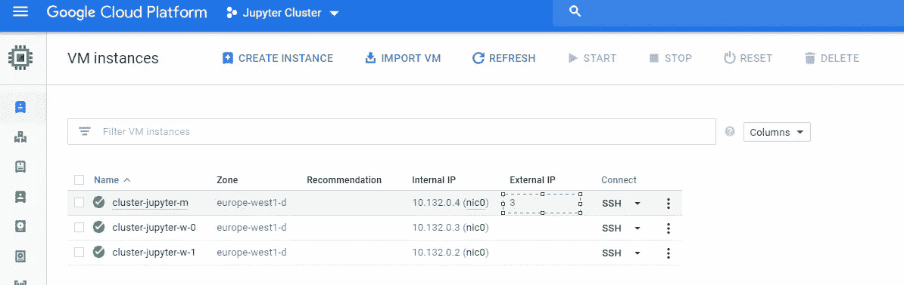

get master´s IP

10.让我们创建我们的第一个 Pyspark 笔记本


create the first Pyspark notebook

11.验证运行良好


**奖励:检查火花 UI**

*   要访问 Spark UI，您需要添加另一个防火墙规则，如步骤 7。打开端口 8088、4040、9870 和 4041。

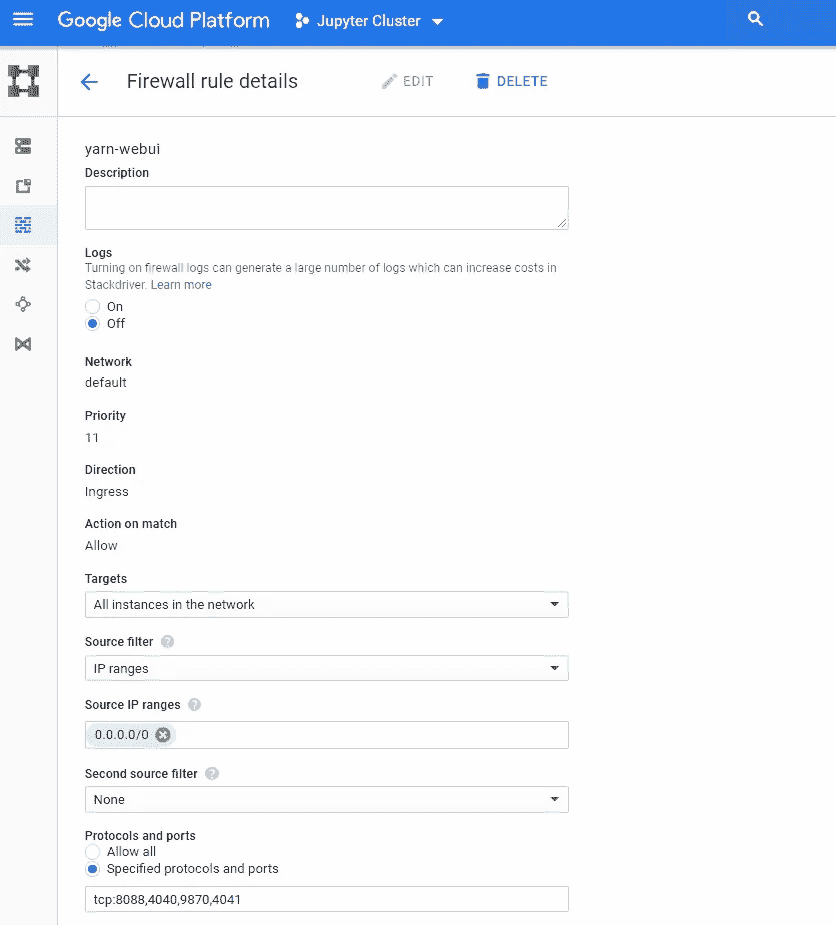

Create Spark UI rule

*   点击我们第一个笔记本中的 Spark UI 链接，您将看到一个 ERR_NAME_NOT_RESOLVED 错误，只需将 URL 替换为主 IP 即可

> 例如[http://3x . XXX . xx . x:8088/proxy/application _ 1542773664669 _ 0001](http://3x.xxx.xx.x:8088/proxy/application_1542773664669_0001)

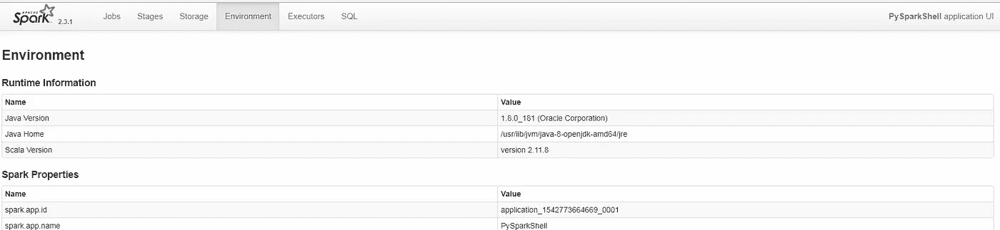

Spark UI

**结论**

在本文中，我尝试在 Data Proc 集群中部署 Jupyter，使得在真实集群中使用 PySpark 更加方便。如果您对下一篇文章有任何问题或建议，请随意。

下一篇文章再见！快乐学习！

PS 如果你有任何问题，或者想要澄清一些事情，你可以在 [Twitter](https://twitter.com/thony_ac77) 和 [LinkedIn 上找到我。](https://www.linkedin.com/in/antoniocachuan/)如果你想了解 Apache Arrow 和 Apache Spark，我有一篇文章[**用一些例子温和地介绍了 Apache Arrow 与 Apache Spark 和 Pandas**](/a-gentle-introduction-to-apache-arrow-with-apache-spark-and-pandas-bb19ffe0ddae) 此外，今年还出版了一本了解 Apache Spark、Spark 的最佳书籍:[权威指南](https://amzn.to/2NQxTmZ)