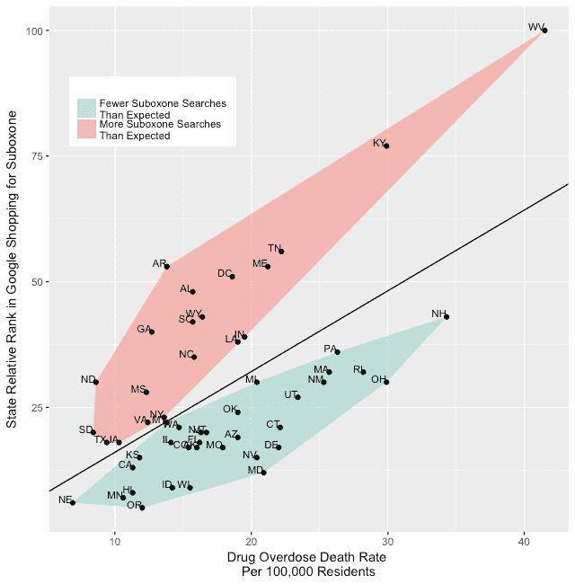
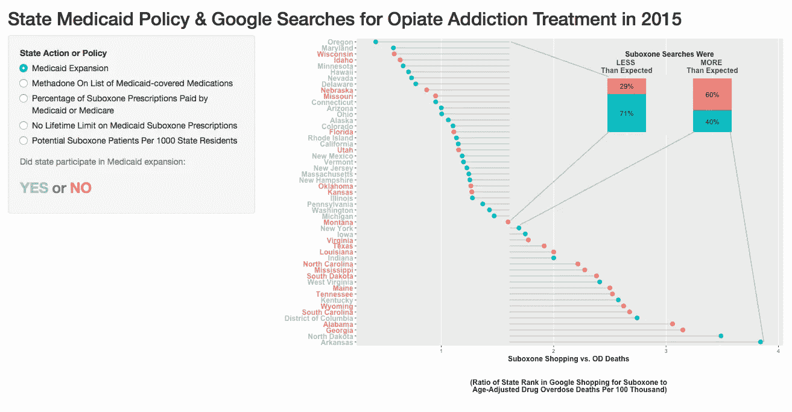

# 州政府关于鸦片滥用治疗的政策可能会驱使人们使用谷歌购物:一个数据可视化。

> 原文：<https://towardsdatascience.com/state-government-policy-on-opiate-abuse-treatment-may-drive-people-to-google-shopping-a-data-f71f4a09ef73?source=collection_archive---------9----------------------->

当人们需要某样东西而又很难得到它时，他们通常会在网上寻找愿意卖给他们的人。这不仅适用于收藏品、不寻常的配方成分和廉价的教科书，也适用于处方药。

用于治疗阿片成瘾或滥用的两种主要药物是[美沙酮](https://medlineplus.gov/druginfo/meds/a682134.html)和[丁丙诺啡](https://medlineplus.gov/druginfo/meds/a605002.html)。丁丙诺啡与[纳洛酮](https://www.drugabuse.gov/related-topics/opioid-overdose-reversal-naloxone-narcan-evzio)混合，通常被称为 Suboxone。这些药物抑制了渴望和戒断症状，使人们在接受治疗的同时更好地发挥作用。美沙酮治疗需要患者每天到特定的配药地点领取药物，这对许多人来说是一种负担。相比之下，Suboxone 可以在药店买到，每月一次。作为一种仿制药，它有望使更多的鸦片上瘾者和滥用者得到成功的治疗。

但是由于多种原因，患者很难得到 Suboxone 根据联邦法律，它只能由经过专门认证培训的医生开出，而医生自己必须为此付费；各州只有少量[医生持证](https://www.samhsa.gov/medication-assisted-treatment/physician-program-data/certified-physicians)；这些医生每年只能为 30、100 或 250 名患者开处方，这取决于他们的认证类型；一些获得认证的人可能会避免接受有需要的病人，因为他们可能是高维护费用的病人；病人排在注册医生的等候名单上是很常见的；一些州将 Medicaid 承保的治疗限制在 2 年或 3 年；一些保险政策，包括医疗补助或医疗保险(视州而定)，可能根本不涵盖 Suboxone。

因此，谷歌有一份关于“Suboxone”的谷歌购物搜索次数的记录。这可以按州进行细分，以获得搜索词“Suboxone”受欢迎程度的相对度量。

点击 [*此处*](https://jennylistman.shinyapps.io/OD_DeathsVsSuboxoneShopping/) 查看此图的互动版本…

Click [*here*](https://jennylistman.shinyapps.io/OD_DeathsVsSuboxoneShopping/) for an interactive version of this graph

你可能会认为，受阿片类药物流行影响最严重、过量致死率最高的[州](https://www.cdc.gov/drugoverdose/data/statedeaths.html)会有最多的关于 Suboxone 的谷歌购物搜索，可能是那些试图在没有处方的情况下购买 Suboxone 的人。这种趋势是存在的，但是有些州的搜索率比你预期的要高(用橙色突出显示)。有些州的搜索率比你预期的要低(用绿色突出显示)。死亡率根据各州年龄组比例的差异进行调整，因为一些死亡原因更可能影响特定年龄范围内的人。

由于 Suboxone 本身可能被吸毒者滥用或转移，试图避免得分之间的戒断症状，并不是所有谷歌购物搜索该药物的人都是积极试图恢复的人。纳洛酮成分被认为可以防止过量服用，但是丁丙诺啡成分确保了黑市[的存在。](http://www.nytimes.com/2013/11/17/health/in-demand-in-clinics-and-on-the-street-bupe-can-be-savior-or-menace.html)

各州正在做什么与比预期更高或更低的次级搜索率相关联？一些因素包括州医疗补助扩展状况、州医疗补助对阿片类药物成瘾或滥用治疗的覆盖范围，以及州政府在认证医生开出 Suboxone 方面所做的努力。点击[交互图](https://jennylistman.shinyapps.io/suboxone_searches)左侧的按钮，查看哪些州在谷歌购物上的 Suboxone 搜索率高于或低于预期，以及州政府政策是如何相关的。我使用的是 2015 年的数据，因为这是我能够获得所有数据的最近一年。

点击 [*此处*](https://jennylistman.shinyapps.io/suboxone_searches/) 查看此图的互动版本…

Click [*here*](https://jennylistman.shinyapps.io/suboxone_searches/) for an interactive version of this graph

我们可以在谷歌购物搜索“Suboxone”上看到与这些因素相关的趋势。通过医疗补助政策或医学博士认证努力促进医生处方 Suboxone 使用的州，人们通过互联网寻找危险替代品的比率较低。不可能知道这些因素*是否导致了搜索率的*差异——我们只能观察一种趋势。这里还有许多其他因素没有涉及，比如 T2 限制阿片类止痛药处方的程度；针对毒品犯罪的州执法实践；和[价格或街上是否有](https://www.reddit.com/r/opiates/comments/23b75c/what_is_the_average_street_price_of_8mg_suboxone/)Suboxone。此外，一些因素也是相互关联的，例如一个州的医疗补助或医疗保险覆盖的子处方的百分比，以及该州是否参与了医疗补助的扩展。

鸦片成瘾治疗包括行为疗法、[药物辅助治疗](https://www.drugabuse.gov/publications/research-reports/medications-to-treat-opioid-addiction/overview)及其组合。关于每种治疗方法的疗效存在争议，此处不予讨论。[美国医学协会](http://docs.house.gov/meetings/IF/IF02/20150423/103367/HHRG-114-IF02-Wstate-HarrisP-20150423.pdf)、[美国成瘾医学协会](https://www.asam.org/docs/default-source/public-policy-statements/pharmacological-therapies-for-opioid-use-disorder-2013-04-24.pdf?sfvrsn=4)和[世界卫生组织](http://www.who.int/substance_abuse/activities/treatment_opioid_dependence/en/)已经声明药物辅助治疗应该广泛可用。

使用 [R](https://www.r-project.org) 和 [Shiny](https://shiny.rstudio.com) 中的工具处理和绘制数据。

## 感谢您的阅读。

我欢迎反馈——您可以“鼓掌”表示赞同，或者如果您有具体的回应或问题，请在此给我发消息。我也有兴趣听听你想在未来的帖子中涉及哪些主题。

**阅读更多关于我的作品**[**【jenny-listman.netlify.com】**](https://jenny-listman.netlify.com)**。欢迎随时通过 Twitter**[**@ jblistman**](https://twitter.com/jblistman)**或**[**LinkedIn**](https://www.linkedin.com/in/jenniferlistman/)**联系我。**

数据来源:

1.  用药过量死亡率是按每 100，000 人中的死亡人数计算的年龄调整死亡率。在比较不同年龄分布的人口(如各州)时，按每个人口中年龄组的比例调整死亡率可以进行直接比较。如果某个特定的死亡原因更有可能影响某个年龄组的人，而某个州该年龄组的人口比例更高，那么在没有年龄调整的情况下，该原因导致的死亡率可能会被夸大。这些比率包括阿片类药物以外的药物过量。在某些情况下，死亡被报告为药物中毒，但不包含药物类型的信息。由于当地的报告惯例，阿片类药物报告的死亡人数[在各州](https://www.cdc.gov/nchs/data/health_policy/unspecified_drugs_by_state_2013-2014.pdf)差异很大，但非阿片类药物中毒死亡的百分比在各州差异较小。在这项分析中，我使用了每 100，000 人中经年龄调整的药物中毒死亡率，包括没有特定药物的死亡。由于各州的用药过量死亡率和州的 Suboxone 搜索率被用作各州之间的相对衡量标准，这使得在面对不规则的药物类型报告做法时，可以进行合理的州与州之间的比较。用药过量死亡率的数据来自 2015 年，从 CDC 网站获得:[https://www.cdc.gov/drugoverdose/data/statedeaths.html](https://www.cdc.gov/drugoverdose/data/statedeaths.html)
2.  按州和年份分列的有资格开 Suboxone 处方的医生人数和允许的病人人数的数据来自:[https://www . Sam HSA . gov/medication-assisted-treatment/physician-program-data/certified-physicians](https://www.samhsa.gov/medication-assisted-treatment/physician-program-data/certified-physicians)
3.  谷歌购物数据来自谷歌趋势:[https://trends.google.com/trends/](https://trends.google.com/trends/)* * *谷歌趋势数据是符合趋势用户选择的搜索标准的所有谷歌搜索数据的随机子集。因此，使用相同搜索标准的 Google Trends 报告之间的结果略有不同。我正在开发一个 R 工具来最小化趋势报告中的偏差。
4.  各州的 Suboxone 和阿片类药物处方数据以及 Medicaid Suboxone 和美沙酮覆盖政策来自 IMS 医疗保健信息学研究所的报告:阿片类药物康复治疗的使用:州级丁丙诺啡使用和支付类型的最新证据。[https://www . IMS health . com/files/web/IMSH % 20 institute/Reports/health care % 20 briefs/IIHI _ Use _ of _ opoid _ Recovery _ drugs . pdf](https://www.imshealth.com/files/web/IMSH%20Institute/Reports/Healthcare%20Briefs/IIHI_Use_of_Opioid_Recovery_Medications.pdf)
5.  2015 财年(截至 2016 年 1 月)医疗补助扩展州数据，来自凯泽家族基金会:[http://www . kff . org/Medicaid/state-indicator/Medicaid-expansion-spending/？current time frame = 0&sort model = % 7B % 22 solid % 22:% 22 location % 22，%22sort%22:%22asc%22%7D](http://www.kff.org/medicaid/state-indicator/medicaid-expansion-spending/?currentTimeframe=0&sortModel=%7B%22colId%22:%22Location%22,%22sort%22:%22asc%22%7D)