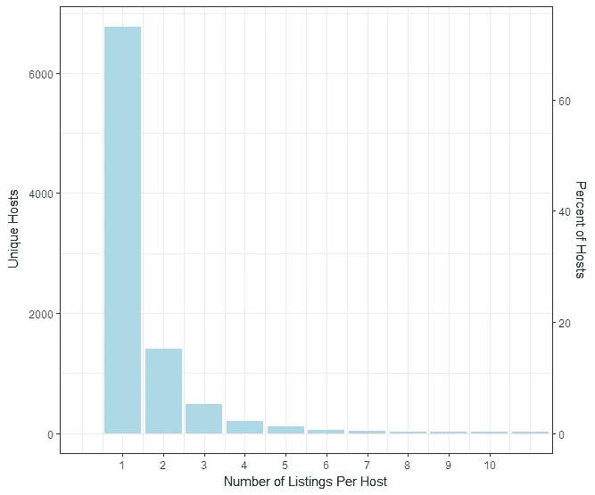
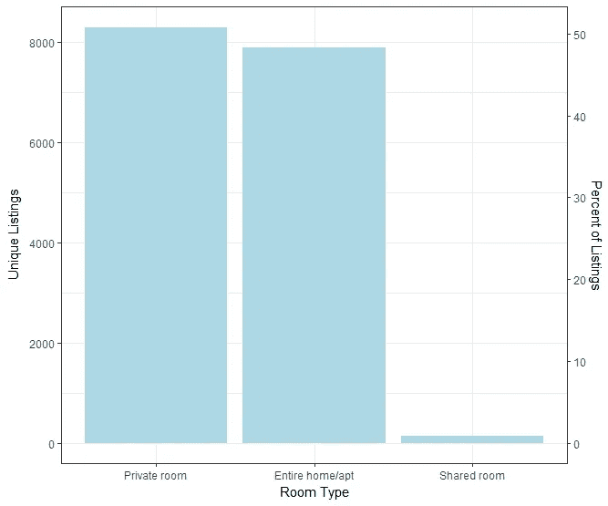
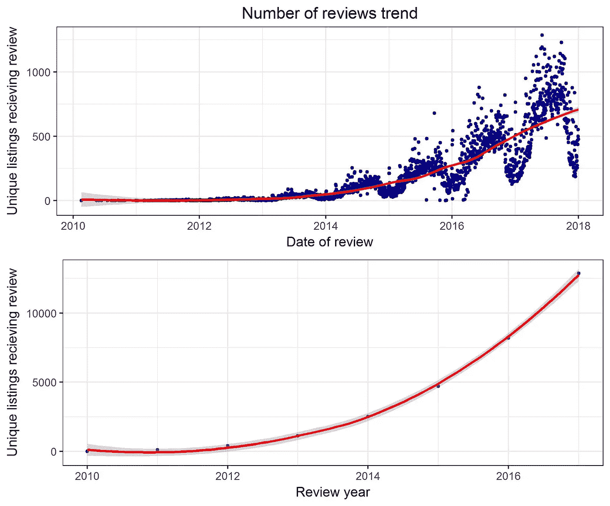
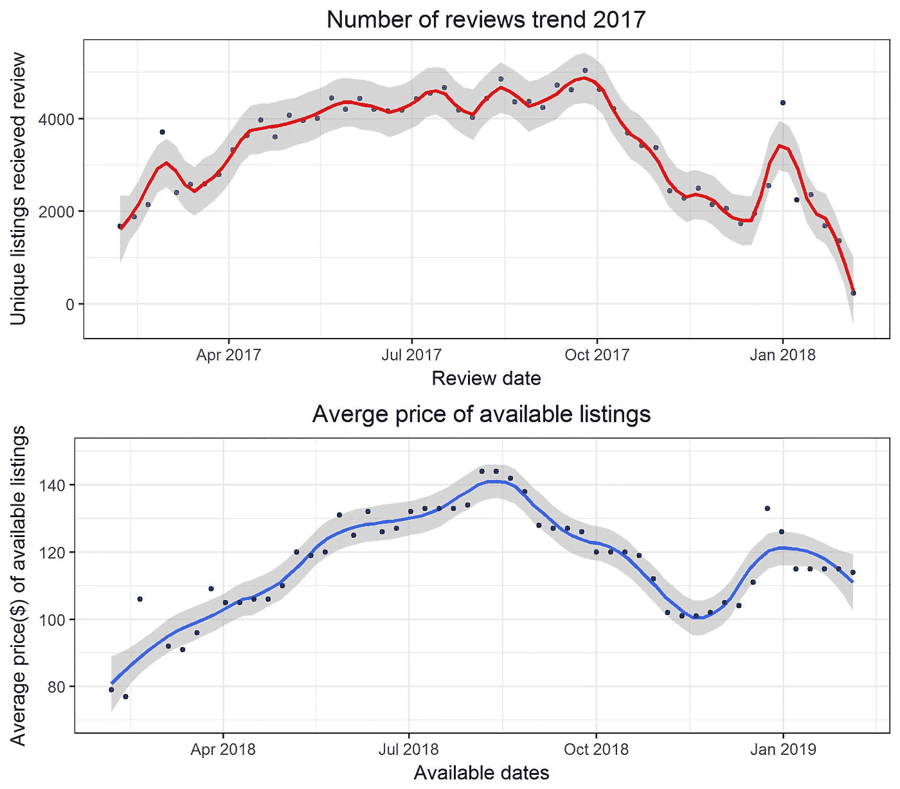
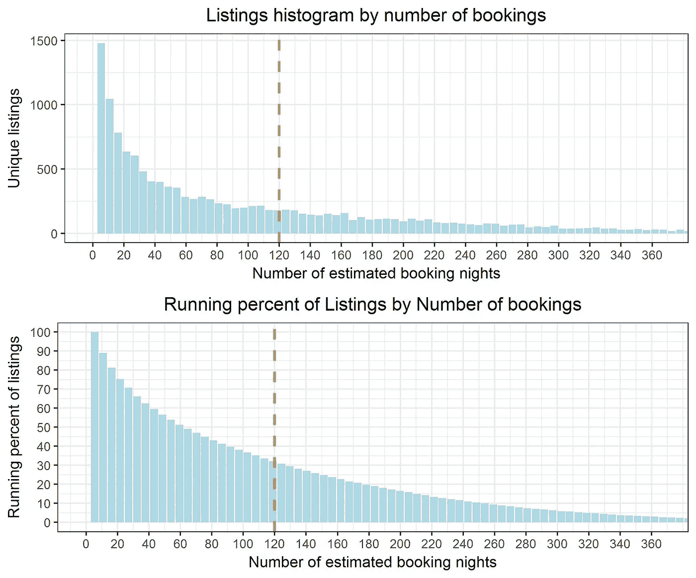
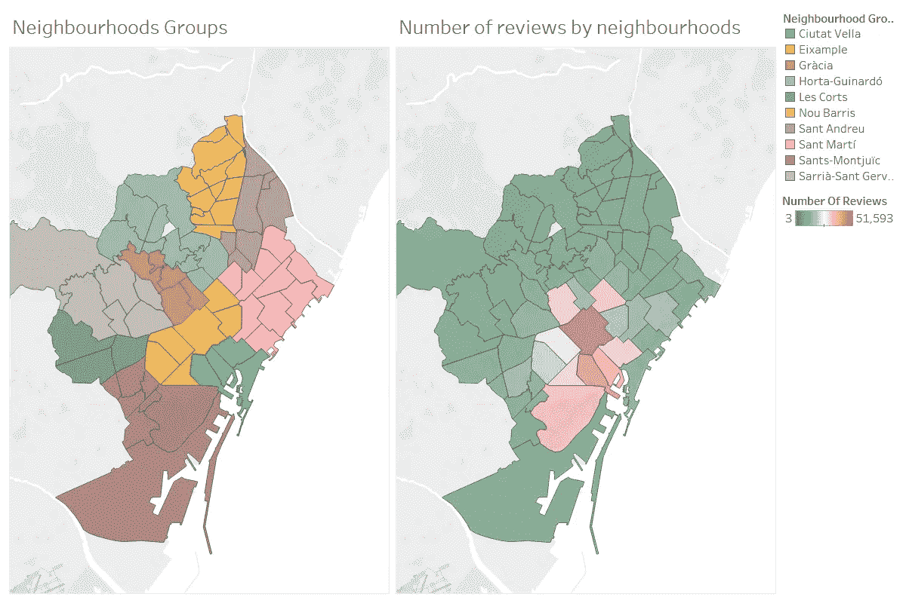
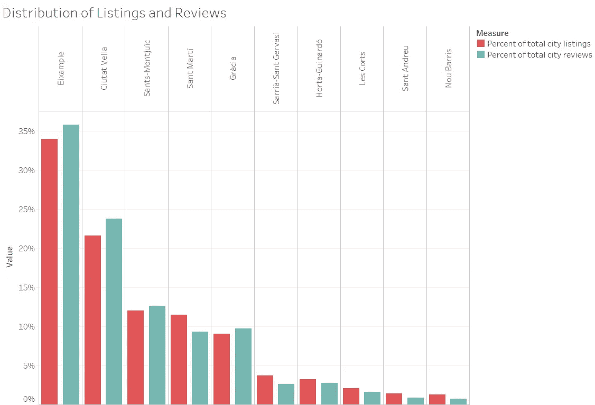
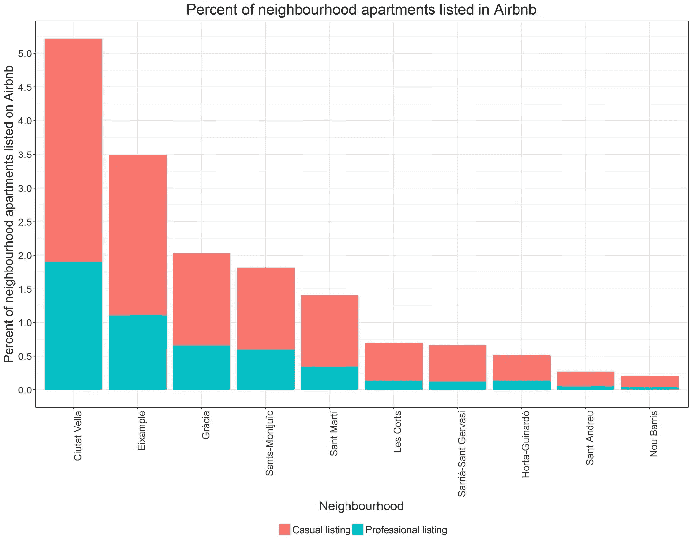

# 巴塞罗那 Airbnb 市场的统计概览

> 原文：<https://towardsdatascience.com/statistical-overview-of-barcelonas-airbnb-market-83dc7d6be648?source=collection_archive---------8----------------------->

本文对巴塞罗那的 Airbnb 经济进行了探索性的数据分析。Airbnb 在巴塞罗那非常受欢迎，与大型酒店行业平行。[福布斯](https://www.forbes.com/sites/bishopjordan/2017/04/05/airbnb-paris-london-nyc-la-barcelona-rome-infographic/#5d0fac0d4127)提到巴塞罗那是继巴黎和伦敦之后欧洲第三大 Airbnb 租赁城市，也是世界第六大。巴塞罗那的 Airbnb 活动也成为了针对使用该平台的东道主的政治和法律诉讼的对象。这座城市正在采取行动，从这个平台上移除数以千计没有[旅游许可证](http://aldianews.com/articles/culture/barcelona-crackdown-airbnb-model-follow/52926)和[被关闭](https://www.citylab.com/life/2018/06/barcelona-finds-a-way-to-control-its-airbnb-market/562187/)的房产。根据现有数据，Airbnb 在巴塞罗那的使用量每年都在增加，越来越多的主机在该平台上建立房源。

# Airbnb 数据源

Airbnb 不共享原始数据，但是使用 Airbnb 内部的[可以获得一些数据，这使得可以通过使用 Airbnb 网站上公开的信息来访问 Airbnb 数据。该数据是从 2018 年 2 月 7 日开始的可搜索列表的快照。这些数据包括:](http://insideairbnb.com/get-the-data.html)

*   未来可用日期的日期和价格
*   可搜索列表的评论
*   位置和列表元数据

# 探索性数据分析

我们可以预计，在一个需求如此之高的城市，大多数主持人将是“专业主持人”，他们出租完整的公寓或私人房间，并持有多个房源，以实现净利润的最大化，但数据告诉我们的情况不同。我们可以看到，大约 70%的活跃列表主机持有单一列表。这可能是市政厅关闭非许可房源的行动以及 Airbnb 自己制定的“一个主机一个家”政策[的结果，该政策限制市中心的非旅游许可房源的每个主机只能有一个房源。](https://www.airbnbcitizen.com/es/one-host-one-home-en-barcelona/)

*如果在未来一年中有 1 到 364 个可用日期，并且在过去 8 个月中至少收到 1 次审核，则该列表被视为有效。

假设大多数房源是非专业的，我们可以预计最受欢迎的房源类型将是私人和共享房间，允许主人继续住在自己的家里。实际上，私人房间平均分布在整个公寓中。这表明了两种情况——主人住在他们的日常公寓里，并列出另一个完整的公寓，这是一年的 Airbnb 清单，或者整个公寓的收入足够高，以鼓励主人搬出去过夜。

# 季节性需求

我们可以通过查看给定评论的数量来估计预订量。Airbnb 内部已经估计审核率为**大约 50%** ，与 Airbnb 官方文件中的统计数据相比，该审核率也符合下图。
审查显示，从 2016 年到 2017 年，被审查的上市公司数量每年增长 40%。

需求也有月度季节性，在 8 月份达到需求高峰，在新年达到另一个较短的高峰。我们可以看到可用房源的价格是如何相互关联并适应假日需求的。
看到这些数据可以解释主人合租甚至搬出公寓的意愿。[市中心一居室的平均租金](http://immovingtobarcelona.com/cost-of-living-in-barcelona/)可以达到每月 800€，日租金 32 美元。同样的公寓可以在 8 月份以 140 美元的价格在 Airbnb 上挂牌，即使扣除平台和清洁费，这对公寓租户来说也是一笔非常好的节省。将 8 月份 140 美元的平均挂牌价格与巴塞罗那酒店[212 美元的平均每日房价](https://www.statista.com/statistics/247224/average-daily-rate-of-hotels-in-barcelona/)进行比较，可以看出主人和客人都觉得 Airbnb 很划算。

# 专业主持

有多少专业 Airbnb 房源在巴塞罗那运营，这是 Airbnb 活动和这座城市之间的一个主要争议问题。全职主持人将努力最大化客人占用列表的时间，并最小化拜访方之间的时间。

可以使用审核日期来估计预订之间的平均时间。下图告诉我们，一个仅被审核 10 次的列表可以被认为是一个临时的-非专业的列表，预订间隔为 10 天(基于 50%的审核率)。

根据 Airbnb 的报告，每位客人的平均入住时间为 4.3 晚。这一措施被添加为橙色虚线。为了让列表每天晚上都工作，列表需要接收至少 90 个预订。

Airbnb 将每年预订超过 [120 天](https://www.airbnbcitizen.com/wp-content/uploads/sites/7/2017/05/Barcelona_DataReport_2017Q1_EN.pdf)的房源视为专业房源。我们将在这部分分析中使用相同的阈值。
根据预计预订量绘制的列表分布图显示，在 4320 个列表中，约 32%的列表可以根据 120 天标准被视为专业列表。

当比较 Airbnb 的 4320 个专业列表和该市酒店的 75000 个床位时，我们可以得出结论，这些列表只代表了巴塞罗那旅游专用住宿的 5%。

# 列表邻域分布

巴塞罗那 160 万人口居住在该市的 10 个街区。这座城市每年接待 3200 万游客，其中大约一半是一日游游客。让我们看看 Airbnb 是如何在邻里层面上影响这座城市的。对于这一部分，我们使用了 [Tableau 10.2](https://www.tableau.com/about/blog/2017/2/tackle-your-geospatial-analysis-ease-tableau-102-66018) GeoJSON 导入功能。

Ciutat Vella 和 Eixample 的市中心社区是最活跃的 Airbnb 社区，实际上，当查看特定区域时，reta de l'Eixample、Raval 和 Barri Gòtic 占据了整个城市 Airbnb 活动的 27%。
巴塞罗那只有市中心主机享受 Airbnb 的人气吗？似乎不是。我们可以注意到，列表和评论都分布在城市的不同区域，而大约 30%的列表和评论发生在三个中心社区之外。

## **Airbnb 是否占用了特定街区的居住空间？**

回答这个问题的正确方法是计算每个街区使用 Airbnb 的家庭百分比，特别是专业房源。我们将通过使用[按地区划分的人口](https://en.wikipedia.org/wiki/Districts_of_Barcelona)数据来估计家庭数量，并假设每套公寓有 2 个人。
Ciutat Vella 街区是巴塞罗那最具影响力的街区，然而，只有 1.9%的公寓是真正的专业房源，其余 3.3%的公寓是临时 Airbnb 房源。Airbnb 正在吸引更多游客进入已经拥挤的市中心，但可能会减少对当地住宅公寓费用的考虑。

# **结论**

Airbnb 在一个受政治、法规、季节性、文化和经济影响的动态市场中运营。巴塞罗那是一个美丽的旅游胜地，这使得 Airbnb 成为一种流行的创收方式，不仅在特定地区是专业的，而且在所有社区都是如此。大多数主机以一种随意的方式使用 Airbnb，通常只有一个列表，大约 30%的主机会管理多个列表。只要 Airbnb 提供比酒店更友好的预算选择，并为主机提供有意义的收入，我们可能会继续看到市场在当局监管主机的压力下增长。

[哈雷尔·瑞卡维亚](http://linkedin.com/in/harelrechavia)