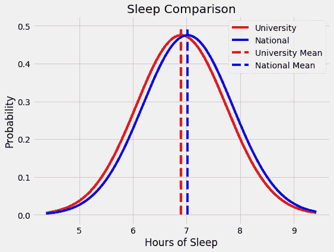
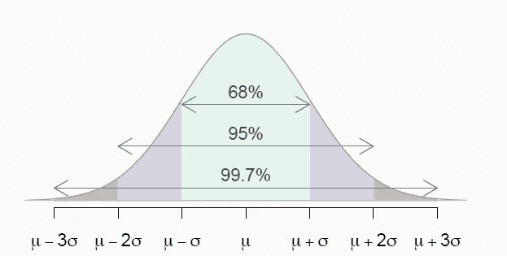
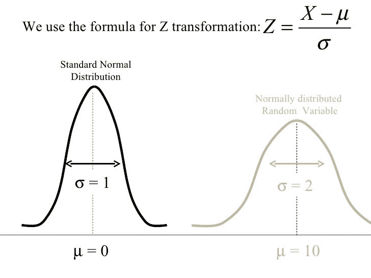
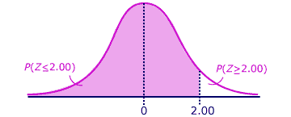
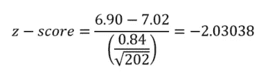

# 解释统计显著性

> 原文：<https://towardsdatascience.com/statistical-significance-hypothesis-testing-the-normal-curve-and-p-values-93274fa32687?source=collection_archive---------0----------------------->


**用数据证明一件事是什么意思？**

作为一所重点大学的院长，你收到一份令人担忧的报告，报告显示你的学生每晚平均睡眠时间为 6.80 小时，而全国大学的平均睡眠时间为 7.02 小时。学生会主席担心学生的健康，并指出这项研究证明家庭作业必须减少。另一方面，大学校长对这项研究不屑一顾，称其为无稽之谈:“在我年轻的时候，我们每晚能睡四个小时，就已经很幸运了。”你必须决定这是否是一个严重的问题。幸运的是，你精通统计学，并最终看到了一个运用你所受教育的机会！



How can we decide if this is meaningful?

统计显著性是我们经常听到但没有真正理解的术语之一。当有人声称数据证明了他们的观点时，我们点头接受，假设统计学家做了复杂的运算，得出了不容置疑的结果。事实上，统计显著性不是一个需要多年学习才能掌握的复杂现象，而是一个每个人都可以——也应该——理解的简单概念。像大多数技术概念一样，统计学意义建立在一些简单的概念上:假设检验、正态分布和 p 值。在本文中，我们将简要地触及所有这些概念(提供了更多的资源),以解决上面提出的难题。

**作者注:**这篇文章的早期版本过于简化了 p 值的定义。我要感谢[教授蒂莫西·贝茨](https://medium.com/u/b91f879bc049?source=post_page-----93274fa32687--------------------------------)纠正了我的错误。这是在线协作学习的一个很好的例子，我鼓励任何反馈、纠正或讨论！

我们要讨论的第一个想法是[假设检验，一种使用数据](http://www.statisticshowto.com/probability-and-statistics/hypothesis-testing/)评估理论的技术。“假设”是指研究者在研究之前对情境的最初信念。这个最初的理论被称为 [*替代*假设，相反的被称为*无效*假设。](https://support.minitab.com/en-us/minitab/18/help-and-how-to/statistics/basic-statistics/supporting-topics/basics/null-and-alternative-hypotheses/)在我们的示例中，这些是:

*   替代假设:我们大学学生的平均睡眠时间低于全国大学生平均水平。
*   零假设:我们大学学生的平均睡眠时间不低于全国大学生平均水平。

请注意，我们必须小心措辞:我们正在寻找一个非常具体的效果，这需要在假设中形式化，因此在事实发生后，我们不能声称已经测试了其他东西！(这是一个单边假设检验的例子，因为我们只关心一个方向的变化。假设检验是统计学的基础之一，用于评估大多数研究的结果。这些研究可以是从评估药物有效性的医学试验到评估锻炼计划的观察性研究。所有的研究都有一个共同点，那就是它们都关注于进行比较，要么在两组之间进行比较，要么在一组和整个人群之间进行比较。在医学的例子中，我们可能会比较服用两种不同药物的两组之间的平均康复时间，或者，在我们作为院长的问题中，我们希望比较我们的学生和全国所有学生之间的睡眠。

假设检验的测试部分允许我们决定哪一个理论，无效的或替代的，更好地被证据支持。假设检验有很多种，我们将使用一种叫做 z 检验的方法。然而，在我们开始测试我们的数据之前，我们需要谈论两个更重要的想法。

具有统计意义的第二个构件是[正态分布](http://www.statisticshowto.com/probability-and-statistics/normal-distributions/)，也称为高斯曲线或钟形曲线。正态分布用于表示来自过程的数据是如何分布的，并且由给定希腊字母μ (mu)的平均值和给定字母σ (sigma)的标准偏差来定义。平均值表示数据中心的位置，标准偏差表示数据的分布。



Normal Distribution with mean μ and standard deviation σ

正态分布的应用来自根据标准偏差评估数据点。我们可以根据一个数据点相对于平均值的标准偏差来确定它的异常程度。正态分布具有以下有用的特性:

*   68%的数据在平均值的 1 个标准偏差范围内
*   95%的数据在平均值的 2 个标准偏差范围内
*   99.7%的数据在平均值的 3 个标准偏差之内

如果我们有一个正态分布的统计数据，我们可以用均值的标准差来描述任何一点。例如，美国女性的平均身高为 65 英寸(5 英尺 5 英寸)，标准差为 4 英寸。如果我们遇到一个 73 英寸高的新朋友，我们可以说她比平均值高两个标准差，是女性中最高的 2.5%。(2.5%的女性比μ-2σ(57 英寸)矮，2.5%的女性比μ+2σ高)。

在统计学中，我们不是说我们的数据是平均值的两个标准差，而是根据 z 分数来评估它，z 分数只是代表一个点与平均值的标准差的数量。通过从数据点中减去分布的平均值并除以标准偏差，可以转换为 z 得分。在身高示例中，您可以检查我们的朋友的 z 值是否为 2。如果我们对所有数据点都这样做，新的分布称为标准正态分布，平均值为 0，标准差为 1，如下所示。



Transformation from normal (right) to standard normal distribution (left). ([Source](https://www.slideshare.net/kkong/demonstration-of-a-z-transformation-of-a-normal-distribution))

每次我们做假设检验时，我们都需要假设检验统计量的分布，在我们的例子中，检验统计量是学生的平均睡眠时间。对于 z 检验，正态曲线用作检验统计分布的近似值。一般来说，根据[中心极限定理](https://en.wikipedia.org/wiki/Central_limit_theorem)，当我们从一个数据分布中取更多的平均值时，平均值将趋向于正态分布。然而，这将始终是一个估计值，因为真实世界的数据永远不会完全遵循正态分布。假设正态分布让我们决定我们在研究中观察到的结果有多大意义。z 值越高或越低，结果越不可能是偶然发生的，结果越有可能是有意义的。为了量化结果的意义，我们使用了另一个概念。

最后一个核心思想是 p 值。一个 [p 值是当零假设为真时，观察结果至少与测量结果一样极端的概率](https://www.statsdirect.com/help/basics/p_values.htm)。这看起来有点复杂，所以让我们看一个例子。

假设我们正在测量美国佛罗里达州和华盛顿州的平均智商。我们的零假设是华盛顿的平均智商并不比佛罗里达的平均智商高。我们进行了研究，发现华盛顿的智商高出 2.2 点，p 值为 0.346。这意味着，在一个零假设——华盛顿的平均智商不高于佛罗里达州的平均智商——为真的世界里，我们有 34.6%的机会测量华盛顿的智商至少高出 2.2 分。因此，如果华盛顿*的智商实际上没有*高，我们仍然会测量出他们*比*高至少 2.2 个点，大约 1/3 的时间是由于随机噪声。随后，p 值越低，结果越有意义，因为它不太可能是由噪声引起的。

结果能否被称为具有统计显著性，取决于我们在开始实验之前 为显著性*确定的 p 值(称为α)。如果观察到的 p 值小于α，则结果具有统计学意义。我们需要在实验之前选择α，因为如果我们等到实验之后，我们可以选择一个数字来证明我们的结果是显著的，不管数据显示什么！*


Choosing a p-value after the study in one good way to “Lie with Statistics”

α的选择取决于情况和研究领域，但最常用的值是 0.05，相当于随机出现结果的概率为 5%。在我的实验室中，我看到常用的值从 0.1 到 0.001。作为一个极端的例子，发现希格斯玻色子粒子的[物理学家使用 0.0000003](https://blogs.scientificamerican.com/observations/five-sigmawhats-that/) 的 p 值，或 350 万分之一的发现概率是因为噪音。(统计学家不愿意承认 0.05 的 p 值是任意的。现代统计学之父 R.A. Fischer 出于不确定的原因选择了 0.05 的 p 值，并坚持了下来！

要从正态分布的 z 值获得 p 值，我们可以使用表格或 r 等统计软件。结果将显示 z 值低于计算值的概率。例如，z 值为 2，p 值为 0.977，这意味着我们随机观察到 z 值大于 2 的概率只有 2.3%。



The percentage of the distribution below a z-score of 2 is 97.7%

到目前为止，我们总结了三个想法:

1.  假设检验:一种用来检验理论的技术
2.  **正态分布:**假设检验中数据的近似表示。
3.  **p 值:**如果零假设为真，则出现至少与观察到的结果一样极端的结果的概率。

现在，让我们把例子中的各个部分放在一起。以下是基本情况:

*   根据国家睡眠基金会的数据，全国学生平均每晚睡眠时间为 7.02 小时
*   在对我们大学 202 名学生的调查中，平均每晚睡眠时间为 6.90 小时，标准差为 0.84 小时。
*   我们的另一个假设是，我们大学学生的平均睡眠时间低于全国大学生的平均水平。
*   我们将使用α值 0.05，这意味着如果 p 值低于 0.05，结果是显著的。

首先，我们需要将我们的测量值转换成 z 值，或者说它偏离平均值的标准偏差数。我们通过从测量值中减去总体平均值(全国平均值)并除以样本数量平方根的标准偏差来计算。([随着样本数量的增加，标准偏差和变异减少](http://www.statisticshowto.com/sigma-sqrt-n-used/)。我们通过将标准偏差除以样本数量的平方根来说明这一点。)



Conversion to z-score

z 分数被称为我们的[检验统计量](http://www.statisticshowto.com/test-statistic/)。一旦我们有了一个检验统计量，我们就可以使用一个表格或一种编程语言(如 R)来计算 p 值。我在这里使用代码不是为了恐吓，而是为了展示用免费工具实现我们的解决方案是多么容易！(#是注释，**粗体**是输出)

```
# Calculate the results
z_score = (6.90 - 7.02) / (0.84 / sqrt(202)) 
p_value = pnorm(z_score)# Print our results
sprintf('The p-value is %0:5f for a z-score of %0.5f.', p_value, z_score)**"The p-value is 0.02116 for a z-score of -2.03038."**
```

基于 p 值 0.02116，我们可以拒绝零假设。统计学家喜欢我们说拒绝零，而不是接受替代。有统计上显著的证据表明，在 0.05 的显著性水平上，我们的学生比美国的大学生平均睡眠时间少。p 值显示我们的结果有 2.12%的可能性是由随机噪声引起的。在这场总统之战中，这个学生是对的。

在我们禁止所有作业之前，我们需要注意不要对这个结果赋予太多。请注意，如果我们使用阈值 0.01，那么我们的 p 值 0.02116 并不显著。有人想证明我们研究中的相反观点，可以简单地操纵 p 值。每当我们检查一项研究时，除了结论之外，我们还应该考虑 p 值和样本量。由于样本量相对较小，只有 202 人，我们的研究可能具有[统计意义，但这确实意味着它具有实际意义](https://atrium.lib.uoguelph.ca/xmlui/bitstream/handle/10214/1869/A_Statistical_versus_Practical_Significance.pdf?sequence=7)。此外，这是一项观察性研究，这意味着只有证据表明[的相关性，而不是因果关系。](/correlation-vs-causation-a-real-world-example-9e939c85581e)我们发现在我们学校的学生和较少的平均睡眠之间有一种*相关性*，但不是说去我们学校*会导致*睡眠减少。可能有其他因素影响睡眠，只有一项随机对照研究能够证明因果关系。

与大多数技术概念一样，统计意义并不复杂，只是许多小概念的组合。大部分的麻烦来自于学习词汇！一旦你把这些碎片放在一起，你就可以开始应用这些统计概念了。当你学会了统计学的基础知识，你就能更好地以健康的怀疑态度看待研究和新闻。你可以看到数据实际上在说什么，而不是别人告诉你它意味着什么。对付不诚实的政客和公司的最佳策略是一个持怀疑态度、受过良好教育的公众！

一如既往，我欢迎建设性的批评和反馈。可以在 Twitter [@koehrsen_will](https://twitter.com/koehrsen_will) 上找到我。