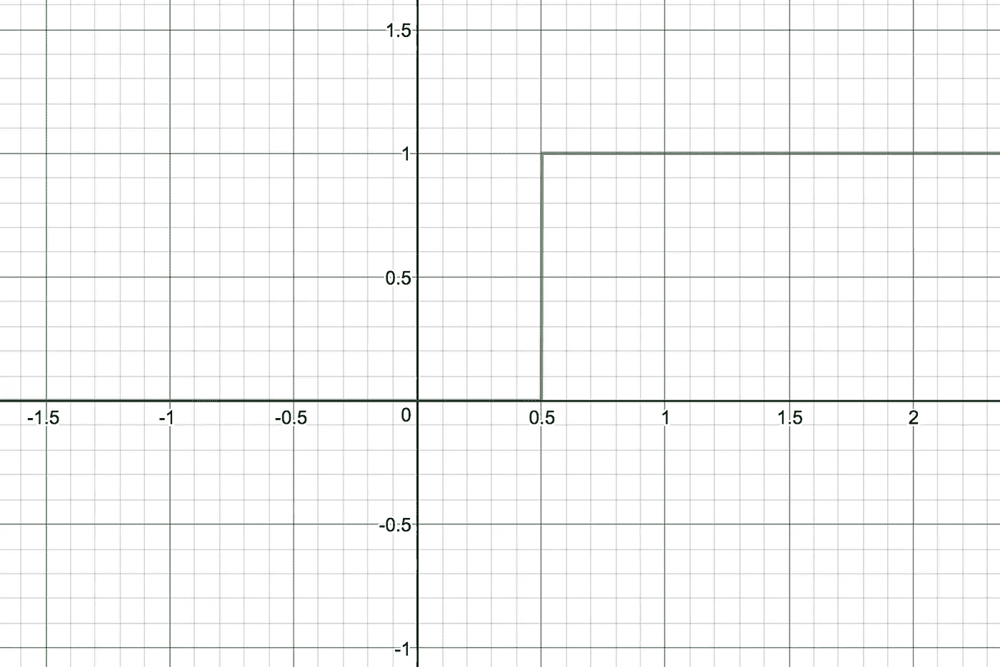
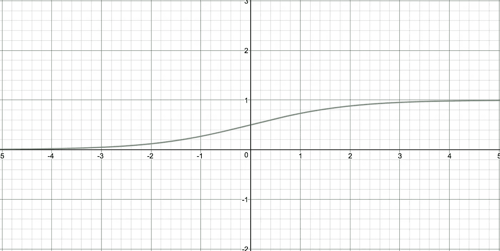
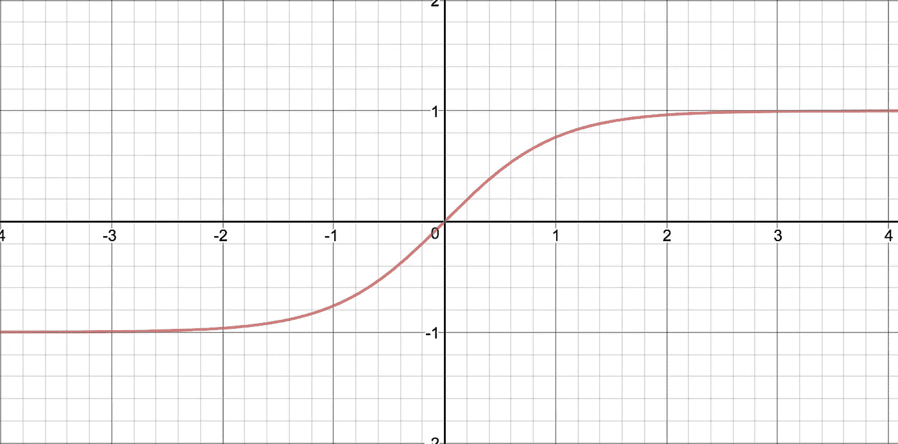

# 统计异常困难:WTF 是激活函数

> 原文：<https://towardsdatascience.com/statistics-is-freaking-hard-wtf-is-activation-function-df8342cdf292?source=collection_archive---------4----------------------->

和任何事情一样，我不是在描述任何独特的事情。有很多人比我更了解这个话题。这个故事是写给我脑海中的另一个人的😬。我确实经常和他聊天，他突然表达了对统计学和机器学习的兴趣。

那么，什么是激活功能呢？神经网络中的神经元松散地模仿我们的大脑神经元。啊！现在，我明白为什么它的名字是一样的了。我们大脑中的神经元会根据输入信息来激发，这不知何故让我们变得聪明！！！神经网络神经元中的激活函数是决定神经元是否应该触发以及以何种强度触发的函数。

让我们来看看不同的常用激活函数及其特性。

这是神经元的样子

Neuron

激活函数的输入值将在-∞和∞之间

# **步进功能**

阶跃函数由阈值定义。
如果输入值大于阈值，则输出为 1，否则为 0。

step function

是因为长得像台阶才叫台阶函数的吗？听起来比说基于阈值的函数更酷。

缺点是非常二进制。它会丢失输入值中的任何梯度知识。阈值的 10000000 倍对阈值具有相同的影响。此外，忽略任何低于阈值的输入值。

另外，考虑一个你正在开发分类器的例子。如果多个神经元触发，我们如何确定选择哪一个？所有放电神经元的值都是 1。

# 线性函数

函数是 y = cx。

linear function

这样做的一个好处是，在分类器的情况下，你现在可以决定选择哪个神经元。

缺点是你建立了多层神经元，每一层都是线性的，然后它们组合在一起形成一个更大的线性函数。因此，这些额外的层不提供任何价值。

# Sigmoid 函数

y = 1 / 1 + e⁻ˣ

sigmoid function

这是更平滑和非线性的特征。这没有线性函数的缺点。另一个优点是该值介于 0 和 1 之间。

缺点是在更高的值上梯度知识消失。这就是所谓的消失梯度问题。

# Tanh 函数

y = tanh(x)

tanh function

这非常类似于 sigmoid 函数。tanh 的梯度比 sigmoid 更陡。tanh 也有渐变消失的问题。

# ReLu 函数

y =最大值(0，x)

ReLu function

这是非线性的，所以它没有线性函数的缺点。ReLu 的一个优点是激发的神经元数量较少。

从计算的角度来看，这是比较便宜的。

依我拙见，你可以根据你喜欢的特征选择任何激活函数。您可以组合这些功能，甚至调整上述基本激活功能，以获得您想要的特性。