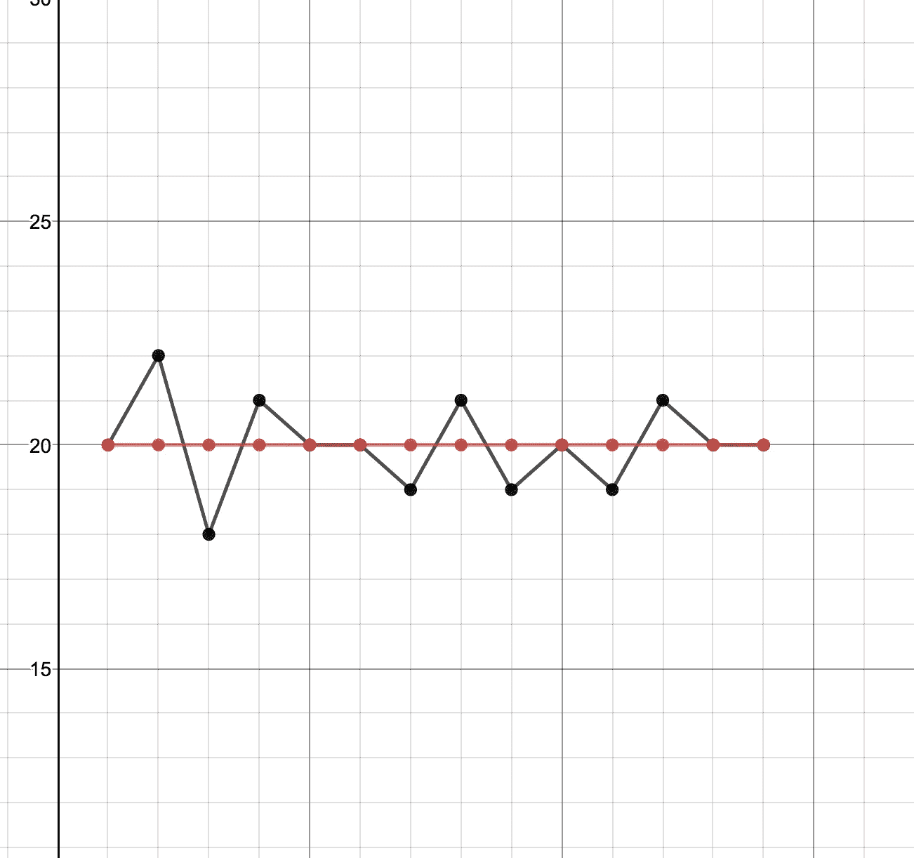
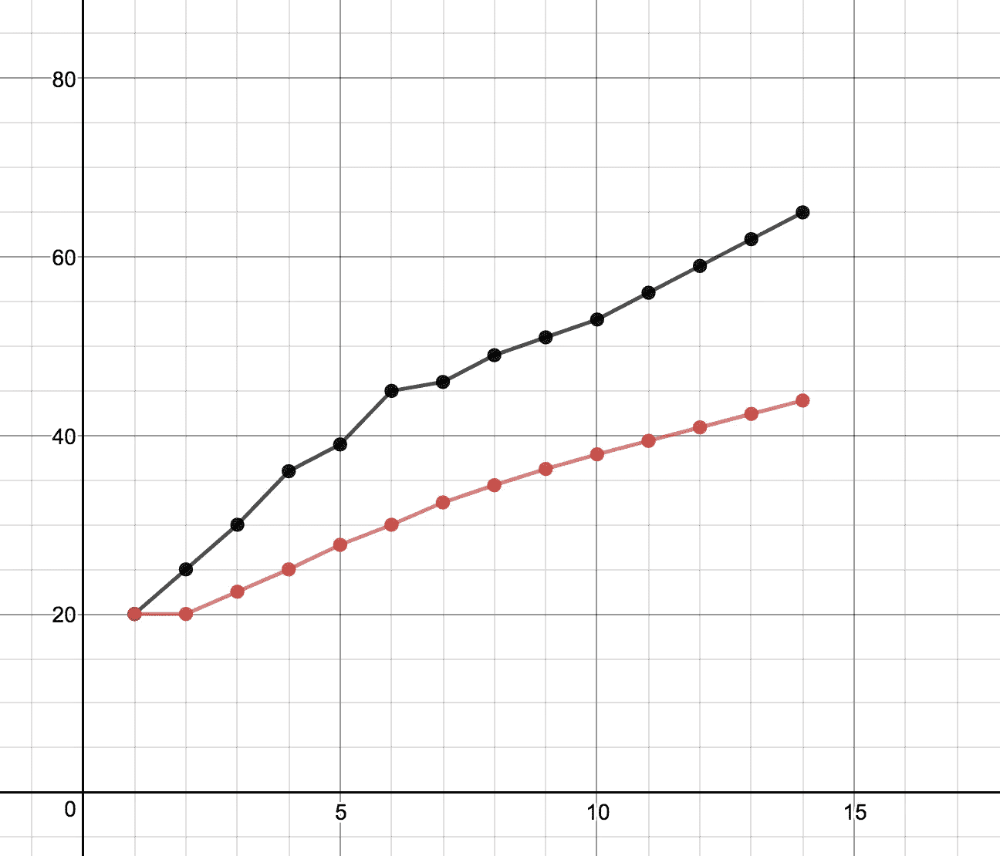
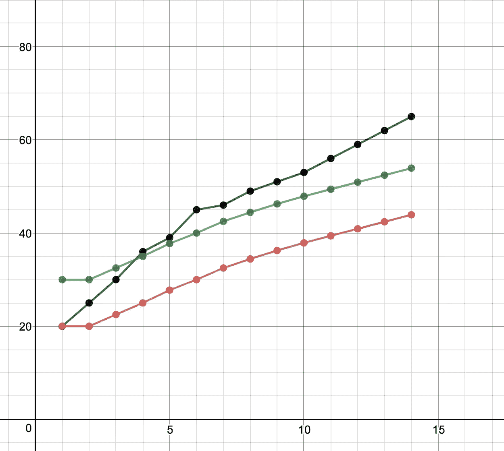

# 统计学非常难:WTF 是时间序列——第一部分

> 原文：<https://towardsdatascience.com/statistics-is-freaking-hard-wtf-is-time-series-part-1-22a44300c64b?source=collection_archive---------5----------------------->

我是一个记忆力和数学能力都很差的人。我不明白，到目前为止，我是如何在编程世界中生存下来的。Stackoverflow.com，我欠你 80%的工资。

尽管有种种限制，我还是接受了学习更多技能的挑战……跳舞。我忘了说我也是手眼协调有问题的人。但幸运的是，我足够理智，不会分享我学跳舞的经历。

但在系列帖子(更多的是独白)中，我计划揭露我在学习统计学和机器学习方面的斗争。

在目前的帖子里，我打算通过我对时间序列分析的理解来谈谈。与任何统计话题一样，它不可能在一篇文章中全面地重复。所以警告是苦难将会继续…

假设我们有不同时间实例的销售数据:T₀、T₁、T₂、T₃..Tn。

让我们考虑最简单的模型来预测任何时间实例 T 中的值。任何时间实例 T 的预测值是所有观察值的平均值。

这种模型可以满足不感兴趣的数据，其中数据围绕一个值波动。

观察值用黑色表示，预测值用红色表示。

在本例中，该值在 20 左右波动。扁平线是所有观察值的平均值。

如果数据是线性的(但本质上不是平坦的)，这种方法就不起作用。

观察值用黑色表示。预测值显示为红色。观察值似乎具有线性模式，但预测值遵循平坦的平均线

我们能做些什么来改进我们的模型？因此，预测值不是所有值的平均值，而是将预测值改为目前为止观察值的平均值。在这种情况下，下一个时间实例 *n+1* 的预测值是迄今为止所有 *n* 观测值的平均值。

观察值用黑色表示，预测值用红色表示。
预测值落后于观测值。它肯定比以前的型号更好。

思考这个模型的一种方式是，平均值对所有过去的观察值进行同等加权。所有观察值被赋予 1/n 的相等权重，以预测我们在下一个时间实例 n+1 的值。

Tn+1 =(1/n)T0+(1/n)T1+(1/n)T2…+(1/n)Tn

由于预测只考虑了以前的观察或预测，所以让我们添加一些误差来减少滞后。

Tn+1 =(1/n)T0+(1/n)T1+(1/n)T2…+(1/n)Tn+误差常数

观察值用黑色表示。先前的预测值以红色显示。添加常数后的当前预测值显示为绿色。

增加误差常数肯定会使预测值看起来更好。

似乎统计建模喜欢在矩阵运算中定义事物。那么，让我们试着在矩阵运算中用公式表示同样的方程。

w 是重量矢量。w 是 1×n 矩阵。
T 是时间实例值的逆向量。t 是 n×1 矩阵。

因此，Tn+1 = W×T

因此，对于上面的平均建模观点，
w =[(1/n)(1/n)……(1/n)]
t⁻=[t0 t1…TN]

需要记住的一点是，我们对每个过去的值都给予了同等的重视。很远的时间值与接近当前时间的值对预测下一个实例值具有相同的影响，这感觉是不正确的。在下一部分中，我们将研究平滑模型，在这种模型中，我们根据以前的值在多远的时间内发生，为它们赋予可变的权重。

谢谢你陪着我。苦难将会继续…在下一篇[帖子](https://medium.com/@NegiPrateek/statistics-is-freaking-hard-wtf-is-time-series-part-2-e9c5d2e72564)中。