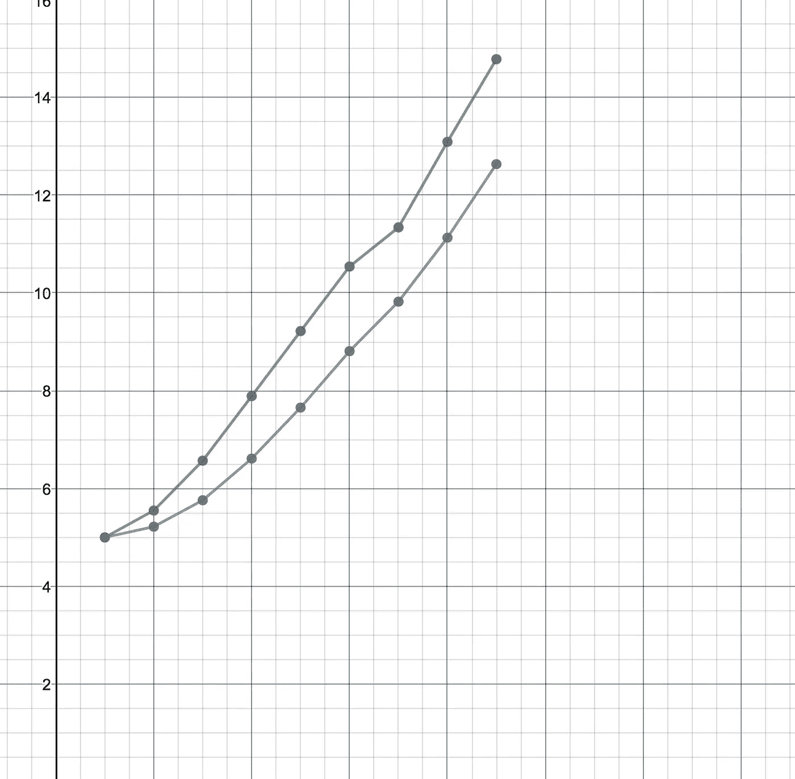

# 统计学非常难:WTF 是时间序列——第三部分

> 原文：<https://towardsdatascience.com/statistics-is-freaking-hard-wtf-is-time-series-part-3-5ffdf77c52fb?source=collection_archive---------9----------------------->

在这一部分，我将尝试解释指数平滑的一些基本概念。因此，在我们深入研究之前，让我们试着理解我们的指数平滑之旅。

在[第 1 部分](https://medium.com/towards-data-science/statistics-is-freaking-hard-wtf-is-time-series-part-1-22a44300c64b)中，我们从一个非常简单的模型开始，在这个模型中，我们给所有先前的观察值赋予了相等的权重，这基本上是所有先前观察值的平均值。这意味着所有先前的观察结果同等地影响下一个预测值。

在[第二部分](https://medium.com/@NegiPrateek/statistics-is-freaking-hard-wtf-is-time-series-part-2-e9c5d2e72564)中，我们转到了另一个极端，我们认为只有 *n* 先前的观察同样影响下一个结果。我们可以进一步将模型移动到极限，其中最后一个值是预测的下一个值，即 *n = 1*

让我们试着考虑一个中间地带，与早期的观察相比，后期的观察会产生指数级的影响。这就是指数平滑发挥作用的地方。在这一部分，我们将讨论简单指数平滑，也称为单指数平滑。

简单指数平滑的方程为:
Sn+1 = 𝛼Yn + (1-𝛼)Sn
其中，
sn→nᵗʰ实例预测值，
yn→nᵗʰ实例实际观测值
sn+1→n+1ᵗʰ实例预测值
𝛼 →平滑参数(0 ≤ 𝛼 ≤ 1)

现在，这个方程似乎不是指数的。让我们展开这个等式，试图理解它的指数性质
sn+1 = 𝛼yn+(1-𝛼)sn
sn+1 = 𝛼yn+(1-𝛼)(𝛼yn-1+(1-𝛼)sn-1)→展开 sn
sn+1 = 𝛼yn+𝛼(1-𝛼)yn-1+(1-𝛼)sn-1
sn+1 = yn+yn-1+(1-1)..+ 𝛼(1-𝛼)ⁿY1

现在，你可以看到这个等式的指数性质。权重基本是几何级数。相信我，所有重量的总和是 1。权重值呈指数减少，因此呈指数平滑。

介于 0 和 1 之间的𝛼值决定了如何抑制影响。当𝛼越接近 1 时，阻尼越快。当𝛼越接近 0 时，阻尼越慢。

Simple Exponential Smoothing

观察值显示为绿色。预测值用紫色表示。如你所见，简单的指数平滑法比之前文章中的模型预测得更好。

也许在下一篇文章中，我会提到双倍和三倍指数平滑。